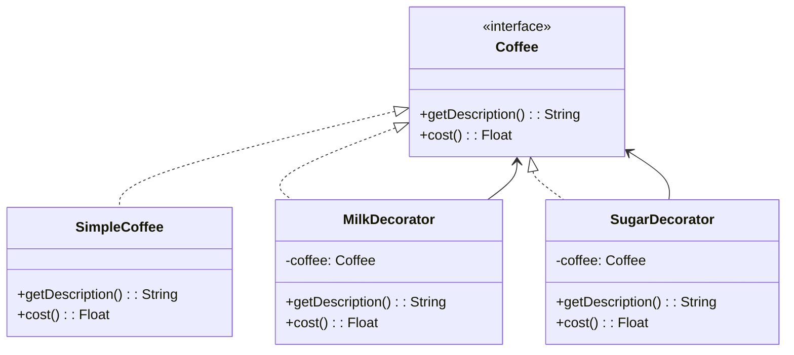

## 5.4 Decorator Pattern

In the realm of software design, the Decorator Pattern stands out as a powerful tool for dynamically adding responsibilities to objects. This pattern provides a flexible alternative to subclassing for extending functionality. In this section, we will delve into the intricacies of the Decorator Pattern, focusing on its implementation in Haxe, a language renowned for its cross-platform capabilities.

### Intent

The primary intent of the Decorator Pattern is to attach additional responsibilities to an object dynamically. It allows for the extension of an object's behavior without modifying its structure, offering a more flexible solution than traditional inheritance.

### Key Participants

1. **Component Interface**: Defines the interface for objects that can have responsibilities added to them.
2. **Concrete Component**: The original object to which additional responsibilities can be attached.
3. **Decorator**: Maintains a reference to a Component object and defines an interface that conforms to the Component's interface.
4. **Concrete Decorators**: Extend the functionality of the component by adding responsibilities.

### Implementing Decorator in Haxe

Let's explore how to implement the Decorator Pattern in Haxe, focusing on the key components and their interactions.

#### Component Interface

The Component Interface defines the methods that can be decorated. In Haxe, this can be achieved using an interface or an abstract class.

```haxe
interface Coffee {
    public function getDescription():String;
    public function cost():Float;
}
```

#### Concrete Components and Decorators

Concrete Components are the objects that can be decorated. Decorators are classes that wrap the component and add new behavior.

```haxe
class SimpleCoffee implements Coffee {
    public function new() {}

    public function getDescription():String {
        return "Simple Coffee";
    }

    public function cost():Float {
        return 5.0;
    }
}

class MilkDecorator implements Coffee {
    private var coffee:Coffee;

    public function new(coffee:Coffee) {
        this.coffee = coffee;
    }

    public function getDescription():String {
        return coffee.getDescription() + ", Milk";
    }

    public function cost():Float {
        return coffee.cost() + 1.5;
    }
}
```

#### Chaining Decorators

One of the powerful features of the Decorator Pattern is the ability to chain multiple decorators, creating a compound effect.

```haxe
class SugarDecorator implements Coffee {
    private var coffee:Coffee;

    public function new(coffee:Coffee) {
        this.coffee = coffee;
    }

    public function getDescription():String {
        return coffee.getDescription() + ", Sugar";
    }

    public function cost():Float {
        return coffee.cost() + 0.5;
    }
}

// Usage
var myCoffee:Coffee = new SimpleCoffee();
myCoffee = new MilkDecorator(myCoffee);
myCoffee = new SugarDecorator(myCoffee);

trace(myCoffee.getDescription()); // Output: Simple Coffee, Milk, Sugar
trace(myCoffee.cost()); // Output: 7.0
```

### Visualizing the Decorator Pattern

Below is a class diagram illustrating the structure of the Decorator Pattern:



### Use Cases and Examples

The Decorator Pattern is versatile and can be applied in various scenarios:

#### Adding Features to Objects

- **Logging**: Decorators can add logging functionality to methods without altering the original code.
- **Validation**: Input validation can be added dynamically to objects.
- **Formatting**: Enhance objects with additional formatting capabilities.

#### GUI Elements Enhancement

In GUI applications, decorators can be used to extend the functionality of GUI components, such as adding borders, scrollbars, or other visual enhancements.

### Design Considerations

- **When to Use**: Use the Decorator Pattern when you need to add responsibilities to individual objects dynamically and transparently, without affecting other objects.
- **Avoid Overuse**: While powerful, overusing decorators can lead to complex and hard-to-debug code.
- **Haxe-Specific Features**: Haxe's static typing and macro capabilities can be leveraged to create more efficient and type-safe decorators.

### Differences and Similarities

- **Similar to Proxy Pattern**: Both patterns involve a level of indirection, but the Decorator Pattern focuses on adding behavior, while the Proxy Pattern controls access.
- **Alternative to Inheritance**: Unlike inheritance, decorators provide a more flexible way to extend functionality without creating a rigid class hierarchy.

### Try It Yourself

Experiment with the Decorator Pattern by modifying the code examples:

- **Add More Decorators**: Create additional decorators, such as `VanillaDecorator` or `CaramelDecorator`.
- **Change Order**: Try changing the order of decorators to see how it affects the output.
- **Implement a New Component**: Create a new type of coffee and apply the existing decorators.

### References and Links

- [Haxe Manual](https://haxe.org/manual/)
- [Design Patterns: Elements of Reusable Object-Oriented Software](https://en.wikipedia.org/wiki/Design_Patterns)
- [MDN Web Docs on Design Patterns](https://developer.mozilla.org/en-US/docs/Web/JavaScript/Guide/Design_Patterns)

### Knowledge Check

- **What is the primary intent of the Decorator Pattern?**
- **How does the Decorator Pattern differ from subclassing?**
- **What are some common use cases for the Decorator Pattern?**

### Embrace the Journey

Remember, mastering design patterns is a journey. The Decorator Pattern is just one tool in your toolkit. As you continue to explore and apply these patterns, you'll develop a deeper understanding of how to create flexible, maintainable, and efficient software. Keep experimenting, stay curious, and enjoy the journey!

## Quiz Time!



### What is the primary intent of the Decorator Pattern?

- [x] To dynamically add responsibilities to objects
- [ ] To create a rigid class hierarchy
- [ ] To control access to objects
- [ ] To simplify object creation

> **Explanation:** The Decorator Pattern is used to dynamically add responsibilities to objects without altering their structure.

### Which of the following is a key participant in the Decorator Pattern?

- [x] Component Interface
- [ ] Singleton
- [ ] Factory
- [ ] Observer

> **Explanation:** The Component Interface is a key participant, defining the methods that can be decorated.

### How does the Decorator Pattern differ from subclassing?

- [x] It provides a more flexible way to extend functionality
- [ ] It creates a rigid class hierarchy
- [ ] It simplifies object creation
- [ ] It controls access to objects

> **Explanation:** The Decorator Pattern offers a more flexible alternative to subclassing by allowing dynamic addition of responsibilities.

### What is a common use case for the Decorator Pattern?

- [x] Adding logging functionality
- [ ] Simplifying object creation
- [ ] Controlling access to objects
- [ ] Creating a rigid class hierarchy

> **Explanation:** The Decorator Pattern is often used to add logging, validation, or formatting features to objects.

### Which pattern is similar to the Decorator Pattern but focuses on controlling access?

- [ ] Factory Pattern
- [x] Proxy Pattern
- [ ] Singleton Pattern
- [ ] Observer Pattern

> **Explanation:** The Proxy Pattern is similar but focuses on controlling access rather than adding behavior.

### What is a potential downside of overusing the Decorator Pattern?

- [x] It can lead to complex and hard-to-debug code
- [ ] It simplifies object creation
- [ ] It creates a rigid class hierarchy
- [ ] It controls access to objects

> **Explanation:** Overusing decorators can result in complex code that is difficult to maintain and debug.

### In Haxe, what feature can enhance the efficiency of decorators?

- [x] Static typing and macro capabilities
- [ ] Dynamic typing
- [ ] Singleton pattern
- [ ] Observer pattern

> **Explanation:** Haxe's static typing and macro capabilities can be leveraged to create more efficient and type-safe decorators.

### What is a key benefit of using the Decorator Pattern?

- [x] It allows for dynamic and transparent addition of responsibilities
- [ ] It simplifies object creation
- [ ] It controls access to objects
- [ ] It creates a rigid class hierarchy

> **Explanation:** The Decorator Pattern allows for dynamic and transparent addition of responsibilities to objects.

### Which of the following is NOT a component of the Decorator Pattern?

- [ ] Concrete Component
- [ ] Decorator
- [x] Singleton
- [ ] Concrete Decorators

> **Explanation:** The Singleton is not a component of the Decorator Pattern.

### True or False: The Decorator Pattern is an alternative to subclassing.

- [x] True
- [ ] False

> **Explanation:** The Decorator Pattern provides a flexible alternative to subclassing by allowing dynamic addition of responsibilities.




