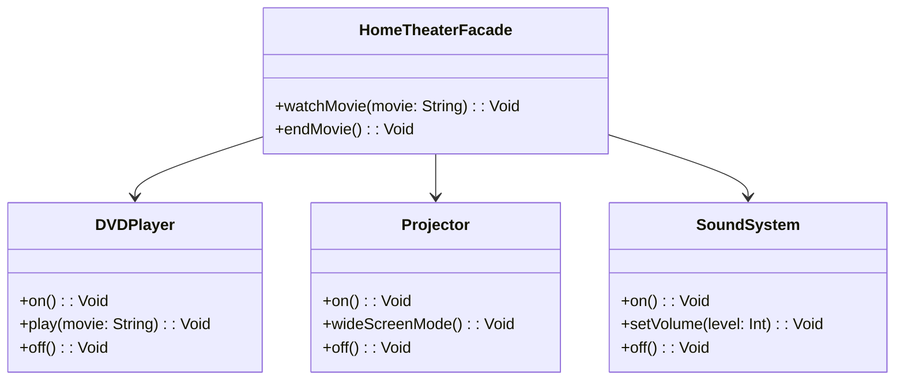

## 5.5 Facade Pattern

In the world of software engineering, complexity is often an unavoidable reality. As systems grow, they tend to become intricate, with numerous components interacting in various ways. The Facade Pattern is a structural design pattern that addresses this complexity by providing a simplified interface to a complex subsystem, making it easier to use. In this section, we will explore the Facade Pattern in the context of Haxe, a versatile language known for its cross-platform capabilities.

### Intent of the Facade Pattern

The primary intent of the Facade Pattern is to provide a unified interface to a set of interfaces in a subsystem. This pattern defines a higher-level interface that makes the subsystem easier to use. By doing so, it reduces the complexity of interacting with the subsystem and promotes a cleaner separation between the subsystem and its clients.

### Key Participants

1. **Facade**: The main class that provides a simplified interface to the complex subsystem. It delegates client requests to the appropriate subsystem objects.
2. **Subsystem Classes**: These are the classes that implement the subsystem's functionality. They handle the actual work but are not directly exposed to the client.
3. **Client**: The entity that interacts with the Facade instead of the subsystem directly.

### Applicability

The Facade Pattern is applicable in the following scenarios:

- When you want to provide a simple interface to a complex subsystem.
- When there are many dependencies between clients and the implementation classes of an abstraction.
- When you want to layer your subsystems, using a facade to define an entry point to each subsystem level.

### Implementing Facade in Haxe

Let's dive into how we can implement the Facade Pattern in Haxe. We'll create a simple example where a Facade class provides a simplified interface to a complex subsystem.

#### Example: Home Theater System

Imagine a home theater system with various components like a DVD player, a projector, and a sound system. Each component has its own interface, making it cumbersome for a user to operate them individually. We can use the Facade Pattern to create a unified interface for the entire system.

#### Step 1: Define Subsystem Classes

First, let's define the subsystem classes. These classes represent the individual components of the home theater system.

```haxe
class DVDPlayer {
    public function new() {}

    public function on():Void {
        trace("DVD Player is on.");
    }

    public function play(movie:String):Void {
        trace("Playing movie: " + movie);
    }

    public function off():Void {
        trace("DVD Player is off.");
    }
}

class Projector {
    public function new() {}

    public function on():Void {
        trace("Projector is on.");
    }

    public function wideScreenMode():Void {
        trace("Projector is in widescreen mode.");
    }

    public function off():Void {
        trace("Projector is off.");
    }
}

class SoundSystem {
    public function new() {}

    public function on():Void {
        trace("Sound system is on.");
    }

    public function setVolume(level:Int):Void {
        trace("Sound system volume set to " + level);
    }

    public function off():Void {
        trace("Sound system is off.");
    }
}
```

#### Step 2: Create the Facade Class

Next, we create the Facade class that provides a simplified interface to the subsystem.

```haxe
class HomeTheaterFacade {
    private var dvdPlayer:DVDPlayer;
    private var projector:Projector;
    private var soundSystem:SoundSystem;

    public function new(dvdPlayer:DVDPlayer, projector:Projector, soundSystem:SoundSystem) {
        this.dvdPlayer = dvdPlayer;
        this.projector = projector;
        this.soundSystem = soundSystem;
    }

    public function watchMovie(movie:String):Void {
        trace("Get ready to watch a movie...");
        projector.on();
        projector.wideScreenMode();
        soundSystem.on();
        soundSystem.setVolume(5);
        dvdPlayer.on();
        dvdPlayer.play(movie);
    }

    public function endMovie():Void {
        trace("Shutting movie theater down...");
        dvdPlayer.off();
        soundSystem.off();
        projector.off();
    }
}
```

#### Step 3: Use the Facade

Finally, let's see how a client can use the Facade to interact with the home theater system.

```haxe
class Main {
    static public function main() {
        var dvdPlayer = new DVDPlayer();
        var projector = new Projector();
        var soundSystem = new SoundSystem();
        var homeTheater = new HomeTheaterFacade(dvdPlayer, projector, soundSystem);

        homeTheater.watchMovie("Inception");
        homeTheater.endMovie();
    }
}
```

### Design Considerations

- **When to Use**: Use the Facade Pattern when you need to simplify interactions with a complex subsystem or when you want to decouple the client from the subsystem.
- **Haxe-Specific Features**: Haxe's static typing and cross-platform capabilities make it an excellent choice for implementing the Facade Pattern, ensuring type safety and seamless compilation across different platforms.
- **Pitfalls**: Avoid using the Facade Pattern to hide poor design. It should simplify interactions, not mask underlying issues.

### Differences and Similarities

The Facade Pattern is often confused with the Adapter Pattern. While both patterns provide a way to interface with a subsystem, they serve different purposes. The Adapter Pattern is used to make an interface compatible with another interface, while the Facade Pattern provides a simplified interface to a complex subsystem.

### Use Cases and Examples

#### Library Simplification

The Facade Pattern is particularly useful when dealing with complex libraries. By creating a facade, you can offer easy access to the library's functionality without exposing its complexity.

#### API Wrappers

When integrating third-party APIs, a facade can simplify the API's interface for internal use, making it easier to work with and reducing the learning curve for developers.

### Visualizing the Facade Pattern

To better understand the Facade Pattern, let's visualize it using a class diagram.



This diagram illustrates how the `HomeTheaterFacade` class interacts with the subsystem classes (`DVDPlayer`, `Projector`, and `SoundSystem`) to provide a simplified interface to the client.

### Try It Yourself

Experiment with the code examples by adding new components to the home theater system, such as a `Lights` class. Modify the `HomeTheaterFacade` to include methods for controlling the lights, and observe how the facade simplifies the interaction with the entire system.

### Knowledge Check

- What is the primary intent of the Facade Pattern?
- How does the Facade Pattern differ from the Adapter Pattern?
- In what scenarios is the Facade Pattern most useful?

### Embrace the Journey

Remember, mastering design patterns is a journey. The Facade Pattern is just one tool in your toolkit. As you continue to explore and apply design patterns, you'll find new ways to simplify complex systems and improve your software architecture. Keep experimenting, stay curious, and enjoy the journey!

## Quiz Time!



### What is the primary intent of the Facade Pattern?

- [x] To provide a simplified interface to a complex subsystem.
- [ ] To convert the interface of a class into another interface.
- [ ] To define a family of algorithms.
- [ ] To ensure a class has only one instance.

> **Explanation:** The Facade Pattern aims to provide a unified and simplified interface to a complex subsystem, making it easier to use.

### Which of the following is a key participant in the Facade Pattern?

- [x] Facade
- [ ] Adapter
- [ ] Observer
- [ ] Singleton

> **Explanation:** The Facade is the main participant that provides a simplified interface to the subsystem.

### When should you consider using the Facade Pattern?

- [x] When you want to provide a simple interface to a complex subsystem.
- [ ] When you need to convert one interface to another.
- [ ] When you want to ensure a class has only one instance.
- [ ] When you need to define a family of algorithms.

> **Explanation:** The Facade Pattern is used to simplify interactions with a complex subsystem.

### How does the Facade Pattern differ from the Adapter Pattern?

- [x] The Facade Pattern provides a simplified interface, while the Adapter Pattern converts interfaces.
- [ ] The Facade Pattern converts interfaces, while the Adapter Pattern provides a simplified interface.
- [ ] Both patterns serve the same purpose.
- [ ] The Facade Pattern is used for creating families of algorithms.

> **Explanation:** The Facade Pattern simplifies interfaces, whereas the Adapter Pattern makes interfaces compatible.

### What is a potential pitfall of using the Facade Pattern?

- [x] It can be used to hide poor design.
- [ ] It can make interfaces incompatible.
- [ ] It can create multiple instances of a class.
- [ ] It can define a family of algorithms.

> **Explanation:** The Facade Pattern should not be used to mask poor design; it should simplify interactions.

### In the home theater example, which class is responsible for playing a movie?

- [x] DVDPlayer
- [ ] Projector
- [ ] SoundSystem
- [ ] HomeTheaterFacade

> **Explanation:** The `DVDPlayer` class is responsible for playing a movie.

### What is the role of the `HomeTheaterFacade` class in the example?

- [x] To provide a simplified interface to the home theater subsystem.
- [ ] To convert the interface of the DVDPlayer.
- [ ] To ensure the SoundSystem has only one instance.
- [ ] To define a family of algorithms for the projector.

> **Explanation:** The `HomeTheaterFacade` class provides a simplified interface to the home theater subsystem.

### Which of the following is NOT a subsystem class in the home theater example?

- [x] HomeTheaterFacade
- [ ] DVDPlayer
- [ ] Projector
- [ ] SoundSystem

> **Explanation:** The `HomeTheaterFacade` is the facade, not a subsystem class.

### What is the benefit of using the Facade Pattern in library simplification?

- [x] It offers easy access to complex libraries.
- [ ] It converts library interfaces to another format.
- [ ] It ensures libraries have only one instance.
- [ ] It defines a family of algorithms for libraries.

> **Explanation:** The Facade Pattern simplifies access to complex libraries by providing a unified interface.

### True or False: The Facade Pattern can be used to simplify third-party API interfaces.

- [x] True
- [ ] False

> **Explanation:** The Facade Pattern is often used to create simplified interfaces for third-party APIs, making them easier to use internally.


