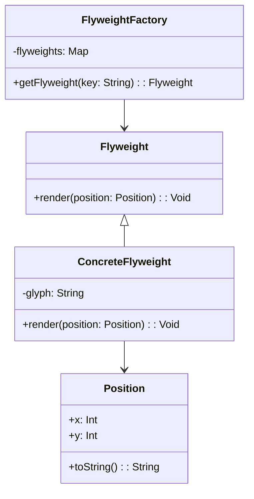

## 5.6 Flyweight Pattern

In the realm of software design patterns, the Flyweight Pattern stands out as a powerful tool for optimizing memory usage by sharing objects. This pattern is particularly useful in scenarios where a large number of similar objects are needed, but the cost of creating and maintaining these objects individually is prohibitive. By leveraging the Flyweight Pattern, developers can significantly reduce memory consumption and improve application performance.

### Intent

The primary intent of the Flyweight Pattern is to minimize memory usage by sharing as much data as possible with similar objects. This is achieved by separating the intrinsic state (shared data) from the extrinsic state (unique data) and managing these states efficiently.

### Key Participants

1. **Flyweight Interface**: Declares methods that flyweight objects can implement.
2. **Concrete Flyweight**: Implements the Flyweight interface and stores intrinsic state.
3. **Unshared Concrete Flyweight**: Not all Flyweight objects need to be shared. This class represents objects that cannot be shared.
4. **Flyweight Factory**: Creates and manages flyweight objects, ensuring that shared objects are reused.
5. **Client**: Maintains references to flyweight objects and computes or stores extrinsic state.

### Implementing Flyweight in Haxe

#### Intrinsic vs. Extrinsic State

In the Flyweight Pattern, the intrinsic state is the information that is shared among multiple objects. This state is independent of the context in which the object is used. On the other hand, the extrinsic state is context-dependent and varies from one object to another. By separating these states, we can share the intrinsic state among multiple objects, thereby reducing memory usage.

#### Flyweight Factory

The Flyweight Factory is responsible for creating and managing the pool of shared objects. It ensures that objects with the same intrinsic state are reused rather than being created anew. This factory plays a crucial role in the Flyweight Pattern by maintaining a cache of existing flyweight objects and providing them to clients as needed.

```haxe
class FlyweightFactory {
    private var flyweights:Map<String, Flyweight> = new Map();

    public function getFlyweight(key:String):Flyweight {
        if (!flyweights.exists(key)) {
            flyweights.set(key, new ConcreteFlyweight(key));
        }
        return flyweights.get(key);
    }
}
```

### Use Cases and Examples

#### Rendering Text

One of the classic examples of the Flyweight Pattern is in rendering text. In a text editor, each character can be represented as a flyweight object. The intrinsic state includes the character's shape and font, while the extrinsic state includes its position in the document.

```haxe
interface Flyweight {
    public function render(position:Position):Void;
}

class ConcreteFlyweight implements Flyweight {
    private var glyph:String;

    public function new(glyph:String) {
        this.glyph = glyph;
    }

    public function render(position:Position):Void {
        trace('Rendering glyph ' + glyph + ' at position ' + position.toString());
    }
}

class Position {
    public var x:Int;
    public var y:Int;

    public function new(x:Int, y:Int) {
        this.x = x;
        this.y = y;
    }

    public function toString():String {
        return 'x: ' + x + ', y: ' + y;
    }
}
```

#### Game Development

In game development, the Flyweight Pattern can be used to reuse visual assets and data. For example, in a game with many trees, each tree can share the same graphical representation (intrinsic state) while having different positions and sizes (extrinsic state).

```haxe
class Tree {
    private var type:TreeType;
    private var position:Position;

    public function new(type:TreeType, position:Position) {
        this.type = type;
        this.position = position;
    }

    public function render():Void {
        type.render(position);
    }
}

class TreeType {
    private var name:String;
    private var color:String;
    private var texture:String;

    public function new(name:String, color:String, texture:String) {
        this.name = name;
        this.color = color;
        this.texture = texture;
    }

    public function render(position:Position):Void {
        trace('Rendering tree ' + name + ' at position ' + position.toString());
    }
}
```

### Design Considerations

When implementing the Flyweight Pattern in Haxe, consider the following:

- **Memory vs. Performance Trade-off**: While the Flyweight Pattern reduces memory usage, it may introduce additional complexity in managing extrinsic state. Ensure that the benefits outweigh the costs.
- **Concurrency**: If flyweight objects are shared across threads, ensure thread safety in the Flyweight Factory.
- **Haxe-Specific Features**: Utilize Haxe's powerful type system and macros to streamline the implementation of the Flyweight Pattern.

### Differences and Similarities

The Flyweight Pattern is often confused with other structural patterns like the Proxy Pattern. While both involve object management, the Flyweight Pattern focuses on sharing objects to save memory, whereas the Proxy Pattern controls access to objects.

### Try It Yourself

To deepen your understanding of the Flyweight Pattern, try modifying the code examples above. Experiment with different intrinsic and extrinsic states, or implement a Flyweight Factory for a different use case, such as managing shared database connections.

### Visualizing the Flyweight Pattern

Below is a class diagram illustrating the Flyweight Pattern:



### Knowledge Check

- **What is the primary benefit of using the Flyweight Pattern?**
- **How does the Flyweight Factory manage shared objects?**
- **In what scenarios is the Flyweight Pattern most beneficial?**

### Embrace the Journey

Remember, mastering design patterns like the Flyweight Pattern is a journey. As you continue to explore and implement these patterns, you'll gain a deeper understanding of how to optimize your applications for performance and efficiency. Keep experimenting, stay curious, and enjoy the journey!

## Quiz Time!



### What is the primary intent of the Flyweight Pattern?

- [x] To minimize memory usage by sharing data among similar objects.
- [ ] To enhance the speed of object creation.
- [ ] To simplify object-oriented design.
- [ ] To improve the security of data.

> **Explanation:** The Flyweight Pattern aims to reduce memory usage by sharing as much data as possible with similar objects.

### Which of the following states is shared among multiple objects in the Flyweight Pattern?

- [x] Intrinsic state
- [ ] Extrinsic state
- [ ] Contextual state
- [ ] Dynamic state

> **Explanation:** The intrinsic state is the shared data that is independent of the context in which the object is used.

### What role does the Flyweight Factory play in the Flyweight Pattern?

- [x] It creates and manages the pool of shared objects.
- [ ] It provides a user interface for flyweight objects.
- [ ] It handles the extrinsic state of objects.
- [ ] It ensures thread safety in object creation.

> **Explanation:** The Flyweight Factory is responsible for creating and managing the pool of shared objects, ensuring that objects with the same intrinsic state are reused.

### In the context of the Flyweight Pattern, what is the extrinsic state?

- [x] Context-dependent data that varies from one object to another.
- [ ] Shared data that is independent of the context.
- [ ] Data that is stored in the Flyweight Factory.
- [ ] Data that is used to initialize flyweight objects.

> **Explanation:** The extrinsic state is context-dependent and varies from one object to another, unlike the intrinsic state which is shared.

### Which of the following is a common use case for the Flyweight Pattern?

- [x] Rendering text in a text editor.
- [ ] Managing user sessions in a web application.
- [x] Reusing visual assets in game development.
- [ ] Implementing a database connection pool.

> **Explanation:** The Flyweight Pattern is commonly used in scenarios like rendering text and reusing visual assets in game development to optimize memory usage.

### What is a potential drawback of using the Flyweight Pattern?

- [x] It may introduce additional complexity in managing extrinsic state.
- [ ] It increases the memory usage of the application.
- [ ] It reduces the performance of object creation.
- [ ] It complicates the user interface design.

> **Explanation:** While the Flyweight Pattern reduces memory usage, it may introduce additional complexity in managing extrinsic state.

### How can Haxe's type system be utilized in implementing the Flyweight Pattern?

- [x] By streamlining the implementation with strong typing and macros.
- [ ] By simplifying the user interface design.
- [ ] By enhancing the security of flyweight objects.
- [ ] By increasing the speed of object creation.

> **Explanation:** Haxe's powerful type system and macros can be utilized to streamline the implementation of the Flyweight Pattern.

### What is the difference between the Flyweight Pattern and the Proxy Pattern?

- [x] The Flyweight Pattern focuses on sharing objects to save memory, while the Proxy Pattern controls access to objects.
- [ ] The Flyweight Pattern enhances security, while the Proxy Pattern optimizes memory usage.
- [ ] The Flyweight Pattern simplifies object creation, while the Proxy Pattern manages shared objects.
- [ ] The Flyweight Pattern is used for UI design, while the Proxy Pattern is used for data management.

> **Explanation:** The Flyweight Pattern focuses on sharing objects to save memory, whereas the Proxy Pattern controls access to objects.

### Which of the following best describes a Concrete Flyweight?

- [x] An implementation of the Flyweight interface that stores intrinsic state.
- [ ] A factory that creates and manages flyweight objects.
- [ ] A client that maintains references to flyweight objects.
- [ ] An object that cannot be shared among multiple clients.

> **Explanation:** A Concrete Flyweight implements the Flyweight interface and stores intrinsic state.

### True or False: The Flyweight Pattern is only applicable in game development.

- [ ] True
- [x] False

> **Explanation:** The Flyweight Pattern is applicable in various scenarios, not just game development, wherever there is a need to optimize memory usage by sharing objects.


