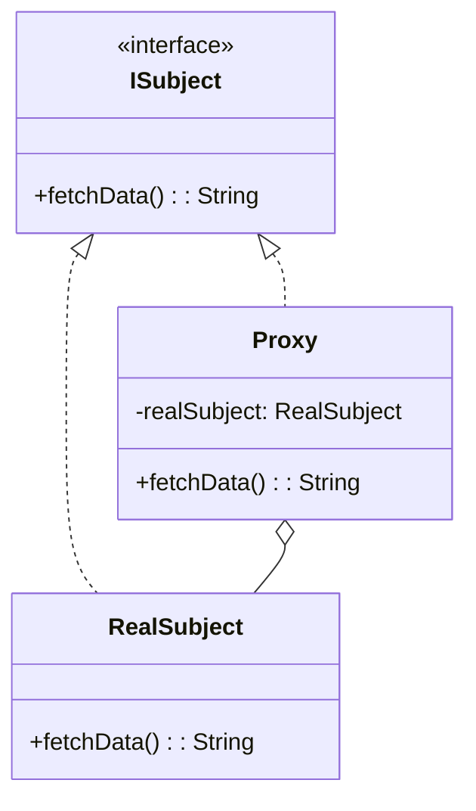

## 5.7 Proxy Pattern

In the realm of software design, the Proxy Pattern stands out as a powerful structural design pattern that provides a surrogate or placeholder for another object. This pattern is particularly useful when you need to control access to an object, add functionality, or defer the creation of an expensive object until it is absolutely necessary. In this section, we will delve into the Proxy Pattern, exploring its various forms and how it can be implemented in Haxe. We will also examine practical use cases and provide detailed code examples to illustrate each concept.

### Intent of the Proxy Pattern

The primary intent of the Proxy Pattern is to provide a surrogate or placeholder for another object to control access to it. This can be particularly useful in scenarios where the real object is resource-intensive to create or requires some form of access control. By using a proxy, we can introduce additional functionality, such as lazy loading, access control, or network communication, without modifying the original object.

### Key Participants

1. **Subject Interface**: This defines the common interface for RealSubject and Proxy so that a Proxy can be used anywhere a RealSubject is expected.
2. **RealSubject**: This is the actual object that the proxy represents.
3. **Proxy**: This maintains a reference to the RealSubject and provides an interface identical to the Subject. It controls access to the RealSubject and may be responsible for creating and deleting it.

### Types of Proxies

The Proxy Pattern can be implemented in several forms, each serving a different purpose:

- **Remote Proxy**: Manages communication with a remote object over a network.
- **Virtual Proxy**: Defers the creation of an expensive object until it is needed.
- **Protection Proxy**: Controls access to an object based on permissions.

### Implementing Proxy in Haxe

Let's explore how each type of proxy can be implemented in Haxe, a language known for its cross-platform capabilities and powerful features.

#### Remote Proxy

A Remote Proxy is used to represent an object that exists in a different address space, such as on a different server. This proxy handles all the communication details, allowing the client to interact with the remote object as if it were local.

```haxe
interface IRemoteService {
    function fetchData():String;
}

class RealRemoteService implements IRemoteService {
    public function new() {}

    public function fetchData():String {
        // Simulate fetching data from a remote server
        return "Data from remote server";
    }
}

class RemoteServiceProxy implements IRemoteService {
    private var realService:RealRemoteService;

    public function new() {
        // Initialize the real service lazily
        this.realService = null;
    }

    public function fetchData():String {
        if (this.realService == null) {
            this.realService = new RealRemoteService();
        }
        return this.realService.fetchData();
    }
}

// Usage
class Main {
    static public function main() {
        var service:IRemoteService = new RemoteServiceProxy();
        trace(service.fetchData());
    }
}
```

In this example, `RemoteServiceProxy` acts as a surrogate for `RealRemoteService`. It initializes the real service only when `fetchData()` is called, simulating a remote service call.

#### Virtual Proxy

A Virtual Proxy is used to defer the creation of an expensive object until it is actually needed. This can be particularly useful for optimizing performance and resource usage.

```haxe
interface IImage {
    function display():Void;
}

class RealImage implements IImage {
    private var filename:String;

    public function new(filename:String) {
        this.filename = filename;
        loadFromDisk();
    }

    private function loadFromDisk():Void {
        trace("Loading " + filename);
    }

    public function display():Void {
        trace("Displaying " + filename);
    }
}

class ImageProxy implements IImage {
    private var realImage:RealImage;
    private var filename:String;

    public function new(filename:String) {
        this.filename = filename;
        this.realImage = null;
    }

    public function display():Void {
        if (this.realImage == null) {
            this.realImage = new RealImage(filename);
        }
        this.realImage.display();
    }
}

// Usage
class Main {
    static public function main() {
        var image:IImage = new ImageProxy("test.jpg");
        image.display(); // Loads and displays the image
        image.display(); // Displays the image without loading
    }
}
```

Here, `ImageProxy` defers the loading of the image until `display()` is called for the first time, demonstrating lazy loading.

#### Protection Proxy

A Protection Proxy controls access to an object based on permissions. This is useful in scenarios where different users have different levels of access.

```haxe
interface IDocument {
    function view():Void;
    function edit():Void;
}

class RealDocument implements IDocument {
    public function new() {}

    public function view():Void {
        trace("Viewing document");
    }

    public function edit():Void {
        trace("Editing document");
    }
}

class DocumentProxy implements IDocument {
    private var realDocument:RealDocument;
    private var userRole:String;

    public function new(userRole:String) {
        this.userRole = userRole;
        this.realDocument = new RealDocument();
    }

    public function view():Void {
        realDocument.view();
    }

    public function edit():Void {
        if (userRole == "admin") {
            realDocument.edit();
        } else {
            trace("Edit access denied");
        }
    }
}

// Usage
class Main {
    static public function main() {
        var adminDoc:IDocument = new DocumentProxy("admin");
        adminDoc.view();
        adminDoc.edit();

        var userDoc:IDocument = new DocumentProxy("user");
        userDoc.view();
        userDoc.edit();
    }
}
```

In this example, `DocumentProxy` checks the user's role before allowing access to the `edit()` method, demonstrating access control.

### Use Cases and Examples

#### Access Control

The Protection Proxy is ideal for implementing access control mechanisms. By wrapping the real object with a proxy, you can enforce security policies and ensure that only authorized users can perform certain actions.

#### Lazy Loading

The Virtual Proxy is perfect for implementing lazy loading. By deferring the creation of resource-intensive objects, you can optimize performance and reduce memory usage, especially in applications with limited resources.

### Visualizing the Proxy Pattern

To better understand the Proxy Pattern, let's visualize the interaction between the client, proxy, and real subject using a class diagram.



In this diagram, `ISubject` is the interface implemented by both `RealSubject` and `Proxy`. The `Proxy` maintains a reference to `RealSubject` and controls access to it.

### Design Considerations

When implementing the Proxy Pattern in Haxe, consider the following:

- **Performance**: While proxies can optimize performance through lazy loading, they can also introduce overhead due to additional method calls.
- **Complexity**: Proxies add an extra layer of abstraction, which can increase the complexity of the codebase. Ensure that the benefits outweigh the added complexity.
- **Security**: Protection proxies can enhance security by enforcing access control, but they must be carefully designed to prevent unauthorized access.

### Differences and Similarities

The Proxy Pattern is often confused with other structural patterns like the Decorator and Adapter patterns. Here are some key differences:

- **Decorator Pattern**: Adds additional responsibilities to an object dynamically, whereas a proxy controls access to the object.
- **Adapter Pattern**: Converts the interface of a class into another interface that clients expect, while a proxy provides the same interface as the real object.

### Try It Yourself

To deepen your understanding of the Proxy Pattern, try modifying the code examples provided:

- Implement a `CacheProxy` that caches the results of expensive operations.
- Create a `LoggingProxy` that logs all method calls to the real object.
- Experiment with different types of proxies and see how they can be combined to achieve complex functionality.

### Embrace the Journey

Remember, mastering design patterns is a journey. As you explore the Proxy Pattern in Haxe, you'll gain valuable insights into structuring your code for flexibility and maintainability. Keep experimenting, stay curious, and enjoy the process of becoming a more proficient software engineer.

## Quiz Time!



### What is the primary intent of the Proxy Pattern?

- [x] To provide a surrogate or placeholder for another object to control access to it.
- [ ] To convert the interface of a class into another interface that clients expect.
- [ ] To add additional responsibilities to an object dynamically.
- [ ] To define a family of algorithms and make them interchangeable.

> **Explanation:** The Proxy Pattern provides a surrogate or placeholder for another object to control access to it.

### Which type of proxy is used to defer the creation of an expensive object until it is needed?

- [ ] Remote Proxy
- [x] Virtual Proxy
- [ ] Protection Proxy
- [ ] Cache Proxy

> **Explanation:** A Virtual Proxy is used to defer the creation of an expensive object until it is needed.

### In the provided Remote Proxy example, when is the real service initialized?

- [ ] During the construction of the proxy.
- [x] When the `fetchData()` method is called for the first time.
- [ ] When the proxy object is destroyed.
- [ ] When the program starts.

> **Explanation:** The real service is initialized when the `fetchData()` method is called for the first time, demonstrating lazy initialization.

### What is the role of the `Proxy` class in the Proxy Pattern?

- [ ] It defines the common interface for RealSubject and Proxy.
- [x] It maintains a reference to the RealSubject and controls access to it.
- [ ] It adds additional responsibilities to the RealSubject.
- [ ] It converts the interface of the RealSubject into another interface.

> **Explanation:** The `Proxy` class maintains a reference to the `RealSubject` and controls access to it.

### Which pattern is often confused with the Proxy Pattern due to its similar structure?

- [ ] Singleton Pattern
- [ ] Factory Pattern
- [x] Decorator Pattern
- [ ] Observer Pattern

> **Explanation:** The Decorator Pattern is often confused with the Proxy Pattern due to its similar structure, but it adds additional responsibilities to an object dynamically.

### What is a key consideration when implementing the Proxy Pattern in Haxe?

- [x] Performance overhead due to additional method calls.
- [ ] Ensuring that all methods are static.
- [ ] Avoiding the use of interfaces.
- [ ] Using only abstract classes.

> **Explanation:** A key consideration is the performance overhead due to additional method calls introduced by the proxy.

### How does a Protection Proxy enhance security?

- [ ] By converting the interface of a class into another interface.
- [x] By enforcing access control based on permissions.
- [ ] By adding additional responsibilities to an object.
- [ ] By deferring the creation of an expensive object.

> **Explanation:** A Protection Proxy enhances security by enforcing access control based on permissions.

### What is the difference between a Proxy and an Adapter?

- [ ] A Proxy adds additional responsibilities to an object.
- [ ] An Adapter controls access to an object.
- [x] A Proxy provides the same interface as the real object, while an Adapter converts the interface.
- [ ] An Adapter defers the creation of an object.

> **Explanation:** A Proxy provides the same interface as the real object, while an Adapter converts the interface of a class into another interface that clients expect.

### Which of the following is NOT a type of proxy?

- [ ] Remote Proxy
- [ ] Virtual Proxy
- [ ] Protection Proxy
- [x] Singleton Proxy

> **Explanation:** Singleton Proxy is not a recognized type of proxy. The common types are Remote, Virtual, and Protection Proxies.

### True or False: The Proxy Pattern can be used to implement lazy loading.

- [x] True
- [ ] False

> **Explanation:** True. The Proxy Pattern, specifically the Virtual Proxy, can be used to implement lazy loading by deferring the creation of an expensive object until it is needed.



By understanding and applying the Proxy Pattern in Haxe, you can create flexible and efficient software architectures that are both maintainable and scalable. Keep exploring and experimenting with different design patterns to enhance your skills as a software engineer.
