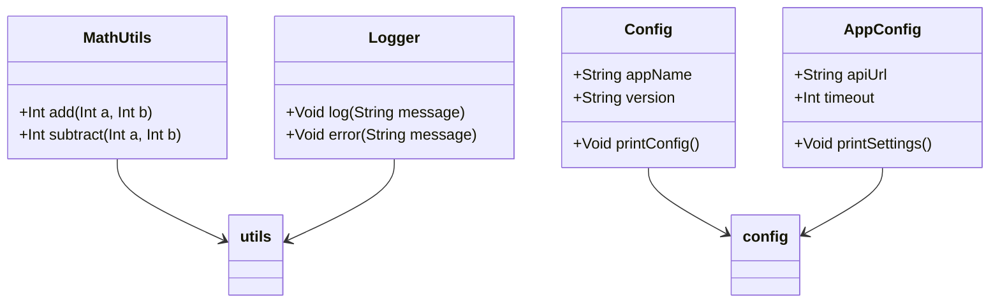

## 5.8 Module Pattern

In the realm of software design, organizing code into self-contained units is a fundamental practice that enhances maintainability, readability, and scalability. The Module Pattern is a structural design pattern that encapsulates related code, allowing developers to group functionalities logically. This pattern is particularly beneficial in Haxe, a language designed for cross-platform development, as it leverages Haxe's unique features such as packages, namespaces, and static classes. In this section, we will delve into the intricacies of the Module Pattern, exploring its implementation in Haxe, and providing practical examples and use cases.

### Intent

The primary intent of the Module Pattern is to encapsulate related code into a single, self-contained unit. This encapsulation allows for better organization, reduces the risk of naming conflicts, and promotes code reuse. By grouping related functionalities, the Module Pattern helps in managing dependencies and enhances the modularity of the application.

### Key Participants

- **Module**: The self-contained unit that encapsulates related code.
- **Packages and Namespaces**: Mechanisms to group related classes and functions.
- **Static Classes and Methods**: Provide utility functions without the need for instantiation.

### Applicability

The Module Pattern is applicable in scenarios where:

- Code needs to be organized into logical units.
- There is a need to reduce naming conflicts.
- Reusability and maintainability of code are priorities.
- Cross-platform compatibility is required, leveraging Haxe's capabilities.

### Implementing Module in Haxe

#### Packages and Namespaces

In Haxe, packages and namespaces are used to group related classes and functions, providing a way to organize code into modules. Packages are directories that contain Haxe files, while namespaces are used within those files to further organize code.

```haxe
// File: src/utils/MathUtils.hx
package utils;

class MathUtils {
    public static function add(a:Int, b:Int):Int {
        return a + b;
    }

    public static function subtract(a:Int, b:Int):Int {
        return a - b;
    }
}
```

In this example, the `MathUtils` class is part of the `utils` package, encapsulating mathematical operations. This organization helps in maintaining a clean project structure and avoids naming conflicts with other classes.

#### Static Classes and Methods

Static classes and methods are a key feature in Haxe for implementing the Module Pattern. They allow the creation of utility functions that can be accessed without instantiating the class.

```haxe
// File: src/config/Config.hx
package config;

class Config {
    public static var appName:String = "MyApp";
    public static var version:String = "1.0.0";

    public static function printConfig():Void {
        trace("App Name: " + appName);
        trace("Version: " + version);
    }
}
```

The `Config` class in this example acts as a configuration module, centralizing application settings. Static variables and methods provide a straightforward way to access configuration data throughout the application.

### Use Cases and Examples

#### Utility Libraries

Utility libraries are a common use case for the Module Pattern. By encapsulating utility functions into modules, developers can create reusable libraries that can be easily integrated into different projects.

```haxe
// File: src/utils/Logger.hx
package utils;

class Logger {
    public static function log(message:String):Void {
        trace("[LOG] " + message);
    }

    public static function error(message:String):Void {
        trace("[ERROR] " + message);
    }
}
```

The `Logger` class provides logging utilities, encapsulated within the `utils` package. This module can be reused across multiple projects, promoting code reuse and consistency.

#### Configuration Modules

Configuration modules centralize application settings, making it easier to manage and modify configurations without affecting other parts of the application.

```haxe
// File: src/config/AppConfig.hx
package config;

class AppConfig {
    public static var apiUrl:String = "https://api.example.com";
    public static var timeout:Int = 5000;

    public static function printSettings():Void {
        trace("API URL: " + apiUrl);
        trace("Timeout: " + timeout);
    }
}
```

The `AppConfig` class encapsulates configuration settings, providing a single point of access for configuration data. This approach simplifies the management of application settings, especially in large projects.

### Design Considerations

When implementing the Module Pattern in Haxe, consider the following:

- **Encapsulation**: Ensure that modules encapsulate related functionalities, promoting cohesion and reducing coupling.
- **Reusability**: Design modules to be reusable across different projects, enhancing code reuse.
- **Cross-Platform Compatibility**: Leverage Haxe's cross-platform capabilities to ensure that modules work seamlessly across different platforms.
- **Naming Conventions**: Use consistent naming conventions for packages, classes, and methods to avoid naming conflicts and improve readability.

### Differences and Similarities

The Module Pattern is often compared to other structural patterns like the Facade Pattern. While both patterns aim to simplify interactions with complex systems, the Module Pattern focuses on encapsulating related code into self-contained units, whereas the Facade Pattern provides a simplified interface to a set of interfaces in a subsystem.

### Try It Yourself

To get hands-on experience with the Module Pattern in Haxe, try modifying the code examples provided. For instance, add new utility functions to the `MathUtils` class or introduce additional configuration settings in the `AppConfig` class. Experiment with different package structures and observe how they affect the organization and readability of your code.

### Visualizing the Module Pattern

To better understand the Module Pattern, let's visualize the structure of a Haxe project using the Module Pattern.



This diagram illustrates the relationship between different modules in a Haxe project. The `MathUtils` and `Logger` classes are part of the `utils` package, while the `Config` and `AppConfig` classes belong to the `config` package. This organization promotes modularity and encapsulation, key principles of the Module Pattern.

### References and Links

For further reading on the Module Pattern and its implementation in Haxe, consider the following resources:

- [Haxe Manual - Packages](https://haxe.org/manual/lf-packages.html)
- [Haxe Manual - Static Fields](https://haxe.org/manual/class-field-static.html)
- [MDN Web Docs - Module Pattern](https://developer.mozilla.org/en-US/docs/Web/JavaScript/Guide/Modules)

### Knowledge Check

To reinforce your understanding of the Module Pattern, consider the following questions:

1. What is the primary intent of the Module Pattern?
2. How do packages and namespaces contribute to the Module Pattern in Haxe?
3. What are the benefits of using static classes and methods in the Module Pattern?
4. How can the Module Pattern enhance cross-platform compatibility in Haxe?
5. What are some common use cases for the Module Pattern?

### Embrace the Journey

Remember, mastering design patterns is a journey. As you continue to explore the Module Pattern and other design patterns in Haxe, you'll gain a deeper understanding of how to organize and structure your code effectively. Keep experimenting, stay curious, and enjoy the process of learning and growing as a software engineer.

## Quiz Time!



### What is the primary intent of the Module Pattern?

- [x] To encapsulate related code into a single, self-contained unit.
- [ ] To provide a simplified interface to a set of interfaces in a subsystem.
- [ ] To create a single instance of a class.
- [ ] To define a family of algorithms.

> **Explanation:** The Module Pattern is designed to encapsulate related code into a single, self-contained unit, promoting organization and reusability.

### How do packages and namespaces contribute to the Module Pattern in Haxe?

- [x] By grouping related classes and functions.
- [ ] By providing a simplified interface to complex systems.
- [ ] By ensuring a single instance of a class.
- [ ] By defining a family of algorithms.

> **Explanation:** Packages and namespaces group related classes and functions, helping to organize code into modules.

### What are the benefits of using static classes and methods in the Module Pattern?

- [x] They provide utility functions without the need for instantiation.
- [ ] They ensure a single instance of a class.
- [ ] They simplify interactions with complex systems.
- [ ] They define a family of algorithms.

> **Explanation:** Static classes and methods allow the creation of utility functions that can be accessed without instantiating the class, promoting reusability.

### How can the Module Pattern enhance cross-platform compatibility in Haxe?

- [x] By leveraging Haxe's capabilities to ensure modules work seamlessly across different platforms.
- [ ] By providing a simplified interface to complex systems.
- [ ] By ensuring a single instance of a class.
- [ ] By defining a family of algorithms.

> **Explanation:** The Module Pattern leverages Haxe's cross-platform capabilities, ensuring that modules work seamlessly across different platforms.

### What are some common use cases for the Module Pattern?

- [x] Utility libraries and configuration modules.
- [ ] Simplifying interactions with complex systems.
- [ ] Ensuring a single instance of a class.
- [ ] Defining a family of algorithms.

> **Explanation:** Common use cases for the Module Pattern include utility libraries and configuration modules, which benefit from encapsulation and reusability.

### What is a key feature of Haxe that supports the Module Pattern?

- [x] Static classes and methods.
- [ ] Dynamic typing.
- [ ] Single inheritance.
- [ ] Multiple dispatch.

> **Explanation:** Static classes and methods in Haxe support the Module Pattern by allowing utility functions to be accessed without instantiation.

### Which design pattern is often compared to the Module Pattern?

- [x] Facade Pattern.
- [ ] Singleton Pattern.
- [ ] Strategy Pattern.
- [ ] Observer Pattern.

> **Explanation:** The Module Pattern is often compared to the Facade Pattern, as both aim to simplify interactions with complex systems.

### What is a common pitfall to avoid when using the Module Pattern?

- [x] Overcomplicating the module structure.
- [ ] Using dynamic typing.
- [ ] Ensuring a single instance of a class.
- [ ] Defining a family of algorithms.

> **Explanation:** A common pitfall is overcomplicating the module structure, which can lead to reduced readability and maintainability.

### How does the Module Pattern promote code reuse?

- [x] By encapsulating related functionalities into reusable modules.
- [ ] By providing a simplified interface to complex systems.
- [ ] By ensuring a single instance of a class.
- [ ] By defining a family of algorithms.

> **Explanation:** The Module Pattern promotes code reuse by encapsulating related functionalities into reusable modules.

### True or False: The Module Pattern is only applicable in object-oriented programming.

- [ ] True
- [x] False

> **Explanation:** The Module Pattern is applicable in both object-oriented and functional programming paradigms, as it focuses on encapsulating related code.


