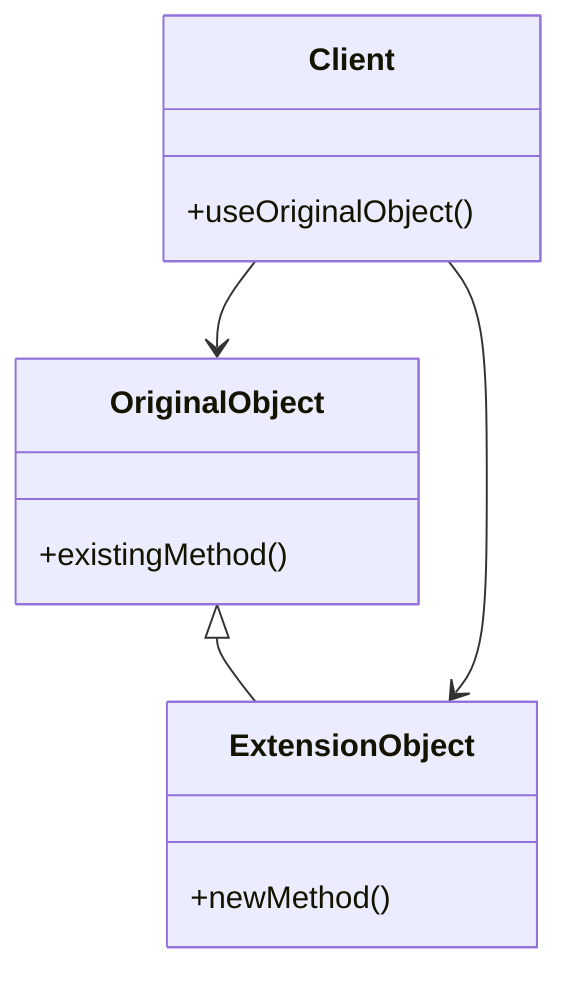

## 5.9 Extension Object Pattern

In the realm of software design, the ability to extend the functionality of existing classes without altering their original structure is a powerful tool. The Extension Object Pattern is a structural design pattern that facilitates this capability, allowing developers to add new behaviors to objects dynamically. This pattern is particularly useful in scenarios where modifying the original class is impractical or impossible, such as when dealing with third-party libraries or built-in types.

### Intent

The primary intent of the Extension Object Pattern is to enable the addition of new functionality to existing classes without modifying their source code. This is achieved by creating extension objects that encapsulate the new behavior and can be attached to the original objects. This pattern promotes flexibility and maintainability, as it allows for the seamless integration of new features without disrupting the existing codebase.

### Key Participants

- **Original Object:** The class or object to which new functionality is to be added.
- **Extension Object:** A separate object that encapsulates the new behavior or functionality.
- **Client:** The entity that interacts with the original object and its extensions.

### Applicability

The Extension Object Pattern is applicable in scenarios where:

- The original class is part of a third-party library or framework, and modifying its source code is not feasible.
- The system requires dynamic addition of new behaviors at runtime.
- There is a need to enhance built-in types or standard library classes without altering their original implementation.

### Implementing Extension Object in Haxe

Haxe, with its unique features such as extension methods and abstract types, provides an elegant way to implement the Extension Object Pattern. Let's explore these features in detail.

#### Extension Methods in Haxe

Haxe allows developers to add methods to existing types using the `using` keyword. This feature enables the creation of extension methods, which are methods that appear to be part of the original class but are defined externally.

```haxe
// Define an extension class with static methods
class StringExtensions {
    public static function toUpperCase(s: String): String {
        return s.toUpperCase();
    }
}

// Use the `using` keyword to apply the extension
using StringExtensions;

class Main {
    static function main() {
        var originalString = "hello, world!";
        // Call the extension method as if it were part of the String class
        trace(originalString.toUpperCase()); // Outputs: HELLO, WORLD!
    }
}
```

In this example, we define a static method `toUpperCase` in the `StringExtensions` class. By using the `using` keyword, we can call this method on any `String` object as if it were a native method of the `String` class.

#### Abstract Types for Extensions

Abstract types in Haxe provide another powerful mechanism for extending existing types. An abstract type can be used to create a new type that extends the behavior of an underlying type.

```haxe
// Define an abstract type that extends the behavior of Int
abstract ExtendedInt(Int) {
    public function new(value: Int) this = value;

    // Add a new method to the Int type
    public function isEven(): Bool {
        return this % 2 == 0;
    }
}

class Main {
    static function main() {
        var num: ExtendedInt = 42;
        trace(num.isEven()); // Outputs: true
    }
}
```

Here, we define an abstract type `ExtendedInt` that extends the `Int` type. The `isEven` method is added to check if the integer is even. This method can be called on any `ExtendedInt` instance, providing additional functionality to the `Int` type.

### Use Cases and Examples

#### Enhancing Built-in Types

One common use case for the Extension Object Pattern is enhancing built-in types. For instance, you might want to add utility methods to the `Array` class without modifying its original implementation.

```haxe
// Define an extension class for Array
class ArrayExtensions {
    public static function sum(arr: Array<Int>): Int {
        return arr.reduce((a, b) -> a + b, 0);
    }
}

// Use the `using` keyword to apply the extension
using ArrayExtensions;

class Main {
    static function main() {
        var numbers = [1, 2, 3, 4, 5];
        trace(numbers.sum()); // Outputs: 15
    }
}
```

In this example, we add a `sum` method to the `Array` class, allowing us to calculate the sum of its elements easily.

#### Extending Third-Party Libraries

Another significant application of the Extension Object Pattern is extending third-party libraries. When working with libraries where source code modification is not possible, extension objects provide a way to add custom functionality.

```haxe
// Assume we have a third-party class `LibraryClass`
class LibraryClass {
    public function new() {}
    public function existingMethod(): Void {
        trace("Existing method in LibraryClass");
    }
}

// Define an extension class for LibraryClass
class LibraryExtensions {
    public static function newMethod(lib: LibraryClass): Void {
        trace("New method added to LibraryClass");
    }
}

// Use the `using` keyword to apply the extension
using LibraryExtensions;

class Main {
    static function main() {
        var libInstance = new LibraryClass();
        libInstance.existingMethod(); // Outputs: Existing method in LibraryClass
        libInstance.newMethod(); // Outputs: New method added to LibraryClass
    }
}
```

Here, we add a `newMethod` to the `LibraryClass` from a third-party library, demonstrating how extension objects can enhance existing functionality without altering the original class.

### Design Considerations

When implementing the Extension Object Pattern in Haxe, consider the following:

- **Maintainability:** Ensure that the extensions are well-documented and maintainable. Overusing extensions can lead to code that is difficult to understand and maintain.
- **Performance:** Be mindful of the performance implications of using extension methods, especially in performance-critical applications.
- **Compatibility:** Ensure that the extensions do not conflict with existing methods or future updates to the original class.

### Differences and Similarities

The Extension Object Pattern is often compared to other patterns like the Decorator Pattern and the Adapter Pattern. While all these patterns involve adding new functionality, they differ in their approach:

- **Decorator Pattern:** Focuses on adding responsibilities to objects dynamically. It involves wrapping an object with another object that adds the new behavior.
- **Adapter Pattern:** Converts the interface of a class into another interface that clients expect. It is primarily used for compatibility purposes.
- **Extension Object Pattern:** Adds new methods to existing classes without modifying their structure. It is more about extending functionality rather than altering interfaces.

### Visualizing the Extension Object Pattern

To better understand the Extension Object Pattern, let's visualize the relationship between the original object, the extension object, and the client.



In this diagram, the `OriginalObject` class represents the class being extended. The `ExtensionObject` class encapsulates the new functionality, and the `Client` interacts with both the original and extension objects.

### Try It Yourself

To deepen your understanding of the Extension Object Pattern in Haxe, try the following exercises:

1. **Modify the `StringExtensions` class** to add a method that reverses a string. Test it with different string inputs.
2. **Create an abstract type** that extends the `Float` type with a method to round the number to the nearest integer. Use this method in a sample program.
3. **Extend a third-party library class** with a new method that logs additional information. Ensure that the extension does not interfere with the existing functionality.

### Embrace the Journey

Remember, mastering design patterns is a journey. The Extension Object Pattern is just one of many tools in your software development toolkit. As you continue to explore and experiment, you'll discover new ways to enhance your applications and solve complex problems. Keep experimenting, stay curious, and enjoy the journey!

## Quiz Time!



### What is the primary intent of the Extension Object Pattern?

- [x] To add new functionality to existing classes without modifying their source code.
- [ ] To convert the interface of a class into another interface.
- [ ] To wrap an object with another object that adds new behavior.
- [ ] To dynamically add responsibilities to objects.

> **Explanation:** The Extension Object Pattern allows for the addition of new functionality to existing classes without altering their original structure.

### Which Haxe feature allows adding methods to existing types using the `using` keyword?

- [x] Extension Methods
- [ ] Abstract Types
- [ ] Interfaces
- [ ] Inheritance

> **Explanation:** Haxe's `using` keyword enables the creation of extension methods, which add methods to existing types.

### What is a key participant in the Extension Object Pattern?

- [x] Original Object
- [ ] Adapter
- [ ] Decorator
- [ ] Proxy

> **Explanation:** The Original Object is the class or object to which new functionality is added in the Extension Object Pattern.

### How do abstract types in Haxe help in implementing the Extension Object Pattern?

- [x] By creating a new type that extends the behavior of an underlying type.
- [ ] By converting the interface of a class into another interface.
- [ ] By wrapping an object with another object that adds new behavior.
- [ ] By dynamically adding responsibilities to objects.

> **Explanation:** Abstract types in Haxe allow for the creation of new types that extend the behavior of existing types.

### What is a common use case for the Extension Object Pattern?

- [x] Enhancing built-in types
- [ ] Converting interfaces
- [ ] Wrapping objects
- [ ] Adding responsibilities

> **Explanation:** Enhancing built-in types is a common use case for the Extension Object Pattern, allowing for the addition of new methods to standard library classes.

### Which pattern is primarily used for compatibility purposes?

- [ ] Extension Object Pattern
- [x] Adapter Pattern
- [ ] Decorator Pattern
- [ ] Singleton Pattern

> **Explanation:** The Adapter Pattern is used to convert the interface of a class into another interface that clients expect, primarily for compatibility.

### What should be considered when implementing the Extension Object Pattern?

- [x] Maintainability
- [x] Performance
- [x] Compatibility
- [ ] Inheritance

> **Explanation:** When implementing the Extension Object Pattern, it's important to consider maintainability, performance, and compatibility.

### Which pattern focuses on adding responsibilities to objects dynamically?

- [ ] Extension Object Pattern
- [ ] Adapter Pattern
- [x] Decorator Pattern
- [ ] Singleton Pattern

> **Explanation:** The Decorator Pattern focuses on adding responsibilities to objects dynamically by wrapping them with additional behavior.

### What is the role of the Client in the Extension Object Pattern?

- [x] To interact with the original object and its extensions.
- [ ] To convert interfaces.
- [ ] To wrap objects.
- [ ] To add responsibilities.

> **Explanation:** The Client interacts with both the original object and its extensions in the Extension Object Pattern.

### True or False: The Extension Object Pattern modifies the original class structure.

- [ ] True
- [x] False

> **Explanation:** The Extension Object Pattern adds new functionality without modifying the original class structure.


