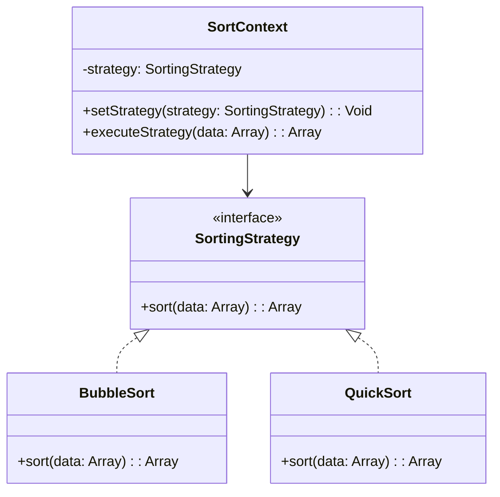

## 6.1 Strategy Pattern

### Introduction

The Strategy Pattern is a behavioral design pattern that enables selecting an algorithm's behavior at runtime. It defines a family of algorithms, encapsulates each one, and makes them interchangeable. This pattern is particularly useful in scenarios where multiple algorithms can be applied to a problem, and the choice of algorithm might depend on the context or user input.

In Haxe, the Strategy Pattern can be implemented using interfaces and classes, allowing for dynamic selection and execution of strategies. This flexibility is crucial in cross-platform development, where different platforms may require different implementations.

### Intent

The primary intent of the Strategy Pattern is to define a set of algorithms, encapsulate each one, and make them interchangeable. This pattern allows the algorithm to vary independently from the clients that use it. By encapsulating the algorithms, we can easily switch between them without altering the client code.

### Key Participants

- **Strategy Interface**: Defines a common interface for all supported algorithms.
- **Concrete Strategies**: Implement the strategy interface, providing specific algorithm implementations.
- **Context**: Maintains a reference to a strategy object and delegates the algorithm execution to the strategy.

### Applicability

Use the Strategy Pattern when:

- You have multiple related classes that differ only in their behavior.
- You need different variants of an algorithm.
- You want to avoid exposing complex, algorithm-specific data structures.
- You need to switch algorithms at runtime.

### Implementing Strategy in Haxe

#### Interfaces and Classes

In Haxe, we can define a common interface for all strategies and implement concrete classes for each strategy. This approach allows us to encapsulate the algorithms and make them interchangeable.

```haxe
// Define the Strategy interface
interface SortingStrategy {
    public function sort(data:Array<Int>):Array<Int>;
}

// Implement Concrete Strategies
class BubbleSort implements SortingStrategy {
    public function new() {}

    public function sort(data:Array<Int>):Array<Int> {
        // Bubble sort algorithm
        var n = data.length;
        for (i in 0...n) {
            for (j in 0...n-i-1) {
                if (data[j] > data[j+1]) {
                    var temp = data[j];
                    data[j] = data[j+1];
                    data[j+1] = temp;
                }
            }
        }
        return data;
    }
}

class QuickSort implements SortingStrategy {
    public function new() {}

    public function sort(data:Array<Int>):Array<Int> {
        // Quick sort algorithm
        if (data.length <= 1) return data;
        var pivot = data[0];
        var less = data.filter(x -> x < pivot);
        var greater = data.filter(x -> x > pivot);
        return sort(less).concat([pivot]).concat(sort(greater));
    }
}
```

#### Dynamic Selection

We can use dependency injection or a context class to switch strategies during execution. This allows us to choose the appropriate strategy based on runtime conditions.

```haxe
// Define the Context class
class SortContext {
    private var strategy:SortingStrategy;

    public function new(strategy:SortingStrategy) {
        this.strategy = strategy;
    }

    public function setStrategy(strategy:SortingStrategy):Void {
        this.strategy = strategy;
    }

    public function executeStrategy(data:Array<Int>):Array<Int> {
        return strategy.sort(data);
    }
}

// Usage example
class Main {
    static public function main() {
        var data = [5, 3, 8, 4, 2];
        
        // Use BubbleSort strategy
        var context = new SortContext(new BubbleSort());
        trace("BubbleSort: " + context.executeStrategy(data));

        // Switch to QuickSort strategy
        context.setStrategy(new QuickSort());
        trace("QuickSort: " + context.executeStrategy(data));
    }
}
```

### Visualizing the Strategy Pattern

To better understand the Strategy Pattern, let's visualize the relationships between the components using a class diagram.



### Use Cases and Examples

#### Sorting Algorithms

One common use case for the Strategy Pattern is implementing different sorting algorithms. Depending on the size or type of data, we might choose a different sorting strategy. For example, Bubble Sort might be suitable for small datasets, while Quick Sort is more efficient for larger datasets.

#### Payment Processing

In an e-commerce application, we might use the Strategy Pattern to select different payment methods. Each payment method (e.g., credit card, PayPal, bank transfer) can be implemented as a concrete strategy, allowing the application to switch between them based on user preference or availability.

### Design Considerations

When implementing the Strategy Pattern in Haxe, consider the following:

- **Interface Design**: Ensure that the strategy interface is well-defined and encompasses all necessary operations.
- **Strategy Selection**: Decide how strategies will be selected and switched at runtime. This could be based on user input, configuration settings, or runtime conditions.
- **Performance**: Be mindful of the performance implications of switching strategies, especially if the strategies involve complex algorithms.

### Differences and Similarities

The Strategy Pattern is often confused with the State Pattern. While both patterns involve encapsulating behavior, the Strategy Pattern focuses on interchangeable algorithms, whereas the State Pattern is concerned with changing behavior based on state.

### Try It Yourself

To deepen your understanding of the Strategy Pattern, try modifying the code examples:

- Implement additional sorting algorithms, such as Merge Sort or Insertion Sort, and integrate them into the existing framework.
- Create a new context class for a different use case, such as payment processing, and implement various payment strategies.

### Knowledge Check

- Explain the primary intent of the Strategy Pattern.
- Describe how the Strategy Pattern can be implemented in Haxe.
- Identify scenarios where the Strategy Pattern is applicable.

### Embrace the Journey

Remember, mastering design patterns is a journey. As you explore the Strategy Pattern, consider how it can be applied to your projects. Keep experimenting, stay curious, and enjoy the process of learning and applying new patterns.

## Quiz Time!



### What is the primary intent of the Strategy Pattern?

- [x] To define a family of algorithms, encapsulate each one, and make them interchangeable.
- [ ] To manage object creation and lifecycle.
- [ ] To provide a way to access elements of an aggregate object sequentially.
- [ ] To define a one-to-many dependency between objects.

> **Explanation:** The Strategy Pattern's primary intent is to define a family of algorithms, encapsulate each one, and make them interchangeable.

### Which component in the Strategy Pattern defines the common interface for all strategies?

- [x] Strategy Interface
- [ ] Concrete Strategy
- [ ] Context
- [ ] Client

> **Explanation:** The Strategy Interface defines the common interface for all supported algorithms.

### How can strategies be switched at runtime in Haxe?

- [x] By using dependency injection or a context class.
- [ ] By modifying the client code directly.
- [ ] By recompiling the application.
- [ ] By using global variables.

> **Explanation:** Strategies can be switched at runtime using dependency injection or a context class to manage the strategy instances.

### What is a common use case for the Strategy Pattern?

- [x] Implementing different sorting algorithms.
- [ ] Managing database connections.
- [ ] Handling user authentication.
- [ ] Rendering graphics.

> **Explanation:** A common use case for the Strategy Pattern is implementing different sorting algorithms that can be selected based on the context.

### Which of the following is NOT a key participant in the Strategy Pattern?

- [ ] Strategy Interface
- [ ] Concrete Strategy
- [x] Singleton
- [ ] Context

> **Explanation:** The Singleton is not a key participant in the Strategy Pattern; it involves the Strategy Interface, Concrete Strategies, and Context.

### What is the role of the Context in the Strategy Pattern?

- [x] To maintain a reference to a strategy object and delegate algorithm execution.
- [ ] To define the algorithm interface.
- [ ] To implement specific algorithms.
- [ ] To manage the lifecycle of strategy objects.

> **Explanation:** The Context maintains a reference to a strategy object and delegates the algorithm execution to the strategy.

### How does the Strategy Pattern differ from the State Pattern?

- [x] Strategy focuses on interchangeable algorithms, while State focuses on behavior based on state.
- [ ] Strategy manages object creation, while State manages object destruction.
- [ ] Strategy is used for sequential access, while State is used for random access.
- [ ] Strategy is a creational pattern, while State is a structural pattern.

> **Explanation:** The Strategy Pattern focuses on interchangeable algorithms, whereas the State Pattern is concerned with changing behavior based on state.

### What should be considered when designing the strategy interface?

- [x] It should encompass all necessary operations for the algorithms.
- [ ] It should be as complex as possible.
- [ ] It should only include a single method.
- [ ] It should be identical to the client interface.

> **Explanation:** The strategy interface should be well-defined and encompass all necessary operations for the algorithms.

### In which scenario would the Strategy Pattern be inappropriate?

- [ ] When you have multiple related classes that differ only in behavior.
- [ ] When you need different variants of an algorithm.
- [x] When you need to manage object creation and lifecycle.
- [ ] When you want to switch algorithms at runtime.

> **Explanation:** The Strategy Pattern is inappropriate for managing object creation and lifecycle, which is the domain of creational patterns.

### True or False: The Strategy Pattern allows algorithms to vary independently from the clients that use them.

- [x] True
- [ ] False

> **Explanation:** True. The Strategy Pattern allows algorithms to vary independently from the clients that use them by encapsulating the algorithms.


