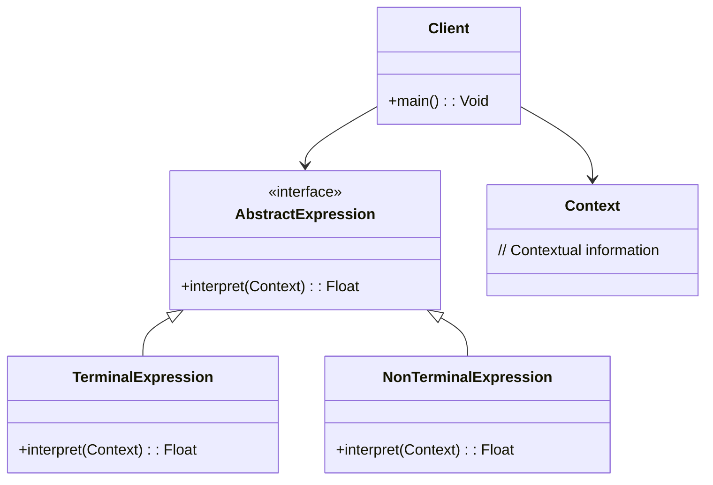

## 6.10 Interpreter Pattern

The Interpreter Pattern is a powerful behavioral design pattern that allows developers to define a grammar for a language and provide an interpreter to process sentences in that language. This pattern is particularly useful in scenarios where you need to interpret expressions or commands, such as in mathematical calculators or scripting languages embedded within applications.

### Intent

The primary intent of the Interpreter Pattern is to interpret sentences in a language by defining a representation for its grammar. This involves creating a set of classes that represent different parts of the grammar and an interpreter that evaluates these classes based on a given context.

### Key Participants

1. **AbstractExpression**: Declares an abstract `interpret` method that is implemented by all concrete expressions.
2. **TerminalExpression**: Implements an `interpret` operation associated with terminal symbols in the grammar.
3. **NonTerminalExpression**: Implements an `interpret` operation for non-terminal symbols in the grammar.
4. **Context**: Contains information that's global to the interpreter.
5. **Client**: Builds (or is given) an abstract syntax tree representing a particular sentence in the language defined by the grammar. The abstract syntax tree is assembled from instances of the NonTerminalExpression and TerminalExpression classes.

### Applicability

Use the Interpreter Pattern when:

- You have a simple grammar and need to interpret sentences in that language.
- You want to implement a language interpreter or a simple scripting language.
- You need to evaluate expressions, such as mathematical expressions or logical conditions.

### Implementing Interpreter in Haxe

Let's delve into how we can implement the Interpreter Pattern in Haxe. We'll start by defining abstract expression classes, followed by the interpreter implementation.

#### Abstract Expression Classes

In Haxe, we can represent grammar rules using abstract expression classes. These classes form the basis of our interpreter.

```haxe
// AbstractExpression.hx
interface AbstractExpression {
    public function interpret(context: Context): Float;
}
```

#### Terminal and Non-Terminal Expressions

Terminal expressions represent the basic elements of the grammar, while non-terminal expressions represent more complex rules.

```haxe
// TerminalExpression.hx
class NumberExpression implements AbstractExpression {
    private var number: Float;

    public function new(number: Float) {
        this.number = number;
    }

    public function interpret(context: Context): Float {
        return number;
    }
}

// NonTerminalExpression.hx
class AddExpression implements AbstractExpression {
    private var left: AbstractExpression;
    private var right: AbstractExpression;

    public function new(left: AbstractExpression, right: AbstractExpression) {
        this.left = left;
        this.right = right;
    }

    public function interpret(context: Context): Float {
        return left.interpret(context) + right.interpret(context);
    }
}
```

#### Context Class

The context class holds any global information required by the interpreter.

```haxe
// Context.hx
class Context {
    // Contextual information can be added here
}
```

#### Interpreter Implementation

The interpreter evaluates expressions based on the context. Here's how you can implement a simple interpreter for mathematical expressions.

```haxe
// Interpreter.hx
class Interpreter {
    public static function main() {
        var context = new Context();
        
        // (5 + 10) + 20
        var expression: AbstractExpression = new AddExpression(
            new AddExpression(new NumberExpression(5), new NumberExpression(10)),
            new NumberExpression(20)
        );

        var result = expression.interpret(context);
        trace("Result: " + result); // Output: Result: 35
    }
}
```

### Diagrams

To better understand the structure of the Interpreter Pattern, let's visualize it using a class diagram.



### Use Cases and Examples

The Interpreter Pattern is versatile and can be applied in various scenarios. Let's explore some common use cases.

#### Expression Evaluation

One of the most common applications of the Interpreter Pattern is in evaluating expressions, such as mathematical calculators.

#### Scripting Languages

The Interpreter Pattern can be used to embed custom scripting languages within applications, allowing users to define and execute scripts.

### Design Considerations

When implementing the Interpreter Pattern, consider the following:

- **Complexity**: The pattern can become complex if the grammar is complex. Consider alternative approaches if the grammar is too intricate.
- **Performance**: The pattern may not be suitable for performance-critical applications due to the overhead of interpreting expressions.
- **Haxe-Specific Features**: Leverage Haxe's static typing and macro system to optimize the interpreter's performance and maintainability.

### Differences and Similarities

The Interpreter Pattern is often confused with the Strategy Pattern. While both involve defining a set of operations, the Interpreter Pattern focuses on interpreting a language, whereas the Strategy Pattern is about selecting an algorithm at runtime.

### Try It Yourself

Experiment with the code examples provided. Try modifying the expressions or adding new operations to see how the interpreter handles them. For instance, implement a `SubtractExpression` class and integrate it into the interpreter.

### References and Links

- [Design Patterns: Elements of Reusable Object-Oriented Software](https://en.wikipedia.org/wiki/Design_Patterns)
- [Haxe Programming Language](https://haxe.org/)
- [Interpreter Pattern on Refactoring Guru](https://refactoring.guru/design-patterns/interpreter)

### Knowledge Check

- What is the primary intent of the Interpreter Pattern?
- How does the Interpreter Pattern differ from the Strategy Pattern?
- What are some common use cases for the Interpreter Pattern?

### Embrace the Journey

Remember, mastering design patterns is a journey. As you explore the Interpreter Pattern, you'll gain insights into how languages are processed and interpreted. Keep experimenting, stay curious, and enjoy the journey!

## Quiz Time!



### What is the primary intent of the Interpreter Pattern?

- [x] To define a representation for a language's grammar and interpret sentences in that language.
- [ ] To select an algorithm at runtime.
- [ ] To encapsulate a request as an object.
- [ ] To define a family of algorithms.

> **Explanation:** The Interpreter Pattern is designed to interpret sentences in a language by defining a representation for its grammar.

### Which class in the Interpreter Pattern represents terminal symbols?

- [x] TerminalExpression
- [ ] NonTerminalExpression
- [ ] Context
- [ ] AbstractExpression

> **Explanation:** TerminalExpression implements the interpret operation for terminal symbols in the grammar.

### What is a common use case for the Interpreter Pattern?

- [x] Expression evaluation in calculators.
- [ ] Implementing a user interface.
- [ ] Managing object creation.
- [ ] Defining a family of algorithms.

> **Explanation:** The Interpreter Pattern is commonly used for evaluating expressions, such as in calculators.

### How does the Interpreter Pattern differ from the Strategy Pattern?

- [x] The Interpreter Pattern focuses on interpreting a language, while the Strategy Pattern selects an algorithm at runtime.
- [ ] The Interpreter Pattern is used for object creation, while the Strategy Pattern is for object behavior.
- [ ] The Interpreter Pattern is for managing object lifecycles, while the Strategy Pattern is for managing object states.
- [ ] The Interpreter Pattern is for defining a family of algorithms, while the Strategy Pattern is for encapsulating requests.

> **Explanation:** The Interpreter Pattern is about interpreting a language, whereas the Strategy Pattern is about selecting an algorithm at runtime.

### What is a potential drawback of the Interpreter Pattern?

- [x] It can become complex if the grammar is complex.
- [ ] It is not suitable for object creation.
- [ ] It cannot be used for expression evaluation.
- [ ] It is only applicable to user interfaces.

> **Explanation:** The Interpreter Pattern can become complex if the grammar is intricate, making it challenging to implement.

### Which Haxe feature can optimize the interpreter's performance?

- [x] Static typing and macro system
- [ ] Dynamic typing
- [ ] Reflection
- [ ] Event handling

> **Explanation:** Haxe's static typing and macro system can be leveraged to optimize the interpreter's performance and maintainability.

### What role does the Context class play in the Interpreter Pattern?

- [x] It contains information that's global to the interpreter.
- [ ] It represents terminal symbols in the grammar.
- [ ] It selects an algorithm at runtime.
- [ ] It encapsulates a request as an object.

> **Explanation:** The Context class holds global information required by the interpreter.

### What is the role of the Client in the Interpreter Pattern?

- [x] It builds an abstract syntax tree representing a sentence in the language.
- [ ] It interprets terminal symbols.
- [ ] It contains global information for the interpreter.
- [ ] It selects an algorithm at runtime.

> **Explanation:** The Client builds an abstract syntax tree from instances of NonTerminalExpression and TerminalExpression classes.

### What is the output of the provided interpreter example?

- [x] Result: 35
- [ ] Result: 15
- [ ] Result: 25
- [ ] Result: 45

> **Explanation:** The interpreter evaluates the expression (5 + 10) + 20, resulting in 35.

### True or False: The Interpreter Pattern is suitable for performance-critical applications.

- [ ] True
- [x] False

> **Explanation:** The Interpreter Pattern may not be suitable for performance-critical applications due to the overhead of interpreting expressions.


