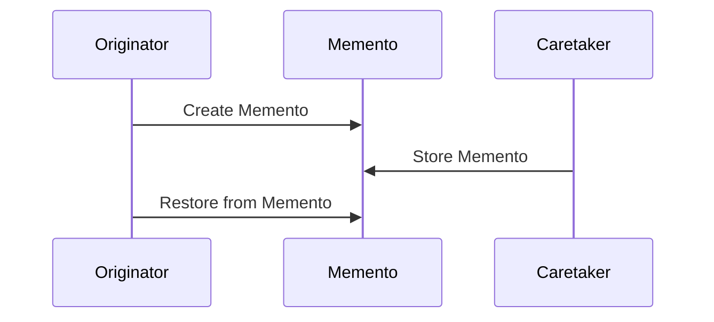

## 6.11 Memento Pattern

The Memento Pattern is a behavioral design pattern that provides the ability to capture and externalize an object's internal state without violating encapsulation, allowing the state to be restored at a later time. This pattern is particularly useful in scenarios where you need to implement undo functionality or save checkpoints in applications, such as games.

### Intent

The primary intent of the Memento Pattern is to:

- Capture an object's internal state.
- Externalize the state without breaking encapsulation.
- Allow the object to be restored to this state later.

### Key Participants

1. **Memento**: Stores the internal state of the Originator. It is a snapshot of the Originator's state.
2. **Originator**: Creates a Memento containing a snapshot of its current state and uses the Memento to restore its state.
3. **Caretaker**: Manages the Memento. It is responsible for keeping track of the Memento but does not modify or inspect its contents.

### Applicability

Use the Memento Pattern when:

- You need to provide undo functionality.
- You want to save and restore an object's state at different points in time.
- You need to maintain encapsulation boundaries.

### Implementing Memento in Haxe

Let's explore how to implement the Memento Pattern in Haxe with a practical example. We'll create a simple text editor that supports undo functionality.

#### Memento Class

The Memento class stores the state of the Originator. In our example, it will store the text content of the editor.

```haxe
class Memento {
    private var state:String;

    public function new(state:String) {
        this.state = state;
    }

    public function getState():String {
        return state;
    }
}
```

#### Originator

The Originator is the object whose state needs to be saved and restored. It creates a Memento to capture its state and uses it to restore its state.

```haxe
class TextEditor {
    private var content:String;

    public function new() {
        content = "";
    }

    public function write(text:String):Void {
        content += text;
    }

    public function save():Memento {
        return new Memento(content);
    }

    public function restore(memento:Memento):Void {
        content = memento.getState();
    }

    public function getContent():String {
        return content;
    }
}
```

#### Caretaker

The Caretaker is responsible for managing the Mementos. It keeps track of the Mementos but does not modify or inspect their contents.

```haxe
class Caretaker {
    private var mementos:Array<Memento>;

    public function new() {
        mementos = [];
    }

    public function addMemento(memento:Memento):Void {
        mementos.push(memento);
    }

    public function getMemento(index:Int):Memento {
        return mementos[index];
    }
}
```

#### Using the Memento Pattern

Let's see how we can use the Memento Pattern to implement undo functionality in our text editor.

```haxe
class Main {
    static function main() {
        var editor = new TextEditor();
        var caretaker = new Caretaker();

        editor.write("Hello, ");
        caretaker.addMemento(editor.save());

        editor.write("world!");
        caretaker.addMemento(editor.save());

        trace("Current Content: " + editor.getContent());

        // Undo last change
        editor.restore(caretaker.getMemento(0));
        trace("After Undo: " + editor.getContent());
    }
}
```

### Diagrams

To better understand the Memento Pattern, let's visualize the interaction between the Originator, Memento, and Caretaker using a sequence diagram.



### Design Considerations

- **Encapsulation**: The Memento Pattern preserves encapsulation boundaries by not exposing the internal state of the Originator to the Caretaker.
- **Memory Usage**: Be mindful of memory usage when storing multiple Mementos, especially if the state is large.
- **Immutable Mementos**: Consider making Mementos immutable to prevent accidental modification.

### Differences and Similarities

- **Command Pattern**: While both patterns can be used to implement undo functionality, the Command Pattern encapsulates a request as an object, whereas the Memento Pattern captures the state of an object.
- **Prototype Pattern**: The Prototype Pattern involves cloning objects, which can be used to achieve similar results as the Memento Pattern but with different intent and implementation.

### Use Cases and Examples

#### State Restoration

The Memento Pattern is ideal for implementing undo functionality in applications. By capturing the state of an object at various points, you can easily restore it to a previous state.

#### Checkpointing

In games or applications where you need to save progress or checkpoints, the Memento Pattern provides a way to capture the state and restore it later.

### Try It Yourself

Experiment with the Memento Pattern by modifying the code examples:

- Add more complex state to the `TextEditor` class, such as formatting or cursor position.
- Implement a redo functionality by managing multiple Mementos.
- Create a history feature that allows navigating through multiple states.

### References and Links

- [Design Patterns: Elements of Reusable Object-Oriented Software](https://en.wikipedia.org/wiki/Design_Patterns) - A foundational book on design patterns.
- [Haxe Language Reference](https://haxe.org/manual/) - Official Haxe documentation.
- [Memento Pattern on Wikipedia](https://en.wikipedia.org/wiki/Memento_pattern) - Additional information on the Memento Pattern.

### Knowledge Check

- What is the primary intent of the Memento Pattern?
- How does the Memento Pattern preserve encapsulation?
- What are some use cases for the Memento Pattern?

### Embrace the Journey

Remember, mastering design patterns is a journey. As you continue to explore and implement patterns like the Memento Pattern, you'll gain valuable insights into building robust and maintainable software. Keep experimenting, stay curious, and enjoy the journey!

## Quiz Time!



### What is the primary intent of the Memento Pattern?

- [x] To capture and externalize an object's internal state without violating encapsulation.
- [ ] To encapsulate a request as an object.
- [ ] To provide a way to create objects without specifying their concrete classes.
- [ ] To define a family of algorithms and make them interchangeable.

> **Explanation:** The Memento Pattern captures and externalizes an object's internal state without violating encapsulation, allowing it to be restored later.

### Which participant in the Memento Pattern is responsible for creating a Memento?

- [x] Originator
- [ ] Caretaker
- [ ] Memento
- [ ] Observer

> **Explanation:** The Originator creates a Memento containing a snapshot of its current state.

### What role does the Caretaker play in the Memento Pattern?

- [x] It manages the Mementos and keeps track of them.
- [ ] It creates and restores Mementos.
- [ ] It modifies the state of the Originator.
- [ ] It inspects the contents of the Memento.

> **Explanation:** The Caretaker manages the Mementos but does not modify or inspect their contents.

### How does the Memento Pattern preserve encapsulation?

- [x] By not exposing the internal state of the Originator to the Caretaker.
- [ ] By allowing the Caretaker to modify the Memento.
- [ ] By storing the state in a public variable.
- [ ] By using inheritance to share state.

> **Explanation:** The Memento Pattern preserves encapsulation by not exposing the internal state of the Originator to the Caretaker.

### Which of the following is a use case for the Memento Pattern?

- [x] Implementing undo functionality.
- [x] Saving checkpoints in games.
- [ ] Defining a family of algorithms.
- [ ] Creating objects without specifying their concrete classes.

> **Explanation:** The Memento Pattern is used for implementing undo functionality and saving checkpoints.

### What is a potential drawback of using the Memento Pattern?

- [x] Increased memory usage due to storing multiple Mementos.
- [ ] Violating encapsulation boundaries.
- [ ] Difficulty in creating Mementos.
- [ ] Lack of flexibility in restoring states.

> **Explanation:** Storing multiple Mementos can lead to increased memory usage.

### How can you make Mementos more robust?

- [x] By making them immutable.
- [ ] By allowing the Caretaker to modify them.
- [ ] By storing them in a public variable.
- [ ] By using inheritance to share state.

> **Explanation:** Making Mementos immutable prevents accidental modification.

### Which pattern is commonly confused with the Memento Pattern?

- [x] Command Pattern
- [ ] Observer Pattern
- [ ] Singleton Pattern
- [ ] Factory Pattern

> **Explanation:** The Command Pattern is often confused with the Memento Pattern as both can be used for undo functionality.

### What is the role of the Originator in the Memento Pattern?

- [x] To create and restore Mementos.
- [ ] To manage the Mementos.
- [ ] To inspect the contents of the Memento.
- [ ] To encapsulate a request as an object.

> **Explanation:** The Originator creates and restores Mementos.

### True or False: The Caretaker modifies the state of the Originator.

- [ ] True
- [x] False

> **Explanation:** The Caretaker does not modify the state of the Originator; it only manages the Mementos.




