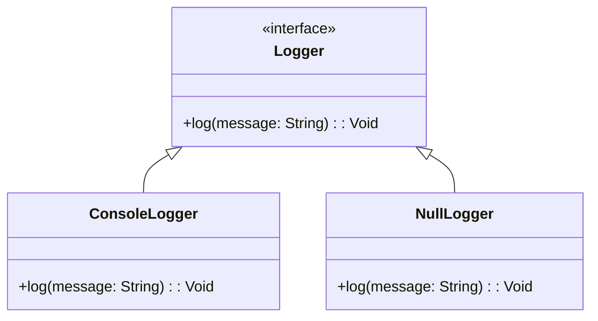

## 6.12 Null Object Pattern

In the world of software development, dealing with null references is a common challenge that can lead to runtime errors and increased complexity in code. The Null Object Pattern offers a solution by providing a default object that represents a "do nothing" behavior, thereby avoiding the need for null checks. In this section, we will explore the Null Object Pattern in Haxe, its implementation, use cases, and how it can enhance your code's robustness and maintainability.

### Definition

The Null Object Pattern is a behavioral design pattern that provides a default object to avoid null references. Instead of returning `null` or checking for `null` values, a null object is used to represent the absence of an object. This null object implements the same interface as the real object but performs no action.

### Implementing Null Object in Haxe

#### Null Implementations

In Haxe, implementing the Null Object Pattern involves creating objects that implement interfaces but perform no action. This approach allows us to use polymorphism to handle cases where an object might be absent without introducing null checks.

Let's consider an example where we have a `Logger` interface:

```haxe
interface Logger {
    public function log(message: String): Void;
}
```

We can implement a `ConsoleLogger` that logs messages to the console:

```haxe
class ConsoleLogger implements Logger {
    public function new() {}

    public function log(message: String): Void {
        trace(message);
    }
}
```

Now, let's implement a `NullLogger` that does nothing:

```haxe
class NullLogger implements Logger {
    public function new() {}

    public function log(message: String): Void {
        // Do nothing
    }
}
```

By using the `NullLogger`, we can avoid null checks and ensure that the `log` method can be called safely without worrying about null references.

#### Avoiding Null Checks

The primary advantage of the Null Object Pattern is the reduction of conditional code. By using a null object, we can eliminate the need for null checks and simplify our code.

Consider the following example where we use a logger:

```haxe
class Application {
    private var logger: Logger;

    public function new(logger: Logger) {
        this.logger = logger;
    }

    public function run(): Void {
        logger.log("Application started.");
        // Application logic
        logger.log("Application finished.");
    }
}
```

Without the Null Object Pattern, we might have to check if `logger` is `null` before calling `log`. However, by using a `NullLogger`, we can avoid these checks:

```haxe
var app = new Application(new NullLogger());
app.run();
```

### Use Cases and Examples

#### Default Handlers

One common use case for the Null Object Pattern is providing a default handler when none is assigned. For instance, in event-driven systems, we might have a default event handler that does nothing:

```haxe
interface EventHandler {
    public function handle(event: String): Void;
}

class DefaultEventHandler implements EventHandler {
    public function new() {}

    public function handle(event: String): Void {
        // Do nothing
    }
}
```

By using a `DefaultEventHandler`, we can ensure that events are handled gracefully even if no specific handler is assigned.

#### Data Structures

The Null Object Pattern can also be used to simplify data structures by avoiding null checks. For example, in a linked list implementation, we might use a null object to represent the end of the list:

```haxe
interface Node {
    public function getNext(): Node;
    public function getValue(): Dynamic;
}

class NullNode implements Node {
    public function new() {}

    public function getNext(): Node {
        return this; // Return itself to indicate the end of the list
    }

    public function getValue(): Dynamic {
        return null;
    }
}
```

By using a `NullNode`, we can traverse the list without checking for null references, simplifying the implementation.

### Visualizing the Null Object Pattern

To better understand the Null Object Pattern, let's visualize it using a class diagram:



In this diagram, `Logger` is an interface with a `log` method. Both `ConsoleLogger` and `NullLogger` implement this interface. The `NullLogger` provides a default implementation that does nothing, allowing us to avoid null checks.

### Key Participants

- **Abstract Interface (Logger):** Defines the operations that concrete classes must implement.
- **Real Object (ConsoleLogger):** Implements the interface and provides actual functionality.
- **Null Object (NullLogger):** Implements the interface but provides a no-operation implementation.

### Applicability

The Null Object Pattern is applicable in scenarios where:

- You want to avoid null checks and simplify code.
- You need a default behavior when an object is absent.
- You want to ensure that method calls are safe even when an object is not present.

### Sample Code Snippet

Let's put everything together in a complete example:

```haxe
interface Logger {
    public function log(message: String): Void;
}

class ConsoleLogger implements Logger {
    public function new() {}

    public function log(message: String): Void {
        trace(message);
    }
}

class NullLogger implements Logger {
    public function new() {}

    public function log(message: String): Void {
        // Do nothing
    }
}

class Application {
    private var logger: Logger;

    public function new(logger: Logger) {
        this.logger = logger;
    }

    public function run(): Void {
        logger.log("Application started.");
        // Application logic
        logger.log("Application finished.");
    }
}

class Main {
    static public function main() {
        var app = new Application(new NullLogger());
        app.run();
    }
}
```

### Design Considerations

When using the Null Object Pattern, consider the following:

- **Performance:** While null objects can simplify code, they may introduce a slight overhead due to additional object creation.
- **Clarity:** Ensure that the use of null objects is clear and does not obscure the intent of the code.
- **Consistency:** Use null objects consistently across your codebase to maintain uniformity.

### Differences and Similarities

The Null Object Pattern is often compared to other patterns like the Strategy Pattern. While both involve polymorphism, the Null Object Pattern specifically addresses the absence of an object, whereas the Strategy Pattern focuses on interchangeable behaviors.

### Try It Yourself

To deepen your understanding of the Null Object Pattern, try modifying the code examples:

- Implement a `FileLogger` that logs messages to a file and use it in the `Application`.
- Create a `NullEventHandler` for an event-driven system and integrate it into your code.
- Experiment with different data structures, such as trees or graphs, using null objects to simplify traversal.

### Knowledge Check

- What is the primary purpose of the Null Object Pattern?
- How does the Null Object Pattern help in avoiding null checks?
- What are some common use cases for the Null Object Pattern?
- How does the Null Object Pattern differ from the Strategy Pattern?

### Embrace the Journey

Remember, mastering design patterns is a journey. The Null Object Pattern is just one tool in your toolkit. As you continue to explore and experiment, you'll discover new ways to apply design patterns to create robust, maintainable, and efficient code. Keep experimenting, stay curious, and enjoy the journey!

## Quiz Time!



### What is the primary purpose of the Null Object Pattern?

- [x] To provide a default object to avoid null references
- [ ] To implement complex algorithms
- [ ] To enhance user interface design
- [ ] To manage database connections

> **Explanation:** The Null Object Pattern provides a default object to avoid null references, reducing the need for null checks.

### How does the Null Object Pattern help in avoiding null checks?

- [x] By providing a default object that implements the same interface
- [ ] By using conditional statements
- [ ] By throwing exceptions
- [ ] By using global variables

> **Explanation:** The Null Object Pattern uses a default object that implements the same interface, allowing method calls without null checks.

### Which of the following is a common use case for the Null Object Pattern?

- [x] Providing a default handler in event-driven systems
- [ ] Implementing a complex algorithm
- [ ] Enhancing user interface design
- [ ] Managing database connections

> **Explanation:** A common use case for the Null Object Pattern is providing a default handler in event-driven systems.

### What is a key participant in the Null Object Pattern?

- [x] Null Object
- [ ] Singleton
- [ ] Observer
- [ ] Factory

> **Explanation:** The Null Object is a key participant in the Null Object Pattern, providing a no-operation implementation.

### How does the Null Object Pattern differ from the Strategy Pattern?

- [x] Null Object Pattern addresses the absence of an object
- [ ] Strategy Pattern addresses the absence of an object
- [ ] Both patterns address the absence of an object
- [ ] Neither pattern addresses the absence of an object

> **Explanation:** The Null Object Pattern specifically addresses the absence of an object, while the Strategy Pattern focuses on interchangeable behaviors.

### What is a potential drawback of using the Null Object Pattern?

- [x] Slight overhead due to additional object creation
- [ ] Increased complexity in code
- [ ] Difficulty in understanding code
- [ ] Lack of flexibility

> **Explanation:** The Null Object Pattern may introduce a slight overhead due to additional object creation.

### What is a benefit of using the Null Object Pattern?

- [x] Simplifies code by reducing null checks
- [ ] Increases code complexity
- [ ] Requires more conditional statements
- [ ] Decreases code readability

> **Explanation:** The Null Object Pattern simplifies code by reducing the need for null checks.

### Which design pattern is often compared to the Null Object Pattern?

- [x] Strategy Pattern
- [ ] Singleton Pattern
- [ ] Observer Pattern
- [ ] Factory Pattern

> **Explanation:** The Null Object Pattern is often compared to the Strategy Pattern, as both involve polymorphism.

### What should be considered when using the Null Object Pattern?

- [x] Consistency in using null objects across the codebase
- [ ] Avoiding the use of interfaces
- [ ] Implementing complex algorithms
- [ ] Using global variables

> **Explanation:** Consistency in using null objects across the codebase is important when implementing the Null Object Pattern.

### True or False: The Null Object Pattern can be used to enhance user interface design.

- [ ] True
- [x] False

> **Explanation:** The Null Object Pattern is not typically used to enhance user interface design; it is used to avoid null references.


