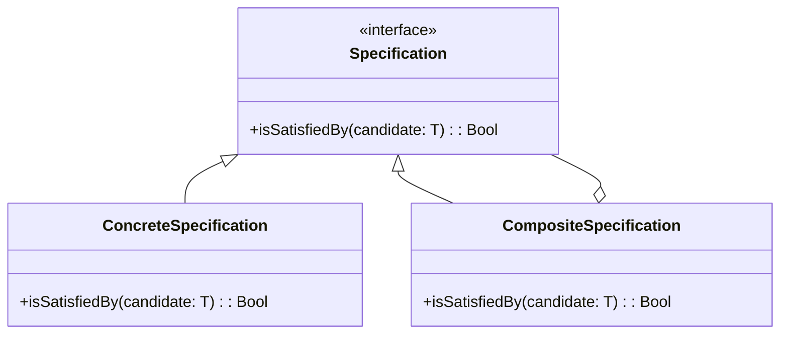

## 6.13 Specification Pattern

The Specification Pattern is a powerful behavioral design pattern that encapsulates business rules to determine if an object satisfies certain criteria. This pattern is particularly useful in scenarios where you need to apply complex filtering conditions or validate business rules across different objects. In this section, we will delve into the Specification Pattern, its implementation in Haxe, and its practical applications.

### Definition and Intent

The Specification Pattern allows you to encapsulate business logic in a reusable and composable way. By defining specifications as separate entities, you can easily combine them using logical operations such as AND, OR, and NOT. This makes it easier to manage and extend business rules without modifying the underlying objects.

### Key Participants

- **Specification Interface:** Defines the contract for specifications, typically including methods like `isSatisfiedBy`.
- **Concrete Specification:** Implements the specification interface to encapsulate specific business rules.
- **Composite Specification:** Combines multiple specifications using logical operations to form complex criteria.

### Applicability

Use the Specification Pattern when:

- You need to apply complex filtering conditions to collections of objects.
- Business rules are subject to frequent changes and need to be easily modifiable.
- You want to promote reusability and composability of business logic.

### Implementing Specification in Haxe

#### Specification Interfaces

Begin by defining a specification interface that outlines the contract for specifications. This interface typically includes a method like `isSatisfiedBy` that takes an object and returns a boolean indicating whether the object satisfies the specification.

```haxe
interface Specification<T> {
    public function isSatisfiedBy(candidate: T): Bool;
}
```

#### Concrete Specifications

Implement concrete specifications by creating classes that implement the specification interface. Each concrete specification encapsulates a specific business rule.

```haxe
class AgeSpecification implements Specification<Person> {
    private var minAge: Int;
    
    public function new(minAge: Int) {
        this.minAge = minAge;
    }
    
    public function isSatisfiedBy(candidate: Person): Bool {
        return candidate.age >= minAge;
    }
}
```

#### Composite Specifications

Composite specifications allow you to combine multiple specifications using logical operations. This is achieved by creating classes that implement the specification interface and combine other specifications.

```haxe
class AndSpecification<T> implements Specification<T> {
    private var spec1: Specification<T>;
    private var spec2: Specification<T>;
    
    public function new(spec1: Specification<T>, spec2: Specification<T>) {
        this.spec1 = spec1;
        this.spec2 = spec2;
    }
    
    public function isSatisfiedBy(candidate: T): Bool {
        return spec1.isSatisfiedBy(candidate) && spec2.isSatisfiedBy(candidate);
    }
}
```

### Use Cases and Examples

#### Filtering Collections

The Specification Pattern is ideal for filtering collections based on complex criteria. For example, you can filter a list of people to find those who are adults and have a specific job title.

```haxe
class JobTitleSpecification implements Specification<Person> {
    private var jobTitle: String;
    
    public function new(jobTitle: String) {
        this.jobTitle = jobTitle;
    }
    
    public function isSatisfiedBy(candidate: Person): Bool {
        return candidate.jobTitle == jobTitle;
    }
}

// Usage
var people: Array<Person> = [/* ... */];
var adultSpec = new AgeSpecification(18);
var developerSpec = new JobTitleSpecification("Developer");
var adultDevelopersSpec = new AndSpecification(adultSpec, developerSpec);

var adultDevelopers = people.filter(adultDevelopersSpec.isSatisfiedBy);
```

#### Business Rules Validation

The Specification Pattern is also useful for validating business rules. For instance, you can check if a product meets certain criteria before allowing it to be added to a shopping cart.

```haxe
class Product {
    public var price: Float;
    public var inStock: Bool;
    // Other properties...
}

class PriceSpecification implements Specification<Product> {
    private var maxPrice: Float;
    
    public function new(maxPrice: Float) {
        this.maxPrice = maxPrice;
    }
    
    public function isSatisfiedBy(candidate: Product): Bool {
        return candidate.price <= maxPrice;
    }
}

class InStockSpecification implements Specification<Product> {
    public function isSatisfiedBy(candidate: Product): Bool {
        return candidate.inStock;
    }
}

// Usage
var products: Array<Product> = [/* ... */];
var affordableSpec = new PriceSpecification(100.0);
var inStockSpec = new InStockSpecification();
var affordableInStockSpec = new AndSpecification(affordableSpec, inStockSpec);

var validProducts = products.filter(affordableInStockSpec.isSatisfiedBy);
```

### Design Considerations

- **Reusability:** Specifications can be reused across different parts of the application, promoting DRY (Don't Repeat Yourself) principles.
- **Composability:** Composite specifications allow you to build complex criteria by combining simpler specifications.
- **Maintainability:** Business rules are encapsulated in separate classes, making them easier to manage and modify.

### Differences and Similarities

The Specification Pattern is often compared to the Strategy Pattern. While both patterns encapsulate behavior, the Specification Pattern focuses on encapsulating business rules and criteria, whereas the Strategy Pattern encapsulates algorithms.

### Visualizing the Specification Pattern

To better understand the Specification Pattern, let's visualize the relationships between specifications using a class diagram.



**Diagram Description:** This class diagram illustrates the Specification Pattern, showing the relationship between the Specification interface, ConcreteSpecification, and CompositeSpecification. CompositeSpecification can combine multiple specifications.

### Try It Yourself

Experiment with the Specification Pattern by modifying the code examples. Try creating new specifications or combining existing ones in different ways. For instance, create a specification that checks if a person is both an adult and has a specific hobby.

### References and Links

- [Design Patterns: Elements of Reusable Object-Oriented Software](https://en.wikipedia.org/wiki/Design_Patterns) - A foundational book on design patterns.
- [Haxe Language Reference](https://haxe.org/manual/) - Official Haxe documentation for language features and syntax.

### Knowledge Check

- What is the primary purpose of the Specification Pattern?
- How does the Specification Pattern promote reusability and composability?
- What are the key differences between the Specification Pattern and the Strategy Pattern?

### Embrace the Journey

Remember, mastering design patterns is a journey. As you continue to explore and apply the Specification Pattern, you'll gain a deeper understanding of how to encapsulate business rules effectively. Keep experimenting, stay curious, and enjoy the journey!

## Quiz Time!



### What is the primary purpose of the Specification Pattern?

- [x] To encapsulate business rules for object criteria satisfaction.
- [ ] To encapsulate algorithms for different behaviors.
- [ ] To manage object creation.
- [ ] To define a family of algorithms.

> **Explanation:** The Specification Pattern is used to encapsulate business rules that determine if an object satisfies certain criteria.

### How does the Specification Pattern promote reusability?

- [x] By encapsulating business rules in separate classes.
- [ ] By allowing multiple inheritance.
- [ ] By using global variables.
- [ ] By hardcoding logic into objects.

> **Explanation:** The Specification Pattern promotes reusability by encapsulating business rules in separate classes, making them easy to reuse across different parts of the application.

### What method is typically defined in a Specification interface?

- [x] isSatisfiedBy
- [ ] execute
- [ ] validate
- [ ] apply

> **Explanation:** The `isSatisfiedBy` method is typically defined in a Specification interface to determine if a candidate object satisfies the specification.

### What is a Composite Specification?

- [x] A specification that combines multiple specifications using logical operations.
- [ ] A specification that encapsulates a single business rule.
- [ ] A specification that manages object creation.
- [ ] A specification that defines a family of algorithms.

> **Explanation:** A Composite Specification combines multiple specifications using logical operations like AND, OR, and NOT.

### Which pattern is often compared to the Specification Pattern?

- [x] Strategy Pattern
- [ ] Singleton Pattern
- [ ] Factory Pattern
- [ ] Observer Pattern

> **Explanation:** The Specification Pattern is often compared to the Strategy Pattern, as both encapsulate behavior, but they serve different purposes.

### What is the role of a Concrete Specification?

- [x] To implement specific business rules.
- [ ] To combine multiple specifications.
- [ ] To manage object creation.
- [ ] To define a family of algorithms.

> **Explanation:** A Concrete Specification implements specific business rules by defining the logic in the `isSatisfiedBy` method.

### How can you combine multiple specifications in the Specification Pattern?

- [x] Using Composite Specifications.
- [ ] Using inheritance.
- [ ] Using global variables.
- [ ] Using hardcoded logic.

> **Explanation:** Multiple specifications can be combined using Composite Specifications, which use logical operations to form complex criteria.

### What is a common use case for the Specification Pattern?

- [x] Filtering collections based on complex criteria.
- [ ] Managing object creation.
- [ ] Defining a family of algorithms.
- [ ] Observing changes in object state.

> **Explanation:** A common use case for the Specification Pattern is filtering collections based on complex criteria.

### What is the benefit of encapsulating business rules in separate classes?

- [x] It makes them easier to manage and modify.
- [ ] It increases code duplication.
- [ ] It makes the code less readable.
- [ ] It decreases performance.

> **Explanation:** Encapsulating business rules in separate classes makes them easier to manage and modify, promoting maintainability.

### True or False: The Specification Pattern is used to encapsulate algorithms for different behaviors.

- [ ] True
- [x] False

> **Explanation:** False. The Specification Pattern is used to encapsulate business rules, not algorithms for different behaviors.


