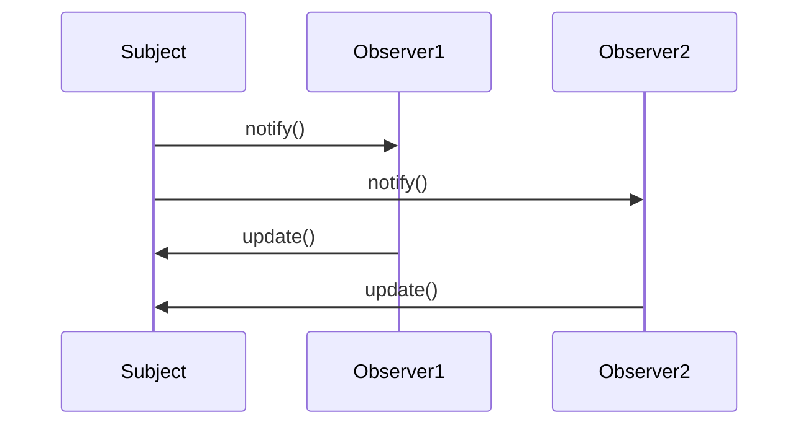

## 6.2 Observer Pattern

The Observer Pattern is a fundamental behavioral design pattern that plays a crucial role in developing responsive and interactive applications. It establishes a one-to-many dependency between objects, ensuring that when one object changes state, all its dependents are notified and updated automatically. This pattern is particularly useful in scenarios where a change in one part of the system requires updates in other parts, such as in GUI applications and event-driven systems.

### Intent

The primary intent of the Observer Pattern is to define a subscription mechanism to allow multiple objects to listen and react to events or changes in another object. This promotes a loose coupling between the subject (the object being observed) and the observers (the objects that need to be notified of changes).

### Key Participants

- **Subject (Observable):** The object that holds the state and notifies observers of any changes.
- **Observer:** The objects that need to be informed about changes in the subject.
- **ConcreteSubject:** A specific implementation of the subject that maintains the state of interest.
- **ConcreteObserver:** A specific implementation of the observer that reacts to changes in the subject.

### Applicability

The Observer Pattern is applicable in the following scenarios:

- When changes to one object require changes to others, and you don't know how many objects need to be changed.
- When an object should be able to notify other objects without making assumptions about who these objects are.
- In GUI applications where UI components need to update in response to changes in data.
- In event-driven systems, such as games, where entities need to respond to various game events.

### Implementing Observer in Haxe

#### Subject and Observer Interfaces

To implement the Observer Pattern in Haxe, we start by defining interfaces for the subject and the observer. These interfaces establish the contract that concrete subjects and observers must adhere to.

```haxe
// Observer Interface
interface Observer {
    function update(data:Dynamic):Void;
}

// Subject Interface
interface Subject {
    function attach(observer:Observer):Void;
    function detach(observer:Observer):Void;
    function notify(data:Dynamic):Void;
}
```

#### Concrete Implementation

Next, we create concrete implementations of the subject and observer. The subject maintains a list of observers and provides methods to attach, detach, and notify them.

```haxe
// ConcreteSubject
class ConcreteSubject implements Subject {
    private var observers:Array<Observer> = [];

    public function new() {}

    public function attach(observer:Observer):Void {
        observers.push(observer);
    }

    public function detach(observer:Observer):Void {
        var index = observers.indexOf(observer);
        if (index != -1) observers.splice(index, 1);
    }

    public function notify(data:Dynamic):Void {
        for (observer in observers) {
            observer.update(data);
        }
    }

    public function changeState(data:Dynamic):Void {
        // Change the state of the subject
        notify(data);
    }
}

// ConcreteObserver
class ConcreteObserver implements Observer {
    public function new() {}

    public function update(data:Dynamic):Void {
        trace("Observer received update with data: " + data);
    }
}
```

#### Event Dispatching

Haxe provides powerful event mechanisms that can be leveraged to implement the Observer Pattern efficiently. Alternatively, you can create custom implementations as demonstrated above.

### Use Cases and Examples

#### GUI Applications

In GUI applications, the Observer Pattern is often used to update UI components when the underlying data changes. For example, consider a scenario where a data model changes, and the UI needs to reflect these changes automatically.

```haxe
class DataModel extends ConcreteSubject {
    private var data:String;

    public function new() {
        super();
    }

    public function setData(newData:String):Void {
        data = newData;
        changeState(data);
    }

    public function getData():String {
        return data;
    }
}

class UIComponent implements Observer {
    public function new() {}

    public function update(data:Dynamic):Void {
        trace("UIComponent updated with new data: " + data);
    }
}

// Usage
var model = new DataModel();
var uiComponent = new UIComponent();

model.attach(uiComponent);
model.setData("New Data");
```

#### Event Systems in Game Development

In game development, the Observer Pattern is useful for creating event systems where entities respond to game events. For instance, when a player scores a point, all relevant game components need to update accordingly.

```haxe
class GameEventManager extends ConcreteSubject {
    public function new() {
        super();
    }

    public function triggerEvent(eventData:Dynamic):Void {
        notify(eventData);
    }
}

class ScoreDisplay implements Observer {
    public function new() {}

    public function update(data:Dynamic):Void {
        trace("Score updated: " + data);
    }
}

// Usage
var eventManager = new GameEventManager();
var scoreDisplay = new ScoreDisplay();

eventManager.attach(scoreDisplay);
eventManager.triggerEvent("Player scored!");
```

### Design Considerations

When implementing the Observer Pattern, consider the following:

- **Performance:** Notifying a large number of observers can be resource-intensive. Ensure that the notification process is efficient.
- **Memory Management:** Be mindful of memory leaks. Ensure that observers are properly detached when no longer needed.
- **Thread Safety:** In multi-threaded environments, ensure that the subject's state changes and observer notifications are thread-safe.

### Differences and Similarities

The Observer Pattern is often confused with the Publish-Subscribe Pattern. While both involve notifying multiple subscribers, the key difference is that in the Observer Pattern, observers are aware of the subject they are observing, whereas in the Publish-Subscribe Pattern, subscribers are decoupled from the publisher.

### Visualizing the Observer Pattern

To better understand the Observer Pattern, let's visualize the interaction between the subject and observers using a sequence diagram.



This diagram illustrates how the subject notifies each observer, and each observer updates itself in response.

### Try It Yourself

To deepen your understanding of the Observer Pattern, try modifying the code examples provided:

- Add more observers to the subject and observe how they all receive updates.
- Implement a mechanism to prioritize certain observers over others.
- Experiment with different types of data being passed to observers.

### References and Links

For further reading on the Observer Pattern and its applications, consider the following resources:

- [Observer Pattern on Wikipedia](https://en.wikipedia.org/wiki/Observer_pattern)
- [Design Patterns: Elements of Reusable Object-Oriented Software](https://www.amazon.com/Design-Patterns-Elements-Reusable-Object-Oriented/dp/0201633612) by Erich Gamma et al.
- [Haxe Manual](https://haxe.org/manual/)

### Knowledge Check

Before moving on, let's reinforce what we've learned:

- What are the key participants in the Observer Pattern?
- How does the Observer Pattern promote loose coupling?
- What are some common use cases for the Observer Pattern?

### Embrace the Journey

Remember, mastering design patterns is a journey. As you continue to explore and implement these patterns, you'll gain a deeper understanding of how to build robust, scalable applications. Keep experimenting, stay curious, and enjoy the journey!

## Quiz Time!



### What is the primary intent of the Observer Pattern?

- [x] To define a subscription mechanism for objects to listen and react to events.
- [ ] To create a single point of access to a resource.
- [ ] To encapsulate a request as an object.
- [ ] To provide a way to access elements of an aggregate object sequentially.

> **Explanation:** The Observer Pattern's primary intent is to define a subscription mechanism to allow multiple objects to listen and react to events or changes in another object.

### Which of the following is NOT a key participant in the Observer Pattern?

- [ ] Subject
- [ ] Observer
- [x] Controller
- [ ] ConcreteObserver

> **Explanation:** The key participants in the Observer Pattern are Subject, Observer, ConcreteSubject, and ConcreteObserver. Controller is not a participant in this pattern.

### In which scenario is the Observer Pattern most applicable?

- [x] When changes to one object require changes to others.
- [ ] When you need to create a complex object step by step.
- [ ] When you want to provide a simplified interface to a complex subsystem.
- [ ] When you need to ensure a class has only one instance.

> **Explanation:** The Observer Pattern is most applicable when changes to one object require changes to others, and you don't know how many objects need to be changed.

### How does the Observer Pattern promote loose coupling?

- [x] By allowing subjects to notify observers without knowing their details.
- [ ] By using a single class to handle multiple responsibilities.
- [ ] By creating a dependency between the subject and observers.
- [ ] By ensuring that observers are tightly integrated with the subject.

> **Explanation:** The Observer Pattern promotes loose coupling by allowing subjects to notify observers without knowing their details, thus decoupling the subject from the observers.

### What is a common use case for the Observer Pattern in GUI applications?

- [x] Updating UI components when underlying data changes.
- [ ] Managing user authentication and authorization.
- [ ] Handling file input and output operations.
- [ ] Optimizing memory usage and garbage collection.

> **Explanation:** In GUI applications, the Observer Pattern is commonly used to update UI components when the underlying data changes.

### What is a potential drawback of the Observer Pattern?

- [x] Notifying a large number of observers can be resource-intensive.
- [ ] It creates a single point of failure in the system.
- [ ] It tightly couples the subject and observers.
- [ ] It limits the flexibility of the system.

> **Explanation:** A potential drawback of the Observer Pattern is that notifying a large number of observers can be resource-intensive.

### How can you ensure thread safety when implementing the Observer Pattern in a multi-threaded environment?

- [x] By ensuring that state changes and notifications are thread-safe.
- [ ] By using a single thread for all operations.
- [ ] By avoiding the use of observers altogether.
- [ ] By tightly coupling the subject and observers.

> **Explanation:** In a multi-threaded environment, you can ensure thread safety by ensuring that state changes and notifications are thread-safe.

### What is the difference between the Observer Pattern and the Publish-Subscribe Pattern?

- [x] In the Observer Pattern, observers are aware of the subject they are observing.
- [ ] In the Publish-Subscribe Pattern, publishers are aware of the subscribers.
- [ ] The Observer Pattern requires a central event manager.
- [ ] The Publish-Subscribe Pattern is only applicable to GUI applications.

> **Explanation:** In the Observer Pattern, observers are aware of the subject they are observing, whereas in the Publish-Subscribe Pattern, subscribers are decoupled from the publisher.

### Which of the following is a design consideration when implementing the Observer Pattern?

- [x] Memory management to prevent leaks.
- [ ] Ensuring a single point of access to resources.
- [ ] Creating a complex object step by step.
- [ ] Providing a simplified interface to a complex subsystem.

> **Explanation:** When implementing the Observer Pattern, memory management is a design consideration to prevent leaks, especially when observers are no longer needed.

### True or False: The Observer Pattern is only applicable in GUI applications.

- [ ] True
- [x] False

> **Explanation:** False. The Observer Pattern is applicable in various scenarios, including GUI applications, event-driven systems, and more.


