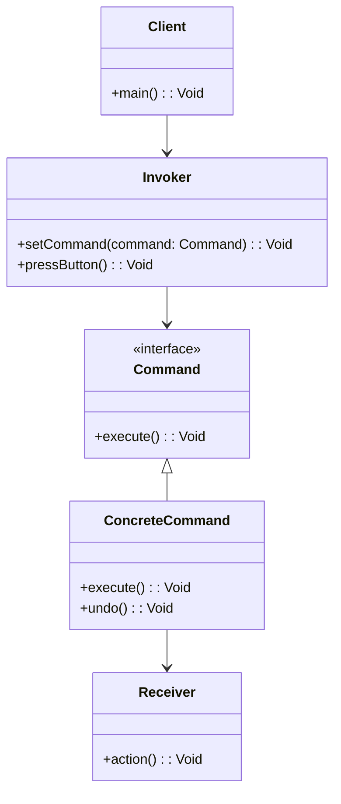

## 6.3 Command Pattern

The Command Pattern is a behavioral design pattern that turns a request into a stand-alone object that contains all the information about the request. This transformation allows for parameterization of clients with queues, requests, and operations, making it a versatile tool in software design. In this section, we will delve into the Command Pattern, its implementation in Haxe, and its practical applications.

### Intent

The primary intent of the Command Pattern is to encapsulate a request as an object, thereby allowing for the parameterization of clients with queues, requests, and operations. This encapsulation provides several benefits, including the ability to:

- Queue commands for later execution.
- Support undoable operations.
- Log changes for auditing purposes.
- Implement callback functionality.

### Key Participants

1. **Command Interface**: Declares an interface for executing an operation.
2. **Concrete Command**: Defines a binding between a Receiver object and an action. Implements the Command interface by invoking the corresponding operation(s) on the Receiver.
3. **Invoker**: Asks the command to carry out the request.
4. **Receiver**: Knows how to perform the operations associated with carrying out a request. Any class can serve as a Receiver.
5. **Client**: Creates a ConcreteCommand object and sets its Receiver.

### Applicability

Use the Command Pattern when you want to:

- Parameterize objects with operations.
- Specify, queue, and execute requests at different times.
- Support undo operations.
- Structure a system around high-level operations built on primitive operations.

### Implementing Command in Haxe

#### Command Interface

In Haxe, we start by defining a Command interface with an `execute` method. This interface will be implemented by all concrete command classes.

```haxe
interface Command {
    public function execute():Void;
}
```

#### Concrete Command

Next, we create concrete command classes that implement the Command interface. Each concrete command will encapsulate a request by binding together a Receiver and an action.

```haxe
class LightOnCommand implements Command {
    private var light:Light;

    public function new(light:Light) {
        this.light = light;
    }

    public function execute():Void {
        light.turnOn();
    }
}

class LightOffCommand implements Command {
    private var light:Light;

    public function new(light:Light) {
        this.light = light;
    }

    public function execute():Void {
        light.turnOff();
    }
}
```

#### Receiver

The Receiver class contains the actual business logic that needs to be performed when a command is executed.

```haxe
class Light {
    public function new() {}

    public function turnOn():Void {
        trace("The light is on.");
    }

    public function turnOff():Void {
        trace("The light is off.");
    }
}
```

#### Invoker

The Invoker class is responsible for executing commands. It can store commands and execute them at a later time.

```haxe
class RemoteControl {
    private var command:Command;

    public function new() {}

    public function setCommand(command:Command):Void {
        this.command = command;
    }

    public function pressButton():Void {
        command.execute();
    }
}
```

#### Client

Finally, the Client creates the concrete command objects and associates them with the appropriate Receiver.

```haxe
class Main {
    static public function main() {
        var light = new Light();
        var lightOn = new LightOnCommand(light);
        var lightOff = new LightOffCommand(light);

        var remote = new RemoteControl();
        remote.setCommand(lightOn);
        remote.pressButton(); // Output: The light is on.

        remote.setCommand(lightOff);
        remote.pressButton(); // Output: The light is off.
    }
}
```

### Use Cases and Examples

#### Undo/Redo Functionality

One of the most common applications of the Command Pattern is implementing undo/redo functionality. By storing executed commands in a stack, we can easily reverse operations by executing an `undo` method on the command.

```haxe
interface Command {
    public function execute():Void;
    public function undo():Void;
}

class LightOnCommand implements Command {
    private var light:Light;

    public function new(light:Light) {
        this.light = light;
    }

    public function execute():Void {
        light.turnOn();
    }

    public function undo():Void {
        light.turnOff();
    }
}

class LightOffCommand implements Command {
    private var light:Light;

    public function new(light:Light) {
        this.light = light;
    }

    public function execute():Void {
        light.turnOff();
    }

    public function undo():Void {
        light.turnOn();
    }
}
```

#### Task Scheduling

The Command Pattern can also be used for task scheduling, where commands are queued for execution at specific times.

```haxe
class Scheduler {
    private var commandQueue:Array<Command> = [];

    public function new() {}

    public function scheduleCommand(command:Command):Void {
        commandQueue.push(command);
    }

    public function run():Void {
        for (command in commandQueue) {
            command.execute();
        }
    }
}
```

### Design Considerations

- **Decoupling**: The Command Pattern decouples the object that invokes the operation from the one that knows how to perform it.
- **Flexibility**: It allows for easy addition of new commands without changing existing code.
- **Complexity**: The pattern can introduce complexity due to the increased number of classes.

### Differences and Similarities

The Command Pattern is often confused with the Strategy Pattern. While both encapsulate actions, the Command Pattern is more about encapsulating requests and operations, while the Strategy Pattern focuses on encapsulating algorithms.

### Visualizing the Command Pattern

Below is a class diagram illustrating the relationships between the components of the Command Pattern.



### Try It Yourself

Experiment with the Command Pattern by modifying the code examples. Try adding new commands, such as `DimLightCommand`, and implement an `undo` feature for the `RemoteControl`. Consider how you might extend the pattern to support macro commands that execute multiple commands in sequence.

### References and Links

- [Design Patterns: Elements of Reusable Object-Oriented Software](https://en.wikipedia.org/wiki/Design_Patterns) - A foundational book on design patterns.
- [Haxe Programming Language](https://haxe.org/documentation/introduction/) - Official Haxe documentation.
- [Command Pattern on Refactoring.Guru](https://refactoring.guru/design-patterns/command) - A comprehensive guide on the Command Pattern.

### Knowledge Check

Before moving on, let's summarize the key takeaways:

- The Command Pattern encapsulates requests as objects, allowing for flexible and decoupled design.
- It is useful for implementing undo/redo functionality and task scheduling.
- The pattern involves key participants: Command, Concrete Command, Invoker, Receiver, and Client.

## Quiz Time!



### What is the primary intent of the Command Pattern?

- [x] To encapsulate a request as an object.
- [ ] To encapsulate an algorithm as an object.
- [ ] To encapsulate a data structure as an object.
- [ ] To encapsulate a user interface as an object.

> **Explanation:** The Command Pattern encapsulates a request as an object, allowing for parameterization of clients with queues, requests, and operations.

### Which component of the Command Pattern knows how to perform the operations?

- [ ] Command
- [ ] Invoker
- [x] Receiver
- [ ] Client

> **Explanation:** The Receiver knows how to perform the operations associated with carrying out a request.

### What method must a Command interface declare?

- [ ] undo()
- [x] execute()
- [ ] run()
- [ ] start()

> **Explanation:** The Command interface must declare an `execute` method, which is implemented by concrete command classes.

### In the Command Pattern, which component is responsible for executing commands?

- [ ] Receiver
- [ ] Client
- [x] Invoker
- [ ] Concrete Command

> **Explanation:** The Invoker is responsible for executing commands by calling their `execute` method.

### Which of the following is a common application of the Command Pattern?

- [x] Undo/Redo functionality
- [ ] Sorting algorithms
- [ ] Data serialization
- [ ] User authentication

> **Explanation:** The Command Pattern is commonly used to implement undo/redo functionality by storing executed commands.

### How does the Command Pattern support task scheduling?

- [x] By queuing commands for execution at specific times.
- [ ] By encapsulating algorithms for sorting tasks.
- [ ] By providing a user interface for scheduling.
- [ ] By managing data storage for tasks.

> **Explanation:** The Command Pattern supports task scheduling by allowing commands to be queued and executed at specific times.

### What is a key benefit of using the Command Pattern?

- [ ] It simplifies the user interface design.
- [x] It decouples the invoker from the receiver.
- [ ] It reduces the number of classes in a system.
- [ ] It enhances data storage capabilities.

> **Explanation:** The Command Pattern decouples the invoker from the receiver, allowing for more flexible and maintainable code.

### Which pattern is often confused with the Command Pattern?

- [ ] Observer Pattern
- [ ] Singleton Pattern
- [x] Strategy Pattern
- [ ] Factory Pattern

> **Explanation:** The Command Pattern is often confused with the Strategy Pattern, although they serve different purposes.

### What is the role of the Client in the Command Pattern?

- [x] To create concrete command objects and set their receivers.
- [ ] To execute commands directly.
- [ ] To perform operations on the receiver.
- [ ] To manage the user interface.

> **Explanation:** The Client creates concrete command objects and sets their receivers, preparing them for execution by the Invoker.

### True or False: The Command Pattern can introduce complexity due to the increased number of classes.

- [x] True
- [ ] False

> **Explanation:** The Command Pattern can introduce complexity due to the increased number of classes, as each command is typically represented by a separate class.



Remember, mastering the Command Pattern in Haxe is just one step in your journey to becoming an expert cross-platform software engineer. Keep experimenting, stay curious, and enjoy the journey!
