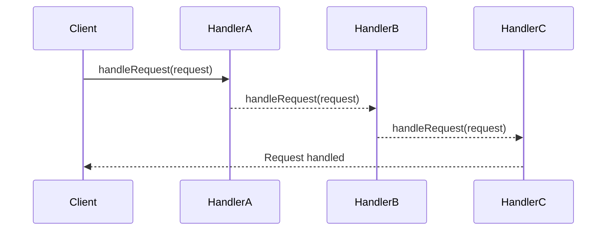

## 6.4 Chain of Responsibility Pattern

In the realm of software design, the Chain of Responsibility pattern stands out as a powerful tool for managing request handling in a flexible and decoupled manner. This pattern is particularly useful in scenarios where multiple objects might handle a request, but the handler isn't known until runtime. In this section, we'll delve into the intricacies of the Chain of Responsibility pattern, explore its implementation in Haxe, and provide practical examples to solidify your understanding.

### Definition

The Chain of Responsibility pattern allows a request to be passed along a chain of potential handlers until one of them handles it. This pattern decouples the sender of the request from its receivers, promoting a clean separation of concerns.

### Intent

The primary intent of the Chain of Responsibility pattern is to avoid coupling the sender of a request to its receiver by giving more than one object a chance to handle the request. This is achieved by chaining the receiving objects and passing the request along the chain until an object handles it.

### Key Participants

- **Handler Interface**: Defines an interface for handling requests and optionally holds a reference to the next handler in the chain.
- **Concrete Handlers**: Implement the handler interface and decide whether to process the request or pass it to the next handler.
- **Client**: Initiates the request and passes it to the first handler in the chain.

### Implementing Chain of Responsibility in Haxe

Let's break down the implementation of the Chain of Responsibility pattern in Haxe, focusing on the key components and their interactions.

#### Handler Interface

The handler interface is the cornerstone of the Chain of Responsibility pattern. It defines a method for processing requests and a reference to the next handler in the chain.

```haxe
interface Handler {
    public function setNext(handler:Handler):Void;
    public function handleRequest(request:String):Void;
}
```

- **setNext**: This method sets the next handler in the chain.
- **handleRequest**: This method processes the request or passes it to the next handler.

#### Concrete Handlers

Concrete handlers implement the handler interface and contain the logic to either handle the request or pass it along the chain.

```haxe
class ConcreteHandlerA implements Handler {
    private var nextHandler:Handler;

    public function new() {}

    public function setNext(handler:Handler):Void {
        this.nextHandler = handler;
    }

    public function handleRequest(request:String):Void {
        if (request == "A") {
            trace("ConcreteHandlerA handled the request.");
        } else if (nextHandler != null) {
            nextHandler.handleRequest(request);
        }
    }
}

class ConcreteHandlerB implements Handler {
    private var nextHandler:Handler;

    public function new() {}

    public function setNext(handler:Handler):Void {
        this.nextHandler = handler;
    }

    public function handleRequest(request:String):Void {
        if (request == "B") {
            trace("ConcreteHandlerB handled the request.");
        } else if (nextHandler != null) {
            nextHandler.handleRequest(request);
        }
    }
}
```

- **ConcreteHandlerA** and **ConcreteHandlerB**: These classes decide whether to handle the request based on its content. If they can't handle it, they pass it to the next handler.

#### Chaining Handlers

To form a chain, we link handlers together, allowing the request to propagate through the chain until it's handled.

```haxe
class Client {
    public static function main() {
        var handlerA = new ConcreteHandlerA();
        var handlerB = new ConcreteHandlerB();

        handlerA.setNext(handlerB);

        handlerA.handleRequest("A");
        handlerA.handleRequest("B");
        handlerA.handleRequest("C");
    }
}
```

- **Client**: The client sets up the chain by linking handlers and initiates the request handling process.

### Use Cases and Examples

The Chain of Responsibility pattern is versatile and can be applied in various scenarios. Let's explore some common use cases.

#### Logging Systems

In logging systems, different handlers can be responsible for logging messages at varying severity levels. For example, a debug handler might log debug messages, while an error handler logs error messages.

```haxe
class DebugHandler implements Handler {
    private var nextHandler:Handler;

    public function new() {}

    public function setNext(handler:Handler):Void {
        this.nextHandler = handler;
    }

    public function handleRequest(request:String):Void {
        if (request == "DEBUG") {
            trace("DebugHandler: Logging debug information.");
        } else if (nextHandler != null) {
            nextHandler.handleRequest(request);
        }
    }
}

class ErrorHandler implements Handler {
    private var nextHandler:Handler;

    public function new() {}

    public function setNext(handler:Handler):Void {
        this.nextHandler = handler;
    }

    public function handleRequest(request:String):Void {
        if (request == "ERROR") {
            trace("ErrorHandler: Logging error information.");
        } else if (nextHandler != null) {
            nextHandler.handleRequest(request);
        }
    }
}
```

- **DebugHandler** and **ErrorHandler**: These handlers log messages based on their severity. If they can't handle a message, they pass it to the next handler.

#### Event Bubbling

In event-driven systems, events can propagate through a hierarchy of handlers until they're handled. This is akin to event bubbling in web development.

```haxe
class EventHandler implements Handler {
    private var nextHandler:Handler;

    public function new() {}

    public function setNext(handler:Handler):Void {
        this.nextHandler = handler;
    }

    public function handleRequest(event:String):Void {
        if (event == "CLICK") {
            trace("EventHandler: Handling click event.");
        } else if (nextHandler != null) {
            nextHandler.handleRequest(event);
        }
    }
}
```

- **EventHandler**: This handler processes events and passes them along the chain if it can't handle them.

### Visualizing the Chain of Responsibility Pattern

To better understand the flow of requests through the chain, let's visualize the Chain of Responsibility pattern using a sequence diagram.



- **Sequence Diagram**: This diagram illustrates the flow of a request through a chain of handlers, highlighting how each handler decides whether to process the request or pass it along.

### Design Considerations

When implementing the Chain of Responsibility pattern, consider the following:

- **Order of Handlers**: The order in which handlers are linked can affect the outcome. Ensure handlers are ordered logically.
- **Termination**: Ensure that the chain terminates correctly, either by handling the request or by reaching the end of the chain.
- **Performance**: Be mindful of performance implications, especially in long chains where requests might propagate through multiple handlers.

### Differences and Similarities

The Chain of Responsibility pattern is often compared to other behavioral patterns, such as the Command and Observer patterns. Here's how they differ:

- **Chain of Responsibility vs. Command**: The Command pattern encapsulates a request as an object, allowing for parameterization and queuing, while the Chain of Responsibility pattern focuses on passing requests through a chain of handlers.
- **Chain of Responsibility vs. Observer**: The Observer pattern defines a one-to-many dependency between objects, whereas the Chain of Responsibility pattern defines a one-to-one relationship between handlers in a chain.

### Try It Yourself

To deepen your understanding of the Chain of Responsibility pattern, try modifying the code examples:

- **Add a New Handler**: Implement a new handler that processes a different type of request.
- **Reorder Handlers**: Change the order of handlers in the chain and observe how it affects request handling.
- **Extend Functionality**: Enhance the handlers to perform additional actions, such as logging or notifying other components.

### Knowledge Check

Before we conclude, let's reinforce your understanding with a few questions:

- **What is the primary intent of the Chain of Responsibility pattern?**
- **How does the Chain of Responsibility pattern promote decoupling?**
- **What are some common use cases for the Chain of Responsibility pattern?**

### Embrace the Journey

Remember, mastering design patterns is a journey. As you continue to explore and implement the Chain of Responsibility pattern in Haxe, you'll gain valuable insights into creating flexible and maintainable software architectures. Keep experimenting, stay curious, and enjoy the process!

## Quiz Time!



### What is the primary intent of the Chain of Responsibility pattern?

- [x] To decouple the sender of a request from its receivers by allowing multiple objects a chance to handle the request.
- [ ] To encapsulate a request as an object, allowing for parameterization and queuing.
- [ ] To define a one-to-many dependency between objects.
- [ ] To provide a way to access the elements of an aggregate object sequentially.

> **Explanation:** The Chain of Responsibility pattern aims to decouple the sender of a request from its receivers by allowing multiple objects a chance to handle the request.

### How does the Chain of Responsibility pattern promote decoupling?

- [x] By allowing requests to be passed along a chain of handlers until one handles it.
- [ ] By encapsulating requests as objects.
- [ ] By defining a one-to-many dependency between objects.
- [ ] By providing a way to access elements of an aggregate object sequentially.

> **Explanation:** The pattern promotes decoupling by allowing requests to be passed along a chain of handlers until one handles it, thus separating the sender from the receiver.

### Which of the following is a common use case for the Chain of Responsibility pattern?

- [x] Logging systems with different handlers for varying severity levels.
- [ ] Encapsulating a request as an object for parameterization.
- [ ] Defining a one-to-many dependency between objects.
- [ ] Providing a way to access elements of an aggregate object sequentially.

> **Explanation:** Logging systems with different handlers for varying severity levels are a common use case for the Chain of Responsibility pattern.

### What is the role of the handler interface in the Chain of Responsibility pattern?

- [x] To define a method for processing requests and a reference to the next handler.
- [ ] To encapsulate a request as an object.
- [ ] To define a one-to-many dependency between objects.
- [ ] To provide a way to access elements of an aggregate object sequentially.

> **Explanation:** The handler interface defines a method for processing requests and a reference to the next handler in the chain.

### In the Chain of Responsibility pattern, what happens if a handler cannot process a request?

- [x] It passes the request to the next handler in the chain.
- [ ] It encapsulates the request as an object.
- [ ] It defines a one-to-many dependency between objects.
- [ ] It provides a way to access elements of an aggregate object sequentially.

> **Explanation:** If a handler cannot process a request, it passes the request to the next handler in the chain.

### How does the Chain of Responsibility pattern differ from the Command pattern?

- [x] The Chain of Responsibility pattern focuses on passing requests through a chain of handlers, while the Command pattern encapsulates a request as an object.
- [ ] The Chain of Responsibility pattern defines a one-to-many dependency between objects, while the Command pattern encapsulates a request as an object.
- [ ] The Chain of Responsibility pattern provides a way to access elements of an aggregate object sequentially, while the Command pattern encapsulates a request as an object.
- [ ] The Chain of Responsibility pattern encapsulates a request as an object, while the Command pattern focuses on passing requests through a chain of handlers.

> **Explanation:** The Chain of Responsibility pattern focuses on passing requests through a chain of handlers, while the Command pattern encapsulates a request as an object.

### What is a potential drawback of the Chain of Responsibility pattern?

- [x] Performance issues in long chains where requests might propagate through multiple handlers.
- [ ] Difficulty in encapsulating requests as objects.
- [ ] Challenges in defining a one-to-many dependency between objects.
- [ ] Complexity in providing a way to access elements of an aggregate object sequentially.

> **Explanation:** A potential drawback is performance issues in long chains where requests might propagate through multiple handlers.

### In the Chain of Responsibility pattern, what is the significance of the order of handlers?

- [x] The order can affect the outcome of request handling.
- [ ] The order determines how requests are encapsulated as objects.
- [ ] The order defines the one-to-many dependency between objects.
- [ ] The order provides a way to access elements of an aggregate object sequentially.

> **Explanation:** The order of handlers can affect the outcome of request handling, as requests are passed through the chain in sequence.

### True or False: The Chain of Responsibility pattern is useful for event bubbling in event-driven systems.

- [x] True
- [ ] False

> **Explanation:** True. The Chain of Responsibility pattern is useful for event bubbling, where events propagate through a hierarchy of handlers until they're handled.

### Which of the following best describes the Chain of Responsibility pattern?

- [x] A behavioral design pattern that allows passing a request along a chain of handlers until one of them handles it.
- [ ] A structural design pattern that encapsulates a request as an object.
- [ ] A creational design pattern that defines a one-to-many dependency between objects.
- [ ] A design pattern that provides a way to access elements of an aggregate object sequentially.

> **Explanation:** The Chain of Responsibility pattern is a behavioral design pattern that allows passing a request along a chain of handlers until one of them handles it.




