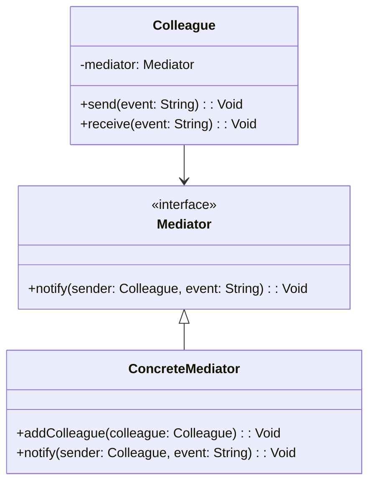

## 6.5 Mediator Pattern

In the realm of software design, managing complex interactions between objects can become cumbersome and error-prone. The **Mediator Pattern** offers a solution by introducing a mediator object that centralizes communication, reducing dependencies and promoting loose coupling. This pattern is particularly beneficial in Haxe, where cross-platform capabilities demand efficient and maintainable code structures.

### Definition

The Mediator Pattern is a behavioral design pattern that encapsulates how a set of objects interact. Instead of objects communicating directly with each other, they communicate through a mediator. This reduces the number of connections between objects, simplifying the system's architecture.

### Intent

- **Simplify Communication:** Reduce the complexity of communication between objects by introducing a mediator.
- **Promote Loose Coupling:** Decouple objects from each other, allowing them to interact through a central mediator.
- **Enhance Maintainability:** Make the system easier to maintain and extend by centralizing control logic.

### Key Participants

1. **Mediator Interface:** Defines the communication methods used by colleague objects.
2. **Concrete Mediator:** Implements the mediator interface and coordinates communication between colleague objects.
3. **Colleague Objects:** Objects that communicate with each other through the mediator.

### Applicability

- **User Interface Components:** Managing interactions between UI elements, such as buttons and text fields.
- **Chat Applications:** A server acting as a mediator between client messages.
- **Complex Systems:** Systems with many interdependent components that require coordination.

### Implementing Mediator in Haxe

Let's explore how to implement the Mediator Pattern in Haxe, focusing on its unique features and cross-platform capabilities.

#### Mediator Interface

The mediator interface defines the methods for communication between colleague objects. In Haxe, we can use interfaces to define this contract.

```haxe
interface Mediator {
    function notify(sender:Colleague, event:String):Void;
}
```

#### Colleague Objects

Colleague objects are the components that interact with each other through the mediator. They hold a reference to the mediator and use it to communicate.

```haxe
class Colleague {
    private var mediator:Mediator;
    
    public function new(mediator:Mediator) {
        this.mediator = mediator;
    }
    
    public function send(event:String):Void {
        mediator.notify(this, event);
    }
    
    public function receive(event:String):Void {
        trace('Colleague received event: ' + event);
    }
}
```

#### Concrete Mediator

The concrete mediator implements the mediator interface and coordinates communication between colleague objects.

```haxe
class ConcreteMediator implements Mediator {
    private var colleagues:Array<Colleague>;
    
    public function new() {
        colleagues = [];
    }
    
    public function addColleague(colleague:Colleague):Void {
        colleagues.push(colleague);
    }
    
    public function notify(sender:Colleague, event:String):Void {
        for (col in colleagues) {
            if (col != sender) {
                col.receive(event);
            }
        }
    }
}
```

### Use Cases and Examples

#### User Interface Components

In a user interface, different components such as buttons, text fields, and sliders often need to interact. The mediator pattern can manage these interactions, ensuring that changes in one component are communicated to others without direct dependencies.

#### Chat Applications

In a chat application, a server can act as a mediator between clients. When a client sends a message, the server (mediator) distributes it to other clients, managing the communication flow.

### Design Considerations

- **When to Use:** Use the mediator pattern when you have a complex system with many interdependent objects that need to communicate.
- **Haxe-Specific Features:** Leverage Haxe's static typing and interface capabilities to define clear contracts for communication.
- **Pitfalls:** Avoid overusing the mediator pattern, as it can lead to a single point of failure if the mediator becomes too complex.

### Differences and Similarities

The mediator pattern is often confused with the observer pattern. While both patterns deal with communication between objects, the mediator pattern centralizes communication through a mediator, whereas the observer pattern allows objects to subscribe to events and be notified of changes.

### Visualizing the Mediator Pattern

To better understand the mediator pattern, let's visualize it using a class diagram.



### Try It Yourself

Experiment with the mediator pattern by modifying the code examples. Try adding new colleague objects or events to see how the mediator handles communication. Consider implementing a simple chat application using the mediator pattern to manage client-server interactions.

### Knowledge Check

- **Question:** What is the primary purpose of the mediator pattern?
- **Exercise:** Implement a mediator pattern for a simple user interface with buttons and text fields.

### Embrace the Journey

Remember, mastering design patterns is a journey. The mediator pattern is just one tool in your toolkit. As you continue to explore Haxe and its cross-platform capabilities, you'll discover new ways to apply design patterns to create efficient, maintainable, and scalable software. Keep experimenting, stay curious, and enjoy the journey!

## Quiz Time!



### What is the primary purpose of the Mediator Pattern?

- [x] To simplify communication between objects by introducing a mediator.
- [ ] To increase dependencies between objects.
- [ ] To eliminate the need for communication between objects.
- [ ] To make objects communicate directly with each other.

> **Explanation:** The Mediator Pattern simplifies communication by introducing a mediator that handles interactions between objects.

### Which of the following is a key participant in the Mediator Pattern?

- [x] Mediator Interface
- [ ] Singleton
- [ ] Factory
- [ ] Observer

> **Explanation:** The Mediator Interface is a key participant that defines communication methods.

### In Haxe, how do colleague objects communicate?

- [x] Through a mediator
- [ ] Directly with each other
- [ ] Using global variables
- [ ] Through a singleton

> **Explanation:** Colleague objects communicate through a mediator to reduce dependencies.

### What is a common use case for the Mediator Pattern?

- [x] Managing interactions between UI components
- [ ] Implementing a singleton
- [ ] Creating a factory
- [ ] Observing changes in objects

> **Explanation:** The Mediator Pattern is commonly used to manage interactions between UI components.

### How does the Mediator Pattern promote loose coupling?

- [x] By centralizing communication through a mediator
- [ ] By increasing dependencies between objects
- [ ] By eliminating communication between objects
- [ ] By making objects communicate directly

> **Explanation:** The Mediator Pattern promotes loose coupling by centralizing communication through a mediator.

### What is a potential pitfall of the Mediator Pattern?

- [x] The mediator becoming too complex
- [ ] Increased dependencies between objects
- [ ] Lack of communication between objects
- [ ] Direct communication between objects

> **Explanation:** A potential pitfall is the mediator becoming too complex, leading to a single point of failure.

### Which pattern is often confused with the Mediator Pattern?

- [x] Observer Pattern
- [ ] Singleton Pattern
- [ ] Factory Pattern
- [ ] Strategy Pattern

> **Explanation:** The Observer Pattern is often confused with the Mediator Pattern, but they handle communication differently.

### What is the role of the Concrete Mediator?

- [x] To implement the mediator interface and coordinate communication
- [ ] To act as a singleton
- [ ] To create objects
- [ ] To observe changes in objects

> **Explanation:** The Concrete Mediator implements the mediator interface and coordinates communication between objects.

### How can you experiment with the Mediator Pattern in Haxe?

- [x] By adding new colleague objects or events
- [ ] By eliminating the mediator
- [ ] By making objects communicate directly
- [ ] By using global variables

> **Explanation:** Experiment by adding new colleague objects or events to see how the mediator handles communication.

### True or False: The Mediator Pattern eliminates the need for communication between objects.

- [ ] True
- [x] False

> **Explanation:** False. The Mediator Pattern centralizes communication through a mediator but does not eliminate it.


