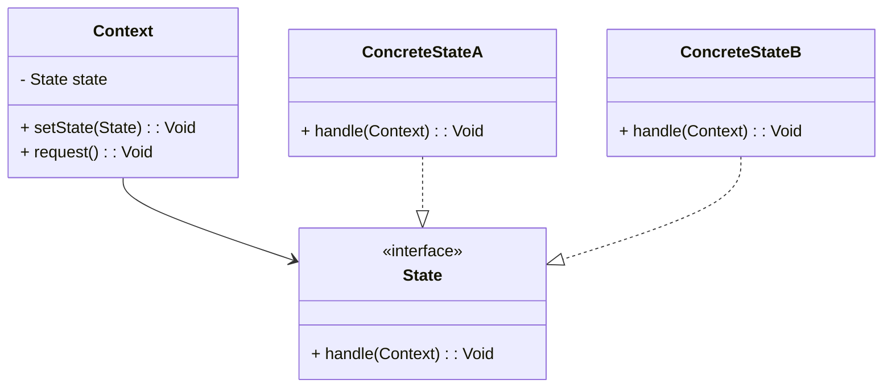

## 6.6 State Pattern

The State Pattern is a behavioral design pattern that allows an object to change its behavior when its internal state changes. This pattern is particularly useful in scenarios where an object must exhibit different behaviors in different states, such as in game development or workflow management systems. In this section, we will delve into the intricacies of the State Pattern, explore its implementation in Haxe, and examine real-world use cases.

### Intent

The primary intent of the State Pattern is to allow an object to alter its behavior when its internal state changes. This pattern encapsulates state-specific behavior and delegates state-specific requests to the current state object. By doing so, it promotes the open/closed principle, allowing new states to be added with minimal changes to existing code.

### Key Participants

1. **State Interface**: Defines the interface for encapsulating the behavior associated with a particular state of the Context.
2. **Concrete States**: Implement the behavior associated with a state of the Context.
3. **Context Class**: Maintains an instance of a ConcreteState subclass that defines the current state.

### Implementing State in Haxe

Let's explore how to implement the State Pattern in Haxe, leveraging its unique features such as static typing and cross-platform capabilities.

#### State Interface

The State Interface defines the methods that all concrete states must implement. This ensures that the Context can interact with any state in a uniform manner.

```haxe
interface State {
    function handle(context:Context):Void;
}
```

#### Concrete States

Concrete States implement the State interface and define the specific behavior for each state.

```haxe
class ConcreteStateA implements State {
    public function new() {}

    public function handle(context:Context):Void {
        trace("Handling state A");
        context.setState(new ConcreteStateB());
    }
}

class ConcreteStateB implements State {
    public function new() {}

    public function handle(context:Context):Void {
        trace("Handling state B");
        context.setState(new ConcreteStateA());
    }
}
```

#### Context Class

The Context class maintains an instance of a ConcreteState subclass and delegates requests to the current state object.

```haxe
class Context {
    private var state:State;

    public function new(initialState:State) {
        this.state = initialState;
    }

    public function setState(state:State):Void {
        this.state = state;
    }

    public function request():Void {
        state.handle(this);
    }
}
```

#### Example Usage

```haxe
class Main {
    static public function main() {
        var context = new Context(new ConcreteStateA());
        context.request(); // Handling state A
        context.request(); // Handling state B
        context.request(); // Handling state A
    }
}
```

### Diagrams

To better understand the State Pattern, let's visualize the interaction between the Context and State objects using a class diagram.



### Use Cases and Examples

The State Pattern is versatile and can be applied in various scenarios. Let's explore some common use cases.

#### Game Characters

In game development, characters often have different behaviors based on their state, such as health or status effects. For example, a character might behave differently when healthy, injured, or incapacitated.

```haxe
interface CharacterState {
    function attack():Void;
    function heal():Void;
}

class HealthyState implements CharacterState {
    public function new() {}

    public function attack():Void {
        trace("Attacking with full strength!");
    }

    public function heal():Void {
        trace("Already healthy!");
    }
}

class InjuredState implements CharacterState {
    public function new() {}

    public function attack():Void {
        trace("Attacking with reduced strength.");
    }

    public function heal():Void {
        trace("Healing...");
    }
}

class Character {
    private var state:CharacterState;

    public function new(initialState:CharacterState) {
        this.state = initialState;
    }

    public function setState(state:CharacterState):Void {
        this.state = state;
    }

    public function attack():Void {
        state.attack();
    }

    public function heal():Void {
        state.heal();
    }
}

class Game {
    static public function main() {
        var character = new Character(new HealthyState());
        character.attack(); // Attacking with full strength!
        character.heal();   // Already healthy!

        character.setState(new InjuredState());
        character.attack(); // Attacking with reduced strength.
        character.heal();   // Healing...
    }
}
```

#### Document Workflow

In a document management system, documents may transition between different states such as draft, review, and published. Each state has specific behaviors and rules.

```haxe
interface DocumentState {
    function edit():Void;
    function publish():Void;
}

class DraftState implements DocumentState {
    public function new() {}

    public function edit():Void {
        trace("Editing draft...");
    }

    public function publish():Void {
        trace("Cannot publish draft. Send for review first.");
    }
}

class ReviewState implements DocumentState {
    public function new() {}

    public function edit():Void {
        trace("Editing review...");
    }

    public function publish():Void {
        trace("Publishing document...");
    }
}

class Document {
    private var state:DocumentState;

    public function new(initialState:DocumentState) {
        this.state = initialState;
    }

    public function setState(state:DocumentState):Void {
        this.state = state;
    }

    public function edit():Void {
        state.edit();
    }

    public function publish():Void {
        state.publish();
    }
}

class Workflow {
    static public function main() {
        var document = new Document(new DraftState());
        document.edit();    // Editing draft...
        document.publish(); // Cannot publish draft. Send for review first.

        document.setState(new ReviewState());
        document.edit();    // Editing review...
        document.publish(); // Publishing document...
    }
}
```

### Design Considerations

When implementing the State Pattern, consider the following:

- **State Explosion**: Be cautious of creating too many states, which can lead to complexity. Group similar states or use hierarchical state machines if necessary.
- **State Transitions**: Clearly define the rules for transitioning between states to avoid unexpected behavior.
- **Performance**: Ensure that state transitions are efficient, especially in performance-critical applications like games.

### Differences and Similarities

The State Pattern is often confused with the Strategy Pattern. While both patterns involve changing behavior, the State Pattern is focused on changing behavior based on an object's internal state, whereas the Strategy Pattern is about selecting an algorithm at runtime.

### Try It Yourself

Experiment with the code examples provided. Try adding new states or modifying existing ones to see how the behavior of the Context changes. For instance, add a "Paused" state to the game character example and implement the corresponding behavior.

### References and Links

For further reading on the State Pattern and its applications, consider the following resources:

- [Design Patterns: Elements of Reusable Object-Oriented Software](https://en.wikipedia.org/wiki/Design_Patterns) by Erich Gamma et al.
- [State Pattern on Refactoring Guru](https://refactoring.guru/design-patterns/state)
- [Haxe Manual](https://haxe.org/manual/)

### Knowledge Check

To reinforce your understanding of the State Pattern, consider the following questions and exercises:

- What are the key components of the State Pattern?
- How does the State Pattern differ from the Strategy Pattern?
- Implement a new state in the document workflow example, such as "Archived".

### Embrace the Journey

Remember, mastering design patterns is a journey. As you continue to explore and implement patterns like the State Pattern, you'll gain valuable insights into creating flexible and maintainable software. Keep experimenting, stay curious, and enjoy the process!

## Quiz Time!



### What is the primary intent of the State Pattern?

- [x] To allow an object to alter its behavior when its internal state changes.
- [ ] To encapsulate algorithms in separate classes.
- [ ] To provide a way to create objects without specifying their concrete classes.
- [ ] To define a family of algorithms and make them interchangeable.

> **Explanation:** The State Pattern is designed to allow an object to change its behavior when its internal state changes.

### Which component of the State Pattern defines the interface for encapsulating behavior?

- [x] State Interface
- [ ] Concrete State
- [ ] Context Class
- [ ] Strategy Interface

> **Explanation:** The State Interface defines the methods that all concrete states must implement.

### In the State Pattern, what role does the Context class play?

- [x] It maintains an instance of a ConcreteState subclass and delegates requests to it.
- [ ] It defines the interface for encapsulating behavior.
- [ ] It implements the behavior associated with a state.
- [ ] It provides a way to create objects without specifying their concrete classes.

> **Explanation:** The Context class maintains an instance of a ConcreteState subclass and delegates requests to it.

### How does the State Pattern differ from the Strategy Pattern?

- [x] The State Pattern changes behavior based on an object's internal state, while the Strategy Pattern selects an algorithm at runtime.
- [ ] The State Pattern encapsulates algorithms in separate classes, while the Strategy Pattern changes behavior based on an object's internal state.
- [ ] The State Pattern provides a way to create objects without specifying their concrete classes, while the Strategy Pattern defines a family of algorithms.
- [ ] The State Pattern defines a family of algorithms, while the Strategy Pattern encapsulates algorithms in separate classes.

> **Explanation:** The State Pattern is focused on changing behavior based on an object's internal state, whereas the Strategy Pattern is about selecting an algorithm at runtime.

### Which of the following is a common use case for the State Pattern?

- [x] Game Characters
- [ ] Sorting Algorithms
- [ ] Database Connections
- [ ] User Interface Layouts

> **Explanation:** Game characters often have different behaviors based on their state, making the State Pattern a suitable choice.

### What should you be cautious of when implementing the State Pattern?

- [x] State Explosion
- [ ] Algorithm Complexity
- [ ] Object Creation
- [ ] Data Redundancy

> **Explanation:** Be cautious of creating too many states, which can lead to complexity.

### What is a key benefit of using the State Pattern?

- [x] It promotes the open/closed principle, allowing new states to be added with minimal changes to existing code.
- [ ] It reduces the number of classes needed in a program.
- [ ] It simplifies the user interface design.
- [ ] It improves the performance of sorting algorithms.

> **Explanation:** The State Pattern promotes the open/closed principle, allowing new states to be added with minimal changes to existing code.

### Which of the following is NOT a component of the State Pattern?

- [x] Strategy Interface
- [ ] State Interface
- [ ] Concrete State
- [ ] Context Class

> **Explanation:** The Strategy Interface is not a component of the State Pattern.

### True or False: The State Pattern can be used to manage transitions between different states in a document workflow.

- [x] True
- [ ] False

> **Explanation:** The State Pattern is well-suited for managing transitions between different states in a document workflow.

### What is a potential drawback of the State Pattern?

- [x] It can lead to a large number of classes if not managed properly.
- [ ] It makes code less flexible and harder to maintain.
- [ ] It is only applicable to single-threaded applications.
- [ ] It cannot be used in cross-platform development.

> **Explanation:** The State Pattern can lead to a large number of classes if not managed properly, which can increase complexity.


