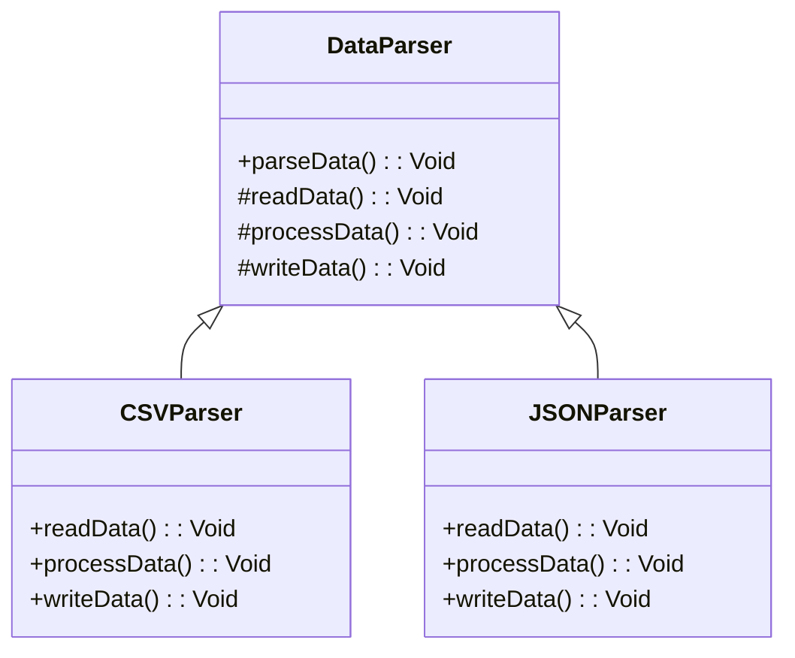

## 6.7 Template Method Pattern

The Template Method Pattern is a behavioral design pattern that defines the skeleton of an algorithm in a method, deferring some steps to subclasses. This pattern allows subclasses to redefine certain steps of an algorithm without changing its structure. In this section, we will delve into the Template Method Pattern, explore its implementation in Haxe, and examine its practical applications.

### Intent

The primary intent of the Template Method Pattern is to define the overall structure of an algorithm while allowing subclasses to modify specific steps. This pattern promotes code reuse and flexibility by encapsulating invariant parts of an algorithm in a base class and allowing subclasses to provide custom implementations for specific steps.

### Key Participants

- **Abstract Class:** Contains the template method that defines the algorithm's structure. It may also include default implementations for some steps.
- **Concrete Subclasses:** Override specific steps of the algorithm to provide custom behavior.

### Applicability

Use the Template Method Pattern when:

- You have an algorithm with invariant steps that can be reused across different contexts.
- You want to allow subclasses to customize specific steps of an algorithm without altering its overall structure.
- You need to enforce a consistent sequence of operations while allowing variations in specific steps.

### Implementing Template Method in Haxe

Let's explore how to implement the Template Method Pattern in Haxe. We'll start by defining an abstract class with a template method and then create concrete subclasses to override specific steps.

#### Abstract Class with Template Method

In Haxe, we can define an abstract class using the `abstract` keyword. The abstract class will contain the template method, which defines the algorithm's structure.

```haxe
abstract class DataParser {
    // Template method
    public function parseData():Void {
        readData();
        processData();
        writeData();
    }

    // Steps of the algorithm
    abstract function readData():Void;
    abstract function processData():Void;
    abstract function writeData():Void;
}
```

In this example, `DataParser` is an abstract class that defines the template method `parseData()`. This method outlines the steps of the algorithm: reading data, processing data, and writing data. The specific implementations of these steps are deferred to subclasses.

#### Concrete Subclasses

Concrete subclasses will override the specific steps of the algorithm to provide custom behavior.

```haxe
class CSVParser extends DataParser {
    override function readData():Void {
        trace("Reading CSV data...");
        // Implementation for reading CSV data
    }

    override function processData():Void {
        trace("Processing CSV data...");
        // Implementation for processing CSV data
    }

    override function writeData():Void {
        trace("Writing CSV data...");
        // Implementation for writing CSV data
    }
}

class JSONParser extends DataParser {
    override function readData():Void {
        trace("Reading JSON data...");
        // Implementation for reading JSON data
    }

    override function processData():Void {
        trace("Processing JSON data...");
        // Implementation for processing JSON data
    }

    override function writeData():Void {
        trace("Writing JSON data...");
        // Implementation for writing JSON data
    }
}
```

In this example, `CSVParser` and `JSONParser` are concrete subclasses of `DataParser`. They override the `readData()`, `processData()`, and `writeData()` methods to provide specific implementations for parsing CSV and JSON data, respectively.

### Use Cases and Examples

The Template Method Pattern is versatile and can be applied to various scenarios. Let's explore some common use cases and examples.

#### Data Parsing

Data parsing is a common use case for the Template Method Pattern. By defining a general parsing structure in an abstract class and allowing subclasses to customize specific steps, we can create flexible and reusable parsing solutions.

```haxe
class XMLParser extends DataParser {
    override function readData():Void {
        trace("Reading XML data...");
        // Implementation for reading XML data
    }

    override function processData():Void {
        trace("Processing XML data...");
        // Implementation for processing XML data
    }

    override function writeData():Void {
        trace("Writing XML data...");
        // Implementation for writing XML data
    }
}
```

In this example, `XMLParser` is another concrete subclass of `DataParser` that provides specific implementations for parsing XML data.

#### AI Behaviors

The Template Method Pattern can also be applied to AI behaviors in games or simulations. By defining a general behavior flow in an abstract class and allowing subclasses to define specific actions, we can create flexible and reusable AI behavior solutions.

```haxe
abstract class AICharacter {
    // Template method
    public function performBehavior():Void {
        senseEnvironment();
        makeDecision();
        act();
    }

    // Steps of the algorithm
    abstract function senseEnvironment():Void;
    abstract function makeDecision():Void;
    abstract function act():Void;
}

class AggressiveAI extends AICharacter {
    override function senseEnvironment():Void {
        trace("Sensing environment aggressively...");
        // Implementation for aggressive sensing
    }

    override function makeDecision():Void {
        trace("Making aggressive decision...");
        // Implementation for aggressive decision-making
    }

    override function act():Void {
        trace("Acting aggressively...");
        // Implementation for aggressive actions
    }
}

class DefensiveAI extends AICharacter {
    override function senseEnvironment():Void {
        trace("Sensing environment defensively...");
        // Implementation for defensive sensing
    }

    override function makeDecision():Void {
        trace("Making defensive decision...");
        // Implementation for defensive decision-making
    }

    override function act():Void {
        trace("Acting defensively...");
        // Implementation for defensive actions
    }
}
```

In this example, `AggressiveAI` and `DefensiveAI` are concrete subclasses of `AICharacter`. They override the `senseEnvironment()`, `makeDecision()`, and `act()` methods to provide specific implementations for aggressive and defensive AI behaviors, respectively.

### Design Considerations

When using the Template Method Pattern, consider the following design considerations:

- **Invariance vs. Variability:** Identify the invariant parts of the algorithm that can be encapsulated in the abstract class and the variable parts that can be overridden by subclasses.
- **Code Reuse:** The Template Method Pattern promotes code reuse by encapsulating common behavior in the abstract class and allowing subclasses to provide custom behavior.
- **Flexibility:** The pattern provides flexibility by allowing subclasses to customize specific steps of the algorithm without altering its overall structure.
- **Complexity:** Be mindful of the complexity introduced by the pattern, especially if the algorithm involves many steps or if there are many subclasses.

### Differences and Similarities

The Template Method Pattern is often compared to other design patterns, such as the Strategy Pattern and the Factory Method Pattern. Here are some key differences and similarities:

- **Template Method vs. Strategy:** The Template Method Pattern defines the overall structure of an algorithm, while the Strategy Pattern defines a family of algorithms and allows clients to choose one at runtime.
- **Template Method vs. Factory Method:** The Template Method Pattern focuses on defining the steps of an algorithm, while the Factory Method Pattern focuses on creating objects.

### Visualizing the Template Method Pattern

To better understand the Template Method Pattern, let's visualize its structure using a class diagram.



In this diagram, `DataParser` is the abstract class that defines the template method `parseData()`. `CSVParser` and `JSONParser` are concrete subclasses that override the specific steps of the algorithm.

### Try It Yourself

Now that we've explored the Template Method Pattern, let's try implementing it in Haxe. Experiment with the code examples provided and try modifying them to suit your needs. For example, you could create a new subclass of `DataParser` to handle a different data format or implement a new AI behavior by creating a subclass of `AICharacter`.

### References and Links

For further reading on the Template Method Pattern and design patterns in general, consider the following resources:

- [Design Patterns: Elements of Reusable Object-Oriented Software](https://en.wikipedia.org/wiki/Design_Patterns) by Erich Gamma, Richard Helm, Ralph Johnson, and John Vlissides
- [Refactoring Guru: Template Method Pattern](https://refactoring.guru/design-patterns/template-method)
- [Haxe Manual](https://haxe.org/manual/)

### Knowledge Check

To reinforce your understanding of the Template Method Pattern, consider the following questions:

- What is the primary intent of the Template Method Pattern?
- How does the Template Method Pattern promote code reuse?
- What are some common use cases for the Template Method Pattern?
- How does the Template Method Pattern differ from the Strategy Pattern?

### Embrace the Journey

Remember, mastering design patterns is a journey. As you continue to explore and apply these patterns in your projects, you'll gain a deeper understanding of their benefits and nuances. Keep experimenting, stay curious, and enjoy the journey!

## Quiz Time!



### What is the primary intent of the Template Method Pattern?

- [x] To define the skeleton of an algorithm while allowing subclasses to override specific steps.
- [ ] To create a family of algorithms and allow clients to choose one at runtime.
- [ ] To encapsulate object creation in subclasses.
- [ ] To define a family of interchangeable objects.

> **Explanation:** The Template Method Pattern defines the skeleton of an algorithm in a method, deferring some steps to subclasses.

### Which of the following is a key participant in the Template Method Pattern?

- [x] Abstract Class
- [ ] Interface
- [ ] Singleton
- [ ] Observer

> **Explanation:** The abstract class contains the template method that defines the algorithm's structure.

### How does the Template Method Pattern promote code reuse?

- [x] By encapsulating common behavior in the abstract class and allowing subclasses to provide custom behavior.
- [ ] By allowing clients to choose from a family of algorithms at runtime.
- [ ] By creating objects in subclasses.
- [ ] By defining a family of interchangeable objects.

> **Explanation:** The Template Method Pattern promotes code reuse by encapsulating common behavior in the abstract class.

### What is a common use case for the Template Method Pattern?

- [x] Data Parsing
- [ ] Object Creation
- [ ] Event Handling
- [ ] Dependency Injection

> **Explanation:** Data parsing is a common use case for the Template Method Pattern, allowing for flexible and reusable parsing solutions.

### How does the Template Method Pattern differ from the Strategy Pattern?

- [x] The Template Method Pattern defines the overall structure of an algorithm, while the Strategy Pattern defines a family of algorithms.
- [ ] The Template Method Pattern focuses on creating objects, while the Strategy Pattern focuses on defining algorithms.
- [ ] The Template Method Pattern allows clients to choose from a family of algorithms at runtime, while the Strategy Pattern defines the overall structure of an algorithm.
- [ ] The Template Method Pattern defines a family of interchangeable objects, while the Strategy Pattern defines the overall structure of an algorithm.

> **Explanation:** The Template Method Pattern defines the overall structure of an algorithm, while the Strategy Pattern defines a family of algorithms.

### What is the role of concrete subclasses in the Template Method Pattern?

- [x] To override specific steps of the algorithm to provide custom behavior.
- [ ] To define the overall structure of the algorithm.
- [ ] To encapsulate object creation.
- [ ] To allow clients to choose from a family of algorithms at runtime.

> **Explanation:** Concrete subclasses override specific steps of the algorithm to provide custom behavior.

### Which of the following is a step in implementing the Template Method Pattern in Haxe?

- [x] Define an abstract class with a template method.
- [ ] Create an interface with a template method.
- [ ] Define a singleton class with a template method.
- [ ] Create a factory method for object creation.

> **Explanation:** Implementing the Template Method Pattern involves defining an abstract class with a template method.

### What is a potential design consideration when using the Template Method Pattern?

- [x] Identifying invariant and variable parts of the algorithm.
- [ ] Ensuring that all steps of the algorithm are implemented in the abstract class.
- [ ] Allowing clients to choose from a family of algorithms at runtime.
- [ ] Defining a family of interchangeable objects.

> **Explanation:** Identifying invariant and variable parts of the algorithm is a key design consideration when using the Template Method Pattern.

### What is the benefit of using the Template Method Pattern in AI behaviors?

- [x] It allows for flexible and reusable AI behavior solutions by defining a general behavior flow and allowing subclasses to define specific actions.
- [ ] It encapsulates object creation for AI behaviors.
- [ ] It allows clients to choose from a family of AI behaviors at runtime.
- [ ] It defines a family of interchangeable AI behaviors.

> **Explanation:** The Template Method Pattern allows for flexible and reusable AI behavior solutions by defining a general behavior flow and allowing subclasses to define specific actions.

### True or False: The Template Method Pattern is often compared to the Factory Method Pattern.

- [x] True
- [ ] False

> **Explanation:** The Template Method Pattern is often compared to the Factory Method Pattern, as both involve defining steps of an algorithm or process.


