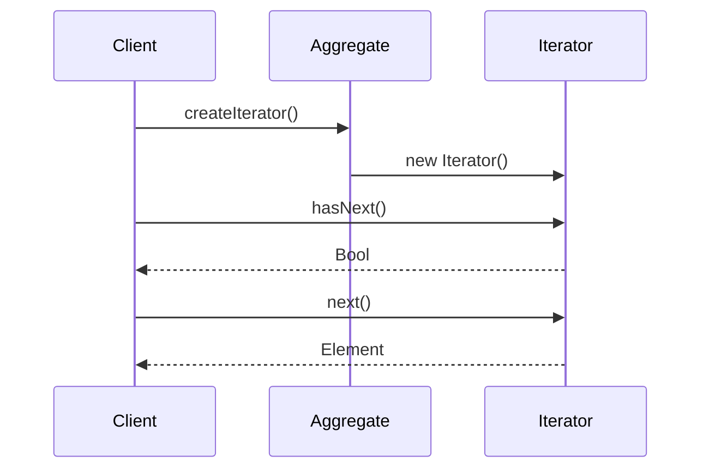

## 6.8 Iterator Pattern

The Iterator Pattern is a fundamental behavioral design pattern that provides a way to access elements of an aggregate object sequentially without exposing its underlying representation. This pattern is particularly useful when dealing with complex data structures, as it abstracts the traversal process and allows for flexible iteration mechanisms.

### Intent of the Iterator Pattern

The primary intent of the Iterator Pattern is to decouple the traversal logic from the actual data structure, enabling the client to iterate over the elements without needing to understand the intricacies of the data structure itself. This promotes cleaner, more maintainable code and enhances the flexibility of the application.

### Key Participants

1. **Iterator Interface**: Defines the methods for accessing and traversing elements.
2. **Concrete Iterator**: Implements the Iterator interface and maintains the current position in the traversal.
3. **Aggregate Interface**: Provides a method to create an iterator.
4. **Concrete Aggregate**: Implements the Aggregate interface and returns an instance of the Concrete Iterator.

### Applicability

- Use the Iterator Pattern when you need to access an aggregate object's contents without exposing its internal structure.
- When multiple traversal algorithms are needed over a data structure.
- When you want to provide a uniform interface for traversing different aggregate structures.

### Implementing Iterator in Haxe

Let's delve into how we can implement the Iterator Pattern in Haxe, leveraging its unique features such as static typing and cross-platform capabilities.

#### Iterator Interface

In Haxe, we define an `Iterator` interface with two essential methods: `hasNext()` and `next()`. These methods will allow us to traverse the elements of a collection.

```haxe
interface Iterator<T> {
    public function hasNext(): Bool;
    public function next(): T;
}
```

#### Aggregate Interface

The Aggregate interface provides a method to create an iterator. This interface will be implemented by any collection that wants to provide an iterator.

```haxe
interface Aggregate<T> {
    public function createIterator(): Iterator<T>;
}
```

#### Concrete Iterator

The Concrete Iterator implements the Iterator interface and maintains the current position of the traversal. Let's consider a simple list as our aggregate structure.

```haxe
class ListIterator<T> implements Iterator<T> {
    private var list: Array<T>;
    private var position: Int = 0;

    public function new(list: Array<T>) {
        this.list = list;
    }

    public function hasNext(): Bool {
        return position < list.length;
    }

    public function next(): T {
        if (!hasNext()) throw "No more elements";
        return list[position++];
    }
}
```

#### Concrete Aggregate

The Concrete Aggregate implements the Aggregate interface and returns an instance of the Concrete Iterator.

```haxe
class NumberList implements Aggregate<Int> {
    private var numbers: Array<Int>;

    public function new(numbers: Array<Int>) {
        this.numbers = numbers;
    }

    public function createIterator(): Iterator<Int> {
        return new ListIterator<Int>(numbers);
    }
}
```

### Use Cases and Examples

#### Custom Collections

The Iterator Pattern is particularly useful for custom collections where you want to provide a consistent way to traverse elements without exposing the internal structure.

```haxe
class CustomCollection<T> implements Aggregate<T> {
    private var items: Array<T>;

    public function new() {
        items = new Array<T>();
    }

    public function addItem(item: T): Void {
        items.push(item);
    }

    public function createIterator(): Iterator<T> {
        return new ListIterator<T>(items);
    }
}
```

#### Tree Structures

Navigating hierarchical data such as trees can be complex. The Iterator Pattern simplifies this by abstracting the traversal logic.

```haxe
class TreeNode<T> {
    public var value: T;
    public var children: Array<TreeNode<T>>;

    public function new(value: T) {
        this.value = value;
        this.children = new Array<TreeNode<T>>();
    }

    public function addChild(node: TreeNode<T>): Void {
        children.push(node);
    }
}

class TreeIterator<T> implements Iterator<T> {
    private var stack: Array<TreeNode<T>>;

    public function new(root: TreeNode<T>) {
        stack = [root];
    }

    public function hasNext(): Bool {
        return stack.length > 0;
    }

    public function next(): T {
        if (!hasNext()) throw "No more elements";
        var node = stack.pop();
        for (child in node.children) {
            stack.push(child);
        }
        return node.value;
    }
}
```

### Design Considerations

- **When to Use**: The Iterator Pattern is ideal when you need to provide multiple traversal methods over a collection or when the collection's structure is complex.
- **Haxe-Specific Features**: Haxe's static typing and cross-platform capabilities make it an excellent choice for implementing the Iterator Pattern, ensuring type safety and consistent behavior across different platforms.
- **Pitfalls**: Be cautious of modifying the collection while iterating, as this can lead to unexpected behavior.

### Differences and Similarities

The Iterator Pattern is often compared to the **Composite Pattern**, as both deal with collections of objects. However, while the Composite Pattern focuses on treating individual objects and compositions uniformly, the Iterator Pattern is concerned with traversing elements in a collection.

### Visualizing the Iterator Pattern

To better understand the flow of the Iterator Pattern, let's visualize the interaction between the components using a sequence diagram.



### Try It Yourself

Experiment with the provided code examples by modifying the data structures or adding new methods to the iterator. For instance, try implementing a reverse iterator or a filter iterator that only returns elements meeting certain criteria.

### References and Links

- [MDN Web Docs on Iterators](https://developer.mozilla.org/en-US/docs/Web/JavaScript/Guide/Iterators_and_Generators)
- [Haxe Documentation](https://haxe.org/documentation/)
- [Design Patterns: Elements of Reusable Object-Oriented Software](https://en.wikipedia.org/wiki/Design_Patterns)

### Knowledge Check

- What are the key components of the Iterator Pattern?
- How does the Iterator Pattern promote encapsulation?
- Can you implement a filter iterator in Haxe?

### Embrace the Journey

Remember, mastering design patterns like the Iterator Pattern is a journey. As you continue to explore and implement these patterns, you'll gain deeper insights into software design and architecture. Keep experimenting, stay curious, and enjoy the journey!

## Quiz Time!



### What is the primary intent of the Iterator Pattern?

- [x] To provide a way to access elements of an aggregate object sequentially without exposing its underlying representation.
- [ ] To create a new object from a prototype instance.
- [ ] To define a family of algorithms and make them interchangeable.
- [ ] To allow an object to alter its behavior when its internal state changes.

> **Explanation:** The Iterator Pattern focuses on providing a mechanism to traverse elements without exposing the underlying structure.

### Which method is NOT part of the Iterator interface?

- [ ] hasNext()
- [ ] next()
- [x] remove()
- [ ] reset()

> **Explanation:** The standard Iterator interface typically includes `hasNext()` and `next()`, but not `remove()` or `reset()`.

### What does the Aggregate interface provide?

- [x] A method to create an iterator.
- [ ] A method to add elements to the collection.
- [ ] A method to remove elements from the collection.
- [ ] A method to sort the collection.

> **Explanation:** The Aggregate interface is responsible for providing a method to create an iterator for the collection.

### In Haxe, what is a common use case for the Iterator Pattern?

- [x] Traversing custom collections.
- [ ] Implementing singleton objects.
- [ ] Managing object creation.
- [ ] Defining object interfaces.

> **Explanation:** The Iterator Pattern is commonly used for traversing collections, including custom data structures.

### How does the Iterator Pattern enhance encapsulation?

- [x] By hiding the internal structure of the collection.
- [ ] By exposing all methods of the collection.
- [ ] By allowing direct access to the collection's elements.
- [ ] By modifying the collection's elements directly.

> **Explanation:** The Iterator Pattern enhances encapsulation by providing a way to traverse elements without exposing the internal structure.

### What is a potential pitfall of using the Iterator Pattern?

- [x] Modifying the collection while iterating.
- [ ] Creating too many objects.
- [ ] Overloading methods.
- [ ] Using too much memory.

> **Explanation:** Modifying the collection during iteration can lead to unexpected behavior and errors.

### Which of the following is a key participant in the Iterator Pattern?

- [x] Concrete Iterator
- [ ] Singleton
- [ ] Proxy
- [ ] Adapter

> **Explanation:** The Concrete Iterator is a key participant that implements the Iterator interface.

### What is the role of the Concrete Aggregate?

- [x] To implement the Aggregate interface and return an instance of the Concrete Iterator.
- [ ] To define the traversal algorithm.
- [ ] To manage object creation.
- [ ] To provide a facade for complex subsystems.

> **Explanation:** The Concrete Aggregate implements the Aggregate interface and provides an iterator for the collection.

### Can the Iterator Pattern be used for hierarchical data structures?

- [x] True
- [ ] False

> **Explanation:** The Iterator Pattern can be used to traverse hierarchical data structures like trees.

### What is a benefit of using the Iterator Pattern in Haxe?

- [x] Cross-platform compatibility and type safety.
- [ ] Increased memory usage.
- [ ] Slower execution time.
- [ ] More complex code.

> **Explanation:** Haxe's static typing and cross-platform capabilities make it ideal for implementing the Iterator Pattern.


