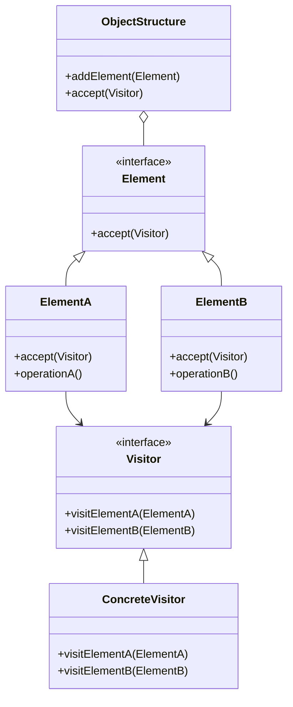

## 6.9 Visitor Pattern

The Visitor Pattern is a powerful behavioral design pattern that allows you to define new operations on an object structure without modifying the classes of the elements on which it operates. This pattern is particularly useful when you have a complex object structure and you want to perform various operations on it without cluttering the object classes with multiple methods.

### Intent

The primary intent of the Visitor Pattern is to separate an algorithm from the object structure it operates on. This separation allows you to add new operations without modifying the existing object structure, adhering to the Open/Closed Principle.

### Key Participants

1. **Visitor Interface**: Declares a visit operation for each type of concrete element in the object structure.
2. **Concrete Visitor**: Implements the operations defined in the Visitor interface.
3. **Element Interface**: Declares an `accept` method that takes a visitor as an argument.
4. **Concrete Element**: Implements the `accept` method to call the visitor's operation corresponding to its class.
5. **Object Structure**: A collection of elements that can be iterated over and visited by a visitor.

### Applicability

Use the Visitor Pattern when:
- You have a complex object structure and need to perform operations on its elements.
- You want to add new operations without modifying the existing classes.
- The object structure rarely changes, but you frequently need to add new operations.

### Implementing Visitor in Haxe

Let's explore how to implement the Visitor Pattern in Haxe with a practical example.

#### Visitor Interface

First, define the `Visitor` interface with a method for each type of element.

```haxe
interface Visitor {
    function visitElementA(element: ElementA): Void;
    function visitElementB(element: ElementB): Void;
}
```

#### Element Interface

Next, define the `Element` interface with an `accept` method.

```haxe
interface Element {
    function accept(visitor: Visitor): Void;
}
```

#### Concrete Elements

Implement the `Element` interface in concrete element classes.

```haxe
class ElementA implements Element {
    public function new() {}

    public function accept(visitor: Visitor): Void {
        visitor.visitElementA(this);
    }

    public function operationA(): String {
        return "ElementA operation";
    }
}

class ElementB implements Element {
    public function new() {}

    public function accept(visitor: Visitor): Void {
        visitor.visitElementB(this);
    }

    public function operationB(): String {
        return "ElementB operation";
    }
}
```

#### Concrete Visitor

Implement the `Visitor` interface in concrete visitor classes.

```haxe
class ConcreteVisitor implements Visitor {
    public function new() {}

    public function visitElementA(element: ElementA): Void {
        trace("Visiting " + element.operationA());
    }

    public function visitElementB(element: ElementB): Void {
        trace("Visiting " + element.operationB());
    }
}
```

#### Object Structure

Create a structure to hold elements and allow them to be visited.

```haxe
class ObjectStructure {
    private var elements: Array<Element>;

    public function new() {
        elements = new Array<Element>();
    }

    public function addElement(element: Element): Void {
        elements.push(element);
    }

    public function accept(visitor: Visitor): Void {
        for (element in elements) {
            element.accept(visitor);
        }
    }
}
```

#### Using the Visitor Pattern

Now, let's see how to use the Visitor Pattern in a Haxe application.

```haxe
class Main {
    static public function main() {
        var structure = new ObjectStructure();
        structure.addElement(new ElementA());
        structure.addElement(new ElementB());

        var visitor = new ConcreteVisitor();
        structure.accept(visitor);
    }
}
```

### Use Cases and Examples

#### Syntax Trees

In compilers or interpreters, the Visitor Pattern is often used to traverse syntax trees and perform operations like code analysis, optimization, or transformation.

#### Document Processing

In document processing applications, the Visitor Pattern can be used to apply actions like rendering, exporting, or converting documents to different formats.

### Visualizing the Visitor Pattern

Below is a class diagram representing the Visitor Pattern structure.



### Design Considerations

- **When to Use**: The Visitor Pattern is ideal when you need to perform multiple unrelated operations on a class hierarchy and you want to avoid polluting the classes with these operations.
- **Haxe-Specific Features**: Haxe's strong typing and interface support make implementing the Visitor Pattern straightforward. Use Haxe's type inference to simplify code and improve readability.
- **Pitfalls**: The Visitor Pattern can become cumbersome if the object structure frequently changes, as each change requires updating the visitor interface and all its implementations.

### Differences and Similarities

- **Similar Patterns**: The Visitor Pattern is often compared to the Strategy Pattern. While both patterns allow you to define operations separately from the objects they operate on, the Visitor Pattern is more suited for operations that need to be applied across a complex object structure.
- **Differences**: Unlike the Strategy Pattern, which is used to encapsulate algorithms, the Visitor Pattern is used to perform operations on elements of an object structure.

### Try It Yourself

Experiment with the Visitor Pattern by modifying the code examples:

- Add a new element type and update the visitor interface and concrete visitor.
- Implement a new concrete visitor that performs a different operation on the elements.
- Create a more complex object structure and apply multiple visitors to it.

### Knowledge Check

- What is the primary intent of the Visitor Pattern?
- How does the Visitor Pattern adhere to the Open/Closed Principle?
- What are the key participants in the Visitor Pattern?
- When should you use the Visitor Pattern?
- How does the Visitor Pattern differ from the Strategy Pattern?

### Embrace the Journey

Remember, mastering design patterns is a journey. As you explore the Visitor Pattern and other patterns, you'll gain a deeper understanding of how to write clean, maintainable, and efficient code. Keep experimenting, stay curious, and enjoy the journey!

## Quiz Time!



### What is the primary intent of the Visitor Pattern?

- [x] To separate an algorithm from the object structure it operates on.
- [ ] To encapsulate algorithms within classes.
- [ ] To allow objects to change their behavior dynamically.
- [ ] To provide a way to access the elements of an aggregate object sequentially.

> **Explanation:** The Visitor Pattern separates an algorithm from the object structure it operates on, allowing new operations to be added without modifying the existing structure.

### Which of the following is a key participant in the Visitor Pattern?

- [x] Visitor Interface
- [ ] Strategy Interface
- [ ] Singleton Class
- [ ] Adapter Interface

> **Explanation:** The Visitor Interface is a key participant in the Visitor Pattern, defining operations for each type of element.

### When should you use the Visitor Pattern?

- [x] When you need to perform multiple unrelated operations on a class hierarchy.
- [ ] When you need to encapsulate algorithms within classes.
- [ ] When you need to allow objects to change their behavior dynamically.
- [ ] When you need to provide a way to access the elements of an aggregate object sequentially.

> **Explanation:** The Visitor Pattern is useful when you need to perform multiple unrelated operations on a class hierarchy without modifying the classes.

### How does the Visitor Pattern adhere to the Open/Closed Principle?

- [x] By allowing new operations to be added without modifying existing classes.
- [ ] By encapsulating algorithms within classes.
- [ ] By allowing objects to change their behavior dynamically.
- [ ] By providing a way to access the elements of an aggregate object sequentially.

> **Explanation:** The Visitor Pattern adheres to the Open/Closed Principle by allowing new operations to be added without modifying existing classes.

### What is a potential pitfall of the Visitor Pattern?

- [x] It can become cumbersome if the object structure frequently changes.
- [ ] It can lead to tight coupling between classes.
- [ ] It can make code difficult to understand.
- [ ] It can lead to excessive use of inheritance.

> **Explanation:** The Visitor Pattern can become cumbersome if the object structure frequently changes, as each change requires updating the visitor interface and its implementations.

### How does the Visitor Pattern differ from the Strategy Pattern?

- [x] The Visitor Pattern is used for operations on elements of an object structure, while the Strategy Pattern is used to encapsulate algorithms.
- [ ] The Visitor Pattern is used to encapsulate algorithms, while the Strategy Pattern is used for operations on elements of an object structure.
- [ ] The Visitor Pattern allows objects to change their behavior dynamically, while the Strategy Pattern does not.
- [ ] The Visitor Pattern provides a way to access the elements of an aggregate object sequentially, while the Strategy Pattern does not.

> **Explanation:** The Visitor Pattern is used for operations on elements of an object structure, while the Strategy Pattern is used to encapsulate algorithms.

### What is a common use case for the Visitor Pattern?

- [x] Syntax Trees
- [ ] Singleton Management
- [ ] Dynamic Behavior Changes
- [ ] Sequential Access to Elements

> **Explanation:** A common use case for the Visitor Pattern is traversing syntax trees to perform operations like code analysis or transformation.

### Which Haxe feature makes implementing the Visitor Pattern straightforward?

- [x] Strong typing and interface support
- [ ] Dynamic typing
- [ ] Lack of inheritance
- [ ] Weak typing

> **Explanation:** Haxe's strong typing and interface support make implementing the Visitor Pattern straightforward.

### What is the role of the `accept` method in the Visitor Pattern?

- [x] It allows an element to accept a visitor and call the visitor's operation.
- [ ] It encapsulates algorithms within classes.
- [ ] It allows objects to change their behavior dynamically.
- [ ] It provides a way to access the elements of an aggregate object sequentially.

> **Explanation:** The `accept` method allows an element to accept a visitor and call the visitor's operation corresponding to its class.

### True or False: The Visitor Pattern is ideal for operations that need to be applied across a complex object structure.

- [x] True
- [ ] False

> **Explanation:** True. The Visitor Pattern is ideal for operations that need to be applied across a complex object structure.


