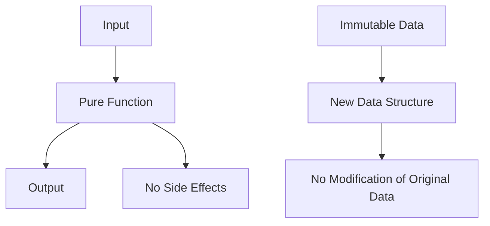

## 7.1 Pure Functions and Immutability

In the realm of functional programming, pure functions and immutability stand as foundational pillars that contribute to the creation of robust, maintainable, and efficient software. In this section, we will delve into these concepts, exploring their significance, implementation in Haxe, and the myriad benefits they offer to cross-platform software development.

### Understanding Pure Functions

**Definition:** A pure function is a function where the output value is determined only by its input values, without observable side effects. This means that a pure function will always produce the same result given the same inputs, and it does not alter any external state.

#### Characteristics of Pure Functions

1. **Deterministic Output:** The function's output is solely dependent on its input parameters.
2. **No Side Effects:** The function does not modify any external state or variables.
3. **Referential Transparency:** A pure function can be replaced with its output value without changing the program's behavior.

#### Implementing Pure Functions in Haxe

To implement pure functions in Haxe, ensure that your functions do not rely on or modify any external state. Let's look at an example:

```haxe
// A pure function that calculates the square of a number
function square(x: Int): Int {
    return x * x;
}

// Another pure function that sums two numbers
function sum(a: Int, b: Int): Int {
    return a + b;
}
```

In the above examples, both `square` and `sum` are pure functions because they rely solely on their input parameters and do not alter any external state.

### Exploring Immutability

**Definition:** Immutability refers to the concept where data structures cannot be modified after they are created. Instead of changing the existing data, new data structures are created with the desired changes.

#### Implementing Immutability in Haxe

In Haxe, immutability can be achieved by using `final` for variables and avoiding mutable collections. Here's how you can implement immutability:

```haxe
// Immutable variable declaration
final myNumber: Int = 10;

// Attempting to modify myNumber will result in a compile-time error
// myNumber = 20; // This line would cause an error

// Using immutable collections
final myList: Array<Int> = [1, 2, 3];

// Instead of modifying myList, create a new list
final newList: Array<Int> = myList.concat([4]);
```

### Benefits of Pure Functions and Immutability

#### Predictability and Testability

Pure functions and immutability enhance the predictability of your code. Since pure functions always produce the same output for the same input, they are easier to debug and test. Immutability ensures that data does not change unexpectedly, reducing the likelihood of bugs.

#### Concurrency Safety

In a concurrent environment, shared mutable state can lead to race conditions and unpredictable behavior. Pure functions and immutability eliminate these issues, as there is no shared mutable state to contend with, making your code inherently thread-safe.

### Visualizing Pure Functions and Immutability

To better understand the flow and impact of pure functions and immutability, let's visualize these concepts using a flowchart:



**Diagram Description:** This flowchart illustrates how pure functions take input and produce output without side effects. It also shows how immutable data leads to the creation of new data structures without modifying the original data.

### Try It Yourself

To solidify your understanding, try modifying the following code examples:

1. **Create a Pure Function:** Write a function that calculates the factorial of a number using recursion. Ensure it is pure by not using any external state.

2. **Implement Immutability:** Create an immutable data structure representing a point in 2D space. Write a function that returns a new point translated by a given vector without modifying the original point.

### References and Further Reading

- [MDN Web Docs on Functional Programming](https://developer.mozilla.org/en-US/docs/Glossary/Functional_programming)
- [Haxe Manual on Type System](https://haxe.org/manual/types.html)

### Knowledge Check

Let's reinforce your understanding with some questions and challenges:

1. **What is a pure function?** Explain its characteristics.
2. **How does immutability contribute to concurrency safety?**
3. **Write a pure function that reverses a string.**

### Embrace the Journey

Remember, mastering pure functions and immutability is a journey that enhances your ability to write clean, maintainable, and efficient code. As you progress, you'll find these concepts invaluable in building complex and reliable software systems. Keep experimenting, stay curious, and enjoy the journey!

## Quiz Time!



### What is a characteristic of a pure function?

- [x] It produces the same output for the same input.
- [ ] It modifies external state.
- [ ] It relies on global variables.
- [ ] It has unpredictable behavior.

> **Explanation:** A pure function always produces the same output for the same input and does not modify external state.

### How does immutability enhance concurrency safety?

- [x] By eliminating shared mutable state.
- [ ] By allowing multiple threads to modify data simultaneously.
- [ ] By increasing the complexity of data structures.
- [ ] By requiring more memory.

> **Explanation:** Immutability eliminates shared mutable state, reducing the risk of race conditions in concurrent environments.

### Which of the following is an example of a pure function?

- [x] A function that calculates the sum of two numbers.
- [ ] A function that modifies a global variable.
- [ ] A function that logs a message to the console.
- [ ] A function that reads from a file.

> **Explanation:** A pure function does not modify external state or rely on external data, such as global variables or files.

### What is the result of attempting to modify an immutable variable in Haxe?

- [x] A compile-time error.
- [ ] A runtime error.
- [ ] The variable is modified successfully.
- [ ] The program crashes.

> **Explanation:** Attempting to modify an immutable variable in Haxe results in a compile-time error, preventing the modification.

### Which concept is closely related to pure functions?

- [x] Referential transparency.
- [ ] Mutable state.
- [ ] Side effects.
- [ ] Global variables.

> **Explanation:** Referential transparency is a property of pure functions, where they can be replaced with their output value without changing the program's behavior.

### What is a benefit of using pure functions?

- [x] Easier to test and debug.
- [ ] Increased complexity.
- [ ] Requires more memory.
- [ ] Slower execution.

> **Explanation:** Pure functions are easier to test and debug because they produce consistent results and do not have side effects.

### How can you achieve immutability in Haxe?

- [x] By using `final` for variables.
- [ ] By using mutable collections.
- [ ] By modifying data in place.
- [ ] By relying on global state.

> **Explanation:** Immutability in Haxe can be achieved by using `final` for variables and avoiding mutable collections.

### What is a potential drawback of immutability?

- [x] Increased memory usage.
- [ ] Difficulty in testing.
- [ ] Unpredictable behavior.
- [ ] Increased risk of race conditions.

> **Explanation:** Immutability can lead to increased memory usage due to the creation of new data structures instead of modifying existing ones.

### Which of the following is NOT a benefit of pure functions?

- [x] They modify external state.
- [ ] They are easier to test.
- [ ] They are predictable.
- [ ] They have no side effects.

> **Explanation:** Pure functions do not modify external state; this is a key characteristic that makes them easier to test and predictable.

### True or False: Immutability ensures that data structures can be modified after creation.

- [ ] True
- [x] False

> **Explanation:** Immutability ensures that data structures cannot be modified after creation, promoting stability and predictability.


