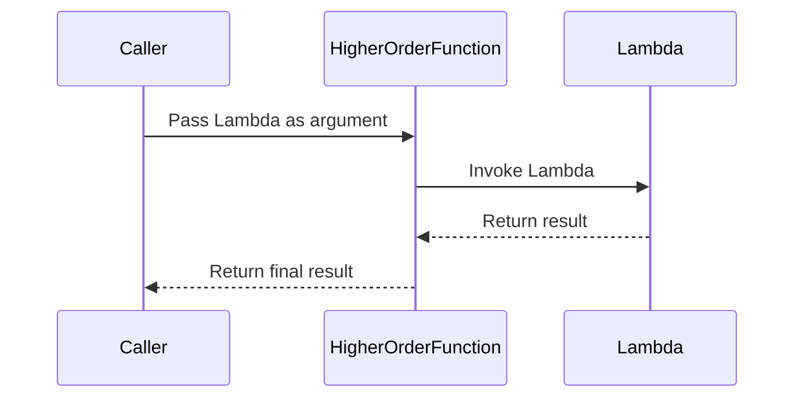

## 7.2 Higher-Order Functions and Lambdas

In the realm of functional programming, higher-order functions and lambdas are indispensable tools that enable developers to write more expressive, concise, and flexible code. In this section, we will delve into the concepts of higher-order functions and lambdas, explore their implementation in Haxe, and understand their practical applications in cross-platform software development.

### Understanding Higher-Order Functions

**Definition:** Higher-order functions are functions that can take other functions as parameters or return them as results. This capability allows for a more modular and reusable codebase, as functions can be passed around and composed in various ways.

#### Key Characteristics of Higher-Order Functions

- **Function as a Parameter:** A higher-order function can accept one or more functions as arguments, allowing for dynamic behavior.
- **Function as a Return Value:** It can return a function, enabling the creation of function factories or decorators.
- **Abstraction and Composition:** Higher-order functions facilitate abstraction and composition, making it easier to build complex operations from simpler ones.

### Implementing Higher-Order Functions in Haxe

Haxe, with its multi-paradigm support, provides robust features for implementing higher-order functions. Let's explore how to define and use them effectively.

#### Function Types in Haxe

In Haxe, functions are first-class citizens, and you can define function types to specify the signature of functions that can be passed as arguments or returned.

```haxe
// Define a function type that takes an Int and returns an Int
typedef IntToInt = Int -> Int;

// A higher-order function that takes a function and an integer
function applyFunction(f: IntToInt, value: Int): Int {
    return f(value);
}

// Example usage
function increment(x: Int): Int {
    return x + 1;
}

var result = applyFunction(increment, 5); // result is 6
```

In this example, `IntToInt` is a function type that represents any function taking an `Int` and returning an `Int`. The `applyFunction` function demonstrates how to use this type to accept a function as a parameter.

#### Lambdas in Haxe

Lambdas, also known as anonymous functions, are a concise way to define functions inline. Haxe supports both the traditional `function` expression and the arrow syntax for lambdas.

```haxe
// Using function expression
var add = function(a: Int, b: Int): Int {
    return a + b;
};

// Using arrow syntax
var multiply = (a: Int, b: Int) => a * b;

// Example usage
trace(add(2, 3)); // Outputs: 5
trace(multiply(4, 5)); // Outputs: 20
```

Lambdas are particularly useful for short, throwaway functions that are used as arguments to higher-order functions.

### Practical Use Cases for Higher-Order Functions and Lambdas

Higher-order functions and lambdas are not just theoretical constructs; they have practical applications in everyday programming tasks. Let's explore some common use cases.

#### Callbacks

Callbacks are functions passed as arguments to other functions, often used to handle events or asynchronous operations.

```haxe
function fetchData(callback: String -> Void): Void {
    // Simulate an asynchronous operation
    haxe.Timer.delay(() -> {
        var data = "Sample Data";
        callback(data);
    }, 1000);
}

// Usage
fetchData((data) => trace("Received: " + data));
```

In this example, `fetchData` accepts a callback function that is invoked once the data is fetched. This pattern is prevalent in event-driven and asynchronous programming.

#### Functional Utilities: Map, Filter, and Reduce

Functional utilities like `map`, `filter`, and `reduce` are powerful tools for processing collections. They leverage higher-order functions to apply operations to each element of a collection.

```haxe
var numbers = [1, 2, 3, 4, 5];

// Map: Apply a function to each element
var doubled = numbers.map((n) => n * 2);
trace(doubled); // Outputs: [2, 4, 6, 8, 10]

// Filter: Select elements that satisfy a condition
var evens = numbers.filter((n) => n % 2 == 0);
trace(evens); // Outputs: [2, 4]

// Reduce: Accumulate a result from the collection
var sum = numbers.reduce((acc, n) => acc + n, 0);
trace(sum); // Outputs: 15
```

These utilities demonstrate the power of higher-order functions in transforming and aggregating data.

### Visualizing Higher-Order Functions and Lambdas

To better understand the flow and interaction of higher-order functions and lambdas, let's visualize the process using a sequence diagram.



**Diagram Description:** This sequence diagram illustrates the interaction between a caller, a higher-order function, and a lambda. The caller passes a lambda to the higher-order function, which then invokes the lambda and returns the result.

### Try It Yourself

Experiment with the code examples provided by modifying them to suit different scenarios. For instance, try creating a higher-order function that accepts multiple lambdas and combines their results. This exercise will help solidify your understanding of higher-order functions and lambdas in Haxe.

### References and Further Reading

- [MDN Web Docs: Functions](https://developer.mozilla.org/en-US/docs/Web/JavaScript/Guide/Functions)
- [Haxe Manual: Functions](https://haxe.org/manual/types-function.html)
- [Functional Programming in Haxe](https://haxe.org/manual/lf-functional.html)

### Knowledge Check

To reinforce your understanding, consider the following questions and exercises:

- What are the benefits of using higher-order functions in software design?
- How can lambdas improve code readability and maintainability?
- Implement a higher-order function that takes a list of numbers and a lambda, and applies the lambda to each number.

### Embrace the Journey

Remember, mastering higher-order functions and lambdas is a journey. As you continue to explore these concepts, you'll discover new ways to write more efficient and expressive code. Keep experimenting, stay curious, and enjoy the process!

## Quiz Time!



### What is a higher-order function?

- [x] A function that takes other functions as parameters or returns them as results.
- [ ] A function that only returns primitive types.
- [ ] A function that cannot be passed as an argument.
- [ ] A function that is always recursive.

> **Explanation:** Higher-order functions can take other functions as parameters or return them as results, enabling more flexible and reusable code.

### How do you define a function type in Haxe?

- [x] Using the syntax `typedef IntToInt = Int -> Int;`
- [ ] Using the syntax `function IntToInt(Int): Int;`
- [ ] Using the syntax `IntToInt = Int -> Int;`
- [ ] Using the syntax `typedef IntToInt = Int => Int;`

> **Explanation:** In Haxe, function types are defined using the `typedef` keyword followed by the function signature.

### What is the purpose of a lambda?

- [x] To define anonymous functions inline.
- [ ] To create named functions.
- [ ] To define global variables.
- [ ] To handle exceptions.

> **Explanation:** Lambdas are anonymous functions that can be defined inline, making them useful for short, throwaway functions.

### Which syntax is used for lambdas in Haxe?

- [x] `(a) => a + 1`
- [ ] `function(a) { return a + 1; }`
- [ ] `lambda(a) { return a + 1; }`
- [ ] `fn(a) => a + 1`

> **Explanation:** Haxe supports the arrow syntax `(a) => a + 1` for defining lambdas.

### What does the `map` function do?

- [x] Applies a function to each element of a collection.
- [ ] Filters elements based on a condition.
- [ ] Accumulates a result from a collection.
- [ ] Sorts elements in a collection.

> **Explanation:** The `map` function applies a given function to each element of a collection, transforming it.

### What is the result of `numbers.reduce((acc, n) => acc + n, 0)` for `numbers = [1, 2, 3]`?

- [x] 6
- [ ] 0
- [ ] 3
- [ ] 1

> **Explanation:** The `reduce` function accumulates the sum of the numbers, resulting in 6.

### What is a common use case for higher-order functions?

- [x] Callbacks for handling events or asynchronous results.
- [ ] Defining global constants.
- [ ] Creating static classes.
- [ ] Managing memory allocation.

> **Explanation:** Higher-order functions are commonly used for callbacks to handle events or asynchronous operations.

### What does the `filter` function do?

- [x] Selects elements that satisfy a condition.
- [ ] Applies a function to each element.
- [ ] Accumulates a result from a collection.
- [ ] Sorts elements in a collection.

> **Explanation:** The `filter` function selects elements from a collection that satisfy a given condition.

### Can higher-order functions return other functions?

- [x] True
- [ ] False

> **Explanation:** Higher-order functions can return other functions, enabling the creation of function factories or decorators.

### What is the benefit of using lambdas in Haxe?

- [x] They provide a concise way to define functions inline.
- [ ] They are always faster than named functions.
- [ ] They can only be used in global scope.
- [ ] They automatically handle exceptions.

> **Explanation:** Lambdas provide a concise way to define functions inline, improving code readability and maintainability.


