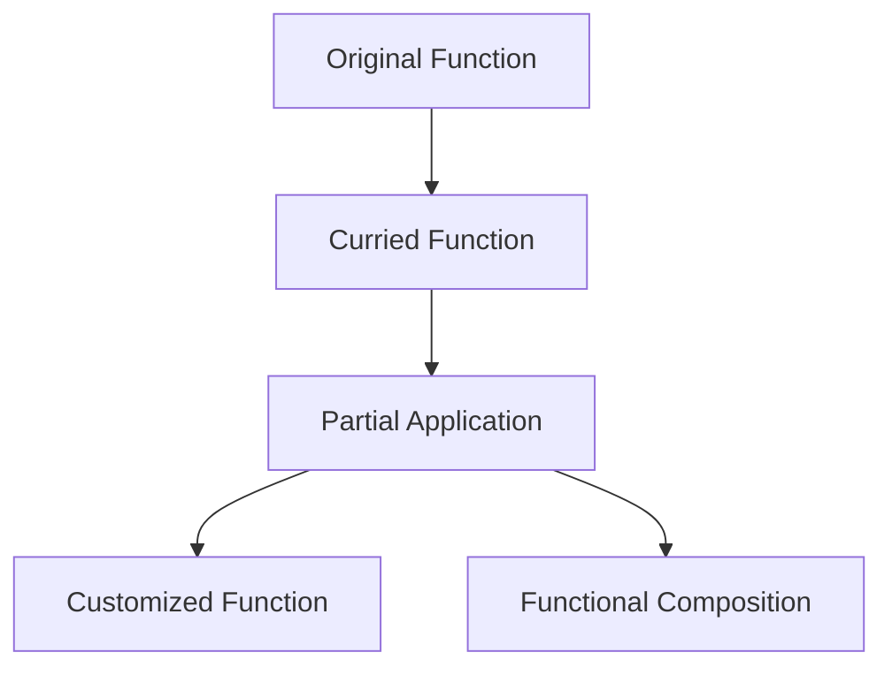

## 7.3 Currying and Partial Application

In the realm of functional programming, currying and partial application are powerful techniques that enhance the modularity and reusability of code. These concepts are particularly useful in Haxe, a language known for its cross-platform capabilities and multi-paradigm support. In this section, we will delve into the intricacies of currying and partial application, exploring their implementation in Haxe and their practical applications in software development.

### Understanding Currying and Partial Application

**Currying** is a process of transforming a function that takes multiple arguments into a series of functions, each taking a single argument. This technique allows for more flexible function composition and reuse. **Partial application**, on the other hand, involves fixing a few arguments of a function, producing another function of smaller arity (fewer arguments).

#### Key Differences

- **Currying**: Converts a function with multiple arguments into a chain of functions, each taking one argument.
- **Partial Application**: Fixes some arguments of a function, resulting in a new function with fewer arguments.

### Implementing Currying in Haxe

To implement currying in Haxe, we create functions that return other functions. This approach allows us to break down complex functions into simpler, more manageable components.

#### Example: Currying a Simple Function

Let's start with a simple example of currying a function that adds three numbers:

```haxe
class CurryExample {
    static function main() {
        // Original function
        var addThree = function(a:Int, b:Int, c:Int):Int {
            return a + b + c;
        };

        // Curried version
        var curriedAdd = function(a:Int):Dynamic {
            return function(b:Int):Dynamic {
                return function(c:Int):Int {
                    return a + b + c;
                };
            };
        };

        // Using the curried function
        var result = curriedAdd(1)(2)(3);
        trace(result); // Outputs: 6
    }
}
```

In this example, `curriedAdd` is a function that returns another function, which in turn returns another function. This chain continues until all arguments are supplied.

### Implementing Partial Application in Haxe

Partial application can be achieved by using helper functions or libraries to fix some arguments of a function, creating a new function with fewer arguments.

#### Example: Partial Application

Consider a function that multiplies three numbers:

```haxe
class PartialExample {
    static function main() {
        // Original function
        var multiplyThree = function(a:Int, b:Int, c:Int):Int {
            return a * b * c;
        };

        // Partial application
        var multiplyByTwo = function(b:Int, c:Int):Int {
            return multiplyThree(2, b, c);
        };

        // Using the partially applied function
        var result = multiplyByTwo(3, 4);
        trace(result); // Outputs: 24
    }
}
```

In this example, `multiplyByTwo` is a partially applied function where the first argument is fixed to `2`.

### Use Cases for Currying and Partial Application

#### Customized Functions

Currying and partial application allow for the creation of customized functions by pre-configuring them with common parameters. This is particularly useful in scenarios where certain parameters remain constant across multiple function calls.

#### Functional Composition

These techniques facilitate functional composition, enabling the construction of complex operations from simpler ones. By breaking down functions into smaller components, we can easily compose them to achieve desired functionality.

### Visualizing Currying and Partial Application

To better understand these concepts, let's visualize the transformation of a function through currying and partial application.



**Diagram Description**: This diagram illustrates the transformation of an original function into a curried function, followed by partial application, resulting in customized functions and enabling functional composition.

### Practical Applications in Haxe

Currying and partial application are not just theoretical concepts; they have practical applications in real-world Haxe projects. Let's explore some scenarios where these techniques can be effectively utilized.

#### Scenario 1: Configurable Logging

Imagine a logging system where the log level is a constant parameter. By using partial application, we can create a logging function that is pre-configured with a specific log level.

```haxe
class Logger {
    static function main() {
        var log = function(level:String, message:String):Void {
            trace(level + ": " + message);
        };

        var infoLog = function(message:String):Void {
            log("INFO", message);
        };

        infoLog("This is an informational message.");
    }
}
```

#### Scenario 2: Building URL Endpoints

In web development, constructing URL endpoints often involves repetitive patterns. Currying can simplify this process by breaking down the URL construction into smaller, reusable functions.

```haxe
class UrlBuilder {
    static function main() {
        var buildUrl = function(base:String):Dynamic {
            return function(endpoint:String):Dynamic {
                return function(query:String):String {
                    return base + "/" + endpoint + "?" + query;
                };
            };
        };

        var apiUrl = buildUrl("https://api.example.com")("users")("id=123");
        trace(apiUrl); // Outputs: https://api.example.com/users?id=123
    }
}
```

### Try It Yourself

To deepen your understanding of currying and partial application, try modifying the code examples provided. Experiment with different functions and see how currying and partial application can simplify your code.

### References and Further Reading

- [MDN Web Docs on Currying](https://developer.mozilla.org/en-US/docs/Glossary/Currying)
- [Functional Programming in Haxe](https://haxe.org/manual/std-functional.html)
- [Partial Application in Functional Programming](https://en.wikipedia.org/wiki/Partial_application)

### Knowledge Check

Before we conclude, let's reinforce what we've learned with a few questions and exercises.

1. **What is the primary difference between currying and partial application?**
2. **How can currying enhance function composition?**
3. **Try creating a curried function that calculates the volume of a box.**

### Embrace the Journey

Remember, mastering currying and partial application is a journey. As you progress, you'll discover new ways to leverage these techniques in your Haxe projects. Keep experimenting, stay curious, and enjoy the journey!

## Quiz Time!



### What is currying in functional programming?

- [x] Transforming a function with multiple arguments into a series of functions each with a single argument.
- [ ] Fixing some arguments of a function to create a new function with fewer arguments.
- [ ] Combining multiple functions into one.
- [ ] Creating a function that takes no arguments.

> **Explanation:** Currying involves transforming a function with multiple arguments into a series of functions, each taking one argument.

### What does partial application involve?

- [ ] Transforming a function with multiple arguments into a series of functions each with a single argument.
- [x] Fixing some arguments of a function to create a new function with fewer arguments.
- [ ] Combining multiple functions into one.
- [ ] Creating a function that takes no arguments.

> **Explanation:** Partial application involves fixing some arguments of a function, resulting in a new function with fewer arguments.

### Which of the following is a use case for currying?

- [x] Functional composition
- [ ] Creating global variables
- [ ] Implementing loops
- [ ] Handling exceptions

> **Explanation:** Currying is useful for functional composition, allowing complex operations to be built from simpler ones.

### How can currying be implemented in Haxe?

- [x] By creating functions that return other functions.
- [ ] By using loops to iterate over arguments.
- [ ] By defining global variables.
- [ ] By using exception handling.

> **Explanation:** Currying in Haxe is implemented by creating functions that return other functions, each taking a single argument.

### What is the result of applying partial application to a function?

- [x] A new function with fewer arguments.
- [ ] A function with more arguments.
- [ ] A function that takes no arguments.
- [ ] A function that returns a constant value.

> **Explanation:** Partial application results in a new function with fewer arguments, as some arguments are fixed.

### Which technique allows pre-configuring functions with common parameters?

- [x] Partial application
- [ ] Currying
- [ ] Looping
- [ ] Exception handling

> **Explanation:** Partial application allows pre-configuring functions with common parameters by fixing some arguments.

### What is a practical application of currying in web development?

- [x] Building URL endpoints
- [ ] Implementing loops
- [ ] Handling exceptions
- [ ] Creating global variables

> **Explanation:** Currying can be used in web development to build URL endpoints by breaking down the construction into smaller, reusable functions.

### How does currying facilitate functional composition?

- [x] By breaking down functions into smaller components.
- [ ] By combining multiple functions into one.
- [ ] By creating global variables.
- [ ] By handling exceptions.

> **Explanation:** Currying facilitates functional composition by breaking down functions into smaller components, allowing complex operations to be built from simpler ones.

### What is the primary benefit of using currying and partial application?

- [x] Enhanced modularity and reusability of code.
- [ ] Increased complexity of code.
- [ ] Reduced performance.
- [ ] Increased memory usage.

> **Explanation:** The primary benefit of using currying and partial application is enhanced modularity and reusability of code.

### True or False: Currying and partial application are only applicable in functional programming languages.

- [ ] True
- [x] False

> **Explanation:** While currying and partial application are concepts from functional programming, they can be applied in multi-paradigm languages like Haxe.




