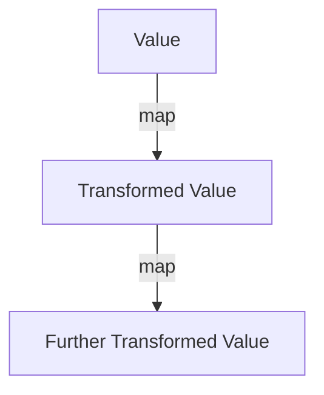
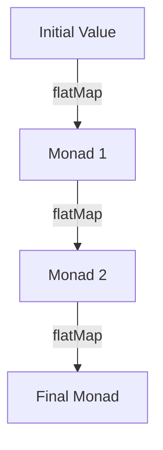

## 7.4 Monads and Functors

In the realm of functional programming, **Monads** and **Functors** are pivotal concepts that enable developers to handle computations and data transformations in a structured and predictable manner. In Haxe, these abstractions are particularly useful for managing side effects, handling optional values, and composing complex operations. This section delves into the definition, implementation, and practical applications of Monads and Functors in Haxe, providing expert software engineers and architects with the knowledge to leverage these patterns effectively.

### Understanding Functors

**Functors** are a type of design pattern that allows you to map a function over a wrapped value. In essence, a Functor is a container that can be mapped over, applying a function to the value inside without altering the structure of the container.

#### Implementing Functors in Haxe

In Haxe, a Functor can be implemented using a generic class that provides a `map` method. This method takes a function and applies it to the value inside the Functor.

```haxe
class Functor<T> {
    private var value: T;

    public function new(value: T) {
        this.value = value;
    }

    public function map<U>(f: T -> U): Functor<U> {
        return new Functor(f(this.value));
    }

    public function getValue(): T {
        return this.value;
    }
}

// Usage example
var numberFunctor = new Functor(5);
var incrementedFunctor = numberFunctor.map(n -> n + 1);
trace(incrementedFunctor.getValue()); // Outputs: 6
```

In this example, the `Functor` class encapsulates a value and provides a `map` method to apply a function to this value. The `map` method returns a new Functor containing the result of the function application.

### Understanding Monads

**Monads** are an extension of Functors that provide additional capabilities for chaining operations. They are used to represent computations instead of data in the domain model. Monads allow for the composition of functions that return wrapped values, enabling a clean and concise way to handle side effects, asynchronous operations, and error handling.

#### Monad Laws

Before diving into implementation, it's important to understand the three Monad laws that ensure the correct behavior of Monads:

1. **Left Identity:** `return a >>= f` is equivalent to `f a`.
2. **Right Identity:** `m >>= return` is equivalent to `m`.
3. **Associativity:** `(m >>= f) >>= g` is equivalent to `m >>= (\x -> f x >>= g)`.

These laws ensure that Monads behave predictably when chaining operations.

#### Implementing Monads in Haxe

Let's explore how to implement Monads in Haxe, focusing on two common types: the **Option/Maybe Monad** and the **Result/Either Monad**.

##### Option/Maybe Monad

The Option or Maybe Monad is used to handle optional values without resorting to nulls, providing a safer way to manage the absence of a value.

```haxe
abstract Maybe<T>(Null<T>) {
    public function new(value: Null<T>) this = value;

    public function map<U>(f: T -> U): Maybe<U> {
        return this == null ? null : new Maybe(f(this));
    }

    public function flatMap<U>(f: T -> Maybe<U>): Maybe<U> {
        return this == null ? null : f(this);
    }

    public static function just<T>(value: T): Maybe<T> {
        return new Maybe(value);
    }

    public static function nothing<T>(): Maybe<T> {
        return new Maybe(null);
    }
}

// Usage example
var maybeValue = Maybe.just(10);
var result = maybeValue.flatMap(v -> Maybe.just(v * 2));
trace(result); // Outputs: 20
```

In this implementation, the `Maybe` Monad provides `map` and `flatMap` methods to apply functions to the encapsulated value. The `flatMap` method is crucial for chaining operations that return another Monad.

##### Result/Either Monad

The Result or Either Monad is used to represent computations that may fail, encapsulating either a success value or an error.

```haxe
enum Result<T, E> {
    Success(value: T);
    Error(error: E);
}

class ResultMonad<T, E> {
    private var result: Result<T, E>;

    public function new(result: Result<T, E>) {
        this.result = result;
    }

    public function map<U>(f: T -> U): ResultMonad<U, E> {
        return switch (this.result) {
            case Success(value): new ResultMonad(Success(f(value)));
            case Error(error): new ResultMonad(Error(error));
        }
    }

    public function flatMap<U>(f: T -> ResultMonad<U, E>): ResultMonad<U, E> {
        return switch (this.result) {
            case Success(value): f(value);
            case Error(error): new ResultMonad(Error(error));
        }
    }
}

// Usage example
var successResult = new ResultMonad(Success(5));
var errorResult = new ResultMonad(Error("An error occurred"));

var mappedResult = successResult.map(n -> n * 2);
trace(mappedResult); // Outputs: Success(10)

var flatMappedResult = successResult.flatMap(n -> new ResultMonad(Success(n + 3)));
trace(flatMappedResult); // Outputs: Success(8)
```

The `ResultMonad` class encapsulates a `Result` type, providing `map` and `flatMap` methods to handle success and error cases gracefully.

### Use Cases for Monads and Functors

Monads and Functors are powerful tools for managing complex computations and data transformations. Here are some practical use cases:

#### Safe Computations

Monads like `Maybe` and `Result` allow you to handle error-prone operations gracefully, avoiding null pointer exceptions and providing a structured way to manage errors.

#### Composing Asynchronous Calls

Monads can be used to chain asynchronous operations, ensuring that each step in the computation is handled correctly and that errors are propagated appropriately.

### Visualizing Monads and Functors

To better understand the flow of operations in Monads and Functors, let's visualize the process using Mermaid.js diagrams.

#### Functor Mapping



This diagram illustrates how a Functor applies a series of transformations to a value using the `map` method.

#### Monad Chaining



This diagram shows how Monads chain operations using the `flatMap` method, passing the result of one computation to the next.

### Try It Yourself

To deepen your understanding of Monads and Functors, try modifying the code examples provided. Experiment with different functions and see how they affect the outcome. Consider implementing additional Monads for specific use cases, such as handling asynchronous operations or managing state.

### References and Further Reading

- [Haxe Manual: Abstract Types](https://haxe.org/manual/types-abstract.html)
- [MDN Web Docs: Functional Programming Concepts](https://developer.mozilla.org/en-US/docs/Glossary/Functional_programming)
- [Learn You a Haskell for Great Good!](http://learnyouahaskell.com/chapters)

### Knowledge Check

To reinforce your understanding of Monads and Functors, consider the following questions and exercises:

1. Explain the difference between a Functor and a Monad.
2. Implement a custom Monad for handling asynchronous operations in Haxe.
3. Describe a real-world scenario where using a Monad would simplify error handling.
4. Modify the `Maybe` Monad to include a method for providing a default value if the Monad is empty.

### Embrace the Journey

Remember, mastering Monads and Functors is a journey. As you continue to explore these concepts, you'll discover new ways to simplify complex computations and enhance the robustness of your code. Keep experimenting, stay curious, and enjoy the process of learning and applying functional programming patterns in Haxe.

## Quiz Time!



### What is a Functor in functional programming?

- [x] A type that can be mapped over with a function.
- [ ] A type that represents computations that may fail.
- [ ] A type that encapsulates asynchronous operations.
- [ ] A type that handles side effects.

> **Explanation:** A Functor is a type that can be mapped over with a function, allowing transformations of the encapsulated value.

### Which method is essential for chaining operations in Monads?

- [ ] map
- [x] flatMap
- [ ] filter
- [ ] reduce

> **Explanation:** The `flatMap` method is essential for chaining operations in Monads, as it allows for the composition of functions that return Monads.

### What is the primary purpose of the Maybe Monad?

- [x] To handle optional values without nulls.
- [ ] To manage asynchronous operations.
- [ ] To encapsulate side effects.
- [ ] To represent computations that may fail.

> **Explanation:** The Maybe Monad is used to handle optional values without resorting to nulls, providing a safer way to manage the absence of a value.

### What does the Left Identity law state for Monads?

- [x] return a >>= f is equivalent to f a.
- [ ] m >>= return is equivalent to m.
- [ ] (m >>= f) >>= g is equivalent to m >>= (\x -> f x >>= g).
- [ ] return a >>= return is equivalent to a.

> **Explanation:** The Left Identity law states that `return a >>= f` is equivalent to `f a`, ensuring predictable behavior when chaining operations.

### What is the result of mapping a function over a Functor?

- [x] A new Functor with the transformed value.
- [ ] The original Functor with a modified value.
- [ ] A Monad encapsulating the transformed value.
- [ ] An error if the function is not applicable.

> **Explanation:** Mapping a function over a Functor results in a new Functor containing the transformed value, preserving the structure of the original Functor.

### How does the Result Monad handle errors?

- [x] By encapsulating either a success value or an error.
- [ ] By throwing exceptions.
- [ ] By returning null.
- [ ] By logging errors to the console.

> **Explanation:** The Result Monad handles errors by encapsulating either a success value or an error, allowing for structured error management.

### Which of the following is a common use case for Monads?

- [x] Composing asynchronous calls.
- [ ] Managing UI components.
- [ ] Optimizing database queries.
- [ ] Designing RESTful APIs.

> **Explanation:** Monads are commonly used for composing asynchronous calls, ensuring that each step in the computation is handled correctly.

### What is the primary benefit of using Monads for error handling?

- [x] They provide a structured way to manage errors.
- [ ] They eliminate all runtime errors.
- [ ] They simplify the syntax of error-prone code.
- [ ] They automatically retry failed operations.

> **Explanation:** Monads provide a structured way to manage errors, allowing for predictable and maintainable error handling.

### What does the Right Identity law state for Monads?

- [x] m >>= return is equivalent to m.
- [ ] return a >>= f is equivalent to f a.
- [ ] (m >>= f) >>= g is equivalent to m >>= (\x -> f x >>= g).
- [ ] m >>= f is equivalent to return a.

> **Explanation:** The Right Identity law states that `m >>= return` is equivalent to `m`, ensuring predictable behavior when chaining operations.

### True or False: Functors can only be used with numeric values.

- [ ] True
- [x] False

> **Explanation:** False. Functors can be used with any type of value, not just numeric values, as long as the value can be transformed by a function.


