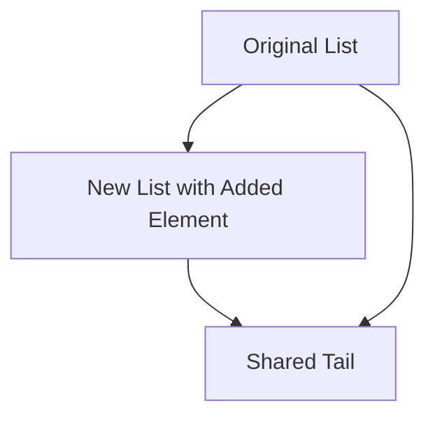

## 7.5 Functional Data Structures

Functional data structures are a cornerstone of functional programming, offering immutability and persistence, which are crucial for building reliable and concurrent applications. In this section, we will delve into the world of functional data structures in Haxe, exploring their implementation, benefits, and practical applications.

### Understanding Functional Data Structures

**Definition:** Functional data structures are immutable data structures that allow for efficient copying and updates. They are designed to be used in functional programming paradigms, where data immutability is a key principle.

#### Key Characteristics

- **Immutability:** Once created, a functional data structure cannot be modified. Instead, operations on the structure return a new version with the desired changes.
- **Persistence:** Functional data structures maintain previous versions of themselves, allowing for efficient access to historical states.
- **Efficiency:** Despite their immutability, these structures are designed to perform updates and accesses efficiently, often using techniques like structural sharing.

### Implementing Functional Data Structures in Haxe

Haxe, with its multi-paradigm support, is well-suited for implementing functional data structures. Let's explore some common types and how they can be implemented in Haxe.

#### Persistent Data Structures

Persistent data structures are a type of functional data structure that retains previous versions of itself. This is achieved through structural sharing, where new versions share parts of the old structure to minimize memory usage.

##### Immutable Lists

An immutable list is a classic example of a persistent data structure. In Haxe, we can implement an immutable list using a simple recursive data type.

```haxe
class ImmutableList<T> {
    private var head: T;
    private var tail: ImmutableList<T>;

    public function new(head: T, tail: ImmutableList<T> = null) {
        this.head = head;
        this.tail = tail;
    }

    public function prepend(value: T): ImmutableList<T> {
        return new ImmutableList(value, this);
    }

    public function getHead(): T {
        return head;
    }

    public function getTail(): ImmutableList<T> {
        return tail;
    }
}

// Usage
var list = new ImmutableList(1).prepend(2).prepend(3);
trace(list.getHead()); // Outputs: 3
```

In this example, each `prepend` operation creates a new list node, sharing the tail with the previous list, thus achieving immutability and persistence.

##### Immutable Trees

Trees are another common functional data structure. An immutable binary tree can be implemented similarly, using recursive data types.

```haxe
class ImmutableTree<T> {
    private var value: T;
    private var left: ImmutableTree<T>;
    private var right: ImmutableTree<T>;

    public function new(value: T, left: ImmutableTree<T> = null, right: ImmutableTree<T> = null) {
        this.value = value;
        this.left = left;
        this.right = right;
    }

    public function insert(newValue: T): ImmutableTree<T> {
        if (newValue < value) {
            return new ImmutableTree(value, left == null ? new ImmutableTree(newValue) : left.insert(newValue), right);
        } else {
            return new ImmutableTree(value, left, right == null ? new ImmutableTree(newValue) : right.insert(newValue));
        }
    }

    public function getValue(): T {
        return value;
    }

    public function getLeft(): ImmutableTree<T> {
        return left;
    }

    public function getRight(): ImmutableTree<T> {
        return right;
    }
}

// Usage
var tree = new ImmutableTree(5).insert(3).insert(7);
trace(tree.getValue()); // Outputs: 5
```

In this tree implementation, each `insert` operation returns a new tree, preserving the immutability of the original structure.

#### Functional Libraries in Haxe

Haxe offers several libraries that provide functional data structures, making it easier to leverage immutability and persistence in your applications.

- **Lambda:** A library that provides functional operations on collections, such as map, filter, and reduce.
- **Haxe DS:** A collection of data structures, including immutable versions of common collections.

### Benefits of Functional Data Structures

Functional data structures offer several advantages, particularly in the context of cross-platform development with Haxe.

#### Reliability

Immutability ensures that state changes are explicit and predictable. This reduces the likelihood of bugs caused by unintended side effects, leading to more reliable code.

#### Concurrency

In a multithreaded context, immutable data structures are inherently thread-safe, as they cannot be modified. This simplifies concurrent programming and reduces the need for complex synchronization mechanisms.

#### Efficiency

Despite their immutability, functional data structures are designed to be efficient. Structural sharing allows for quick updates and minimal memory usage, making them suitable for performance-critical applications.

### Visualizing Functional Data Structures

To better understand how functional data structures work, let's visualize the concept of structural sharing using a simple diagram.



**Diagram Explanation:** In this diagram, the original list shares its tail with the new list created by adding an element. This demonstrates how structural sharing minimizes memory usage while maintaining immutability.

### Practical Applications

Functional data structures are widely used in various domains, including:

- **Functional Programming:** As a fundamental concept, they are essential for writing pure functions and maintaining immutability.
- **Concurrent Systems:** Their thread-safe nature makes them ideal for concurrent and parallel programming.
- **Version Control Systems:** The ability to efficiently manage historical states is valuable for implementing features like undo/redo.

### Try It Yourself

To deepen your understanding of functional data structures, try modifying the code examples provided. Experiment with different data types, operations, and structures to see how immutability and persistence affect your code.

### References and Further Reading

- [Functional Programming in Haxe](https://haxe.org/manual/target-functional.html)
- [Immutable Data Structures](https://en.wikipedia.org/wiki/Persistent_data_structure)
- [Lambda Library Documentation](https://lib.haxe.org/p/lambda)

### Knowledge Check

Before we conclude, let's reinforce what we've learned with a few questions and exercises.

- **Question:** What is the primary benefit of using immutable data structures in concurrent programming?
- **Exercise:** Implement an immutable stack in Haxe and test its operations.

### Embrace the Journey

Remember, mastering functional data structures is just one step in your journey as a software engineer. As you continue to explore Haxe and its capabilities, you'll discover new ways to write clean, efficient, and reliable code. Keep experimenting, stay curious, and enjoy the journey!

## Quiz Time!



### What is a key characteristic of functional data structures?

- [x] Immutability
- [ ] Mutability
- [ ] Volatility
- [ ] Transience

> **Explanation:** Functional data structures are immutable, meaning they cannot be changed once created.

### How do functional data structures achieve efficiency?

- [x] Structural sharing
- [ ] Deep copying
- [ ] Frequent mutations
- [ ] Redundant storage

> **Explanation:** Structural sharing allows new versions of data structures to share parts of the old structure, minimizing memory usage.

### What is a benefit of using immutable data structures in concurrent programming?

- [x] Thread safety
- [ ] Increased complexity
- [ ] Higher memory usage
- [ ] Slower performance

> **Explanation:** Immutable data structures are inherently thread-safe, as they cannot be modified, simplifying concurrent programming.

### Which Haxe library provides functional operations on collections?

- [x] Lambda
- [ ] Haxe DS
- [ ] Haxe UI
- [ ] Haxe Toolkit

> **Explanation:** The Lambda library provides functional operations such as map, filter, and reduce on collections.

### What is structural sharing in the context of functional data structures?

- [x] Sharing parts of the structure between versions
- [ ] Copying the entire structure for each version
- [ ] Storing redundant data
- [ ] Using volatile memory

> **Explanation:** Structural sharing involves sharing parts of the data structure between different versions to minimize memory usage.

### What is a persistent data structure?

- [x] A structure that retains previous versions
- [ ] A structure that changes frequently
- [ ] A structure that is volatile
- [ ] A structure that is mutable

> **Explanation:** Persistent data structures retain previous versions of themselves, allowing access to historical states.

### Which of the following is an example of a functional data structure?

- [x] Immutable list
- [ ] Mutable array
- [ ] Volatile map
- [ ] Transient set

> **Explanation:** An immutable list is a classic example of a functional data structure.

### Why are functional data structures suitable for version control systems?

- [x] They efficiently manage historical states
- [ ] They are mutable
- [ ] They are volatile
- [ ] They require deep copying

> **Explanation:** Functional data structures can efficiently manage historical states, making them suitable for version control systems.

### What is the primary advantage of immutability in functional programming?

- [x] Predictable state changes
- [ ] Frequent mutations
- [ ] Increased complexity
- [ ] Volatile data

> **Explanation:** Immutability ensures that state changes are explicit and predictable, reducing the likelihood of bugs.

### True or False: Functional data structures are inherently thread-safe.

- [x] True
- [ ] False

> **Explanation:** Functional data structures are inherently thread-safe because they cannot be modified, making them ideal for concurrent programming.


