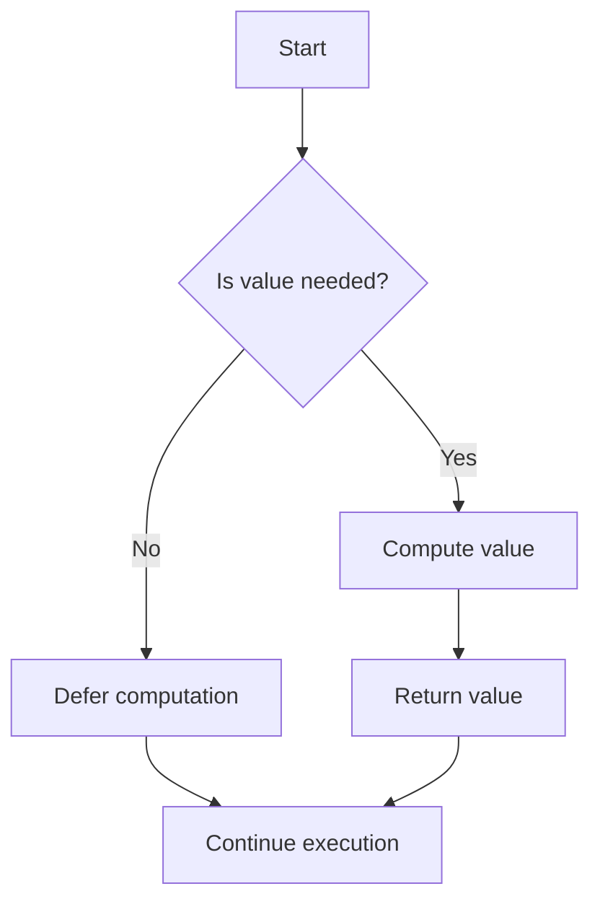

## 7.6 Lazy Evaluation and Streams

In the realm of functional programming, lazy evaluation and streams are powerful concepts that can significantly enhance the efficiency and scalability of your applications. In this section, we will delve into these concepts, explore their implementation in Haxe, and provide practical examples to illustrate their use.

### Understanding Lazy Evaluation

**Lazy evaluation** is a technique where computation is deferred until the result is actually needed. This can lead to performance improvements by avoiding unnecessary calculations and can enable the creation of infinite data structures.

#### Key Benefits of Lazy Evaluation

- **Performance Optimization:** By deferring computation, we can avoid unnecessary calculations, leading to more efficient code execution.
- **Memory Efficiency:** Lazy evaluation can help reduce memory usage by only computing values when they are needed.
- **Infinite Data Structures:** It allows the creation of data structures that can conceptually be infinite, such as streams or lists, without consuming infinite memory.

### Implementing Lazy Evaluation in Haxe

Haxe provides several ways to implement lazy evaluation, including the use of `Lazy<T>` and custom lazy implementations.

#### Using `Lazy<T>`

Haxe's `Lazy<T>` is a built-in construct that allows for deferred computation. Here's how you can use it:

```haxe
class LazyExample {
    static function main() {
        // Define a lazy variable
        var lazyValue:Lazy<Int> = new Lazy(() -> {
            trace("Computing value...");
            return 42;
        });

        // The computation is deferred until the value is accessed
        trace("Before accessing lazyValue");
        trace("Lazy value: " + lazyValue.get());
        trace("After accessing lazyValue");
    }
}
```

**Explanation:**
- The `Lazy` class takes a function that computes the value.
- The computation is deferred until `get()` is called on the lazy variable.

#### Custom Lazy Implementations

You can also create custom lazy implementations to suit specific needs. Here's a simple example:

```haxe
class CustomLazy<T> {
    private var value:T;
    private var computed:Bool = false;
    private var compute:Void -> T;

    public function new(compute:Void -> T) {
        this.compute = compute;
    }

    public function get():T {
        if (!computed) {
            value = compute();
            computed = true;
        }
        return value;
    }
}

class CustomLazyExample {
    static function main() {
        var lazyValue = new CustomLazy(() -> {
            trace("Computing custom lazy value...");
            return 100;
        });

        trace("Before accessing custom lazy value");
        trace("Custom lazy value: " + lazyValue.get());
        trace("After accessing custom lazy value");
    }
}
```

**Explanation:**
- The `CustomLazy` class encapsulates the logic for lazy evaluation.
- The `get()` method checks if the value has been computed; if not, it computes and caches the result.

### Streams in Haxe

**Streams** represent potentially infinite sequences of data. They are particularly useful for handling large datasets or continuous data flows without loading everything into memory at once.

#### Implementing Streams with Generators

Haxe supports generators, which can be used to create streams. Here's a basic example:

```haxe
class StreamExample {
    static function main() {
        // Define a generator function
        function numbers():Generator<Int> {
            return Generator.create((yield) -> {
                var i = 0;
                while (true) {
                    yield(i++);
                }
            });
        }

        // Create a stream of numbers
        var numberStream = numbers();

        // Access the first 5 numbers in the stream
        for (i in 0...5) {
            trace("Number: " + numberStream.next());
        }
    }
}
```

**Explanation:**
- The `Generator.create` function is used to define a generator that yields an infinite sequence of numbers.
- The `next()` method retrieves the next value from the stream.

### Use Cases for Lazy Evaluation and Streams

#### Performance Optimization

Lazy evaluation can be used to optimize performance by avoiding unnecessary computations. For example, in a complex calculation pipeline, you can defer expensive operations until their results are actually needed.

#### Infinite Data Structures

Streams allow you to work with infinite data structures, such as infinite lists or sequences. This is particularly useful in scenarios where you need to process data on-the-fly, such as real-time data processing or handling large datasets.

### Visualizing Lazy Evaluation and Streams

To better understand how lazy evaluation and streams work, let's visualize the flow of data and computation:



**Diagram Explanation:**
- The flowchart illustrates the decision-making process in lazy evaluation.
- Computation is deferred until the value is needed, optimizing performance and resource usage.

### Try It Yourself

Experiment with the code examples provided. Try modifying the lazy evaluation and stream implementations to suit different scenarios. For instance, create a stream that generates Fibonacci numbers or implement a lazy evaluation for a complex mathematical function.

### References and Further Reading

- [Haxe Manual: Lazy Evaluation](https://haxe.org/manual/std-Lazy.html)
- [Functional Programming in Haxe](https://haxe.org/manual/lf-functional.html)
- [Generators in Haxe](https://haxe.org/manual/std-Generator.html)

### Knowledge Check

- What are the benefits of lazy evaluation?
- How can streams be used to handle infinite data structures?
- Implement a custom lazy evaluation for a function that calculates factorials.

### Embrace the Journey

Remember, mastering lazy evaluation and streams is just the beginning. As you progress, you'll discover more ways to optimize and enhance your applications using these powerful concepts. Keep experimenting, stay curious, and enjoy the journey!

## Quiz Time!



### What is lazy evaluation?

- [x] Deferring computation until the result is needed
- [ ] Performing all computations upfront
- [ ] A method of eager computation
- [ ] A type of data structure

> **Explanation:** Lazy evaluation defers computation until the result is actually needed, optimizing performance and resource usage.

### Which Haxe construct is used for lazy evaluation?

- [x] Lazy<T>
- [ ] Eager<T>
- [ ] Deferred<T>
- [ ] Immediate<T>

> **Explanation:** Haxe provides the `Lazy<T>` construct for implementing lazy evaluation.

### What is a key benefit of lazy evaluation?

- [x] Performance optimization
- [ ] Increased memory usage
- [ ] Immediate computation
- [ ] Reduced code readability

> **Explanation:** Lazy evaluation optimizes performance by avoiding unnecessary computations.

### How are streams typically implemented in Haxe?

- [x] Using generators
- [ ] Using arrays
- [ ] Using lists
- [ ] Using maps

> **Explanation:** Streams in Haxe are typically implemented using generators, which allow for the creation of infinite sequences.

### What is a common use case for streams?

- [x] Handling infinite data structures
- [ ] Storing static data
- [ ] Immediate data processing
- [ ] Reducing code complexity

> **Explanation:** Streams are commonly used to handle infinite data structures, allowing for efficient data processing.

### What does the `next()` method do in a stream?

- [x] Retrieves the next value from the stream
- [ ] Initializes the stream
- [ ] Closes the stream
- [ ] Resets the stream

> **Explanation:** The `next()` method retrieves the next value from the stream, allowing for sequential data access.

### How can lazy evaluation improve memory efficiency?

- [x] By computing values only when needed
- [ ] By storing all values upfront
- [ ] By duplicating data
- [ ] By using more memory

> **Explanation:** Lazy evaluation improves memory efficiency by computing values only when they are needed, reducing unnecessary memory usage.

### What is a generator in Haxe?

- [x] A construct for creating streams
- [ ] A type of array
- [ ] A method for eager computation
- [ ] A static data structure

> **Explanation:** A generator in Haxe is a construct used for creating streams, allowing for the generation of infinite sequences.

### What is a potential pitfall of lazy evaluation?

- [x] Delayed computation can lead to unexpected performance issues
- [ ] Immediate computation is always better
- [ ] It increases memory usage
- [ ] It simplifies code

> **Explanation:** While lazy evaluation optimizes performance, delayed computation can sometimes lead to unexpected performance issues if not managed carefully.

### True or False: Streams can only handle finite data.

- [ ] True
- [x] False

> **Explanation:** Streams are designed to handle potentially infinite data sequences, making them suitable for continuous data flows.


