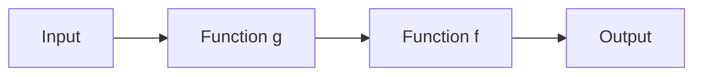

## 7.7 Function Composition and Pipelines

In the realm of functional programming, function composition and pipelines are powerful techniques that allow developers to build complex operations by combining simpler functions. In Haxe, these patterns are particularly useful due to the language's support for both functional and object-oriented paradigms, making it a versatile tool for cross-platform development. In this section, we will explore the concepts of function composition and pipelines, demonstrate how to implement them in Haxe, and discuss their practical applications.

### Understanding Function Composition

**Function Composition** is the process of combining two or more functions to produce a new function. The output of one function becomes the input of the next. This technique promotes code reusability and modularity, allowing developers to build complex operations from simple, well-defined functions.

#### Key Concepts

- **Composable Functions:** Functions that can be combined in a sequence where the output of one function is the input of the next.
- **Higher-Order Functions:** Functions that take other functions as arguments or return them as results, which are essential for function composition.
- **Point-Free Style:** A style of defining functions where the arguments are not explicitly mentioned, often used in function composition.

#### Implementing Function Composition in Haxe

To implement function composition in Haxe, we can define a utility function that takes two functions as arguments and returns a new function representing their composition.

```haxe
// Define a function to compose two functions
function compose<A, B, C>(f: B -> C, g: A -> B): A -> C {
    return function(x: A): C {
        return f(g(x));
    }
}

// Example functions
function double(x: Int): Int {
    return x * 2;
}

function increment(x: Int): Int {
    return x + 1;
}

// Compose functions
var doubleThenIncrement = compose(increment, double);

// Test the composed function
trace(doubleThenIncrement(3)); // Output: 7
```

In this example, we define a `compose` function that takes two functions, `f` and `g`, and returns a new function that applies `g` to its input and then `f` to the result. We then compose `double` and `increment` to create a new function `doubleThenIncrement`.

### Visualizing Function Composition

To better understand function composition, let's visualize the process using a flowchart.



In this diagram, the input is first processed by function `g`, and the result is then passed to function `f`, producing the final output.

### Pipelines in Haxe

**Pipelines** are a way to chain multiple functions together, where the output of one function is passed as the input to the next. This pattern is similar to function composition but often involves a sequence of operations on data.

#### Implementing Pipelines in Haxe

Haxe does not have built-in support for pipelines like some other languages, but we can achieve similar functionality using a combination of function composition and chaining.

```haxe
// Define a pipeline function
function pipeline<T>(value: T, functions: Array<T -> T>): T {
    for (f in functions) {
        value = f(value);
    }
    return value;
}

// Example functions
function square(x: Int): Int {
    return x * x;
}

function halve(x: Int): Int {
    return x / 2;
}

// Create a pipeline
var result = pipeline(4, [double, square, halve]);

trace(result); // Output: 16
```

In this example, we define a `pipeline` function that takes an initial value and an array of functions. It applies each function in sequence to the value, returning the final result.

### Use Cases for Function Composition and Pipelines

Function composition and pipelines are particularly useful in scenarios where data needs to be processed through multiple steps or when designing modular systems.

#### Data Processing Pipelines

In data processing, pipelines can be used to transform data through a series of operations. This approach is common in data analysis, where raw data is cleaned, transformed, and analyzed.

```haxe
// Example data processing pipeline
function cleanData(data: String): String {
    return data.trim().toLowerCase();
}

function transformData(data: String): Array<String> {
    return data.split(" ");
}

function analyzeData(data: Array<String>): Int {
    return data.length;
}

var dataPipeline = pipeline("  Hello World  ", [cleanData, transformData, analyzeData]);

trace(dataPipeline); // Output: 2
```

In this example, we define a data processing pipeline that cleans, transforms, and analyzes a string of data.

#### Modular Design

Function composition and pipelines promote modular design by allowing developers to break down complex functions into simpler, reusable components. This approach enhances code readability and maintainability.

### Try It Yourself

Experiment with the code examples provided by modifying the functions and observing the changes in output. Try creating your own pipelines and composed functions to process different types of data.

### Design Considerations

When using function composition and pipelines in Haxe, consider the following:

- **Function Purity:** Ensure that functions used in composition are pure, meaning they do not have side effects. This guarantees predictable behavior.
- **Error Handling:** Implement error handling within pipelines to manage exceptions and ensure robustness.
- **Performance:** Be mindful of performance implications, especially when composing a large number of functions or processing large datasets.

### Differences and Similarities

Function composition and pipelines are often confused with each other, but they have distinct differences:

- **Function Composition:** Focuses on combining two or more functions into a single function.
- **Pipelines:** Emphasize chaining a sequence of operations on data.

Both patterns share the goal of creating modular, reusable code and can be used together to achieve complex data transformations.

### Further Reading

For more information on function composition and pipelines, consider exploring the following resources:

- [MDN Web Docs on Function Composition](https://developer.mozilla.org/en-US/docs/Web/JavaScript/Guide/Functions)
- [Functional Programming in Haxe](https://haxe.org/manual/lf-functional.html)

### Knowledge Check

To reinforce your understanding of function composition and pipelines, try answering the following questions:

## Quiz Time!



### What is function composition?

- [x] Combining two or more functions where the output of one becomes the input of another
- [ ] A method of chaining functions using intermediate data
- [ ] A way to define functions without arguments
- [ ] A technique for optimizing performance

> **Explanation:** Function composition involves combining functions such that the output of one function becomes the input of the next.

### What is a key benefit of using pipelines?

- [x] They allow for chaining multiple operations on data
- [ ] They eliminate the need for error handling
- [ ] They automatically optimize code performance
- [ ] They replace the need for function composition

> **Explanation:** Pipelines enable chaining multiple operations on data, making complex transformations easier to manage.

### How can you implement function composition in Haxe?

- [x] By defining a utility function that combines two functions
- [ ] By using built-in Haxe pipeline operators
- [ ] By writing functions without arguments
- [ ] By using macros to generate code

> **Explanation:** Function composition in Haxe can be implemented by defining a utility function that combines two functions.

### What is a common use case for pipelines?

- [x] Data processing through multiple steps
- [ ] Compiling code to multiple targets
- [ ] Managing dependencies in Haxe projects
- [ ] Handling exceptions in asynchronous code

> **Explanation:** Pipelines are commonly used for processing data through multiple steps, such as in data analysis.

### Which style is often used in function composition?

- [x] Point-Free Style
- [ ] Object-Oriented Style
- [ ] Imperative Style
- [ ] Procedural Style

> **Explanation:** Point-Free Style is often used in function composition, where functions are defined without explicitly mentioning arguments.

### What should you consider when using function composition?

- [x] Ensure functions are pure and have no side effects
- [ ] Avoid using higher-order functions
- [ ] Use macros to optimize performance
- [ ] Always use object-oriented principles

> **Explanation:** When using function composition, ensure that functions are pure and have no side effects to guarantee predictable behavior.

### How can you handle errors in pipelines?

- [x] Implement error handling within the pipeline functions
- [ ] Ignore exceptions and focus on performance
- [ ] Use macros to catch errors
- [ ] Avoid using pipelines in error-prone code

> **Explanation:** Implementing error handling within pipeline functions ensures robustness and manages exceptions effectively.

### What is a similarity between function composition and pipelines?

- [x] Both aim to create modular, reusable code
- [ ] Both eliminate the need for error handling
- [ ] Both are used exclusively in object-oriented programming
- [ ] Both automatically optimize code performance

> **Explanation:** Both function composition and pipelines aim to create modular, reusable code, enhancing maintainability.

### What is the output of the following composed function: `compose(increment, double)(3)`?

- [x] 7
- [ ] 6
- [ ] 8
- [ ] 9

> **Explanation:** The composed function first doubles the input (3 * 2 = 6) and then increments the result (6 + 1 = 7).

### True or False: Pipelines in Haxe are built-in language features.

- [ ] True
- [x] False

> **Explanation:** Pipelines are not built-in features in Haxe, but can be implemented using function composition and chaining.



Remember, mastering function composition and pipelines is just the beginning. As you continue to explore Haxe's functional programming capabilities, you'll discover even more ways to write clean, efficient, and maintainable code. Keep experimenting, stay curious, and enjoy the journey!
