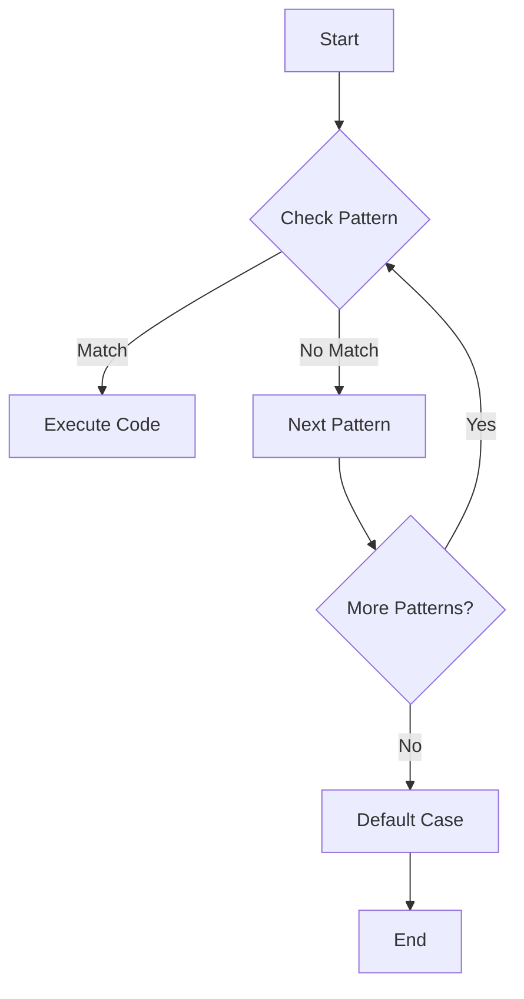

## 7.8 Pattern Matching in Functional Programming

Pattern matching is a powerful feature in functional programming that allows developers to check a value against a pattern. It simplifies complex conditional logic and data extraction, making code more readable and maintainable. In Haxe, pattern matching is implemented using the `switch` statement, which offers a robust mechanism for handling various data types and structures.

### Understanding Pattern Matching

Pattern matching is akin to a more powerful and flexible version of the traditional `switch` or `if-else` statements found in many programming languages. It allows you to match complex data structures, deconstruct them, and execute code based on the structure and content of the data.

#### Key Concepts

- **Patterns:** These are templates that describe the shape and content of data you want to match against.
- **Deconstruction:** This involves breaking down complex data structures into their constituent parts.
- **Guards:** These are additional conditions that must be satisfied for a pattern to match.

### Implementing Pattern Matching in Haxe

Haxe provides a robust `switch` statement that supports pattern matching. This feature allows you to match against various data types, including enums, classes, and basic types.

#### Pattern Matching with `switch`

The `switch` statement in Haxe is more powerful than in many other languages. It allows you to match on types, values, and even deconstruct data structures.

```haxe
class Main {
    static function main() {
        var value = 42;
        
        switch (value) {
            case 0:
                trace("Zero");
            case 1:
                trace("One");
            case 2...10:
                trace("Between two and ten");
            case _:
                trace("Something else");
        }
    }
}
```

In this example, the `switch` statement matches the integer `value` against several patterns. The underscore `_` acts as a wildcard, matching any value not explicitly handled by other cases.

#### Deconstruction

Deconstruction is a powerful feature of pattern matching that allows you to extract values from complex data structures directly within a `switch` statement.

```haxe
enum Shape {
    Circle(radius: Float);
    Rectangle(width: Float, height: Float);
}

class Main {
    static function main() {
        var shape: Shape = Shape.Circle(5.0);
        
        switch (shape) {
            case Circle(radius):
                trace("Circle with radius: " + radius);
            case Rectangle(width, height):
                trace("Rectangle with width: " + width + " and height: " + height);
        }
    }
}
```

In this example, the `Shape` enum is deconstructed within the `switch` statement, allowing direct access to the `radius`, `width`, and `height` values.

### Use Cases for Pattern Matching

Pattern matching is particularly useful in scenarios where you need to simplify complex conditional logic or extract data from structured data types.

#### Conditional Logic

Pattern matching can replace complex `if-else` chains, making your code cleaner and more intuitive.

```haxe
class Main {
    static function main() {
        var score = 85;
        
        switch (score) {
            case 90...100:
                trace("Excellent");
            case 75...89:
                trace("Good");
            case 50...74:
                trace("Average");
            case _:
                trace("Needs Improvement");
        }
    }
}
```

This example demonstrates how pattern matching can simplify the logic for grading scores.

#### Data Extraction

Pattern matching is ideal for extracting data from complex structures, such as nested objects or collections.

```haxe
typedef Person = {
    name: String,
    age: Int,
    address: { city: String, zip: String }
};

class Main {
    static function main() {
        var person: Person = { name: "Alice", age: 30, address: { city: "Wonderland", zip: "12345" } };
        
        switch (person) {
            case { name, age, address: { city, zip } }:
                trace("Name: " + name + ", Age: " + age + ", City: " + city + ", Zip: " + zip);
        }
    }
}
```

Here, the `switch` statement deconstructs the `Person` typedef, allowing easy access to nested fields.

### Advanced Pattern Matching Techniques

Haxe's pattern matching capabilities extend beyond basic usage, offering advanced techniques for more complex scenarios.

#### Using Guards

Guards are additional conditions that can be used within a pattern to refine matches.

```haxe
class Main {
    static function main() {
        var number = 42;
        
        switch (number) {
            case n if n % 2 == 0:
                trace("Even number");
            case _:
                trace("Odd number");
        }
    }
}
```

In this example, a guard is used to check if a number is even before matching the pattern.

#### Matching Complex Data Structures

Pattern matching can handle complex data structures, such as nested enums or collections.

```haxe
enum Tree {
    Leaf(value: Int);
    Node(left: Tree, right: Tree);
}

class Main {
    static function main() {
        var tree: Tree = Node(Leaf(1), Node(Leaf(2), Leaf(3)));
        
        switch (tree) {
            case Leaf(value):
                trace("Leaf with value: " + value);
            case Node(left, right):
                trace("Node with left and right subtrees");
        }
    }
}
```

This example demonstrates pattern matching on a recursive data structure, allowing you to traverse and process trees efficiently.

### Visualizing Pattern Matching

To better understand pattern matching, let's visualize the process using a flowchart.



This flowchart illustrates the decision-making process in pattern matching, where each pattern is checked sequentially until a match is found or the default case is executed.

### Try It Yourself

Experiment with the code examples provided by modifying the patterns and data structures. Try adding new cases, using guards, or matching different data types to see how pattern matching can simplify your code.

### References and Further Reading

- [Haxe Manual: Pattern Matching](https://haxe.org/manual/lf-pattern-matching.html)
- [MDN Web Docs: Switch Statement](https://developer.mozilla.org/en-US/docs/Web/JavaScript/Reference/Statements/switch)
- [Functional Programming in Haxe](https://haxe.org/manual/lf-functional.html)

### Knowledge Check

- What is pattern matching, and how does it differ from traditional `switch` statements?
- How can pattern matching simplify conditional logic in your code?
- What are guards, and how are they used in pattern matching?
- How does deconstruction work in pattern matching?

### Embrace the Journey

Remember, mastering pattern matching is just one step in your journey to becoming an expert Haxe developer. Keep experimenting, stay curious, and enjoy the process of learning and applying new concepts.

## Quiz Time!



### What is pattern matching in functional programming?

- [x] A mechanism to check a value against a pattern
- [ ] A way to iterate over collections
- [ ] A method for sorting data
- [ ] A technique for optimizing performance

> **Explanation:** Pattern matching is a mechanism to check a value against a pattern, allowing for more readable and maintainable code.

### How is pattern matching implemented in Haxe?

- [x] Using the `switch` statement
- [ ] Using the `if-else` statement
- [ ] Using the `for` loop
- [ ] Using the `while` loop

> **Explanation:** In Haxe, pattern matching is implemented using the `switch` statement, which supports matching on types, values, and deconstructing data structures.

### What is deconstruction in pattern matching?

- [x] Extracting values from complex data structures
- [ ] Combining multiple values into a single structure
- [ ] Sorting data in a specific order
- [ ] Filtering data based on a condition

> **Explanation:** Deconstruction involves breaking down complex data structures into their constituent parts, allowing for easy access to nested values.

### What is the purpose of guards in pattern matching?

- [x] To add additional conditions for a pattern to match
- [ ] To optimize the performance of pattern matching
- [ ] To sort patterns in a specific order
- [ ] To combine multiple patterns into one

> **Explanation:** Guards are additional conditions that must be satisfied for a pattern to match, providing more control over the matching process.

### Which of the following is a use case for pattern matching?

- [x] Simplifying conditional logic
- [x] Extracting data from complex structures
- [ ] Sorting data
- [ ] Optimizing performance

> **Explanation:** Pattern matching is useful for simplifying conditional logic and extracting data from complex structures, making code more readable and maintainable.

### How can pattern matching replace complex `if-else` chains?

- [x] By providing a more readable and concise syntax
- [ ] By optimizing the performance of the code
- [ ] By sorting the conditions in a specific order
- [ ] By filtering out unnecessary conditions

> **Explanation:** Pattern matching provides a more readable and concise syntax, making it easier to understand and maintain than complex `if-else` chains.

### What is the role of the underscore `_` in pattern matching?

- [x] It acts as a wildcard, matching any value
- [ ] It indicates the end of a pattern
- [ ] It is used to sort patterns
- [ ] It optimizes the performance of pattern matching

> **Explanation:** The underscore `_` acts as a wildcard in pattern matching, matching any value not explicitly handled by other cases.

### Can pattern matching handle recursive data structures?

- [x] Yes
- [ ] No

> **Explanation:** Pattern matching can handle recursive data structures, allowing for efficient traversal and processing of complex data types.

### What is the benefit of using pattern matching for data extraction?

- [x] It simplifies access to parts of a data structure
- [ ] It optimizes the performance of data extraction
- [ ] It sorts data in a specific order
- [ ] It filters out unnecessary data

> **Explanation:** Pattern matching simplifies access to parts of a data structure, making it easier to work with complex data types.

### Is pattern matching exclusive to functional programming languages?

- [ ] True
- [x] False

> **Explanation:** While pattern matching is a common feature in functional programming languages, it is not exclusive to them and can be found in other languages as well.


