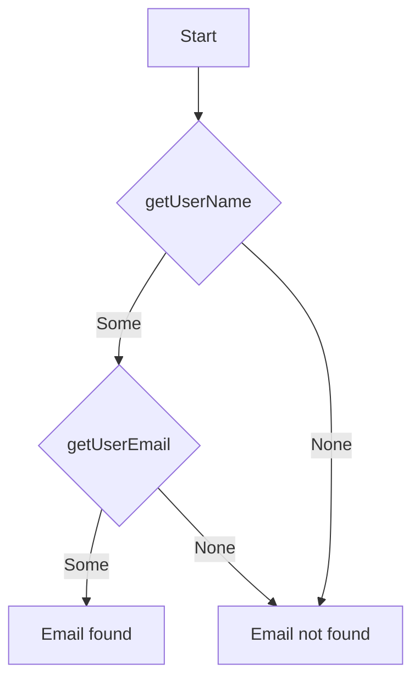
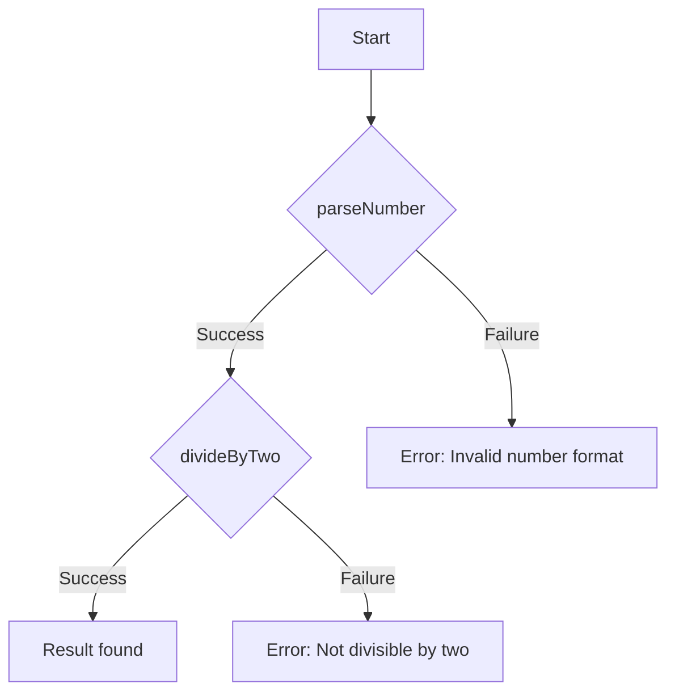

## 7.9 Functional Error Handling Techniques

In the realm of software development, error handling is a crucial aspect that ensures robustness and reliability. Traditional error handling mechanisms, such as exceptions, can often lead to complex and hard-to-maintain code. Functional programming offers an alternative approach that emphasizes explicit and composable error handling. In this section, we will explore functional error handling techniques in Haxe, focusing on the use of Option and Result types to manage errors effectively.

### Understanding Functional Error Handling

Functional error handling involves using functional constructs to manage errors instead of relying on exceptions. This approach encourages developers to handle errors explicitly, making the code more predictable and easier to understand. By using functional constructs, we can compose operations and handle errors in a more declarative manner.

#### Key Concepts

- **Option Types:** Represent values that may or may not exist.
- **Result Types:** Represent success or failure, often using a type like `Either<L, R>`.

### Implementing Functional Error Handling in Haxe

Haxe, with its multi-paradigm support, provides powerful constructs for implementing functional error handling. Let's delve into how we can use Option and Result types in Haxe to manage errors effectively.

#### Option Types in Haxe

The `Option<T>` type is a common functional construct used to represent a value that may or may not exist. It is similar to the `Optional` type in other languages. In Haxe, we can define an `Option` type as follows:

```haxe
enum Option<T> {
    Some(value: T);
    None;
}
```

- **Some:** Represents a value that exists.
- **None:** Represents the absence of a value.

##### Using Option Types

Let's consider a simple example where we use `Option<T>` to handle a potential null value:

```haxe
class OptionExample {
    static function findUserById(id: Int): Option<String> {
        var users = ["Alice", "Bob", "Charlie"];
        if (id >= 0 && id < users.length) {
            return Some(users[id]);
        } else {
            return None;
        }
    }

    static function main() {
        var user = findUserById(1);
        switch (user) {
            case Some(name):
                trace("User found: " + name);
            case None:
                trace("User not found.");
        }
    }
}
```

In this example, the `findUserById` function returns an `Option<String>`, indicating that the user may or may not be found. We use pattern matching to handle both cases explicitly.

#### Result Types in Haxe

The `Result` type is used to represent the outcome of an operation that can either succeed or fail. It is often implemented using a type like `Either<L, R>`, where `L` represents the error type and `R` represents the success type.

```haxe
enum Result<L, R> {
    Success(value: R);
    Failure(error: L);
}
```

- **Success:** Represents a successful operation with a result.
- **Failure:** Represents a failed operation with an error.

##### Using Result Types

Consider an example where we use `Result<L, R>` to handle a division operation that can fail if the divisor is zero:

```haxe
class ResultExample {
    static function divide(a: Float, b: Float): Result<String, Float> {
        if (b == 0) {
            return Failure("Division by zero error");
        } else {
            return Success(a / b);
        }
    }

    static function main() {
        var result = divide(10, 0);
        switch (result) {
            case Success(value):
                trace("Result: " + value);
            case Failure(error):
                trace("Error: " + error);
        }
    }
}
```

In this example, the `divide` function returns a `Result<String, Float>`, allowing us to handle both success and failure cases explicitly.

### Benefits of Functional Error Handling

Functional error handling offers several advantages over traditional exception-based error handling:

- **Explicit Error Handling:** Errors are handled where they occur, making the code more predictable and easier to understand.
- **Composability:** Operations can be chained together without the need for try-catch blocks, resulting in cleaner and more maintainable code.
- **Type Safety:** The use of types like `Option` and `Result` ensures that errors are handled explicitly, reducing the risk of runtime errors.

### Composing Operations with Functional Error Handling

One of the key benefits of functional error handling is the ability to compose operations. Let's explore how we can chain operations using `Option` and `Result` types.

#### Chaining Operations with Option Types

Consider a scenario where we need to perform multiple operations that may or may not succeed. We can use `Option` types to chain these operations together:

```haxe
class OptionChainingExample {
    static function getUserName(id: Int): Option<String> {
        var users = ["Alice", "Bob", "Charlie"];
        return if (id >= 0 && id < users.length) Some(users[id]) else None;
    }

    static function getUserEmail(name: String): Option<String> {
        var emails = ["alice@example.com", "bob@example.com", "charlie@example.com"];
        var index = ["Alice", "Bob", "Charlie"].indexOf(name);
        return if (index != -1) Some(emails[index]) else None;
    }

    static function main() {
        var email = getUserName(1).flatMap(getUserEmail);
        switch (email) {
            case Some(email):
                trace("Email: " + email);
            case None:
                trace("Email not found.");
        }
    }
}
```

In this example, we use the `flatMap` function to chain the `getUserName` and `getUserEmail` operations, handling the absence of a value at each step.

#### Chaining Operations with Result Types

Similarly, we can chain operations using `Result` types:

```haxe
class ResultChainingExample {
    static function parseNumber(input: String): Result<String, Int> {
        try {
            return Success(Std.parseInt(input));
        } catch (e: Dynamic) {
            return Failure("Invalid number format");
        }
    }

    static function divideByTwo(number: Int): Result<String, Float> {
        if (number % 2 != 0) {
            return Failure("Number is not divisible by two");
        } else {
            return Success(number / 2);
        }
    }

    static function main() {
        var result = parseNumber("4").flatMap(divideByTwo);
        switch (result) {
            case Success(value):
                trace("Result: " + value);
            case Failure(error):
                trace("Error: " + error);
        }
    }
}
```

Here, we use the `flatMap` function to chain the `parseNumber` and `divideByTwo` operations, handling errors at each step.

### Visualizing Functional Error Handling

To better understand how functional error handling works, let's visualize the flow of operations using Mermaid.js diagrams.

#### Option Type Flow



This diagram illustrates the flow of operations when using `Option` types to chain `getUserName` and `getUserEmail`.

#### Result Type Flow



This diagram shows the flow of operations when using `Result` types to chain `parseNumber` and `divideByTwo`.

### Try It Yourself

Now that we've explored functional error handling techniques in Haxe, it's time to experiment with the code examples. Try modifying the examples to handle different types of errors or chain additional operations. This hands-on experience will deepen your understanding of functional error handling.

### References and Further Reading

For more information on functional programming and error handling, consider exploring the following resources:

- [MDN Web Docs: Error Handling](https://developer.mozilla.org/en-US/docs/Web/JavaScript/Guide/Control_flow_and_error_handling)
- [Haxe Manual: Enums](https://haxe.org/manual/types-enum.html)
- [Functional Programming in Haxe](https://haxe.org/manual/lf-functional.html)

### Knowledge Check

Before we conclude, let's reinforce our understanding of functional error handling techniques in Haxe with a few questions and exercises.

- **Question:** What are the key differences between `Option` and `Result` types?
- **Exercise:** Implement a function that reads a file and returns its content using `Result<String, String>` to handle potential errors.

### Embrace the Journey

Remember, mastering functional error handling is a journey. As you continue to explore and experiment with these techniques, you'll gain a deeper understanding of how to write robust and maintainable code. Keep experimenting, stay curious, and enjoy the journey!

## Quiz Time!



### What is the primary advantage of using functional error handling over traditional exception-based error handling?

- [x] Explicit error handling
- [ ] Faster execution
- [ ] Less code
- [ ] Automatic error resolution

> **Explanation:** Functional error handling encourages explicit handling of errors, making the code more predictable and easier to understand.

### Which Haxe type is used to represent a value that may or may not exist?

- [x] Option<T>
- [ ] Result<L, R>
- [ ] Either<L, R>
- [ ] Nullable<T>

> **Explanation:** The `Option<T>` type is used to represent a value that may or may not exist.

### In Haxe, what does the `Some` constructor of the `Option` type represent?

- [x] A value that exists
- [ ] The absence of a value
- [ ] An error
- [ ] A null value

> **Explanation:** The `Some` constructor represents a value that exists in the `Option` type.

### What is the purpose of the `Result` type in Haxe?

- [x] To represent success or failure of an operation
- [ ] To handle null values
- [ ] To manage memory
- [ ] To optimize performance

> **Explanation:** The `Result` type is used to represent the success or failure of an operation.

### How can we chain operations using `Option` types in Haxe?

- [x] Using the `flatMap` function
- [ ] Using the `map` function
- [ ] Using the `filter` function
- [ ] Using the `reduce` function

> **Explanation:** The `flatMap` function is used to chain operations with `Option` types.

### Which of the following is a benefit of using functional error handling?

- [x] Composability
- [ ] Automatic error resolution
- [ ] Reduced code size
- [ ] Faster execution

> **Explanation:** Functional error handling allows for composability, enabling operations to be chained together without try-catch blocks.

### What does the `Failure` constructor of the `Result` type represent?

- [x] A failed operation with an error
- [ ] A successful operation with a result
- [ ] The absence of a value
- [ ] A null value

> **Explanation:** The `Failure` constructor represents a failed operation with an error in the `Result` type.

### Which function is used to handle both success and failure cases in a `Result` type?

- [x] switch
- [ ] try-catch
- [ ] if-else
- [ ] while

> **Explanation:** The `switch` statement is used to handle both success and failure cases in a `Result` type.

### What is the key difference between `Option` and `Result` types?

- [x] `Option` represents presence or absence of a value, while `Result` represents success or failure of an operation
- [ ] `Option` is faster than `Result`
- [ ] `Result` is more memory efficient than `Option`
- [ ] `Option` is used for error handling, while `Result` is not

> **Explanation:** `Option` represents the presence or absence of a value, while `Result` represents the success or failure of an operation.

### True or False: Functional error handling in Haxe can reduce the need for try-catch blocks.

- [x] True
- [ ] False

> **Explanation:** Functional error handling allows for explicit error handling and composability, reducing the need for try-catch blocks.


