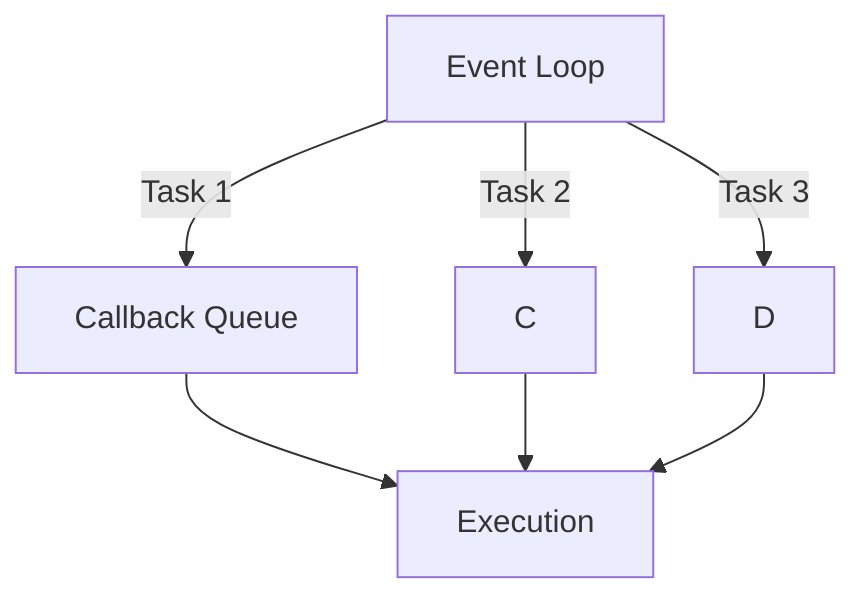
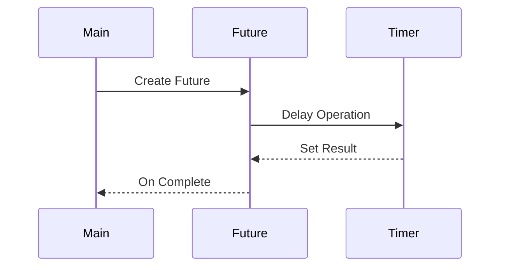

## 8.1 Concurrency Models in Haxe

Concurrency is a fundamental aspect of modern software development, enabling applications to perform multiple tasks simultaneously. In this section, we will delve into the concurrency models supported by Haxe, a versatile language known for its cross-platform capabilities. We will explore how Haxe handles concurrency across different targets, such as JavaScript, C#, and Java, and provide practical guidance on implementing efficient asynchronous patterns.

### Understanding Platform Capabilities

Haxe is a powerful language that compiles to multiple targets, each with its own concurrency model. Understanding the concurrency capabilities of these platforms is crucial for writing efficient and portable code.

#### JavaScript

JavaScript is single-threaded and relies on an event-driven, non-blocking I/O model. Concurrency is achieved through asynchronous programming using callbacks, promises, and async/await syntax.

#### C#

C# supports multithreading through the .NET framework, offering rich concurrency primitives such as tasks, threads, and asynchronous programming with async/await.

#### Java

Java provides robust concurrency support with its threading model, offering features like the `java.util.concurrent` package, which includes thread pools, futures, and other concurrency utilities.

#### Python

Python's concurrency model includes threading, multiprocessing, and asynchronous programming with the `asyncio` library. However, the Global Interpreter Lock (GIL) can limit true parallelism in multi-threaded programs.

### Platform Limitations

While Haxe provides a unified syntax, not all concurrency features are available across all targets. For instance, JavaScript does not support true multithreading, whereas C# and Java do. It's essential to consider these limitations when designing cross-platform applications.

### Concurrency Abstractions

To write platform-agnostic code, Haxe developers can use concurrency abstractions that work across multiple targets. These abstractions help manage asynchronous tasks without relying on platform-specific features.

#### Futures and Promises

Futures and promises are abstractions that represent a value that may not yet be available. They are widely used in asynchronous programming to handle operations that will complete in the future.

```haxe
import haxe.concurrent.Future;

class Main {
    static function main() {
        var future = new Future<String>();
        
        // Simulate an asynchronous operation
        haxe.Timer.delay(() -> {
            future.setResult("Hello, Haxe!");
        }, 1000);
        
        future.onComplete(result -> {
            trace(result); // Outputs: Hello, Haxe!
        });
    }
}
```

In this example, we create a `Future` object that will eventually hold a string value. We simulate an asynchronous operation using `haxe.Timer.delay` and set the result of the future once the operation completes.

#### Async/Await

Haxe supports async/await syntax, which simplifies asynchronous programming by allowing developers to write asynchronous code in a synchronous style.

```haxe
import haxe.concurrent.Promise;

class Main {
    static function main() {
        asyncFunction().handle(result -> {
            trace(result); // Outputs: Hello, Async/Await!
        });
    }
    
    static function asyncFunction():Promise<String> {
        return new Promise((resolve, reject) -> {
            haxe.Timer.delay(() -> {
                resolve("Hello, Async/Await!");
            }, 1000);
        });
    }
}
```

In this example, `asyncFunction` returns a `Promise` that resolves after a delay. The `handle` method is used to process the result once the promise is fulfilled.

### Concurrency Models in Haxe

Let's explore the concurrency models available in Haxe for different targets, focusing on their unique features and limitations.

#### JavaScript Concurrency Model

JavaScript's concurrency model is based on the event loop, which processes events and executes callback functions. This model is non-blocking, allowing JavaScript to handle multiple tasks concurrently without multithreading.



**Diagram Description:** The event loop processes tasks from the callback queue, executing them one at a time.

JavaScript's concurrency model is well-suited for I/O-bound tasks, such as network requests and file operations. However, it may not be ideal for CPU-intensive tasks due to its single-threaded nature.

#### C# Concurrency Model

C# provides a comprehensive concurrency model with support for multithreading, asynchronous programming, and parallel processing. The `Task` class and async/await syntax are commonly used for managing asynchronous operations.

```haxe
using System;
using System.Threading.Tasks;

class Main {
    static async Task Main() {
        string result = await AsyncFunction();
        Console.WriteLine(result); // Outputs: Hello, C# Async/Await!
    }
    
    static async Task<string> AsyncFunction() {
        await Task.Delay(1000);
        return "Hello, C# Async/Await!";
    }
}
```

In this example, we use the `Task` class to perform an asynchronous operation in C#. The `await` keyword pauses the execution of the method until the task completes.

#### Java Concurrency Model

Java's concurrency model is built around threads and the `java.util.concurrent` package, which provides high-level concurrency utilities. Java supports both multithreading and asynchronous programming.

```haxe
import java.util.concurrent.CompletableFuture;

class Main {
    public static void main(String[] args) {
        CompletableFuture<String> future = asyncFunction();
        future.thenAccept(result -> {
            System.out.println(result); // Outputs: Hello, Java CompletableFuture!
        });
    }
    
    static CompletableFuture<String> asyncFunction() {
        return CompletableFuture.supplyAsync(() -> {
            try {
                Thread.sleep(1000);
            } catch (InterruptedException e) {
                e.printStackTrace();
            }
            return "Hello, Java CompletableFuture!";
        });
    }
}
```

In this example, we use `CompletableFuture` to perform an asynchronous operation in Java. The `supplyAsync` method runs the operation in a separate thread.

### Considerations for Cross-Platform Concurrency

When developing cross-platform applications with Haxe, it's essential to consider the following:

- **Platform Limitations:** Be aware of the concurrency features supported by each target. For example, avoid using threads in JavaScript.
- **Concurrency Abstractions:** Use platform-agnostic abstractions like futures and promises to manage asynchronous tasks.
- **Performance:** Consider the performance implications of different concurrency models, especially for CPU-intensive tasks.
- **Error Handling:** Implement robust error handling for asynchronous operations, as errors may occur at different stages of execution.

### Try It Yourself

To deepen your understanding of concurrency models in Haxe, try modifying the code examples provided in this section. Experiment with different concurrency abstractions and observe how they behave across various targets.

### Visualizing Concurrency in Haxe

To better understand how concurrency works in Haxe, let's visualize the flow of asynchronous operations using a sequence diagram.



**Diagram Description:** This sequence diagram illustrates the flow of an asynchronous operation using a `Future` in Haxe. The `Main` participant creates a `Future`, which delays an operation using a `Timer`. Once the operation completes, the result is set, and the `Future` notifies the `Main` participant.

### References and Links

For further reading on concurrency models and asynchronous programming, consider the following resources:

- [MDN Web Docs: JavaScript Asynchronous Programming](https://developer.mozilla.org/en-US/docs/Learn/JavaScript/Asynchronous)
- [Microsoft Docs: Asynchronous Programming with Async and Await (C#)](https://docs.microsoft.com/en-us/dotnet/csharp/programming-guide/concepts/async/)
- [Oracle Docs: Java Concurrency Utilities](https://docs.oracle.com/javase/8/docs/api/java/util/concurrent/package-summary.html)

### Knowledge Check

To reinforce your understanding of concurrency models in Haxe, consider the following questions:

- What are the key differences between JavaScript's and C#'s concurrency models?
- How can you use futures and promises to manage asynchronous tasks in Haxe?
- What are the limitations of JavaScript's concurrency model, and how can you work around them?

### Embrace the Journey

Concurrency is a complex but rewarding aspect of software development. As you explore concurrency models in Haxe, remember that this is just the beginning. Keep experimenting, stay curious, and enjoy the journey of mastering cross-platform asynchronous patterns.

## Quiz Time!



### Which concurrency model does JavaScript use?

- [x] Event-driven, non-blocking I/O
- [ ] Multithreading
- [ ] Asynchronous programming with async/await
- [ ] Parallel processing

> **Explanation:** JavaScript uses an event-driven, non-blocking I/O model for concurrency.

### What is a key feature of C#'s concurrency model?

- [x] Multithreading support
- [ ] Single-threaded execution
- [ ] Global Interpreter Lock (GIL)
- [ ] Event loop

> **Explanation:** C# supports multithreading through the .NET framework.

### How does Java handle concurrency?

- [x] Threads and `java.util.concurrent` package
- [ ] Event loop
- [ ] Single-threaded execution
- [ ] Promises and async/await

> **Explanation:** Java handles concurrency using threads and the `java.util.concurrent` package.

### What is a limitation of JavaScript's concurrency model?

- [x] Lack of true multithreading
- [ ] Lack of async/await support
- [ ] Lack of event-driven programming
- [ ] Lack of futures and promises

> **Explanation:** JavaScript does not support true multithreading.

### Which Haxe abstraction is used for asynchronous operations?

- [x] Futures and promises
- [ ] Threads
- [ ] Event loop
- [ ] Global Interpreter Lock (GIL)

> **Explanation:** Futures and promises are used in Haxe for asynchronous operations.

### What is the purpose of the `await` keyword in C#?

- [x] To pause execution until a task completes
- [ ] To create a new thread
- [ ] To handle exceptions
- [ ] To start an event loop

> **Explanation:** The `await` keyword pauses execution until a task completes.

### How can you handle asynchronous tasks in Java?

- [x] Using `CompletableFuture`
- [ ] Using event loop
- [ ] Using async/await
- [ ] Using Global Interpreter Lock (GIL)

> **Explanation:** Java uses `CompletableFuture` for handling asynchronous tasks.

### What is a common use case for JavaScript's concurrency model?

- [x] I/O-bound tasks
- [ ] CPU-intensive tasks
- [ ] Multithreading
- [ ] Parallel processing

> **Explanation:** JavaScript's concurrency model is well-suited for I/O-bound tasks.

### What should you consider when writing cross-platform concurrent code in Haxe?

- [x] Platform limitations and concurrency abstractions
- [ ] Only platform-specific features
- [ ] Only performance implications
- [ ] Only error handling

> **Explanation:** Consider platform limitations and use concurrency abstractions for cross-platform code.

### True or False: Haxe supports async/await syntax for asynchronous programming.

- [x] True
- [ ] False

> **Explanation:** Haxe supports async/await syntax, simplifying asynchronous programming.


