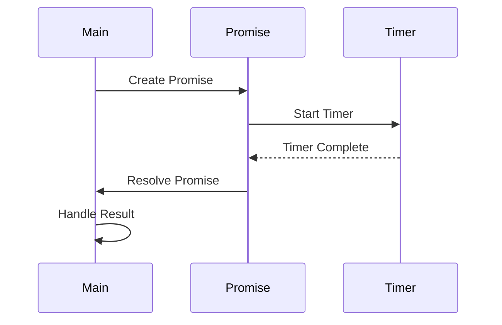

## 8.2 Asynchronous Programming with Promises and Futures

In the realm of modern software development, handling operations that complete in the future without blocking the current thread is crucial for building responsive and efficient applications. Asynchronous programming allows us to perform tasks such as network requests, file I/O, and other time-consuming operations without freezing the user interface or blocking the execution of other tasks. In this section, we will explore how to implement asynchronous programming in Haxe using Promises and Futures, providing you with the tools to write non-blocking, efficient code.

### Understanding Asynchronous Programming

Asynchronous programming is a paradigm that allows a program to initiate a potentially long-running task and continue executing other tasks while waiting for the first task to complete. This is particularly useful in scenarios where tasks involve I/O operations, such as reading from a file or making a network request, which can take an indeterminate amount of time.

#### Key Concepts

- **Concurrency:** The ability to run multiple tasks or operations simultaneously.
- **Non-blocking:** The ability to perform operations without halting the execution of other tasks.
- **Callback:** A function that is passed as an argument to another function and is executed after the completion of an operation.

### Implementing Asynchronous Programming in Haxe

Haxe provides robust support for asynchronous programming through its `haxe.concurrent.Promise` class, which allows developers to handle asynchronous operations in a clean and manageable way. Additionally, Haxe's macro system can be leveraged to simulate async/await patterns, providing a more intuitive syntax for handling asynchronous code.

#### Promises in Haxe

A Promise in Haxe represents a value that may be available now, or in the future, or never. It is an object that acts as a placeholder for the eventual result of an asynchronous operation.

##### Creating a Promise

To create a Promise in Haxe, you can use the `haxe.concurrent.Promise` class. Here's a simple example:

```haxe
import haxe.concurrent.Promise;

class Main {
    static function main() {
        var promise = new Promise<String>((resolve, reject) -> {
            // Simulate an asynchronous operation
            haxe.Timer.delay(() -> {
                var success = true; // Simulate success or failure
                if (success) {
                    resolve("Operation completed successfully!");
                } else {
                    reject("Operation failed.");
                }
            }, 1000); // Delay for 1 second
        });

        promise.then((result) -> {
            trace(result); // Output: Operation completed successfully!
        }).catchError((error) -> {
            trace(error);
        });
    }
}
```

In this example, we create a Promise that simulates an asynchronous operation using `haxe.Timer.delay`. The `resolve` function is called if the operation is successful, while the `reject` function is called if it fails.

##### Chaining Promises

Promises can be chained together to perform a sequence of asynchronous operations. This is done using the `then` method, which returns a new Promise that resolves with the result of the callback function.

```haxe
promise.then((result) -> {
    trace(result);
    return new Promise<String>((resolve, reject) -> {
        // Another asynchronous operation
        haxe.Timer.delay(() -> resolve("Second operation completed!"), 1000);
    });
}).then((secondResult) -> {
    trace(secondResult); // Output: Second operation completed!
}).catchError((error) -> {
    trace(error);
});
```

In this example, the second `then` method is called after the first Promise is resolved, allowing us to chain multiple asynchronous operations together.

#### Futures in Haxe

Futures are similar to Promises but are often used to represent a value that will be available at some point in the future. In Haxe, Futures can be implemented using Promises, as they both serve the purpose of handling asynchronous operations.

### Async/Await Patterns in Haxe

While Haxe does not natively support async/await syntax, it can be simulated using macros or platform-specific features. This allows developers to write asynchronous code in a more synchronous style, making it easier to read and maintain.

#### Simulating Async/Await

Here's an example of how you might simulate async/await in Haxe using macros:

```haxe
import haxe.macro.Context;
import haxe.macro.Expr;

class AsyncMacro {
    public static function asyncAwait(expr:Expr):Expr {
        // Macro implementation to transform async/await syntax
        return Context.makeExprContext().transform(expr);
    }
}
```

This macro would transform the async/await syntax into Promise-based code, allowing you to write asynchronous code in a more intuitive way.

### Use Cases and Examples

Asynchronous programming is essential in many real-world scenarios. Let's explore some common use cases and examples.

#### HTTP Requests

Making HTTP requests is a common asynchronous operation. Using Promises, you can perform non-blocking network calls in Haxe.

```haxe
import haxe.Http;
import haxe.concurrent.Promise;

class Main {
    static function main() {
        var promise = new Promise<String>((resolve, reject) -> {
            var http = new Http("https://api.example.com/data");
            http.onData = resolve;
            http.onError = reject;
            http.request(false);
        });

        promise.then((data) -> {
            trace("Received data: " + data);
        }).catchError((error) -> {
            trace("Error: " + error);
        });
    }
}
```

In this example, we use the `haxe.Http` class to make an HTTP request. The `onData` and `onError` callbacks are used to resolve or reject the Promise based on the response.

#### File I/O

Reading and writing files asynchronously is another common use case. Here's how you can handle file I/O using Promises in Haxe:

```haxe
import sys.io.File;
import haxe.concurrent.Promise;

class Main {
    static function main() {
        var promise = new Promise<String>((resolve, reject) -> {
            try {
                var content = File.getContent("example.txt");
                resolve(content);
            } catch (e:Dynamic) {
                reject(e);
            }
        });

        promise.then((content) -> {
            trace("File content: " + content);
        }).catchError((error) -> {
            trace("Error reading file: " + error);
        });
    }
}
```

In this example, we read the content of a file asynchronously using the `sys.io.File` class. The Promise is resolved with the file content or rejected with an error if the operation fails.

### Visualizing Asynchronous Operations

To better understand how asynchronous operations work, let's visualize the flow of a Promise-based operation using a sequence diagram.



This diagram illustrates the sequence of events in a Promise-based asynchronous operation. The `Main` participant creates a Promise, which starts a Timer. Once the Timer completes, the Promise is resolved, and the result is handled by the `Main` participant.

### References and Further Reading

- [MDN Web Docs: Promises](https://developer.mozilla.org/en-US/docs/Web/JavaScript/Guide/Using_promises)
- [Haxe Manual: Concurrency](https://haxe.org/manual/std-concurrency.html)
- [Haxe API: haxe.concurrent.Promise](https://api.haxe.org/haxe/concurrent/Promise.html)

### Knowledge Check

Before we wrap up, let's reinforce what we've learned with some questions and exercises.

1. **What is the primary purpose of a Promise in asynchronous programming?**
2. **How can you chain multiple asynchronous operations using Promises?**
3. **Explain how you might simulate async/await syntax in Haxe.**
4. **Provide an example of a real-world use case for asynchronous programming.**

### Embrace the Journey

Remember, mastering asynchronous programming is a journey. As you continue to explore and experiment with Promises and Futures in Haxe, you'll gain a deeper understanding of how to build responsive and efficient applications. Keep experimenting, stay curious, and enjoy the journey!

## Quiz Time!



### What is the primary purpose of a Promise in asynchronous programming?

- [x] To represent a value that may be available now, or in the future, or never.
- [ ] To block the execution of other tasks until a value is available.
- [ ] To simplify synchronous programming.
- [ ] To replace all callback functions.

> **Explanation:** A Promise is an object that represents the eventual completion (or failure) of an asynchronous operation and its resulting value.

### How can you chain multiple asynchronous operations using Promises?

- [x] By using the `then` method to handle the result of a Promise and return a new Promise.
- [ ] By using the `catchError` method to handle errors.
- [ ] By using the `finally` method to execute code after a Promise is settled.
- [ ] By using synchronous loops.

> **Explanation:** The `then` method allows you to chain multiple asynchronous operations by returning a new Promise that resolves with the result of the callback function.

### What is a common use case for asynchronous programming?

- [x] Making HTTP requests.
- [ ] Performing simple arithmetic operations.
- [ ] Declaring variables.
- [ ] Writing comments in code.

> **Explanation:** Asynchronous programming is commonly used for operations that may take an indeterminate amount of time, such as making HTTP requests.

### How can async/await syntax be simulated in Haxe?

- [x] By using macros to transform async/await syntax into Promise-based code.
- [ ] By using the `await` keyword directly in Haxe.
- [ ] By using synchronous functions.
- [ ] By using the `delay` function.

> **Explanation:** Haxe does not natively support async/await syntax, but it can be simulated using macros to transform the syntax into Promise-based code.

### What is the role of the `resolve` function in a Promise?

- [x] To fulfill the Promise with a value when the asynchronous operation completes successfully.
- [ ] To reject the Promise with an error.
- [ ] To delay the execution of the Promise.
- [ ] To cancel the Promise.

> **Explanation:** The `resolve` function is used to fulfill the Promise with a value when the asynchronous operation completes successfully.

### What is the role of the `reject` function in a Promise?

- [x] To reject the Promise with an error if the asynchronous operation fails.
- [ ] To fulfill the Promise with a value.
- [ ] To delay the execution of the Promise.
- [ ] To cancel the Promise.

> **Explanation:** The `reject` function is used to reject the Promise with an error if the asynchronous operation fails.

### Which method is used to handle errors in a Promise chain?

- [x] `catchError`
- [ ] `then`
- [ ] `finally`
- [ ] `resolve`

> **Explanation:** The `catchError` method is used to handle errors in a Promise chain.

### What is a Future in the context of asynchronous programming?

- [x] A representation of a value that will be available at some point in the future.
- [ ] A function that executes immediately.
- [ ] A synchronous operation.
- [ ] A method to block the execution of other tasks.

> **Explanation:** A Future is similar to a Promise and represents a value that will be available at some point in the future.

### What is the benefit of using asynchronous programming?

- [x] It allows programs to perform tasks without blocking the execution of other tasks.
- [ ] It makes programs run slower.
- [ ] It simplifies synchronous programming.
- [ ] It eliminates the need for error handling.

> **Explanation:** Asynchronous programming allows programs to perform tasks without blocking the execution of other tasks, improving responsiveness and efficiency.

### True or False: Haxe natively supports async/await syntax.

- [ ] True
- [x] False

> **Explanation:** Haxe does not natively support async/await syntax, but it can be simulated using macros or platform-specific features.


