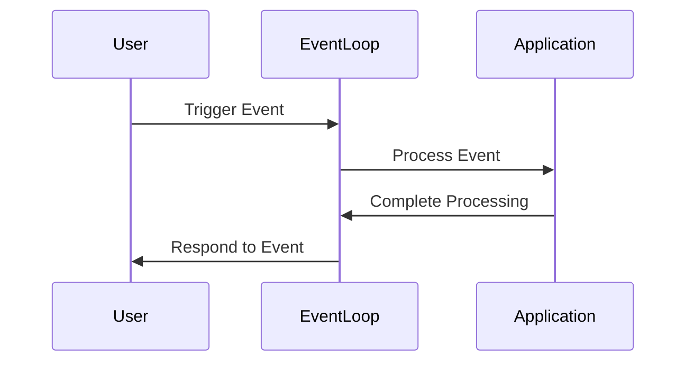
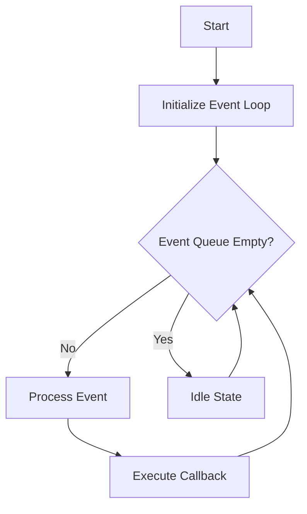

## 8.3 Event Loops and Non-Blocking I/O

In the realm of modern software development, handling asynchronous operations efficiently is crucial, especially when dealing with tasks such as user interactions, network requests, or file I/O. Event loops and non-blocking I/O are fundamental concepts that enable developers to manage these tasks without freezing the application. In this section, we will delve into how these concepts are implemented in Haxe, a versatile language known for its cross-platform capabilities.

### Understanding Event Loops

An **event loop** is a programming construct that waits for and dispatches events or messages in a program. It is a core component of asynchronous programming, allowing applications to perform non-blocking operations. The event loop continuously checks for new events and executes the corresponding event handlers.

#### How Event Loops Work

1. **Initialization**: The event loop starts by initializing resources and setting up the environment.
2. **Event Queue**: Events are placed in a queue as they occur. These events can be user inputs, network responses, or timers.
3. **Event Handling**: The loop iterates over the event queue, executing the associated callback functions for each event.
4. **Idle State**: When there are no events to process, the loop remains idle, consuming minimal resources.



*Figure 1: Event Loop Processing Sequence*

### Non-Blocking I/O

**Non-blocking I/O** allows a program to initiate an I/O operation and continue executing other tasks while waiting for the operation to complete. This is essential for maintaining responsiveness in applications, particularly those with graphical user interfaces or real-time requirements.

#### Benefits of Non-Blocking I/O

- **Responsiveness**: Keeps applications responsive by not waiting for I/O operations to complete.
- **Efficiency**: Utilizes system resources more effectively by performing tasks concurrently.
- **Scalability**: Supports handling multiple I/O operations simultaneously, crucial for server applications.

### Implementing Event Loops in Haxe

Haxe provides several mechanisms to implement event loops and non-blocking I/O, leveraging its cross-platform capabilities. Let's explore some of these implementations.

#### Callbacks

**Callbacks** are functions passed as arguments to other functions, which are invoked after a certain task is completed. In Haxe, callbacks are commonly used to handle asynchronous events.

```haxe
class Main {
    static function main() {
        // Simulate an asynchronous operation
        simulateAsyncOperation(onComplete);
    }

    static function simulateAsyncOperation(callback:Void->Void) {
        // Simulate a delay using a timer
        haxe.Timer.delay(() -> {
            trace("Operation completed.");
            callback();
        }, 1000);
    }

    static function onComplete() {
        trace("Callback executed.");
    }
}
```

*Code Example 1: Using Callbacks in Haxe*

In this example, `simulateAsyncOperation` simulates an asynchronous task using `haxe.Timer.delay`, and `onComplete` is the callback function executed once the task is complete.

#### Event Dispatchers

**Event Dispatchers** are objects that manage event listeners and dispatch events to them. They are useful for decoupling event producers from consumers.

```haxe
import openfl.events.Event;
import openfl.events.EventDispatcher;

class Main {
    static function main() {
        var dispatcher = new EventDispatcher();
        dispatcher.addEventListener("customEvent", onCustomEvent);
        
        // Dispatch an event
        dispatcher.dispatchEvent(new Event("customEvent"));
    }

    static function onCustomEvent(event:Event) {
        trace("Custom event received.");
    }
}
```

*Code Example 2: Using Event Dispatchers in Haxe*

Here, we use `openfl.events.EventDispatcher` to manage custom events. The `onCustomEvent` function is registered as a listener and is invoked when the event is dispatched.

### Use Cases and Examples

Event loops and non-blocking I/O are particularly useful in scenarios where responsiveness and concurrency are critical. Let's explore some common use cases.

#### GUI Applications

In graphical user interface (GUI) applications, event loops are essential for handling user interactions such as clicks, key presses, and mouse movements. By using non-blocking I/O, the application can remain responsive while processing these events.

```haxe
import openfl.display.Sprite;
import openfl.events.MouseEvent;

class Main extends Sprite {
    public function new() {
        super();
        graphics.beginFill(0xFF0000);
        graphics.drawRect(0, 0, 100, 100);
        graphics.endFill();
        
        addEventListener(MouseEvent.CLICK, onClick);
    }

    function onClick(event:MouseEvent) {
        trace("Rectangle clicked.");
    }
}
```

*Code Example 3: Handling Mouse Clicks in a GUI Application*

In this example, a red rectangle is drawn on the screen, and a click event listener is added to it. When the rectangle is clicked, the `onClick` function is executed.

#### Game Loops

In game development, event loops are used to update the game state in response to time and user input. A typical game loop involves updating the game logic, rendering graphics, and processing input events.

```haxe
class GameLoop {
    static var running:Bool = true;

    static function main() {
        while (running) {
            update();
            render();
            processInput();
        }
    }

    static function update() {
        // Update game state
        trace("Updating game state.");
    }

    static function render() {
        // Render graphics
        trace("Rendering graphics.");
    }

    static function processInput() {
        // Process user input
        trace("Processing input.");
    }
}
```

*Code Example 4: A Simple Game Loop in Haxe*

This code demonstrates a basic game loop structure, where the game state is updated, graphics are rendered, and input is processed in each iteration.

### Visualizing Event Loops and Non-Blocking I/O

To better understand how event loops and non-blocking I/O work together, let's visualize the process using a flowchart.



*Figure 2: Event Loop and Non-Blocking I/O Flowchart*

### Try It Yourself

Experiment with the provided code examples by modifying them to suit different scenarios. For instance, try changing the delay in the `simulateAsyncOperation` function or adding more event listeners to the `EventDispatcher` example. This hands-on approach will deepen your understanding of event loops and non-blocking I/O in Haxe.

### Knowledge Check

- **Question:** What is the primary purpose of an event loop in an application?
- **Challenge:** Modify the game loop example to include a condition that stops the loop after a certain number of iterations.

### Key Takeaways

- Event loops are essential for managing asynchronous operations in applications.
- Non-blocking I/O allows applications to remain responsive while performing I/O tasks.
- Haxe provides mechanisms such as callbacks and event dispatchers to implement event loops.
- Event loops are widely used in GUI applications and game development.

### References and Further Reading

- [MDN Web Docs: Event Loop](https://developer.mozilla.org/en-US/docs/Web/JavaScript/EventLoop)
- [Haxe Manual: Asynchronous Programming](https://haxe.org/manual/std-async.html)
- [OpenFL Documentation](https://www.openfl.org/learn/)

Remember, mastering event loops and non-blocking I/O is a journey. As you continue to explore these concepts, you'll gain the skills needed to build responsive and efficient applications. Keep experimenting, stay curious, and enjoy the journey!

## Quiz Time!



### What is the primary function of an event loop?

- [x] To manage and dispatch events in a program
- [ ] To block the execution of code until an event occurs
- [ ] To handle only user input events
- [ ] To execute synchronous operations

> **Explanation:** The event loop manages and dispatches events, allowing asynchronous operations to be handled efficiently.

### Which of the following is a benefit of non-blocking I/O?

- [x] Improved application responsiveness
- [ ] Increased memory usage
- [ ] Slower execution of tasks
- [ ] Blocking user interactions

> **Explanation:** Non-blocking I/O improves application responsiveness by allowing other tasks to execute while waiting for I/O operations to complete.

### In Haxe, what is a common use of callbacks?

- [x] To handle asynchronous events
- [ ] To execute code synchronously
- [ ] To block the event loop
- [ ] To manage memory allocation

> **Explanation:** Callbacks are used to handle asynchronous events by executing a function once a task is completed.

### What is the role of an event dispatcher in Haxe?

- [x] To manage event listeners and dispatch events
- [ ] To block events from being processed
- [ ] To execute synchronous code
- [ ] To handle memory management

> **Explanation:** An event dispatcher manages event listeners and dispatches events to them, facilitating event-driven programming.

### Which of the following is a typical use case for event loops?

- [x] GUI applications
- [ ] Static websites
- [ ] Batch processing
- [ ] Synchronous file operations

> **Explanation:** Event loops are commonly used in GUI applications to handle user interactions and maintain responsiveness.

### What is the purpose of the `haxe.Timer.delay` function in the callback example?

- [x] To simulate an asynchronous operation with a delay
- [ ] To block the execution of code
- [ ] To execute code immediately
- [ ] To manage memory allocation

> **Explanation:** The `haxe.Timer.delay` function simulates an asynchronous operation by introducing a delay before executing the callback.

### How does non-blocking I/O contribute to scalability?

- [x] By allowing multiple I/O operations to be handled simultaneously
- [ ] By increasing the number of threads used
- [ ] By blocking operations until they complete
- [ ] By reducing the number of I/O operations

> **Explanation:** Non-blocking I/O contributes to scalability by enabling multiple I/O operations to be handled concurrently.

### What happens when the event queue is empty in an event loop?

- [x] The loop enters an idle state
- [ ] The loop terminates
- [ ] The loop blocks until an event occurs
- [ ] The loop processes the last event again

> **Explanation:** When the event queue is empty, the event loop enters an idle state, consuming minimal resources until new events arrive.

### In the game loop example, what is the purpose of the `processInput` function?

- [x] To handle user input during each iteration of the loop
- [ ] To render graphics
- [ ] To update the game state
- [ ] To terminate the loop

> **Explanation:** The `processInput` function handles user input during each iteration of the game loop, ensuring responsive gameplay.

### True or False: Event loops can only be used in GUI applications.

- [ ] True
- [x] False

> **Explanation:** Event loops are not limited to GUI applications; they are used in various contexts, including server applications and game development.


