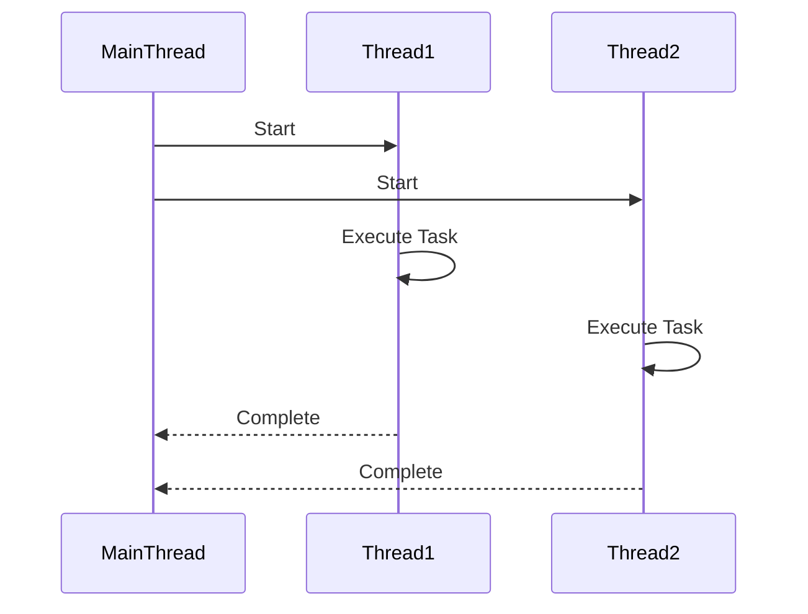

## 8.4 Multi-Threading and Parallelism

In the realm of software development, multi-threading and parallelism are crucial for optimizing performance and responsiveness, especially in applications that require handling multiple tasks simultaneously. In this section, we delve into the concepts of multi-threading and parallelism within the Haxe programming language, exploring how to implement these techniques effectively across different platforms.

### Understanding Multi-Threading and Parallelism

**Multi-threading** involves the concurrent execution of multiple threads within a single process. Each thread can perform a separate task, allowing for more efficient use of resources and improved application performance. **Parallelism**, on the other hand, refers to the simultaneous execution of multiple computations, which can be achieved through multi-threading or distributed computing.

#### Key Concepts

- **Thread**: A lightweight process that can run concurrently with other threads.
- **Concurrency**: The ability of a system to handle multiple tasks at once.
- **Parallelism**: The simultaneous execution of multiple tasks.
- **Synchronization**: Techniques to ensure that threads do not interfere with each other when accessing shared resources.

### Implementing Multi-Threading in Haxe

Haxe provides a robust framework for implementing multi-threading, although the support varies across different target platforms. Let's explore how to create and manage threads in Haxe.

#### Creating Threads

In Haxe, threads can be created using the `haxe.Concurrent.Thread` class. This class provides methods to start, manage, and synchronize threads.

```haxe
import haxe.Concurrent.Thread;

class Main {
    static function main() {
        // Create a new thread
        var thread = Thread.create(function() {
            for (i in 0...5) {
                trace("Thread: " + i);
                Thread.sleep(1000); // Sleep for 1 second
            }
        });

        // Main thread continues execution
        for (i in 0...5) {
            trace("Main: " + i);
            Thread.sleep(500); // Sleep for 0.5 seconds
        }
    }
}
```

In this example, we create a new thread that runs a loop independently of the main thread. The `Thread.sleep()` method is used to pause execution, simulating a time-consuming task.

#### Synchronization Primitives

When multiple threads access shared resources, synchronization is essential to prevent data corruption and ensure thread safety. Haxe provides several synchronization primitives, such as locks, mutexes, and semaphores.

##### Using Locks

Locks are used to ensure that only one thread can access a resource at a time.

```haxe
import haxe.Concurrent.Thread;
import haxe.Concurrent.Lock;

class Main {
    static var lock = new Lock();

    static function main() {
        var thread1 = Thread.create(threadFunction);
        var thread2 = Thread.create(threadFunction);

        thread1.join();
        thread2.join();
    }

    static function threadFunction() {
        lock.acquire();
        try {
            // Critical section
            for (i in 0...5) {
                trace("Thread: " + i);
                Thread.sleep(500);
            }
        } finally {
            lock.release();
        }
    }
}
```

In this example, the `Lock` class is used to synchronize access to the critical section, ensuring that only one thread can execute it at a time.

### Considerations for Multi-Threading in Haxe

#### Thread Safety

Ensuring thread safety is crucial when implementing multi-threading. This involves protecting shared data from concurrent access and preventing race conditions.

- **Immutable Data Structures**: Use immutable data structures where possible to avoid the need for synchronization.
- **Atomic Operations**: Utilize atomic operations for simple data manipulations.
- **Thread-Local Storage**: Store data locally within threads to avoid sharing.

#### Target Support

The availability of threading features in Haxe depends on the target platform. For instance, Java and C++ targets have robust threading support, while JavaScript does not support traditional multi-threading due to its single-threaded nature. Instead, JavaScript relies on asynchronous programming and Web Workers for concurrency.

### Visualizing Multi-Threading and Parallelism

To better understand the flow of multi-threading and parallelism, let's visualize the process using a sequence diagram.



This diagram illustrates the sequence of events when two threads are started from the main thread. Each thread executes its task independently and reports back to the main thread upon completion.

### Try It Yourself

Experiment with the provided code examples by modifying the sleep durations or adding additional threads. Observe how the execution order changes and how synchronization affects the output.

### References and Further Reading

- [Haxe Manual: Concurrency](https://haxe.org/manual/std-Thread.html)
- [MDN Web Docs: Concurrency model and the event loop](https://developer.mozilla.org/en-US/docs/Web/JavaScript/EventLoop)
- [Java Concurrency in Practice](https://jcip.net/)

### Knowledge Check

Let's reinforce your understanding of multi-threading and parallelism in Haxe with some questions and exercises.

## Quiz Time!



### What is the primary purpose of multi-threading?

- [x] To allow multiple tasks to run concurrently
- [ ] To improve code readability
- [ ] To reduce code complexity
- [ ] To increase memory usage

> **Explanation:** Multi-threading allows multiple tasks to run concurrently, improving performance and responsiveness.

### Which Haxe class is used to create threads?

- [ ] haxe.Concurrent.Lock
- [x] haxe.Concurrent.Thread
- [ ] haxe.Concurrent.Semaphore
- [ ] haxe.Concurrent.Mutex

> **Explanation:** The `haxe.Concurrent.Thread` class is used to create and manage threads in Haxe.

### What is a critical section in multi-threading?

- [x] A section of code that must not be executed by more than one thread at a time
- [ ] A section of code that is executed by all threads simultaneously
- [ ] A section of code that is ignored by threads
- [ ] A section of code that is executed only by the main thread

> **Explanation:** A critical section is a part of the code that must be executed by only one thread at a time to prevent data corruption.

### What is the role of locks in multi-threading?

- [x] To ensure that only one thread can access a resource at a time
- [ ] To speed up thread execution
- [ ] To create new threads
- [ ] To terminate threads

> **Explanation:** Locks are used to synchronize access to shared resources, ensuring that only one thread can access them at a time.

### Which of the following is a synchronization primitive?

- [x] Mutex
- [ ] Thread
- [ ] Function
- [ ] Variable

> **Explanation:** A mutex is a synchronization primitive used to control access to shared resources.

### What is thread safety?

- [x] Ensuring that shared data is accessed safely by multiple threads
- [ ] Ensuring that threads run faster
- [ ] Ensuring that threads do not terminate unexpectedly
- [ ] Ensuring that threads are created efficiently

> **Explanation:** Thread safety involves ensuring that shared data is accessed safely by multiple threads to prevent race conditions.

### Which platform does not support traditional multi-threading?

- [ ] Java
- [ ] C++
- [x] JavaScript
- [ ] Python

> **Explanation:** JavaScript does not support traditional multi-threading due to its single-threaded nature.

### What is the purpose of thread-local storage?

- [x] To store data locally within threads to avoid sharing
- [ ] To store data globally for all threads
- [ ] To store data in the main thread
- [ ] To store data in external files

> **Explanation:** Thread-local storage is used to store data locally within threads to avoid sharing and ensure thread safety.

### What is the difference between concurrency and parallelism?

- [x] Concurrency is about managing multiple tasks at once, while parallelism is about executing multiple tasks simultaneously
- [ ] Concurrency is faster than parallelism
- [ ] Concurrency is only used in single-threaded applications
- [ ] Concurrency and parallelism are the same

> **Explanation:** Concurrency involves managing multiple tasks at once, while parallelism involves executing multiple tasks simultaneously.

### True or False: Synchronization is not necessary in multi-threading.

- [ ] True
- [x] False

> **Explanation:** Synchronization is necessary in multi-threading to ensure that shared resources are accessed safely and to prevent race conditions.



Remember, mastering multi-threading and parallelism in Haxe is a journey. As you continue to explore and experiment, you'll gain deeper insights into creating efficient, responsive applications. Keep pushing the boundaries, and enjoy the process!
