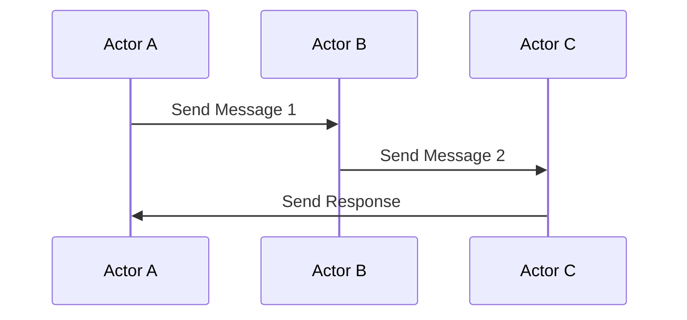

## 8.5 Actor Model and Message Passing

Concurrency is a critical aspect of modern software development, especially when building applications that need to handle multiple tasks simultaneously. The Actor Model is a powerful concurrency model that provides a robust framework for managing state and behavior in concurrent systems. In this section, we'll explore how the Actor Model and message passing can be implemented in Haxe, leveraging its cross-platform capabilities to build scalable and efficient applications.

### Understanding the Actor Model

The Actor Model is a conceptual model that treats "actors" as the fundamental units of computation. Each actor is an independent entity that encapsulates state and behavior, and interacts with other actors solely through message passing. This model provides a high level of abstraction for concurrent programming, making it easier to reason about complex systems.

#### Key Concepts of the Actor Model

- **Actors:** The basic units of computation that encapsulate state and behavior.
- **Message Passing:** The primary means of communication between actors, ensuring that actors remain isolated and independent.
- **Concurrency:** Actors can process messages concurrently, allowing for parallel execution of tasks.
- **Isolation:** Actors do not share state directly, reducing the risk of race conditions and ensuring thread safety.

### Implementing the Actor Model in Haxe

Haxe, with its strong typing and cross-platform capabilities, is well-suited for implementing the Actor Model. While Haxe does not have built-in support for actors, several libraries and frameworks can be used to implement this model effectively.

#### Actor Libraries in Haxe

To implement the Actor Model in Haxe, we can use libraries that provide the necessary abstractions and tools. One such library is **HaxeActors**, which offers a simple and efficient way to create and manage actors.

```haxe
import haxeactors.Actor;
import haxeactors.Message;

class MyActor extends Actor {
    public function new() {
        super();
    }

    override public function receive(msg:Message):Void {
        switch (msg) {
            case Message.Text(text):
                trace("Received message: " + text);
            default:
                trace("Unknown message type");
        }
    }
}

class Main {
    static function main() {
        var actor = new MyActor();
        actor.send(Message.Text("Hello, Actor!"));
    }
}
```

In this example, we define a simple actor `MyActor` that can receive and process text messages. The `receive` method is overridden to handle incoming messages, demonstrating the core concept of message passing.

#### Message Queues and Asynchronous Communication

Message queues are essential for implementing asynchronous communication between actors. They allow messages to be stored and processed in a non-blocking manner, enabling actors to handle multiple messages concurrently.

```haxe
import haxeactors.Actor;
import haxeactors.MessageQueue;

class MyActor extends Actor {
    private var queue:MessageQueue;

    public function new() {
        super();
        queue = new MessageQueue();
    }

    override public function receive(msg:Message):Void {
        queue.enqueue(msg);
        processQueue();
    }

    private function processQueue():Void {
        while (!queue.isEmpty()) {
            var msg = queue.dequeue();
            // Process the message
        }
    }
}
```

In this example, we introduce a `MessageQueue` to manage incoming messages. The `processQueue` method processes messages asynchronously, allowing the actor to handle multiple messages efficiently.

### Use Cases and Examples

The Actor Model is particularly useful in scenarios where concurrency and parallelism are essential. Here are some common use cases:

#### Concurrent Systems

In concurrent systems, the Actor Model helps decouple components that run in parallel, making it easier to manage state and behavior. For example, in a web server, each request can be handled by a separate actor, allowing for efficient processing of multiple requests simultaneously.

#### Distributed Applications

In distributed applications, the Actor Model simplifies communication across networked services. By using message passing, actors can communicate with each other regardless of their physical location, enabling seamless integration of distributed components.

### Visualizing the Actor Model

To better understand the Actor Model, let's visualize the interaction between actors using a sequence diagram.



In this diagram, Actor A sends a message to Actor B, which in turn sends a message to Actor C. Actor C processes the message and sends a response back to Actor A. This illustrates the flow of messages between actors, highlighting the asynchronous nature of the Actor Model.

### Design Considerations

When implementing the Actor Model in Haxe, consider the following design considerations:

- **Scalability:** The Actor Model naturally supports scalability by allowing actors to be distributed across multiple nodes.
- **Fault Tolerance:** Actors can be designed to handle failures gracefully, improving the overall resilience of the system.
- **Performance:** While the Actor Model provides a high level of abstraction, it's important to optimize message passing and processing to ensure optimal performance.

### Differences and Similarities

The Actor Model is often compared to other concurrency models, such as threads and coroutines. While threads provide low-level control over concurrency, the Actor Model offers a higher level of abstraction, making it easier to manage complex systems. Coroutines, on the other hand, provide cooperative multitasking, which can be combined with the Actor Model to achieve efficient concurrency.

### Try It Yourself

To gain a deeper understanding of the Actor Model, try modifying the code examples provided. Experiment with different message types, implement additional actors, and explore how message passing can be used to build complex systems.

### References and Links

For further reading on the Actor Model and message passing, consider the following resources:

- [The Actor Model](https://en.wikipedia.org/wiki/Actor_model) on Wikipedia
- [HaxeActors Library](https://github.com/HaxeFoundation/haxeactors) on GitHub

### Knowledge Check

Before moving on, let's review some key concepts:

- What are the fundamental units of computation in the Actor Model?
- How do actors communicate with each other?
- What are some common use cases for the Actor Model?

### Embrace the Journey

Remember, mastering the Actor Model and message passing is just the beginning. As you continue to explore concurrency and asynchronous patterns in Haxe, you'll unlock new possibilities for building scalable and efficient applications. Keep experimenting, stay curious, and enjoy the journey!

## Quiz Time!



### What is the primary means of communication between actors in the Actor Model?

- [x] Message Passing
- [ ] Shared Memory
- [ ] Direct Method Calls
- [ ] Global Variables

> **Explanation:** In the Actor Model, actors communicate with each other through message passing, ensuring isolation and independence.

### Which of the following is NOT a characteristic of the Actor Model?

- [ ] Concurrency
- [ ] Isolation
- [x] Shared State
- [ ] Message Passing

> **Explanation:** The Actor Model emphasizes isolation and does not allow shared state between actors.

### What is the role of a Message Queue in the Actor Model?

- [x] To manage and process messages asynchronously
- [ ] To store actor states
- [ ] To execute actor methods
- [ ] To synchronize actor threads

> **Explanation:** Message Queues are used to manage and process messages asynchronously, enabling efficient communication between actors.

### Which Haxe library can be used to implement the Actor Model?

- [x] HaxeActors
- [ ] HaxeThreads
- [ ] HaxeCoroutines
- [ ] HaxeAsync

> **Explanation:** The HaxeActors library provides tools and abstractions for implementing the Actor Model in Haxe.

### In a distributed application, how do actors communicate across networked services?

- [x] Through message passing
- [ ] Through shared memory
- [ ] Through direct method calls
- [ ] Through global variables

> **Explanation:** In distributed applications, actors communicate through message passing, allowing seamless integration across networked services.

### What is a key benefit of using the Actor Model in concurrent systems?

- [x] Decoupling of components
- [ ] Direct access to shared memory
- [ ] Synchronous communication
- [ ] Global state management

> **Explanation:** The Actor Model helps decouple components that run in parallel, making it easier to manage state and behavior in concurrent systems.

### Which of the following is a common use case for the Actor Model?

- [x] Concurrent Systems
- [x] Distributed Applications
- [ ] Single-threaded Applications
- [ ] Static Websites

> **Explanation:** The Actor Model is commonly used in concurrent systems and distributed applications to manage state and behavior efficiently.

### What is a key design consideration when implementing the Actor Model?

- [x] Scalability
- [ ] Direct state sharing
- [ ] Synchronous method calls
- [ ] Global variable usage

> **Explanation:** Scalability is a key design consideration when implementing the Actor Model, as it naturally supports distributed and scalable systems.

### How can actors handle failures gracefully?

- [x] By designing fault-tolerant actors
- [ ] By sharing state with other actors
- [ ] By using global variables
- [ ] By relying on synchronous communication

> **Explanation:** Actors can be designed to handle failures gracefully, improving the overall resilience of the system.

### True or False: The Actor Model provides a low-level control over concurrency.

- [ ] True
- [x] False

> **Explanation:** The Actor Model provides a high level of abstraction for concurrency, making it easier to manage complex systems.


