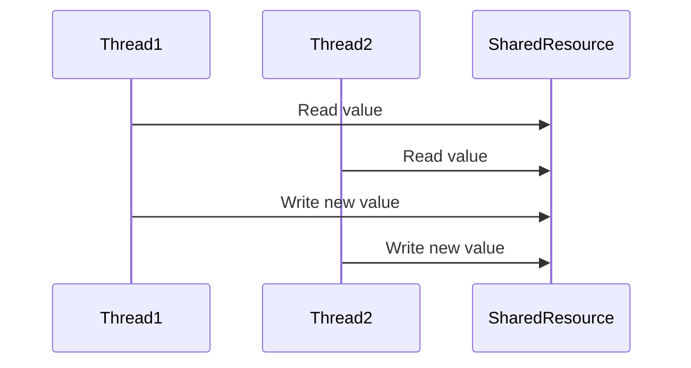
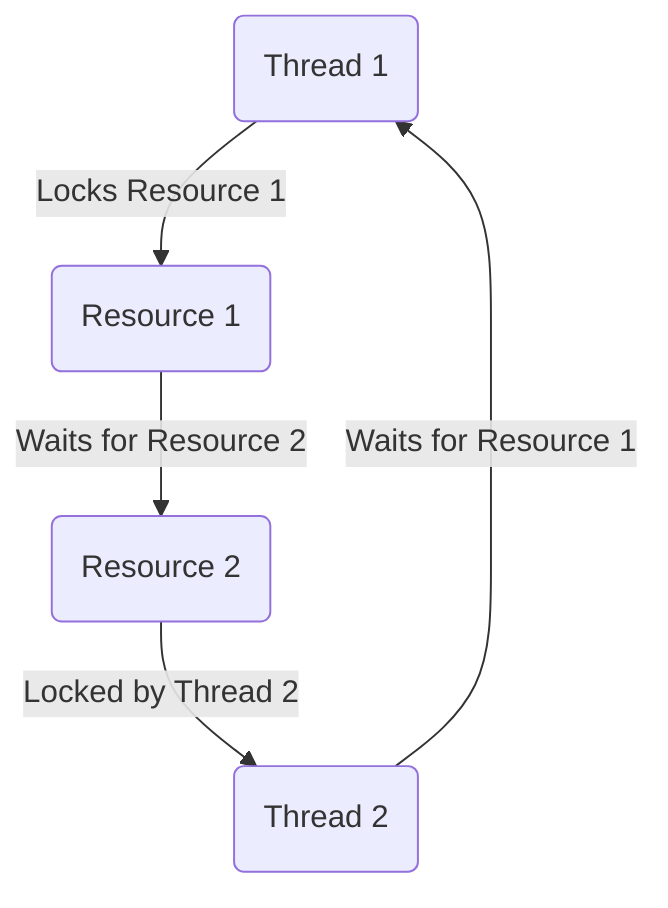

## 8.6 Synchronization and Thread Safety

In the realm of concurrent programming, synchronization and thread safety are critical concepts that ensure the correct execution of programs that involve multiple threads. In this section, we will delve into these concepts specifically within the context of the Haxe programming language. We will explore techniques such as locks, mutexes, and atomic operations, and discuss best practices for minimizing shared state and utilizing immutable data to avoid synchronization issues.

### Understanding Synchronization and Thread Safety

**Synchronization** refers to the coordination of concurrent processes to ensure that they do not interfere with each other when accessing shared resources. **Thread safety** is the property of a program or code segment that guarantees safe execution by multiple threads simultaneously.

#### Key Concepts

- **Race Conditions:** Occur when two or more threads access shared data and try to change it simultaneously. The final outcome depends on the timing of the threads, leading to unpredictable results.
- **Deadlocks:** A situation where two or more threads are blocked forever, waiting for each other to release resources.
- **Livelocks:** Similar to deadlocks, but the threads keep changing state in response to each other without making progress.

### Implementing Synchronization in Haxe

Haxe provides several mechanisms to handle synchronization and ensure thread safety. Let's explore some of these techniques.

#### Locks and Mutexes

Locks and mutexes are fundamental tools for synchronization. They prevent multiple threads from accessing shared resources simultaneously, thus avoiding race conditions.

**Example: Using Locks in Haxe**

```haxe
import sys.thread.Mutex;

class SharedResource {
    private var mutex:Mutex;
    private var counter:Int;

    public function new() {
        this.mutex = new Mutex();
        this.counter = 0;
    }

    public function increment():Void {
        mutex.lock();
        try {
            counter++;
        } finally {
            mutex.unlock();
        }
    }

    public function getCounter():Int {
        return counter;
    }
}

class Main {
    static function main() {
        var resource = new SharedResource();
        // Simulate concurrent access
        for (i in 0...10) {
            Sys.thread.create(() -> resource.increment());
        }
        Sys.sleep(1); // Wait for threads to finish
        trace("Final counter value: " + resource.getCounter());
    }
}
```

In this example, we use a `Mutex` to ensure that only one thread can increment the `counter` at a time. The `lock()` and `unlock()` methods are used to acquire and release the lock, respectively.

#### Atomic Operations

Atomic operations are indivisible operations that complete without interference from other threads. They are useful for simple operations on shared data without the overhead of locks.

**Example: Atomic Operations in Haxe**

```haxe
import sys.thread.Atomic;

class AtomicCounter {
    private var counter:Atomic<Int>;

    public function new() {
        this.counter = new Atomic(0);
    }

    public function increment():Void {
        counter.add(1);
    }

    public function getCounter():Int {
        return counter.get();
    }
}

class Main {
    static function main() {
        var atomicCounter = new AtomicCounter();
        // Simulate concurrent access
        for (i in 0...10) {
            Sys.thread.create(() -> atomicCounter.increment());
        }
        Sys.sleep(1); // Wait for threads to finish
        trace("Final atomic counter value: " + atomicCounter.getCounter());
    }
}
```

In this example, we use the `Atomic` class to perform atomic operations on the `counter`. The `add()` method is used to increment the counter atomically.

### Best Practices for Synchronization and Thread Safety

To effectively manage synchronization and ensure thread safety, consider the following best practices:

#### Minimize Shared State

Reducing the amount of shared data between threads can significantly decrease the complexity of synchronization. By minimizing shared state, you reduce the chances of race conditions and the need for locks.

#### Use Immutable Data

Immutable objects cannot be modified after they are created. This property makes them inherently thread-safe, as multiple threads can read them without the risk of data corruption.

**Example: Immutable Data in Haxe**

```haxe
class ImmutableData {
    public final name:String;
    public final age:Int;

    public function new(name:String, age:Int) {
        this.name = name;
        this.age = age;
    }
}

class Main {
    static function main() {
        var person = new ImmutableData("Alice", 30);
        // Safe to share between threads
        Sys.thread.create(() -> trace(person.name));
        Sys.thread.create(() -> trace(person.age));
    }
}
```

In this example, the `ImmutableData` class is immutable, making it safe to share between threads without synchronization.

### Visualizing Synchronization Concepts

To better understand synchronization and thread safety, let's visualize some of the key concepts using Mermaid.js diagrams.

#### Visualizing Race Conditions



This sequence diagram illustrates a race condition where two threads read and write to a shared resource simultaneously, leading to unpredictable results.

#### Visualizing Deadlocks



This graph illustrates a deadlock situation where two threads are waiting for each other to release resources, resulting in a standstill.

### References and Further Reading

- [MDN Web Docs on Concurrency](https://developer.mozilla.org/en-US/docs/Web/JavaScript/EventLoop)
- [Haxe Manual: Concurrency](https://haxe.org/manual/std-sys-thread.html)
- [Java Concurrency in Practice](https://jcip.net/)

### Knowledge Check

Let's reinforce our understanding with some questions and exercises.

- **Question:** What is the main purpose of using locks in concurrent programming?
- **Exercise:** Modify the `SharedResource` example to use a `ReentrantLock` instead of a `Mutex`.

### Embrace the Journey

Remember, mastering synchronization and thread safety is a journey. As you progress, you'll encounter more complex scenarios that require a deep understanding of these concepts. Keep experimenting, stay curious, and enjoy the journey!

## Quiz Time!



### What is the main purpose of using locks in concurrent programming?

- [x] To prevent simultaneous access to shared resources
- [ ] To increase the speed of execution
- [ ] To reduce memory usage
- [ ] To simplify code structure

> **Explanation:** Locks are used to prevent simultaneous access to shared resources, ensuring thread safety.

### Which of the following is an example of an atomic operation?

- [x] Incrementing a counter using an atomic variable
- [ ] Reading a value from a shared resource
- [ ] Writing a value to a shared resource
- [ ] Acquiring a lock on a resource

> **Explanation:** Atomic operations are indivisible and complete without interference, such as incrementing a counter using an atomic variable.

### What is a race condition?

- [x] A situation where multiple threads access shared data simultaneously, leading to unpredictable results
- [ ] A situation where a thread is waiting indefinitely for a resource
- [ ] A situation where a thread is executing faster than others
- [ ] A situation where a thread is blocked by another thread

> **Explanation:** Race conditions occur when multiple threads access shared data simultaneously, leading to unpredictable results.

### What is a deadlock?

- [x] A situation where two or more threads are blocked forever, waiting for each other to release resources
- [ ] A situation where a thread is executing faster than others
- [ ] A situation where a thread is waiting indefinitely for a resource
- [ ] A situation where a thread is blocked by another thread

> **Explanation:** Deadlocks occur when two or more threads are blocked forever, waiting for each other to release resources.

### Which of the following is a best practice for synchronization?

- [x] Minimize shared state
- [ ] Maximize shared state
- [ ] Use mutable data
- [ ] Avoid using locks

> **Explanation:** Minimizing shared state reduces the complexity of synchronization and the chances of race conditions.

### What is the benefit of using immutable data in concurrent programming?

- [x] It is inherently thread-safe
- [ ] It reduces memory usage
- [ ] It increases execution speed
- [ ] It simplifies code structure

> **Explanation:** Immutable data is inherently thread-safe, as it cannot be modified after creation.

### What is a livelock?

- [x] A situation where threads keep changing state in response to each other without making progress
- [ ] A situation where a thread is executing faster than others
- [ ] A situation where a thread is waiting indefinitely for a resource
- [ ] A situation where a thread is blocked by another thread

> **Explanation:** Livelocks occur when threads keep changing state in response to each other without making progress.

### How can atomic operations help in synchronization?

- [x] By performing indivisible operations without interference from other threads
- [ ] By increasing the speed of execution
- [ ] By reducing memory usage
- [ ] By simplifying code structure

> **Explanation:** Atomic operations perform indivisible operations without interference from other threads, ensuring thread safety.

### What is the role of a mutex in synchronization?

- [x] To prevent multiple threads from accessing a shared resource simultaneously
- [ ] To increase the speed of execution
- [ ] To reduce memory usage
- [ ] To simplify code structure

> **Explanation:** A mutex prevents multiple threads from accessing a shared resource simultaneously, ensuring thread safety.

### True or False: Immutable objects can be safely shared between threads without synchronization.

- [x] True
- [ ] False

> **Explanation:** Immutable objects can be safely shared between threads without synchronization, as they cannot be modified after creation.


