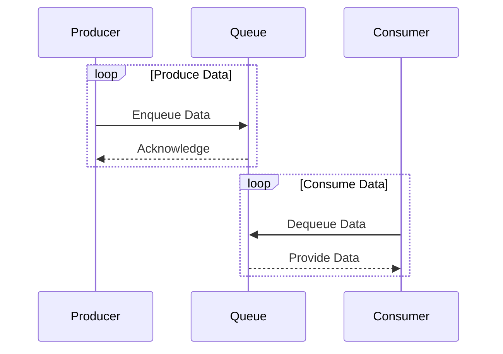

## 8.7 Producer-Consumer Pattern

In the realm of concurrent programming, the Producer-Consumer pattern is a fundamental design pattern that facilitates the management of data flow between producers, which generate data, and consumers, which process that data. This pattern is particularly useful in scenarios where the rate of data production and consumption may vary, necessitating a buffer to decouple the two processes. In this section, we will delve into the intricacies of implementing the Producer-Consumer pattern in Haxe, leveraging its unique features to create efficient and robust concurrent applications.

### Definition and Intent

The Producer-Consumer pattern involves two main components: producers and consumers. Producers are responsible for generating data and placing it into a shared buffer, while consumers retrieve and process this data. The buffer acts as a mediator, allowing producers and consumers to operate at their own pace without being directly dependent on each other.

**Intent:** The primary intent of the Producer-Consumer pattern is to decouple data production from data consumption, enabling both processes to operate independently and efficiently. This is achieved by using a shared buffer that temporarily holds data until it is consumed.

### Key Participants

- **Producers:** Entities that generate data and place it into the buffer.
- **Consumers:** Entities that retrieve data from the buffer for processing.
- **Buffer:** A shared data structure that holds data produced by producers until it is consumed.
- **Synchronization Mechanism:** Ensures thread-safe access to the buffer, preventing race conditions and data corruption.

### Applicability

The Producer-Consumer pattern is applicable in various scenarios, including:

- **Data Pipelines:** Stream processing of data where data is produced and consumed at different rates.
- **Task Queues:** Managing workloads in server applications where tasks are produced by different sources and processed by worker threads.
- **Resource Management:** Controlling access to limited resources by queuing requests and processing them sequentially.

### Implementing the Producer-Consumer Pattern in Haxe

Haxe provides several features that facilitate the implementation of the Producer-Consumer pattern, including thread-safe data structures and synchronization mechanisms. Let's explore how to implement this pattern in Haxe.

#### Thread-Safe Queues

In Haxe, we can use synchronized queues to facilitate communication between producers and consumers. A synchronized queue ensures that access to the queue is thread-safe, preventing race conditions and ensuring data integrity.

```haxe
import sys.thread.Thread;
import sys.thread.Mutex;
import sys.thread.Lock;

class SynchronizedQueue<T> {
    private var queue:Array<T> = [];
    private var mutex:Mutex = new Mutex();
    private var lock:Lock = new Lock();

    public function new() {}

    public function enqueue(item:T):Void {
        mutex.acquire();
        queue.push(item);
        lock.release();
        mutex.release();
    }

    public function dequeue():T {
        lock.acquire();
        mutex.acquire();
        var item = queue.shift();
        mutex.release();
        return item;
    }
}
```

In this example, we define a `SynchronizedQueue` class that uses a `Mutex` to ensure exclusive access to the queue and a `Lock` to manage blocking and non-blocking operations.

#### Blocking and Non-Blocking Operations

Blocking operations are used when a consumer needs to wait for data to become available in the buffer. Non-blocking operations allow producers to continue generating data even if the buffer is full.

```haxe
class Producer extends Thread {
    private var queue:SynchronizedQueue<Int>;

    public function new(queue:SynchronizedQueue<Int>) {
        this.queue = queue;
        super();
    }

    override public function run():Void {
        for (i in 0...10) {
            queue.enqueue(i);
            trace("Produced: " + i);
            Thread.sleep(100);
        }
    }
}

class Consumer extends Thread {
    private var queue:SynchronizedQueue<Int>;

    public function new(queue:SynchronizedQueue<Int>) {
        this.queue = queue;
        super();
    }

    override public function run():Void {
        for (i in 0...10) {
            var item = queue.dequeue();
            trace("Consumed: " + item);
            Thread.sleep(150);
        }
    }
}
```

In this example, we define `Producer` and `Consumer` classes that extend `Thread`. The producer generates data and places it into the queue, while the consumer retrieves and processes the data.

### Visualizing the Producer-Consumer Pattern

To better understand the flow of data between producers and consumers, let's visualize the Producer-Consumer pattern using a sequence diagram.



**Diagram Description:** This sequence diagram illustrates the interaction between producers, the queue, and consumers. Producers enqueue data into the queue, and consumers dequeue data for processing.

### Use Cases and Examples

#### Data Pipelines

In data pipelines, data is often produced and consumed at different rates. The Producer-Consumer pattern allows for efficient data flow management, ensuring that data is processed as it becomes available.

#### Task Queues

In server applications, tasks are often produced by different sources and need to be processed by worker threads. The Producer-Consumer pattern facilitates task management by queuing tasks and processing them sequentially.

### Design Considerations

When implementing the Producer-Consumer pattern in Haxe, consider the following:

- **Buffer Size:** Determine an appropriate buffer size to balance between memory usage and throughput.
- **Synchronization:** Use appropriate synchronization mechanisms to ensure thread-safe access to the buffer.
- **Blocking vs. Non-Blocking:** Decide whether to use blocking or non-blocking operations based on the application's requirements.

### Differences and Similarities

The Producer-Consumer pattern is often compared to other concurrency patterns, such as the Observer pattern. While both patterns involve communication between components, the Producer-Consumer pattern focuses on decoupling data production and consumption, whereas the Observer pattern focuses on notifying observers of state changes.

### Try It Yourself

To gain a deeper understanding of the Producer-Consumer pattern, try modifying the code examples provided. Experiment with different buffer sizes, synchronization mechanisms, and blocking vs. non-blocking operations. Observe how these changes affect the behavior of the producers and consumers.

### References and Links

For further reading on the Producer-Consumer pattern and concurrency in Haxe, consider the following resources:

- [Haxe Manual - Concurrency](https://haxe.org/manual/std-sys-thread.html)
- [MDN Web Docs - Concurrency](https://developer.mozilla.org/en-US/docs/Web/JavaScript/EventLoop)
- [W3Schools - Multithreading](https://www.w3schools.com/java/java_threads.asp)

### Knowledge Check

To reinforce your understanding of the Producer-Consumer pattern, consider the following questions:

1. What is the primary intent of the Producer-Consumer pattern?
2. How does a synchronized queue ensure thread-safe access to the buffer?
3. What are the key differences between blocking and non-blocking operations?
4. In what scenarios is the Producer-Consumer pattern particularly useful?
5. How can you modify the buffer size to optimize performance?

### Embrace the Journey

Remember, mastering concurrency and asynchronous programming is a journey. As you experiment with the Producer-Consumer pattern in Haxe, you'll gain valuable insights into managing data flow and synchronization in concurrent applications. Keep exploring, stay curious, and enjoy the process!

## Quiz Time!



### What is the primary intent of the Producer-Consumer pattern?

- [x] To decouple data production from data consumption
- [ ] To synchronize data access between threads
- [ ] To optimize memory usage
- [ ] To enhance data security

> **Explanation:** The primary intent of the Producer-Consumer pattern is to decouple data production from data consumption, allowing both processes to operate independently.

### How does a synchronized queue ensure thread-safe access to the buffer?

- [x] By using mutexes and locks
- [ ] By using semaphores
- [ ] By using atomic operations
- [ ] By using shared memory

> **Explanation:** A synchronized queue ensures thread-safe access by using mutexes and locks to control access to the buffer.

### What is the difference between blocking and non-blocking operations?

- [x] Blocking operations wait for data, non-blocking operations do not
- [ ] Blocking operations are faster than non-blocking operations
- [ ] Blocking operations use more memory than non-blocking operations
- [ ] Blocking operations are less secure than non-blocking operations

> **Explanation:** Blocking operations wait for data to become available, while non-blocking operations allow processes to continue without waiting.

### In what scenarios is the Producer-Consumer pattern particularly useful?

- [x] Data pipelines and task queues
- [ ] Real-time data processing
- [ ] Secure data transmission
- [ ] Memory management

> **Explanation:** The Producer-Consumer pattern is particularly useful in data pipelines and task queues where data production and consumption rates may vary.

### How can you modify the buffer size to optimize performance?

- [x] By balancing memory usage and throughput
- [ ] By increasing the number of producers
- [ ] By decreasing the number of consumers
- [ ] By using a different data structure

> **Explanation:** Modifying the buffer size can optimize performance by balancing memory usage and throughput.

### What is a key participant in the Producer-Consumer pattern?

- [x] Buffer
- [ ] Semaphore
- [ ] Timer
- [ ] Logger

> **Explanation:** The buffer is a key participant in the Producer-Consumer pattern, acting as a mediator between producers and consumers.

### Which synchronization mechanism is commonly used in the Producer-Consumer pattern?

- [x] Mutex
- [ ] Semaphore
- [ ] Timer
- [ ] Logger

> **Explanation:** A mutex is commonly used to ensure exclusive access to shared resources in the Producer-Consumer pattern.

### What is a common use case for the Producer-Consumer pattern?

- [x] Task queues in server applications
- [ ] Real-time data processing
- [ ] Secure data transmission
- [ ] Memory management

> **Explanation:** Task queues in server applications are a common use case for the Producer-Consumer pattern.

### What is the role of the consumer in the Producer-Consumer pattern?

- [x] To retrieve and process data from the buffer
- [ ] To generate data and place it in the buffer
- [ ] To synchronize data access
- [ ] To manage memory usage

> **Explanation:** The consumer retrieves and processes data from the buffer in the Producer-Consumer pattern.

### True or False: The Producer-Consumer pattern is only applicable in multi-threaded applications.

- [ ] True
- [x] False

> **Explanation:** The Producer-Consumer pattern can be applied in both multi-threaded and single-threaded applications, depending on the design requirements.


