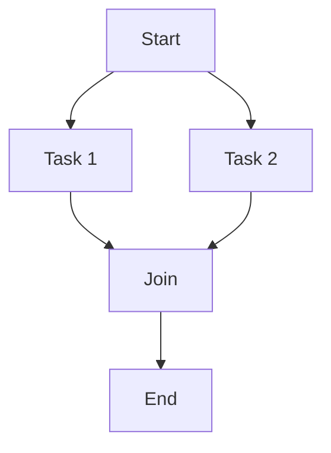

## 8.8 Concurrency Best Practices

Concurrency is a powerful tool in software development, enabling applications to perform multiple tasks simultaneously and efficiently. However, it also introduces complexity and potential pitfalls. In this section, we will explore best practices for managing concurrency in Haxe, ensuring your applications are robust, efficient, and maintainable.

### Understanding Concurrency in Haxe

Concurrency in Haxe involves executing multiple sequences of operations simultaneously. This can be achieved through multi-threading, asynchronous programming, or a combination of both. Haxe's cross-platform capabilities make it an excellent choice for developing applications that require concurrency, as it can compile to various targets, each with its own concurrency model.

### Keep It Simple

Concurrency adds complexity to your codebase. Therefore, it's crucial to keep your designs straightforward and avoid unnecessary complexity. Here are some guidelines to help you achieve simplicity:

- **Limit Shared State:** Minimize the amount of shared state between concurrent tasks. Shared state can lead to race conditions and make your code harder to reason about.
- **Use High-Level Concurrency Primitives:** Leverage Haxe's built-in concurrency primitives, such as `Promise` and `Future`, to manage asynchronous operations. These abstractions simplify concurrency management and reduce the likelihood of errors.
- **Encapsulate Concurrency Logic:** Isolate concurrency logic within well-defined modules or classes. This makes it easier to understand and maintain your code.

### Avoid Deadlocks

Deadlocks occur when two or more tasks are waiting for each other to release resources, resulting in a standstill. To avoid deadlocks, consider the following strategies:

- **Resource Ordering:** Establish a consistent order for acquiring resources. This prevents circular dependencies that can lead to deadlocks.
- **Timeouts:** Implement timeouts for resource acquisition. If a task cannot acquire a resource within a specified time, it should release any held resources and retry.
- **Deadlock Detection:** Use tools and techniques to detect potential deadlocks during development and testing.

### Use Concurrency Primitives

Haxe provides several concurrency primitives that can help you manage concurrent tasks effectively. These include:

- **Futures and Promises:** Use `Future` and `Promise` to handle asynchronous operations. They provide a clean and intuitive way to manage asynchronous workflows.
- **Actors:** Implement the actor model to encapsulate state and behavior within independent entities. Actors communicate through message passing, reducing the need for locks.
- **Locks and Semaphores:** Use locks and semaphores judiciously to synchronize access to shared resources. However, be cautious, as improper use can lead to deadlocks and performance issues.

### Tools and Techniques

Effective concurrency management requires the right tools and techniques. Here are some recommendations:

- **Testing for Concurrency Issues:** Use stress tests and specialized tools to detect race conditions and other concurrency-related issues. Tools like `HaxeCheck` can help identify potential problems in your code.
- **Immutable Design Patterns:** Reduce the need for locks by using immutable data structures. Immutable objects cannot be modified after creation, eliminating race conditions.

### Code Example: Using Futures in Haxe

Let's explore a simple example of using `Future` in Haxe to manage asynchronous operations:

```haxe
import haxe.concurrent.Future;

class Main {
    static function main() {
        // Create a future that completes after a delay
        var future = Future.delay(1000).map(function(_) {
            return "Hello, Concurrency!";
        });

        // Handle the result of the future
        future.handle(function(result) {
            trace(result);
        });

        // Keep the application running to allow the future to complete
        Sys.sleep(2);
    }
}
```

In this example, we create a `Future` that completes after a 1-second delay. The `map` function is used to transform the result of the future, and the `handle` function is used to process the result. This approach simplifies asynchronous programming by abstracting the complexity of managing threads and callbacks.

### Visualizing Concurrency with Mermaid.js

To better understand concurrency concepts, let's visualize a simple concurrency model using Mermaid.js:



In this diagram, we have two concurrent tasks, Task 1 and Task 2, that start from a common point and join at a synchronization point before completing.

### Try It Yourself

Experiment with the code example by modifying the delay or adding additional futures. Observe how changes affect the program's behavior and explore different concurrency patterns.

### Knowledge Check

- What are the benefits of using immutable data structures in concurrent programming?
- How can resource ordering help prevent deadlocks?
- What are the advantages of using `Future` and `Promise` for asynchronous operations in Haxe?

### Embrace the Journey

Concurrency can be challenging, but mastering it is a rewarding journey. As you gain experience, you'll develop a deeper understanding of concurrency patterns and best practices. Remember, this is just the beginning. Keep experimenting, stay curious, and enjoy the journey!

### References and Links

- [Haxe Manual: Concurrency](https://haxe.org/manual/std-concurrency.html)
- [MDN Web Docs: Concurrency](https://developer.mozilla.org/en-US/docs/Web/JavaScript/Guide/Concurrency_model_and_Event_Loop)
- [HaxeCheck: Concurrency Testing Tool](https://github.com/HaxeCheck)

## Quiz Time!



### What is a key benefit of using high-level concurrency primitives in Haxe?

- [x] Simplifies concurrency management
- [ ] Increases code complexity
- [ ] Reduces code readability
- [ ] Requires more manual synchronization

> **Explanation:** High-level concurrency primitives like `Future` and `Promise` simplify concurrency management by abstracting complex details.

### How can resource ordering help prevent deadlocks?

- [x] By establishing a consistent order for acquiring resources
- [ ] By increasing the number of locks
- [ ] By using more threads
- [ ] By reducing the number of resources

> **Explanation:** Resource ordering prevents circular dependencies, which can lead to deadlocks.

### What is the purpose of using timeouts in resource acquisition?

- [x] To prevent tasks from waiting indefinitely for resources
- [ ] To increase the likelihood of deadlocks
- [ ] To reduce the number of resources
- [ ] To increase code complexity

> **Explanation:** Timeouts prevent tasks from waiting indefinitely, reducing the risk of deadlocks.

### What is a benefit of using immutable data structures in concurrent programming?

- [x] Eliminates race conditions
- [ ] Increases the need for locks
- [ ] Reduces code readability
- [ ] Requires more manual synchronization

> **Explanation:** Immutable data structures cannot be modified after creation, eliminating race conditions.

### Which concurrency model encapsulates state and behavior within independent entities?

- [x] Actor model
- [ ] Thread model
- [ ] Lock model
- [ ] Semaphore model

> **Explanation:** The actor model encapsulates state and behavior within independent entities, reducing the need for locks.

### What is the role of `Future` in Haxe?

- [x] To handle asynchronous operations
- [ ] To increase code complexity
- [ ] To reduce code readability
- [ ] To require more manual synchronization

> **Explanation:** `Future` is used to handle asynchronous operations in a clean and intuitive way.

### How can stress tests help in concurrency management?

- [x] By detecting race conditions and concurrency-related issues
- [ ] By increasing code complexity
- [ ] By reducing code readability
- [ ] By requiring more manual synchronization

> **Explanation:** Stress tests help detect race conditions and other concurrency-related issues.

### What is a potential consequence of improper use of locks and semaphores?

- [x] Deadlocks and performance issues
- [ ] Increased code readability
- [ ] Reduced code complexity
- [ ] Improved performance

> **Explanation:** Improper use of locks and semaphores can lead to deadlocks and performance issues.

### What is the main advantage of using `Promise` in Haxe?

- [x] Simplifies asynchronous workflows
- [ ] Increases code complexity
- [ ] Reduces code readability
- [ ] Requires more manual synchronization

> **Explanation:** `Promise` simplifies asynchronous workflows by providing a clean abstraction.

### True or False: Concurrency always increases code complexity.

- [x] True
- [ ] False

> **Explanation:** Concurrency introduces complexity, but with best practices, it can be managed effectively.


