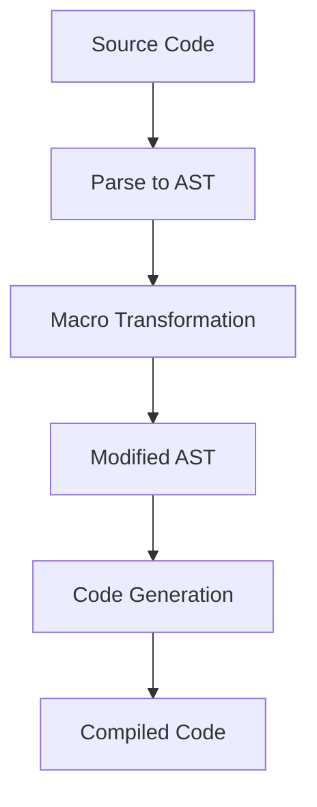

## 9.1 Introduction to Haxe Macros

In the realm of software development, the ability to write code that writes code is a powerful tool. Haxe macros provide this capability, offering developers a way to perform compile-time metaprogramming. This section will delve into the intricacies of Haxe macros, exploring their definition, capabilities, use cases, and practical applications. By the end of this guide, you'll have a solid understanding of how to leverage Haxe macros to enhance your development workflow.

### Definition of Haxe Macros

Haxe macros are a feature of the Haxe programming language that allows developers to perform compile-time metaprogramming. This means that macros can manipulate the code before it is compiled, enabling the generation and transformation of code. The primary goal of macros is to provide a mechanism for automating repetitive tasks, optimizing performance, and enabling advanced programming techniques.

### Capabilities of Haxe Macros

#### AST Manipulation

One of the core capabilities of Haxe macros is the ability to manipulate the Abstract Syntax Tree (AST). The AST is a tree representation of the source code, where each node represents a construct occurring in the source code. By accessing and modifying the AST, macros can transform the code in powerful ways.

```haxe
import haxe.macro.Expr;

class MacroExample {
    static macro function addLogging(expr:Expr):Expr {
        return macro {
            trace("Entering function");
            $expr;
            trace("Exiting function");
        };
    }
}
```

In this example, the `addLogging` macro takes an expression and wraps it with logging statements. This demonstrates how macros can be used to inject additional behavior into existing code.

#### Conditional Compilation

Haxe macros also support conditional compilation, allowing developers to generate code based on compile-time conditions. This is particularly useful for cross-platform development, where different platforms may require different implementations.

```haxe
#if js
    trace("JavaScript platform");
#elseif cpp
    trace("C++ platform");
#end
```

This example shows how conditional compilation can be used to include platform-specific code. The `#if`, `#elseif`, and `#end` directives allow you to specify conditions under which certain code blocks should be included or excluded.

### Use Cases for Haxe Macros

#### Eliminating Boilerplate Code

One of the most common use cases for Haxe macros is the elimination of boilerplate code. Boilerplate code refers to sections of code that are repeated in multiple places with little to no variation. Macros can automate the generation of such code, reducing redundancy and potential errors.

```haxe
class Entity {
    public var id:Int;
    public var name:String;

    public function new(id:Int, name:String) {
        this.id = id;
        this.name = name;
    }
}

class EntityMacro {
    static macro function generateEntity(fields:Array<{name:String, type:String}>):Expr {
        var fieldExprs = fields.map(function(field) {
            return macro public var ${field.name}:${field.type};
        });
        return macro {
            class Entity {
                $fieldExprs;
            }
        };
    }
}
```

In this example, the `generateEntity` macro generates a class with fields based on the provided array of field definitions. This reduces the need to manually write repetitive class definitions.

#### Creating Custom DSLs

Haxe macros can also be used to create custom domain-specific languages (DSLs) within Haxe. A DSL is a specialized language tailored to a specific application domain. By embedding a DSL within Haxe, developers can create more expressive and concise code.

```haxe
class DSLExample {
    static macro function defineDSL():Expr {
        return macro {
            function greet(name:String) {
                trace("Hello, " + name);
            }
        };
    }
}
```

This example demonstrates how a simple DSL for greeting can be defined using macros. The `defineDSL` macro generates a function that takes a name and prints a greeting message.

### Practical Applications of Haxe Macros

#### Code Optimization

Macros can be used to optimize code by performing transformations that improve performance. For example, a macro could inline functions or unroll loops to reduce the overhead of function calls or loop iterations.

```haxe
class OptimizationMacro {
    static macro function inlineFunction(expr:Expr):Expr {
        return switch(expr) {
            case { expr: EFunction(f) }:
                // Inline the function body
                f.expr;
            default:
                expr;
        }
    }
}
```

In this example, the `inlineFunction` macro attempts to inline a function by replacing the function call with the function body. This can lead to performance improvements by eliminating the overhead of function calls.

#### Code Validation

Macros can also be used for code validation, ensuring that certain conditions are met before the code is compiled. This can help catch errors early in the development process.

```haxe
class ValidationMacro {
    static macro function validateNonNull(expr:Expr):Expr {
        return switch(expr) {
            case { expr: EConst(CNull) }:
                throw "Null value not allowed";
            default:
                expr;
        }
    }
}
```

In this example, the `validateNonNull` macro checks if an expression is null and throws an error if it is. This ensures that null values are not used in places where they are not allowed.

### Try It Yourself

To get hands-on experience with Haxe macros, try modifying the examples provided. For instance, you can:

- Add additional logging statements in the `addLogging` macro.
- Create a new macro that generates a class with methods instead of fields.
- Experiment with conditional compilation by adding more platform-specific code blocks.

### Visualizing Haxe Macros

To better understand how Haxe macros work, let's visualize the process of AST manipulation using a flowchart.



**Figure 1: The Process of AST Manipulation in Haxe Macros**

This flowchart illustrates the steps involved in using Haxe macros to transform code. The source code is first parsed into an AST, which is then transformed by macros. The modified AST is used to generate the final compiled code.

### References and Links

For further reading on Haxe macros and metaprogramming, consider the following resources:

- [Haxe Macros Documentation](https://haxe.org/manual/macro.html)
- [Metaprogramming in Haxe](https://haxe.org/blog/metaprogramming/)
- [Haxe Language Reference](https://haxe.org/manual/)

### Knowledge Check

Before moving on, let's review some key concepts:

- **What are Haxe macros?** Haxe macros are a feature that allows compile-time metaprogramming, enabling code generation and transformation.
- **What is AST manipulation?** AST manipulation involves accessing and modifying the Abstract Syntax Tree to transform code.
- **How can macros eliminate boilerplate code?** Macros can automate the generation of repetitive code, reducing redundancy and potential errors.

### Embrace the Journey

Remember, mastering Haxe macros is a journey. As you explore and experiment with macros, you'll discover new ways to optimize your code and enhance your development workflow. Stay curious, keep experimenting, and enjoy the process of learning and growing as a developer.

## Quiz Time!



### What is the primary purpose of Haxe macros?

- [x] Compile-time metaprogramming
- [ ] Runtime code execution
- [ ] Memory management
- [ ] Error handling

> **Explanation:** Haxe macros are used for compile-time metaprogramming, allowing code generation and transformation before compilation.

### What does AST stand for in the context of Haxe macros?

- [x] Abstract Syntax Tree
- [ ] Advanced Syntax Tree
- [ ] Abstract Semantic Tree
- [ ] Advanced Semantic Tree

> **Explanation:** AST stands for Abstract Syntax Tree, which is a tree representation of the source code used in macros for code transformation.

### How can Haxe macros help in cross-platform development?

- [x] By using conditional compilation to generate platform-specific code
- [ ] By managing memory allocation across platforms
- [ ] By providing runtime debugging tools
- [ ] By handling network communication

> **Explanation:** Haxe macros can use conditional compilation to include or exclude code based on the target platform, aiding cross-platform development.

### Which of the following is a use case for Haxe macros?

- [x] Eliminating boilerplate code
- [ ] Managing runtime exceptions
- [ ] Handling user input
- [ ] Rendering graphics

> **Explanation:** Haxe macros can automate the generation of repetitive code, reducing boilerplate and potential errors.

### What is a domain-specific language (DSL)?

- [x] A specialized language tailored to a specific application domain
- [ ] A general-purpose programming language
- [ ] A language used for database queries
- [ ] A language for web development

> **Explanation:** A DSL is a specialized language designed for a specific application domain, which can be embedded in Haxe using macros.

### What is the role of the `#if` directive in Haxe macros?

- [x] It is used for conditional compilation
- [ ] It defines a new macro
- [ ] It declares a variable
- [ ] It handles exceptions

> **Explanation:** The `#if` directive is used for conditional compilation, allowing code to be included or excluded based on compile-time conditions.

### How can macros optimize code?

- [x] By performing transformations that improve performance
- [ ] By managing memory allocation
- [ ] By handling user input
- [ ] By rendering graphics

> **Explanation:** Macros can optimize code by transforming it in ways that improve performance, such as inlining functions or unrolling loops.

### What is the benefit of using macros for code validation?

- [x] They can catch errors early in the development process
- [ ] They improve runtime performance
- [ ] They enhance user interface design
- [ ] They manage database connections

> **Explanation:** Macros can validate code at compile-time, catching errors early and preventing them from reaching runtime.

### What is the first step in the process of AST manipulation?

- [x] Parsing the source code to an AST
- [ ] Generating the final compiled code
- [ ] Modifying the AST
- [ ] Executing the code

> **Explanation:** The first step in AST manipulation is parsing the source code into an Abstract Syntax Tree.

### True or False: Haxe macros can only be used for code generation.

- [ ] True
- [x] False

> **Explanation:** False. Haxe macros can be used for code generation, transformation, optimization, and validation.




