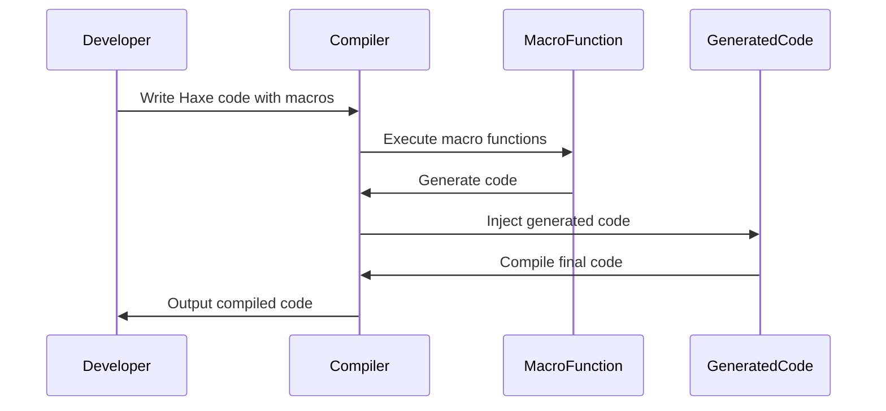

## 9.2 Compile-Time Code Generation

In the realm of software development, compile-time code generation stands as a powerful technique that allows developers to generate code during the compilation process rather than at runtime. This approach can lead to more efficient, maintainable, and error-free code. In Haxe, compile-time code generation is primarily achieved through the use of macros, which provide a robust mechanism for code manipulation and generation.

### Understanding Compile-Time Code Generation

Compile-time code generation involves creating or transforming code during the compilation phase. This process can optimize performance, reduce boilerplate code, and enforce consistency across large codebases. By generating code at compile time, developers can ensure that the generated code is type-safe and free from runtime errors that might otherwise occur with dynamically generated code.

### Implementing Compile-Time Code Generation in Haxe

Haxe offers a unique and powerful macro system that facilitates compile-time code generation. Macros in Haxe are functions that are executed during the compilation process, allowing developers to manipulate the Abstract Syntax Tree (AST) and generate new code.

#### Macro Functions

Macro functions in Haxe are defined with the `macro` keyword. These functions operate on the AST, enabling developers to analyze and transform code before it is compiled. Here's a simple example of a macro function:

```haxe
class Main {
    static function main() {
        trace(greet("World"));
    }

    macro static function greet(name: String): haxe.macro.Expr {
        return macro "Hello, " + $v{name} + "!";
    }
}
```

In this example, the `greet` function is a macro that generates a string concatenation expression at compile time. The `$v{name}` syntax is used to insert the value of the `name` variable into the generated code.

#### Code Injection

Code injection is the process of inserting generated code directly into your program. This can be achieved using Haxe macros to dynamically create and inject code based on specific conditions or metadata.

Consider the following example, where we inject a method into a class at compile time:

```haxe
class Main {
    static function main() {
        var obj = new MyClass();
        obj.sayHello();
    }
}

class MyClass {
    public function new() {}

    macro static function injectMethod(): haxe.macro.Expr {
        return macro {
            public function sayHello() {
                trace("Hello from injected method!");
            }
        };
    }
}

@:build(MyClass.injectMethod())
class MyClass {}
```

In this example, the `injectMethod` macro injects a `sayHello` method into the `MyClass` class. The `@:build` metadata is used to specify that the macro should be executed during the build process.

### Use Cases and Examples

Compile-time code generation in Haxe can be applied to a variety of use cases, enhancing both the efficiency and maintainability of your codebase.

#### Annotations

Annotations in Haxe can be used to attach metadata to classes, fields, or methods. This metadata can then be leveraged by macros to generate code based on the annotated elements.

For example, consider a scenario where we want to automatically generate getter and setter methods for fields annotated with `@property`:

```haxe
class Main {
    static function main() {
        var person = new Person();
        person.setName("Alice");
        trace(person.getName());
    }
}

class Person {
    @property var name: String;

    macro static function generateAccessors(): haxe.macro.Expr {
        var fields = Context.getBuildFields();
        var accessors = [];
        for (field in fields) {
            if (field.meta.has(":property")) {
                accessors.push(macro {
                    public function get${field.name.capitalize()}(): ${field.type} {
                        return this.${field.name};
                    }
                    public function set${field.name.capitalize()}(value: ${field.type}): Void {
                        this.${field.name} = value;
                    }
                });
            }
        }
        return macro { $a{accessors} };
    }
}

@:build(Person.generateAccessors())
class Person {}
```

In this example, the `generateAccessors` macro generates getter and setter methods for any field annotated with `@property`. The `Context.getBuildFields()` function retrieves the fields of the class, and the macro constructs the appropriate methods.

#### Serialization

Serialization is another common use case for compile-time code generation. By generating serialization code at compile time, we can ensure that our objects are serialized and deserialized efficiently and consistently.

Here's an example of a macro that generates serialization methods for a class:

```haxe
class Main {
    static function main() {
        var person = new Person("Alice", 30);
        var serialized = person.serialize();
        trace(serialized);
        var deserialized = Person.deserialize(serialized);
        trace(deserialized);
    }
}

class Person {
    public var name: String;
    public var age: Int;

    public function new(name: String, age: Int) {
        this.name = name;
        this.age = age;
    }

    macro static function generateSerialization(): haxe.macro.Expr {
        var fields = Context.getBuildFields();
        var serializeCode = [];
        var deserializeCode = [];
        for (field in fields) {
            serializeCode.push(macro '"${field.name}":' + Std.string(this.${field.name}));
            deserializeCode.push(macro '${field.name}: Std.parseInt(data["${field.name}"])');
        }
        return macro {
            public function serialize(): String {
                return "{" + ${serializeCode.join(",")} + "}";
            }
            public static function deserialize(data: String): Person {
                var obj = haxe.Json.parse(data);
                return new Person(${deserializeCode.join(",")});
            }
        };
    }
}

@:build(Person.generateSerialization())
class Person {}
```

In this example, the `generateSerialization` macro generates `serialize` and `deserialize` methods for the `Person` class. The `serialize` method converts the object's fields into a JSON string, while the `deserialize` method reconstructs the object from a JSON string.

### Visualizing Compile-Time Code Generation

To better understand the process of compile-time code generation in Haxe, let's visualize the flow of macro execution and code generation using a sequence diagram.



This diagram illustrates the interaction between the developer, the compiler, macro functions, and the generated code. The developer writes Haxe code that includes macros, which are executed by the compiler to generate additional code. The generated code is then injected into the final compiled output.

### Try It Yourself

To truly grasp the power of compile-time code generation in Haxe, we encourage you to experiment with the examples provided. Try modifying the macro functions to generate different types of code or apply them to new use cases. Here are a few suggestions:

- Modify the `greet` macro to generate a personalized greeting based on additional metadata.
- Extend the `generateAccessors` macro to include validation logic in the setter methods.
- Create a macro that generates logging code for all methods in a class.

### References and Links

For further reading and a deeper dive into Haxe macros and compile-time code generation, consider exploring the following resources:

- [Haxe Macros Documentation](https://haxe.org/manual/macro.html)
- [Haxe Language Reference](https://haxe.org/manual/)
- [Haxe Compiler Internals](https://haxe.org/manual/compiler.html)

### Knowledge Check

To reinforce your understanding of compile-time code generation in Haxe, let's summarize the key takeaways:

- Compile-time code generation allows for efficient and type-safe code generation during the compilation process.
- Haxe macros provide a powerful mechanism for manipulating the AST and generating code.
- Use cases for compile-time code generation include annotations, serialization, and code injection.
- Experimenting with macros can lead to more maintainable and consistent codebases.

Remember, this is just the beginning. As you progress, you'll discover even more ways to leverage compile-time code generation in Haxe to create robust and efficient applications. Keep experimenting, stay curious, and enjoy the journey!

## Quiz Time!



### What is the primary purpose of compile-time code generation?

- [x] To generate code during the compilation process
- [ ] To execute code at runtime
- [ ] To optimize runtime performance
- [ ] To handle runtime exceptions

> **Explanation:** Compile-time code generation involves creating code during the compilation phase, not at runtime.

### How are macro functions defined in Haxe?

- [x] Using the `macro` keyword
- [ ] Using the `function` keyword
- [ ] Using the `static` keyword
- [ ] Using the `override` keyword

> **Explanation:** Macro functions in Haxe are defined with the `macro` keyword, allowing them to manipulate the AST.

### What is a common use case for compile-time code generation in Haxe?

- [x] Serialization
- [ ] Networking
- [ ] User Interface Design
- [ ] Database Management

> **Explanation:** Serialization is a common use case for compile-time code generation, allowing for efficient and consistent object serialization.

### What does the `@:build` metadata do in Haxe?

- [x] Specifies that a macro should be executed during the build process
- [ ] Indicates a deprecated method
- [ ] Marks a method as abstract
- [ ] Declares a constant value

> **Explanation:** The `@:build` metadata is used to specify that a macro should be executed during the build process.

### In the provided example, what does the `generateAccessors` macro do?

- [x] Generates getter and setter methods for annotated fields
- [ ] Serializes objects to JSON
- [ ] Injects logging code into methods
- [ ] Compiles code into a binary format

> **Explanation:** The `generateAccessors` macro generates getter and setter methods for fields annotated with `@property`.

### What is the role of the `Context.getBuildFields()` function in a macro?

- [x] Retrieves the fields of a class during the build process
- [ ] Executes a macro function
- [ ] Compiles the final code
- [ ] Parses JSON data

> **Explanation:** The `Context.getBuildFields()` function retrieves the fields of a class during the build process, allowing macros to generate code based on those fields.

### Which of the following is NOT a benefit of compile-time code generation?

- [ ] Type-safe code generation
- [ ] Reduced boilerplate code
- [ ] Consistent codebase
- [x] Increased runtime flexibility

> **Explanation:** Compile-time code generation focuses on generating code during compilation, not increasing runtime flexibility.

### What is the purpose of the `$v{name}` syntax in a macro?

- [x] To insert the value of a variable into the generated code
- [ ] To declare a new variable
- [ ] To define a function
- [ ] To create a loop

> **Explanation:** The `$v{name}` syntax is used to insert the value of a variable into the generated code within a macro.

### How can you experiment with macros in Haxe?

- [x] By modifying existing macro functions and applying them to new use cases
- [ ] By writing runtime scripts
- [ ] By using a different programming language
- [ ] By compiling code without macros

> **Explanation:** Experimenting with macros involves modifying existing macro functions and applying them to new use cases.

### True or False: Compile-time code generation can help enforce consistency across large codebases.

- [x] True
- [ ] False

> **Explanation:** Compile-time code generation can enforce consistency by generating standardized code across large codebases.


