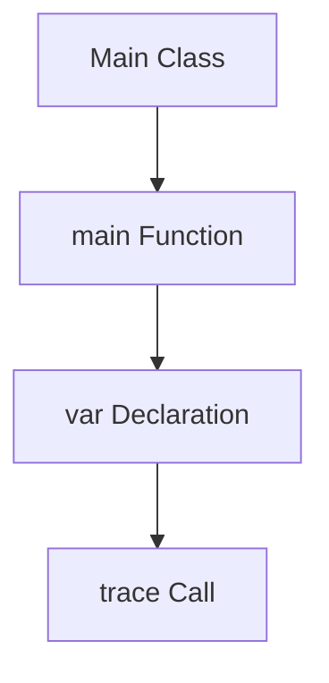
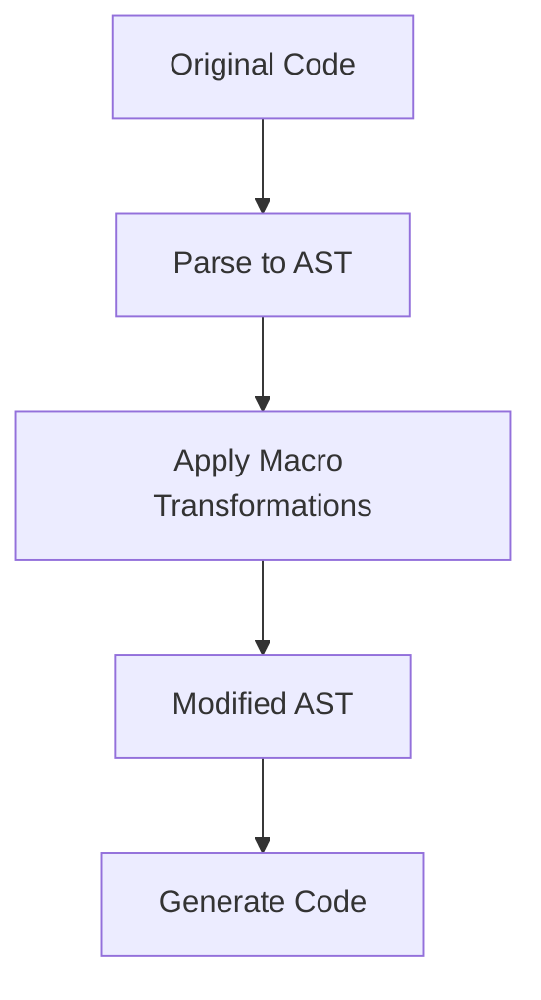

## 9.3 AST Manipulation and Transformation

In the realm of Haxe programming, Abstract Syntax Tree (AST) manipulation and transformation stand as powerful techniques that allow developers to directly interact with the code's structure. This capability is particularly useful for optimizing performance, implementing custom compile-time checks, and even generating code dynamically. In this section, we'll delve into the intricacies of AST manipulation and transformation, providing you with the knowledge and tools to harness this advanced feature of Haxe.

### Understanding the AST Structure

Before we dive into manipulating the AST, it's crucial to understand what an AST is and how it represents code. An AST is a tree representation of the abstract syntactic structure of source code. Each node in the tree denotes a construct occurring in the source code.

#### Key Components of Haxe's AST

- **Expressions:** These are the building blocks of the AST, representing operations, values, and control structures.
- **Statements:** These include constructs like loops, conditionals, and function declarations.
- **Types:** Representations of data types in the code.
- **Declarations:** Nodes that define variables, functions, and classes.

#### Visualizing the AST

To better understand the AST, let's visualize a simple Haxe code snippet and its corresponding AST structure.

```haxe
class Main {
    static function main() {
        var x = 10;
        trace(x);
    }
}
```



In this diagram, the `Main` class contains a `main` function, which in turn contains a variable declaration and a trace call.

### Implementing AST Manipulation in Haxe

Haxe provides a robust macro system that allows developers to manipulate the AST at compile time. This capability enables the creation of powerful transformations and optimizations.

#### Writing Macros for AST Manipulation

Macros in Haxe are special functions that operate on the AST. They can be used to generate, modify, or analyze code before it is compiled.

**Example: A Simple Macro**

Let's start with a simple macro that modifies a variable declaration.

```haxe
import haxe.macro.Expr;

class MyMacro {
    public static macro function modifyVarDeclaration(e:Expr):Expr {
        switch e {
            case { expr: EVar(v), pos: p }:
                return macro var $v = 42;
            default:
                return e;
        }
    }
}
```

In this example, the macro `modifyVarDeclaration` changes any variable declaration to initialize the variable with the value `42`.

#### Transformations: Traversing and Modifying the AST

To perform more complex transformations, we need to traverse the AST and apply modifications where necessary.

**Example: Transforming a Function Call**

Suppose we want to transform all `trace` calls to include a prefix message.

```haxe
import haxe.macro.Expr;

class MyMacro {
    public static macro function transformTraceCalls(e:Expr):Expr {
        return switch e {
            case { expr: ECall({ expr: EField(_, "trace") }, args), pos: p }:
                macro trace("Prefix: " + $args[0]);
            default:
                e;
        };
    }
}
```

In this macro, we check for `trace` calls and modify them to include a prefix message.

### Use Cases and Examples

AST manipulation in Haxe opens up a wide range of possibilities. Let's explore some practical use cases.

#### Optimization

One of the primary use cases for AST manipulation is code optimization. By transforming the AST, we can improve the performance of the generated code.

**Example: Inline Function Calls**

We can write a macro to inline simple function calls, reducing the overhead of function invocation.

```haxe
import haxe.macro.Expr;

class InlineMacro {
    public static macro function inlineFunction(e:Expr):Expr {
        switch e {
            case { expr: ECall({ expr: EFunction(f) }, args), pos: p }:
                return f.expr;
            default:
                return e;
        }
    }
}
```

This macro inlines function calls by replacing them with the function's body.

#### Code Analysis

Another powerful application of AST manipulation is code analysis. We can implement custom compile-time checks to enforce coding standards or detect potential issues.

**Example: Detecting Unused Variables**

We can write a macro to analyze the AST and detect unused variables in the code.

```haxe
import haxe.macro.Expr;

class AnalysisMacro {
    public static macro function detectUnusedVars(e:Expr):Expr {
        // Pseudo-code for detecting unused variables
        // Traverse the AST and collect variable declarations
        // Check if each variable is used in the code
        // Report any unused variables
        return e;
    }
}
```

While the above example is pseudo-code, it illustrates the concept of using AST manipulation for code analysis.

### Try It Yourself

To truly master AST manipulation, it's essential to experiment with the concepts and examples provided. Here are some suggestions for modifications and experiments:

- **Modify the `transformTraceCalls` macro** to append a suffix message instead of a prefix.
- **Create a macro** that transforms all `if` statements into `switch` statements.
- **Implement a macro** that automatically adds logging to all function entries and exits.

### Visualizing AST Transformations

To further aid understanding, let's visualize the transformation process using a flowchart.



This flowchart illustrates the process of parsing code into an AST, applying macro transformations, and generating the modified code.

### References and Links

For further reading and deeper dives into AST manipulation and transformation, consider exploring the following resources:

- [Haxe Macros Documentation](https://haxe.org/manual/macro.html)
- [Understanding Abstract Syntax Trees](https://en.wikipedia.org/wiki/Abstract_syntax_tree)
- [Advanced Haxe Programming Techniques](https://haxe.org/documentation/)

### Knowledge Check

To reinforce your understanding of AST manipulation and transformation, consider the following questions and exercises:

- **What is an AST, and why is it important in programming?**
- **How can macros be used to optimize code performance?**
- **Experiment with writing a macro that transforms all `for` loops into `while` loops.**

### Embrace the Journey

Remember, mastering AST manipulation and transformation is a journey. As you progress, you'll unlock new possibilities for optimizing and analyzing code. Keep experimenting, stay curious, and enjoy the journey!

## Quiz Time!



### What is an AST in programming?

- [x] A tree representation of the abstract syntactic structure of source code.
- [ ] A binary representation of compiled code.
- [ ] A list of all variables in a program.
- [ ] A graphical representation of program flow.

> **Explanation:** An AST, or Abstract Syntax Tree, is a tree representation of the abstract syntactic structure of source code.

### What is the primary purpose of AST manipulation in Haxe?

- [x] To optimize code and implement custom compile-time checks.
- [ ] To generate binary executables.
- [ ] To create user interfaces.
- [ ] To manage memory allocation.

> **Explanation:** AST manipulation is primarily used to optimize code and implement custom compile-time checks in Haxe.

### Which Haxe feature allows for AST manipulation?

- [x] Macros
- [ ] Interfaces
- [ ] Enums
- [ ] Abstract types

> **Explanation:** Haxe macros allow for AST manipulation, enabling developers to modify code at compile time.

### In the provided macro example, what does the `modifyVarDeclaration` macro do?

- [x] Changes any variable declaration to initialize the variable with the value `42`.
- [ ] Deletes all variable declarations.
- [ ] Converts variables to constants.
- [ ] Renames all variables to `x`.

> **Explanation:** The `modifyVarDeclaration` macro changes any variable declaration to initialize the variable with the value `42`.

### What is a practical use case for AST manipulation?

- [x] Code optimization
- [ ] User interface design
- [ ] Network communication
- [ ] File I/O operations

> **Explanation:** A practical use case for AST manipulation is code optimization, where transformations can improve performance.

### How can macros be used for code analysis?

- [x] By implementing custom compile-time checks to enforce coding standards.
- [ ] By generating runtime exceptions.
- [ ] By creating graphical user interfaces.
- [ ] By managing memory allocation.

> **Explanation:** Macros can be used for code analysis by implementing custom compile-time checks to enforce coding standards.

### What is the result of applying the `transformTraceCalls` macro?

- [x] Modifies `trace` calls to include a prefix message.
- [ ] Deletes all `trace` calls.
- [ ] Converts `trace` calls to `print` calls.
- [ ] Renames `trace` calls to `log`.

> **Explanation:** The `transformTraceCalls` macro modifies `trace` calls to include a prefix message.

### What is a key component of Haxe's AST?

- [x] Expressions
- [ ] Widgets
- [ ] Threads
- [ ] Files

> **Explanation:** Expressions are a key component of Haxe's AST, representing operations, values, and control structures.

### True or False: AST manipulation can only be used for optimization.

- [ ] True
- [x] False

> **Explanation:** False. AST manipulation can be used for optimization, code analysis, and other transformations.

### What is the first step in the AST transformation process?

- [x] Parse code into an AST.
- [ ] Generate code.
- [ ] Apply macro transformations.
- [ ] Compile the code.

> **Explanation:** The first step in the AST transformation process is to parse code into an AST.



By understanding and applying AST manipulation and transformation in Haxe, you can unlock powerful capabilities for optimizing and analyzing your code. Keep exploring and experimenting to master this advanced feature of Haxe programming!
