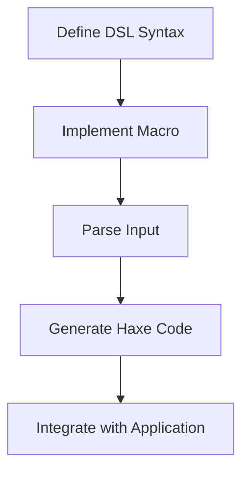

## 9.4 Building Domain-Specific Languages with Macros

In the realm of software engineering, Domain-Specific Languages (DSLs) serve as powerful tools that allow developers to express solutions in terms that are closer to the problem domain. By leveraging Haxe's macro system, we can create DSLs that enhance expressiveness and efficiency. This section will guide you through the process of building DSLs using Haxe macros, providing you with the knowledge to tailor mini-languages to specific problem domains.

### Understanding Domain-Specific Languages

**Definition:** A Domain-Specific Language (DSL) is a specialized mini-language designed to solve problems within a specific domain. Unlike general-purpose programming languages, DSLs offer constructs and syntax that are closely aligned with the domain they target, making them more intuitive and efficient for domain experts.

**Types of DSLs:**
- **Internal DSLs:** Embedded within a host language, leveraging its syntax and semantics.
- **External DSLs:** Standalone languages with their own syntax, often requiring a separate parser or interpreter.

### Implementing DSLs in Haxe

Haxe's powerful macro system allows us to create both internal and external DSLs. Let's explore how we can achieve this.

#### Custom Syntax with Macros

**Custom Syntax:** By using macros, we can parse and interpret new syntax constructs within Haxe. This allows us to extend the language's capabilities and introduce domain-specific constructs.

**Example: Creating a Simple Query Language**

Let's create a simple query language embedded within Haxe. This DSL will allow us to write SQL-like queries directly in our Haxe code.

```haxe
import haxe.macro.Context;
import haxe.macro.Expr;

class QueryMacro {
    public static macro function query(expr:Expr):Expr {
        switch (expr) {
            case { expr: EConst(CString(query)) }:
                return parseQuery(query);
            default:
                Context.error("Invalid query syntax", expr.pos);
        }
    }

    static function parseQuery(query:String):Expr {
        // Parse the query string and generate Haxe code
        // For simplicity, let's assume a basic SELECT statement
        if (query.startsWith("SELECT")) {
            return macro trace("Executing query: " + $v{query});
        } else {
            Context.error("Unsupported query type", Context.currentPos());
        }
    }
}
```

**Usage:**

```haxe
class Main {
    static function main() {
        QueryMacro.query("SELECT * FROM users WHERE age > 30");
    }
}
```

In this example, we define a macro `query` that parses a SQL-like string and generates Haxe code to execute the query. This is a simple demonstration of how macros can be used to introduce custom syntax.

#### Embedded DSLs

**Embedded DSLs:** These are DSLs that are integrated within the host language, allowing domain-specific expressions to coexist with regular Haxe code.

**Example: Configuration Language**

Let's create a configuration DSL that allows us to define application settings in a more readable format.

```haxe
import haxe.macro.Context;
import haxe.macro.Expr;

class ConfigMacro {
    public static macro function config(expr:Expr):Expr {
        switch (expr) {
            case { expr: EConst(CString(config)) }:
                return parseConfig(config);
            default:
                Context.error("Invalid configuration syntax", expr.pos);
        }
    }

    static function parseConfig(config:String):Expr {
        // Parse the configuration string and generate Haxe code
        // For simplicity, let's assume key-value pairs
        var settings = config.split("\n").map(function(line) {
            var parts = line.split(":");
            return { key: parts[0].trim(), value: parts[1].trim() };
        });
        return macro {
            var config = new Map<String, String>();
            $settings.forEach(function(setting) {
                config.set(setting.key, setting.value);
            });
            config;
        };
    }
}
```

**Usage:**

```haxe
class Main {
    static function main() {
        var settings = ConfigMacro.config("
            host: localhost
            port: 8080
            debug: true
        ");
        trace(settings.get("host")); // Outputs: localhost
    }
}
```

In this example, we define a macro `config` that parses a configuration string and generates Haxe code to create a map of settings. This demonstrates how embedded DSLs can simplify configuration management.

### Use Cases and Examples

#### Query Languages

**Query Languages:** DSLs can be used to embed SQL-like syntax for database queries, allowing developers to write queries in a more intuitive manner.

**Example:**

```haxe
QueryMacro.query("SELECT name, age FROM users WHERE active = true");
```

This example shows how a query DSL can be used to express database queries directly in Haxe code, improving readability and maintainability.

#### Configuration Languages

**Configuration Languages:** DSLs can define custom configuration syntax, making it easier to manage application settings.

**Example:**

```haxe
ConfigMacro.config("
    theme: dark
    language: en-US
    timeout: 30
");
```

This example illustrates how a configuration DSL can simplify the process of defining application settings, reducing the likelihood of errors and improving clarity.

### Visualizing DSL Implementation

To better understand the process of implementing DSLs with macros, let's visualize the workflow using a flowchart.



**Diagram Description:** This flowchart represents the steps involved in implementing a DSL with macros. We start by defining the DSL syntax, then implement a macro to parse the input and generate Haxe code, which is finally integrated with the application.

### References and Links

For further reading on DSLs and macros, consider the following resources:

- [Haxe Macros Documentation](https://haxe.org/manual/macro.html)
- [Domain-Specific Languages Book by Martin Fowler](https://martinfowler.com/books/dsl.html)
- [Meta-Programming in Haxe](https://haxe.org/manual/macro-meta.html)

### Knowledge Check

Let's reinforce our understanding with a few questions and exercises.

- **Question:** What are the main differences between internal and external DSLs?
- **Exercise:** Modify the query DSL to support `INSERT` statements.
- **Challenge:** Create a DSL for defining UI components in Haxe.

### Embrace the Journey

Remember, building DSLs is a journey that requires creativity and experimentation. As you progress, you'll discover new ways to enhance your software's expressiveness and efficiency. Keep exploring, stay curious, and enjoy the process!

## Quiz Time!



### What is a Domain-Specific Language (DSL)?

- [x] A specialized mini-language designed for a specific domain
- [ ] A general-purpose programming language
- [ ] A type of database query language
- [ ] A language used for web development

> **Explanation:** A DSL is a specialized mini-language designed to solve problems within a specific domain.

### What is the primary advantage of using DSLs?

- [x] They offer constructs closely aligned with the problem domain
- [ ] They are faster than general-purpose languages
- [ ] They are easier to learn than other languages
- [ ] They are used for web development

> **Explanation:** DSLs offer constructs and syntax that are closely aligned with the domain they target, making them more intuitive and efficient for domain experts.

### How can macros be used in Haxe to create DSLs?

- [x] By parsing and interpreting new syntax constructs
- [ ] By compiling code faster
- [ ] By improving memory management
- [ ] By enhancing security

> **Explanation:** Macros in Haxe can parse and interpret new syntax constructs, allowing for the creation of DSLs.

### What is an embedded DSL?

- [x] A DSL integrated within a host language
- [ ] A standalone language with its own syntax
- [ ] A type of database query language
- [ ] A language used for web development

> **Explanation:** An embedded DSL is integrated within the host language, leveraging its syntax and semantics.

### What is the purpose of the `query` macro in the example?

- [x] To parse SQL-like strings and generate Haxe code
- [ ] To improve code performance
- [ ] To handle exceptions
- [ ] To manage memory

> **Explanation:** The `query` macro parses SQL-like strings and generates Haxe code to execute the query.

### What is the role of the `parseConfig` function in the configuration DSL example?

- [x] To parse the configuration string and generate Haxe code
- [ ] To compile the configuration into binary
- [ ] To handle errors in the configuration
- [ ] To improve performance

> **Explanation:** The `parseConfig` function parses the configuration string and generates Haxe code to create a map of settings.

### What is the first step in implementing a DSL with macros?

- [x] Define the DSL syntax
- [ ] Write the application code
- [ ] Compile the code
- [ ] Test the application

> **Explanation:** The first step in implementing a DSL with macros is to define the DSL syntax.

### What is the benefit of using a configuration DSL?

- [x] It simplifies the process of defining application settings
- [ ] It improves application performance
- [ ] It enhances security
- [ ] It reduces memory usage

> **Explanation:** A configuration DSL simplifies the process of defining application settings, reducing the likelihood of errors and improving clarity.

### What is the purpose of the flowchart in the article?

- [x] To visualize the workflow of implementing a DSL with macros
- [ ] To show the performance of the application
- [ ] To illustrate the memory usage
- [ ] To demonstrate security features

> **Explanation:** The flowchart visualizes the workflow of implementing a DSL with macros, showing the steps involved in the process.

### True or False: External DSLs are embedded within a host language.

- [ ] True
- [x] False

> **Explanation:** External DSLs are standalone languages with their own syntax, not embedded within a host language.


