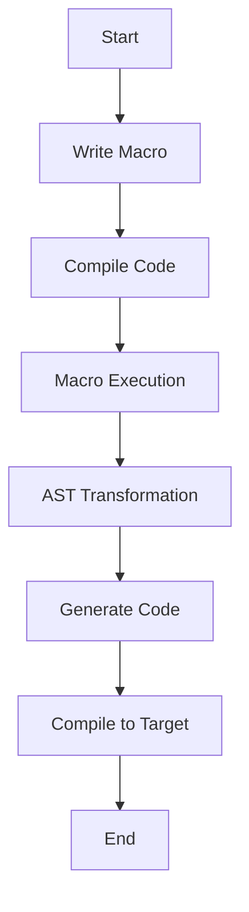

## 9.5 Meta-Programming Best Practices

Meta-programming in Haxe, particularly through its powerful macro system, offers developers the ability to manipulate code at compile-time, enabling advanced optimizations and code generation techniques. However, with great power comes great responsibility. In this section, we will explore best practices for meta-programming in Haxe, focusing on maintainability, debugging support, performance considerations, and common pitfalls to avoid.

### Understanding Meta-Programming in Haxe

Meta-programming refers to the practice of writing programs that can generate or manipulate other programs or themselves. In Haxe, this is primarily achieved through macros, which are special functions that run at compile-time and can transform the Abstract Syntax Tree (AST) of the code.

#### Key Concepts

- **Macros**: Functions that operate on the code's AST during compilation.
- **AST (Abstract Syntax Tree)**: A tree representation of the source code structure.
- **Compile-Time Code Generation**: Creating or modifying code during the compilation process.

### Best Practices for Meta-Programming

#### Maintainability

1. **Keep Macro Code Clean and Well-Documented**

   - **Explain Your Code**: Use comments to explain the purpose and functionality of your macros. This is crucial as macro code can become complex and difficult to understand.
   - **Organize Code**: Structure your macro code logically, using functions and modules to separate concerns.

   ```haxe
   // Example of a simple macro function
   macro static public function addLogging(expr:Expr):Expr {
       // This macro adds logging to a function
       return macro {
           trace("Entering function");
           $expr;
           trace("Exiting function");
       };
   }
   ```

2. **Provide Meaningful Error Messages**

   - **Use `haxe.macro.Context.error`**: When writing macros, use this function to provide clear and informative error messages that help developers understand what went wrong.

   ```haxe
   import haxe.macro.Context;

   macro static public function checkType(expr:Expr):Expr {
       if (expr.expr != ExprDef.EConst(CInt)) {
           Context.error("Expected an integer constant", expr.pos);
       }
       return expr;
   }
   ```

#### Debugging Support

1. **Use Debugging Tools**

   - **Leverage Haxe's Debugging Capabilities**: Use the `haxe.macro.Context` API to inspect and debug macros. This includes printing the AST or using the `trace` function to output intermediate results.

   ```haxe
   import haxe.macro.Context;

   macro static public function debugMacro(expr:Expr):Expr {
       trace(Context.toString(expr)); // Print the AST
       return expr;
   }
   ```

2. **Test Macros Thoroughly**

   - **Create Unit Tests**: Write tests for your macros to ensure they behave as expected. This can help catch errors early and ensure reliability.

#### Performance Considerations

1. **Minimize Macro Execution Time**

   - **Optimize AST Traversal**: Avoid unnecessary traversals of the AST. Use efficient algorithms and data structures to minimize the time spent in macros.

   ```haxe
   macro static public function optimizeTraversal(expr:Expr):Expr {
       // Efficiently traverse and transform the AST
       return expr;
   }
   ```

2. **Avoid Overhead**

   - **Limit Macro Complexity**: Keep macros simple and focused on specific tasks to avoid adding unnecessary overhead to the compilation process.

#### Pitfalls to Avoid

1. **Overcomplicating Code**

   - **Use Macros Judiciously**: Only use macros when necessary. Overuse can lead to a complex and hard-to-maintain codebase.

2. **Hidden Behavior**

   - **Ensure Transparency**: Make sure that the generated code is clear and understandable to users. Avoid generating code that behaves in unexpected ways.

### Visualizing Meta-Programming Concepts

To better understand the flow of meta-programming in Haxe, let's visualize the process using a flowchart.



**Diagram Description**: This flowchart illustrates the process of meta-programming in Haxe, from writing a macro to compiling the transformed code to the target platform.

### References and Further Reading

- [Haxe Macros Documentation](https://haxe.org/manual/macro.html)
- [MDN Web Docs on Meta-Programming](https://developer.mozilla.org/en-US/docs/Web/JavaScript/Guide/Meta_programming)
- [W3Schools on Programming Concepts](https://www.w3schools.com/)

### Knowledge Check

- **What is the primary purpose of macros in Haxe?**
- **How can you provide meaningful error messages in macros?**
- **Why is it important to minimize macro execution time?**

### Exercises

1. **Create a Simple Macro**: Write a macro that adds logging to a function. Test it with different functions to ensure it works correctly.
2. **Optimize a Macro**: Take an existing macro and optimize it for performance. Measure the compilation time before and after optimization.

### Embrace the Journey

Remember, mastering meta-programming in Haxe is a journey. As you explore and experiment with macros, you'll discover new ways to optimize and enhance your code. Stay curious, keep learning, and enjoy the process!

## Quiz Time!



### What is the primary purpose of macros in Haxe?

- [x] To manipulate code at compile-time
- [ ] To execute code at runtime
- [ ] To handle exceptions
- [ ] To manage memory

> **Explanation:** Macros in Haxe are used to manipulate code at compile-time, allowing for advanced optimizations and code generation.

### How can you provide meaningful error messages in macros?

- [x] Use `haxe.macro.Context.error`
- [ ] Use `trace` statements
- [ ] Use `print` statements
- [ ] Use `throw` statements

> **Explanation:** The `haxe.macro.Context.error` function is used to provide clear and informative error messages in macros.

### Why is it important to minimize macro execution time?

- [x] To avoid slowing down the compilation process
- [ ] To reduce runtime errors
- [ ] To improve code readability
- [ ] To enhance security

> **Explanation:** Minimizing macro execution time is important to avoid slowing down the compilation process, ensuring efficient code generation.

### What should you avoid when using macros?

- [x] Overcomplicating code
- [ ] Using comments
- [ ] Writing tests
- [ ] Using functions

> **Explanation:** Overcomplicating code with macros can lead to a complex and hard-to-maintain codebase.

### What is an AST in the context of Haxe macros?

- [x] Abstract Syntax Tree
- [ ] Application State Tracker
- [ ] Automated Script Tool
- [ ] Advanced Security Token

> **Explanation:** AST stands for Abstract Syntax Tree, which is a tree representation of the source code structure used in macros.

### Which tool can help you debug macros in Haxe?

- [x] `haxe.macro.Context`
- [ ] `haxe.debugger`
- [ ] `haxe.compiler`
- [ ] `haxe.runtime`

> **Explanation:** The `haxe.macro.Context` API provides tools for inspecting and debugging macros.

### What is a common pitfall when using macros?

- [x] Hidden behavior
- [ ] Clear documentation
- [ ] Efficient algorithms
- [ ] Simple code

> **Explanation:** Hidden behavior in macros can lead to unexpected results and should be avoided.

### How can you test macros effectively?

- [x] Create unit tests
- [ ] Use `trace` statements
- [ ] Use `print` statements
- [ ] Use `throw` statements

> **Explanation:** Creating unit tests for macros ensures they behave as expected and helps catch errors early.

### What is the benefit of organizing macro code?

- [x] Improved maintainability
- [ ] Faster execution
- [ ] Reduced memory usage
- [ ] Enhanced security

> **Explanation:** Organizing macro code improves maintainability, making it easier to understand and modify.

### True or False: Macros in Haxe can execute code at runtime.

- [ ] True
- [x] False

> **Explanation:** Macros in Haxe operate at compile-time, not runtime.


