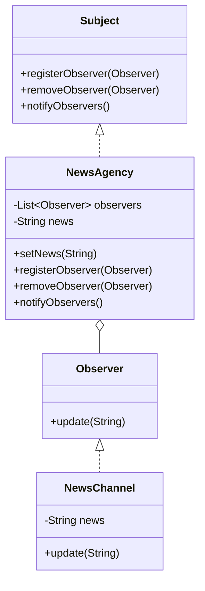

## 1.1 What Are Design Patterns?

In the realm of software engineering, design patterns are akin to blueprints for solving recurring design problems. They are not finished designs that can be directly transformed into code, but rather templates for how to solve a problem in many different situations. Design patterns capture the experience of skilled software engineers and provide a common language for discussing and implementing solutions.

### Defining Design Patterns

Design patterns are reusable solutions to common problems encountered in software design. They represent best practices used by experienced object-oriented software developers. A design pattern systematically names, motivates, and explains a general design that addresses a recurring design problem in object-oriented systems. It describes the problem, the solution, when to apply the solution, and its consequences.

#### Key Characteristics of Design Patterns

1. **Reusability**: Design patterns provide a proven solution to a problem that can be reused in different contexts.
2. **Abstraction**: They abstract the core of the solution, allowing developers to focus on the larger architecture rather than the minutiae of implementation.
3. **Documentation**: Patterns are well-documented, making them easy to understand and apply.
4. **Standardization**: They offer a standard terminology that fosters better communication among developers.

### Purpose of Design Patterns

The primary purpose of design patterns is to provide a standard solution to a commonly occurring problem. They help developers avoid reinventing the wheel by offering tried-and-tested solutions. Design patterns also facilitate communication among developers by providing a shared language and understanding of design problems and solutions.

#### Addressing Common Design Challenges

Design patterns help address several common challenges in software design:

- **Complexity Management**: By providing a high-level solution to a problem, design patterns help manage the complexity of software systems.
- **Flexibility and Scalability**: Patterns often promote designs that are flexible and scalable, making it easier to adapt to changing requirements.
- **Maintainability**: By using well-established patterns, code becomes more maintainable and easier to understand for new developers joining the project.

### Design Patterns vs. Algorithms and Data Structures

It's important to distinguish between design patterns, algorithms, and data structures:

- **Design Patterns**: These are high-level strategies for solving design problems. They provide a template for how to solve a problem in a particular context.
- **Algorithms**: These are step-by-step procedures or formulas for solving a problem. They are more about the "how" of solving a problem.
- **Data Structures**: These are ways of organizing and storing data so that it can be accessed and modified efficiently.

While algorithms and data structures are about the implementation of specific tasks, design patterns are about the organization of code and the relationships between objects.

### The Role of Design Patterns in Standardization

Design patterns play a crucial role in standardizing the software development process. They provide a common language that helps developers communicate more effectively. By using patterns, developers can convey complex design ideas succinctly and clearly. This standardization also helps in onboarding new team members, as they can quickly understand the design of a system by recognizing familiar patterns.

#### Example: The Observer Pattern

Consider the Observer pattern, which is used to create a subscription mechanism to allow multiple objects to listen and react to events or changes in another object. This pattern is useful in scenarios where a change in one object requires changes in others, but the objects should not be tightly coupled.

```java
// Subject interface
interface Subject {
    void registerObserver(Observer o);
    void removeObserver(Observer o);
    void notifyObservers();
}

// Observer interface
interface Observer {
    void update(String message);
}

// Concrete Subject
class NewsAgency implements Subject {
    private List<Observer> observers = new ArrayList<>();
    private String news;

    public void setNews(String news) {
        this.news = news;
        notifyObservers();
    }

    public void registerObserver(Observer o) {
        observers.add(o);
    }

    public void removeObserver(Observer o) {
        observers.remove(o);
    }

    public void notifyObservers() {
        for (Observer o : observers) {
            o.update(news);
        }
    }
}

// Concrete Observer
class NewsChannel implements Observer {
    private String news;

    public void update(String news) {
        this.news = news;
        System.out.println("NewsChannel received news: " + news);
    }
}

// Usage
public class Main {
    public static void main(String[] args) {
        NewsAgency agency = new NewsAgency();
        NewsChannel channel1 = new NewsChannel();
        NewsChannel channel2 = new NewsChannel();

        agency.registerObserver(channel1);
        agency.registerObserver(channel2);

        agency.setNews("Breaking News: Design Patterns in Java!");
    }
}
```

In this example, the `NewsAgency` is the subject that notifies registered observers (`NewsChannel`) about changes. The Observer pattern decouples the subject from the observers, allowing for flexibility and scalability.

### Understanding the Problem Context

Before applying a design pattern, it's crucial to understand the context of the problem. Patterns are not one-size-fits-all solutions; they are applicable only in certain situations. Misapplying a pattern can lead to increased complexity and reduced performance. Therefore, it's essential to analyze the problem thoroughly and determine whether a pattern is suitable.

#### Example: Singleton Pattern

The Singleton pattern ensures that a class has only one instance and provides a global point of access to it. This pattern is useful in scenarios where exactly one object is needed to coordinate actions across the system.

```java
public class Singleton {
    private static Singleton instance;

    private Singleton() {
        // private constructor to prevent instantiation
    }

    public static Singleton getInstance() {
        if (instance == null) {
            instance = new Singleton();
        }
        return instance;
    }
}

// Usage
public class Main {
    public static void main(String[] args) {
        Singleton singleton1 = Singleton.getInstance();
        Singleton singleton2 = Singleton.getInstance();

        System.out.println(singleton1 == singleton2); // true
    }
}
```

In this example, the Singleton pattern is used to ensure that only one instance of the `Singleton` class exists. However, it's important to use this pattern judiciously, as it can introduce global state into an application, which can be difficult to manage.

### Visualizing Design Patterns

To better understand how design patterns work, let's visualize the Observer pattern using a class diagram.



This diagram illustrates the relationship between the `Subject`, `Observer`, `NewsAgency`, and `NewsChannel` classes. The `NewsAgency` class implements the `Subject` interface and maintains a list of observers. The `NewsChannel` class implements the `Observer` interface and updates its state based on notifications from the `NewsAgency`.

### Try It Yourself

To deepen your understanding of design patterns, try modifying the code examples provided. For instance, you can:

- Add another observer to the `NewsAgency` and see how it reacts to news updates.
- Implement a different pattern, such as the Factory Method, and observe how it simplifies object creation.

### Importance of Design Patterns

Design patterns are an essential tool in a software engineer's toolkit. They provide a proven solution to common problems, facilitate communication among developers, and promote code reusability and maintainability. By understanding and applying design patterns, developers can create robust and scalable software systems.

### Conclusion

Design patterns are a fundamental aspect of software engineering, offering reusable solutions to common design problems. They help manage complexity, enhance flexibility, and improve maintainability. By understanding the context of a problem and selecting the appropriate pattern, developers can create efficient and effective software solutions.

## Quiz Time!



### What is a design pattern in software engineering?

- [x] A reusable solution to a common software design problem.
- [ ] A specific algorithm for solving computational tasks.
- [ ] A data structure for organizing information.
- [ ] A programming language feature.

> **Explanation:** Design patterns provide a general solution to common design problems in software engineering, unlike algorithms or data structures which are more specific.

### What is the primary purpose of design patterns?

- [x] To provide a standard solution to recurring design problems.
- [ ] To replace algorithms in software development.
- [ ] To serve as a substitute for data structures.
- [ ] To eliminate the need for coding.

> **Explanation:** Design patterns offer standardized solutions to common design challenges, helping developers avoid reinventing the wheel.

### How do design patterns differ from algorithms?

- [x] Design patterns are high-level strategies for solving design problems, while algorithms are step-by-step procedures for solving computational tasks.
- [ ] Design patterns are specific to Java, whereas algorithms are universal.
- [ ] Design patterns focus on data storage, while algorithms focus on data processing.
- [ ] Design patterns are used for UI design, while algorithms are used for backend logic.

> **Explanation:** Design patterns provide a structural solution to design problems, whereas algorithms provide a procedural solution to computational problems.

### Which of the following is a key characteristic of design patterns?

- [x] Reusability
- [ ] Complexity
- [ ] Specificity
- [ ] Uniqueness

> **Explanation:** Design patterns are designed to be reusable solutions to common problems, making them applicable in various contexts.

### What role do design patterns play in software development?

- [x] They standardize solutions and facilitate communication among developers.
- [ ] They replace the need for software testing.
- [ ] They eliminate the need for documentation.
- [ ] They are used only in Java programming.

> **Explanation:** Design patterns provide a common language and standardized solutions, improving communication and understanding among developers.

### Why is it important to understand the problem context before applying a design pattern?

- [x] To ensure the pattern is appropriate for the specific situation.
- [ ] To avoid writing any code.
- [ ] To eliminate the need for debugging.
- [ ] To ensure the pattern is used in every project.

> **Explanation:** Understanding the problem context helps determine the suitability of a pattern, preventing misapplication and unnecessary complexity.

### What is the Observer pattern used for?

- [x] Creating a subscription mechanism for objects to listen and react to events.
- [ ] Sorting data in a collection.
- [ ] Managing memory allocation.
- [ ] Encrypting data for security.

> **Explanation:** The Observer pattern allows multiple objects to listen and react to changes in another object, facilitating event-driven programming.

### Which of the following is an example of a design pattern?

- [x] Singleton
- [ ] Binary Search
- [ ] Linked List
- [ ] Quick Sort

> **Explanation:** Singleton is a design pattern that ensures a class has only one instance, whereas Binary Search and Quick Sort are algorithms, and Linked List is a data structure.

### How does the Singleton pattern ensure only one instance of a class exists?

- [x] By using a private constructor and a static method to control instance creation.
- [ ] By using a public constructor and multiple instances.
- [ ] By using an interface to define multiple implementations.
- [ ] By using a loop to create instances.

> **Explanation:** The Singleton pattern uses a private constructor and a static method to ensure only one instance of a class is created and accessed globally.

### True or False: Design patterns are specific to Java programming.

- [ ] True
- [x] False

> **Explanation:** Design patterns are not specific to Java; they are applicable across various programming languages and paradigms.



Remember, this is just the beginning. As you progress, you'll build more complex and interactive software systems. Keep experimenting, stay curious, and enjoy the journey!
