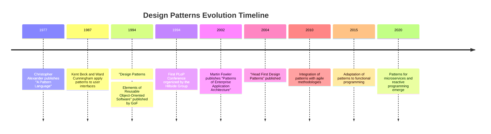

## 1.2 History and Evolution of Design Patterns

Design patterns have become a cornerstone of software engineering, providing reusable solutions to common design problems. Their journey from architectural concepts to software engineering staples is a fascinating tale of adaptation and evolution. In this section, we will explore the origins of design patterns, their transition into software engineering, and their impact on modern development practices.

### The Architectural Roots: Christopher Alexander

The concept of design patterns originated in the field of architecture, thanks to the pioneering work of Christopher Alexander. In the late 1970s, Alexander introduced the idea of patterns as a way to capture the essence of good design practices in architecture. His book, *"A Pattern Language: Towns, Buildings, Construction,"* published in 1977, presented a collection of 253 patterns that could be used to solve recurring design problems in architecture.

Alexander's patterns were not just solutions; they were a language for architects to communicate and share design knowledge. Each pattern described a problem, the context in which it occurs, and a solution that could be applied. This approach allowed architects to create buildings and towns that were more harmonious and functional.

### Transition to Software Engineering

The transition of design patterns from architecture to software engineering began in the late 1980s and early 1990s. Software engineers recognized that many of the challenges they faced in designing software systems were similar to those encountered in architecture. They saw the potential for using patterns to capture and share solutions to common software design problems.

One of the earliest adopters of design patterns in software engineering was Kent Beck, who, along with Ward Cunningham, applied patterns to the design of user interfaces. Their work laid the groundwork for the broader adoption of design patterns in software development.

### The Gang of Four: A Seminal Work

The true catalyst for the widespread adoption of design patterns in software engineering was the publication of *"Design Patterns: Elements of Reusable Object-Oriented Software"* in 1994. This seminal book, authored by Erich Gamma, Richard Helm, Ralph Johnson, and John Vlissides—collectively known as the "Gang of Four" (GoF)—introduced 23 design patterns that addressed common problems in object-oriented software design.

The GoF book provided a structured approach to documenting design patterns, including sections on intent, applicability, structure, participants, collaborations, consequences, and implementation. This format made it easier for software engineers to understand and apply patterns in their work.

The impact of the GoF book was profound. It not only popularized the concept of design patterns but also established a common vocabulary for discussing software design. The 23 patterns described in the book became foundational to object-oriented design and are still widely used today.

### Key Milestones in the Evolution of Design Patterns

The evolution of design patterns in software engineering has been marked by several key milestones:

1. **The Hillside Group and Pattern Languages of Programs (PLoP) Conferences**: In the mid-1990s, the Hillside Group was formed to promote the use of patterns in software development. They organized the first Pattern Languages of Programs (PLoP) conference in 1994, which became an annual event where practitioners could share and discuss patterns.

2. **The Rise of Pattern Communities**: The success of the GoF book and PLoP conferences led to the formation of pattern communities focused on specific domains, such as enterprise applications, user interfaces, and concurrent programming. These communities contributed to the development of new patterns and pattern languages.

3. **Integration with Agile and Extreme Programming (XP)**: As agile methodologies gained popularity in the early 2000s, design patterns were integrated into agile practices. Patterns provided a way to capture and share design knowledge within agile teams, enhancing collaboration and code quality.

4. **Patterns in Modern Programming Languages**: With the rise of modern programming languages like Java, C#, and Python, design patterns have been adapted to leverage language-specific features. For example, Java's support for interfaces and abstract classes has facilitated the implementation of patterns like Strategy and Observer.

5. **The Influence of Functional Programming**: The growing interest in functional programming has led to the adaptation of design patterns to functional paradigms. Patterns such as Visitor and Command have been reimagined to work with functional concepts like higher-order functions and immutability.

### Impact on Modern Software Development Practices

Design patterns have had a profound impact on modern software development practices. They provide a shared language for developers to communicate design ideas and solutions, reducing misunderstandings and improving collaboration. Patterns also promote code reuse and maintainability by providing proven solutions to common problems.

In addition, design patterns have influenced the development of software frameworks and libraries. Many popular frameworks, such as Spring and Hibernate, incorporate design patterns to provide flexible and extensible architectures.

### Conferences, Books, and Publications

Several conferences, books, and publications have played a significant role in shaping the understanding of design patterns:

- **Pattern Languages of Programs (PLoP) Conferences**: These conferences continue to be a key forum for pattern enthusiasts to share new patterns and discuss their applications.

- ***Patterns of Enterprise Application Architecture* by Martin Fowler**: This book, published in 2002, introduced patterns for enterprise application development, expanding the scope of design patterns beyond object-oriented design.

- ***Head First Design Patterns* by Eric Freeman and Elisabeth Robson**: This book, published in 2004, provided an accessible introduction to design patterns using a visually rich format, making patterns more approachable for developers.

### Adapting to Changes in Programming Paradigms and Languages

Design patterns have demonstrated remarkable adaptability to changes in programming paradigms and languages. As new programming languages and paradigms have emerged, patterns have been reinterpreted and extended to fit new contexts.

For example, the rise of reactive programming has led to the development of patterns for handling asynchronous data streams. Similarly, the adoption of microservices architecture has prompted the creation of patterns for service decomposition and communication.

### Conclusion

The history and evolution of design patterns is a testament to their enduring value in software engineering. From their roots in architecture to their widespread adoption in software development, design patterns have provided a framework for solving complex design problems and improving software quality. As programming paradigms and languages continue to evolve, design patterns will undoubtedly adapt and remain a vital tool for software engineers.

### Visualizing the Evolution of Design Patterns

To better understand the evolution of design patterns, let's visualize the key milestones and transitions using a timeline diagram.

### Try It Yourself

To deepen your understanding of design patterns, try the following exercises:

1. **Explore Architectural Patterns**: Read Christopher Alexander's *"A Pattern Language"* and identify patterns that could be applied to software design.

2. **Implement a GoF Pattern**: Choose one of the 23 GoF patterns and implement it in Java. Consider how the pattern could be adapted to leverage Java's features.

3. **Attend a PLoP Conference**: If possible, attend a PLoP conference to engage with the pattern community and learn about new patterns.

4. **Experiment with Functional Patterns**: Explore how traditional design patterns can be adapted to functional programming languages like Scala or Haskell.

### References and Further Reading

- [A Pattern Language: Towns, Buildings, Construction by Christopher Alexander](https://www.amazon.com/Pattern-Language-Buildings-Construction-Environmental/dp/0195019199)
- [Design Patterns: Elements of Reusable Object-Oriented Software by Erich Gamma, Richard Helm, Ralph Johnson, and John Vlissides](https://www.amazon.com/Design-Patterns-Elements-Reusable-Object-Oriented/dp/0201633612)
- [Patterns of Enterprise Application Architecture by Martin Fowler](https://www.amazon.com/Patterns-Enterprise-Application-Architecture-Martin/dp/0321127420)
- [Head First Design Patterns by Eric Freeman and Elisabeth Robson](https://www.amazon.com/Head-First-Design-Patterns-Brain-Friendly/dp/0596007124)

### Quiz Time!



### Who introduced the concept of design patterns in architecture?

- [x] Christopher Alexander
- [ ] Erich Gamma
- [ ] Martin Fowler
- [ ] Kent Beck

> **Explanation:** Christopher Alexander introduced the concept of design patterns in architecture with his book *"A Pattern Language."*

### What is the title of the seminal book by the "Gang of Four"?

- [ ] Patterns of Enterprise Application Architecture
- [x] Design Patterns: Elements of Reusable Object-Oriented Software
- [ ] Head First Design Patterns
- [ ] A Pattern Language

> **Explanation:** The "Gang of Four" authored *"Design Patterns: Elements of Reusable Object-Oriented Software,"* which is a seminal work in software design patterns.

### Which group organized the first Pattern Languages of Programs (PLoP) conference?

- [ ] The Gang of Four
- [ ] Agile Alliance
- [x] The Hillside Group
- [ ] IEEE

> **Explanation:** The Hillside Group organized the first PLoP conference to promote the use of patterns in software development.

### Which book expanded the scope of design patterns to enterprise applications?

- [ ] Head First Design Patterns
- [ ] Design Patterns: Elements of Reusable Object-Oriented Software
- [x] Patterns of Enterprise Application Architecture
- [ ] A Pattern Language

> **Explanation:** Martin Fowler's *"Patterns of Enterprise Application Architecture"* expanded the scope of design patterns to enterprise applications.

### How have design patterns adapted to functional programming?

- [x] By reimagining patterns like Visitor and Command
- [ ] By abandoning object-oriented principles
- [ ] By focusing solely on data structures
- [ ] By avoiding higher-order functions

> **Explanation:** Design patterns have been adapted to functional programming by reimagining patterns like Visitor and Command to work with functional concepts.

### What is a key benefit of design patterns in software development?

- [x] They provide a shared language for developers
- [ ] They eliminate the need for documentation
- [ ] They make code less maintainable
- [ ] They increase code duplication

> **Explanation:** Design patterns provide a shared language for developers, improving communication and collaboration.

### Which programming paradigm has influenced the adaptation of design patterns?

- [ ] Procedural programming
- [x] Functional programming
- [ ] Machine learning
- [ ] Quantum computing

> **Explanation:** Functional programming has influenced the adaptation of design patterns, leading to new interpretations and extensions.

### What role do design patterns play in software frameworks?

- [x] They provide flexible and extensible architectures
- [ ] They restrict the use of new technologies
- [ ] They increase the complexity of frameworks
- [ ] They are not used in frameworks

> **Explanation:** Design patterns provide flexible and extensible architectures in software frameworks, enhancing their usability.

### Which of the following is a key milestone in the evolution of design patterns?

- [x] The publication of the GoF book
- [ ] The invention of the internet
- [ ] The development of the first computer
- [ ] The creation of the Java programming language

> **Explanation:** The publication of the GoF book is a key milestone in the evolution of design patterns, popularizing their use in software engineering.

### True or False: Design patterns have remained static since their introduction.

- [ ] True
- [x] False

> **Explanation:** False. Design patterns have evolved and adapted to changes in programming paradigms and languages over time.



Remember, this is just the beginning. As you progress, you'll discover how design patterns can be applied to solve complex design challenges in Java and beyond. Keep exploring, stay curious, and enjoy the journey!
