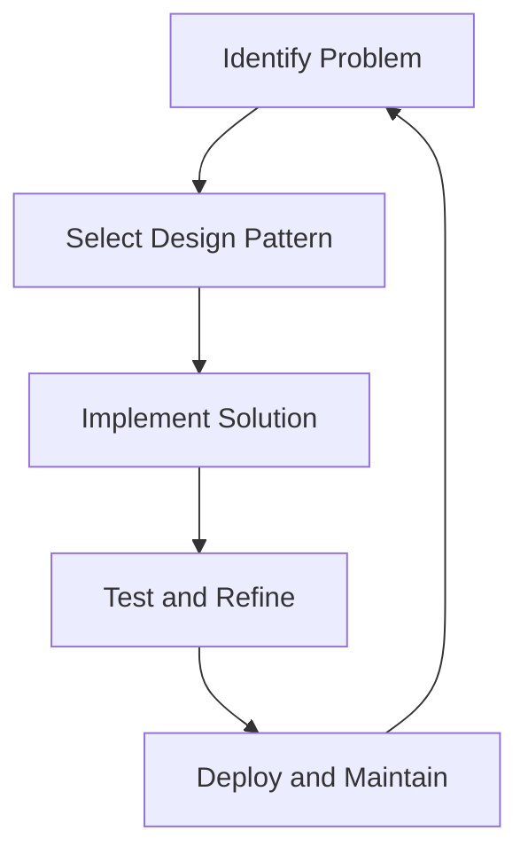

## 1.3 Importance of Design Patterns in Software Development

In the realm of software engineering, design patterns stand as a beacon of best practices, guiding developers toward writing code that is not only functional but also maintainable, scalable, and communicative. As expert developers, we often encounter complex problems that require robust solutions. Design patterns offer a repertoire of proven strategies to address these challenges effectively.

### Addressing Common Challenges in Software Development

Software development is fraught with challenges such as code duplication, poor scalability, and difficult maintenance. Design patterns provide a structured approach to these issues by offering reusable solutions that have been tested and refined over time.

#### Code Duplication and Reuse

One of the primary challenges in software development is avoiding code duplication. Repeated code not only bloats the codebase but also increases the risk of errors and inconsistencies. Design patterns, such as the Singleton and Factory Method, promote code reuse by encapsulating common functionalities in a single, reusable component.

```java
// Singleton Pattern Example
public class DatabaseConnection {
    private static DatabaseConnection instance;

    private DatabaseConnection() {
        // Private constructor to prevent instantiation
    }

    public static synchronized DatabaseConnection getInstance() {
        if (instance == null) {
            instance = new DatabaseConnection();
        }
        return instance;
    }
}
```

In this example, the Singleton pattern ensures that only one instance of `DatabaseConnection` exists, promoting reuse and consistency across the application.

#### Scalability

Scalability is another critical aspect of software development. As applications grow, they must handle increased loads and complexity without degrading performance. Design patterns like the Observer and Strategy patterns facilitate scalability by decoupling components and allowing them to evolve independently.

```java
// Observer Pattern Example
public interface Observer {
    void update(String message);
}

public class ConcreteObserver implements Observer {
    @Override
    public void update(String message) {
        System.out.println("Received update: " + message);
    }
}

public class Subject {
    private List<Observer> observers = new ArrayList<>();

    public void addObserver(Observer observer) {
        observers.add(observer);
    }

    public void notifyObservers(String message) {
        for (Observer observer : observers) {
            observer.update(message);
        }
    }
}
```

Here, the Observer pattern enables the `Subject` to notify multiple `Observers` of changes, allowing the system to scale by adding new observers without modifying existing code.

#### Maintainability

Maintainability is crucial for the long-term success of any software project. Design patterns enhance maintainability by promoting clear, organized code structures. The Model-View-Controller (MVC) pattern, for example, separates concerns, making it easier to manage and update code.

```java
// MVC Pattern Example
public class Model {
    private String data;

    public String getData() {
        return data;
    }

    public void setData(String data) {
        this.data = data;
    }
}

public class View {
    public void display(String data) {
        System.out.println("Data: " + data);
    }
}

public class Controller {
    private Model model;
    private View view;

    public Controller(Model model, View view) {
        this.model = model;
        this.view = view;
    }

    public void updateView() {
        view.display(model.getData());
    }
}
```

By separating the model, view, and controller, the MVC pattern makes it easier to modify each component independently, enhancing maintainability.

### Promoting Best Practices

Design patterns are not just about solving specific problems; they embody best practices that lead to high-quality software.

#### Clear Communication

Design patterns provide a shared vocabulary among developers, facilitating clear communication and collaboration. When a team member mentions using a "Decorator pattern," others immediately understand the approach and its implications, reducing misunderstandings and speeding up development.

#### Simplifying Complex Design Decisions

Complex design decisions can be daunting, especially when multiple solutions are possible. Design patterns simplify these decisions by offering well-documented strategies that have been proven effective in similar situations. This reduces the cognitive load on developers and allows them to focus on the unique aspects of their projects.

### Real-World Scenarios

Let's explore some real-world scenarios where design patterns have led to better code quality.

#### Scenario 1: Building a Notification System

Consider a notification system that sends alerts via email, SMS, and push notifications. Using the Strategy pattern, we can encapsulate each notification method in a separate class, allowing the system to switch between methods dynamically.

```java
// Strategy Pattern Example
public interface NotificationStrategy {
    void send(String message);
}

public class EmailNotification implements NotificationStrategy {
    @Override
    public void send(String message) {
        System.out.println("Sending email: " + message);
    }
}

public class SMSNotification implements NotificationStrategy {
    @Override
    public void send(String message) {
        System.out.println("Sending SMS: " + message);
    }
}

public class NotificationContext {
    private NotificationStrategy strategy;

    public void setStrategy(NotificationStrategy strategy) {
        this.strategy = strategy;
    }

    public void executeStrategy(String message) {
        strategy.send(message);
    }
}
```

By using the Strategy pattern, the notification system can easily adapt to new methods without altering existing code, enhancing flexibility and maintainability.

#### Scenario 2: Implementing a GUI Framework

In a GUI framework, the Composite pattern can be used to manage complex hierarchies of UI components. This pattern allows individual components and composite groups to be treated uniformly, simplifying the rendering and event-handling processes.

```java
// Composite Pattern Example
public interface UIComponent {
    void render();
}

public class Button implements UIComponent {
    @Override
    public void render() {
        System.out.println("Rendering Button");
    }
}

public class Panel implements UIComponent {
    private List<UIComponent> components = new ArrayList<>();

    public void addComponent(UIComponent component) {
        components.add(component);
    }

    @Override
    public void render() {
        System.out.println("Rendering Panel");
        for (UIComponent component : components) {
            component.render();
        }
    }
}
```

The Composite pattern allows the framework to manage components hierarchically, making it easier to build complex UIs.

### Simplifying Design Decisions

Design patterns simplify design decisions by providing a catalog of solutions that address common problems. This not only speeds up the decision-making process but also ensures that the chosen solution is robust and reliable.

#### Faster Development Times

By offering proven solutions, design patterns contribute to faster development times. Developers can leverage existing patterns to solve problems quickly, reducing the need for trial and error. This efficiency is particularly valuable in fast-paced development environments where time-to-market is critical.

### Viewing Design Patterns as Essential Tools

As expert developers, we should view design patterns as essential tools in our software development toolkit. They not only provide solutions to specific problems but also promote best practices that lead to high-quality code. By understanding and applying design patterns, we can create software that is robust, maintainable, and scalable.

### Try It Yourself

To truly grasp the power of design patterns, try modifying the provided code examples. For instance, add a new notification method to the Strategy pattern example or create a new UI component for the Composite pattern. Experimenting with these patterns will deepen your understanding and enhance your ability to apply them effectively.

### Visualizing Design Patterns

To further illustrate the importance of design patterns, let's visualize how they fit into the software development process.



**Figure 1:** This flowchart depicts the iterative nature of software development, where design patterns play a crucial role in selecting and implementing solutions.

### References and Further Reading

For more information on design patterns and their applications, consider exploring the following resources:

- [Design Patterns: Elements of Reusable Object-Oriented Software](https://en.wikipedia.org/wiki/Design_Patterns) by Erich Gamma, Richard Helm, Ralph Johnson, and John Vlissides.
- [Refactoring: Improving the Design of Existing Code](https://martinfowler.com/books/refactoring.html) by Martin Fowler.
- [Head First Design Patterns](https://www.oreilly.com/library/view/head-first-design/0596007124/) by Eric Freeman and Elisabeth Robson.

### Knowledge Check

To reinforce your understanding of the importance of design patterns, consider the following questions:

1. How do design patterns promote code reuse?
2. What role do design patterns play in enhancing scalability?
3. How do design patterns facilitate communication among developers?
4. Provide an example of a real-world scenario where a design pattern improved code quality.
5. How do design patterns simplify complex design decisions?

### Embrace the Journey

Remember, mastering design patterns is a journey. As you continue to explore and apply these patterns, you'll find that they become invaluable tools in your software development arsenal. Keep experimenting, stay curious, and enjoy the journey!

## Quiz Time!



### What is one of the primary challenges in software development that design patterns help address?

- [x] Code duplication
- [ ] Lack of features
- [ ] User interface design
- [ ] Marketing strategies

> **Explanation:** Design patterns help address code duplication by promoting code reuse and encapsulating common functionalities.

### How do design patterns enhance scalability in software development?

- [x] By decoupling components and allowing them to evolve independently
- [ ] By increasing the number of developers on a project
- [ ] By adding more hardware resources
- [ ] By reducing the number of features

> **Explanation:** Design patterns like the Observer and Strategy patterns enhance scalability by decoupling components, allowing them to evolve independently.

### What is a benefit of using design patterns for communication among developers?

- [x] They provide a shared vocabulary
- [ ] They eliminate the need for documentation
- [ ] They reduce the number of meetings
- [ ] They increase the complexity of code

> **Explanation:** Design patterns provide a shared vocabulary, facilitating clear communication and collaboration among developers.

### In the provided code example, which design pattern is used to ensure only one instance of a class exists?

- [x] Singleton Pattern
- [ ] Factory Method Pattern
- [ ] Observer Pattern
- [ ] Strategy Pattern

> **Explanation:** The Singleton pattern is used to ensure that only one instance of a class exists, promoting reuse and consistency.

### How do design patterns contribute to faster development times?

- [x] By offering proven solutions that reduce trial and error
- [ ] By increasing the number of developers
- [ ] By reducing the number of features
- [ ] By eliminating the need for testing

> **Explanation:** Design patterns contribute to faster development times by offering proven solutions, reducing the need for trial and error.

### What is the role of the Composite pattern in a GUI framework?

- [x] To manage complex hierarchies of UI components
- [ ] To handle user input
- [ ] To optimize rendering performance
- [ ] To manage network connections

> **Explanation:** The Composite pattern is used to manage complex hierarchies of UI components, simplifying the rendering and event-handling processes.

### How do design patterns simplify complex design decisions?

- [x] By providing a catalog of solutions that address common problems
- [ ] By increasing the number of features
- [ ] By reducing the number of developers
- [ ] By eliminating the need for testing

> **Explanation:** Design patterns simplify complex design decisions by providing a catalog of solutions that address common problems.

### What is a real-world scenario where the Strategy pattern can be applied?

- [x] Building a notification system with multiple methods
- [ ] Designing a database schema
- [ ] Creating a marketing plan
- [ ] Developing a user interface

> **Explanation:** The Strategy pattern can be applied to build a notification system with multiple methods, allowing the system to switch between methods dynamically.

### How do design patterns promote maintainability?

- [x] By promoting clear, organized code structures
- [ ] By increasing the number of developers
- [ ] By reducing the number of features
- [ ] By eliminating the need for documentation

> **Explanation:** Design patterns promote maintainability by promoting clear, organized code structures, making it easier to manage and update code.

### True or False: Design patterns are only useful for solving specific problems and do not promote best practices.

- [ ] True
- [x] False

> **Explanation:** False. Design patterns not only solve specific problems but also embody best practices that lead to high-quality software.


