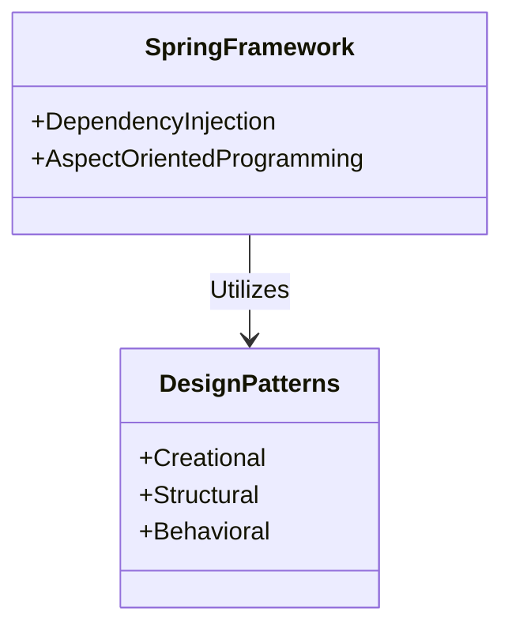

## 1.3 History and Evolution of Design Patterns

Design patterns have become an integral part of software engineering, providing reusable solutions to common problems. Their journey from architectural concepts to essential tools in Java development is both fascinating and instructive. This section delves into the history and evolution of design patterns, tracing their origins, key milestones, and their significant impact on Java programming.

### Origins of Design Patterns

The concept of design patterns originated in the field of architecture, introduced by Christopher Alexander in the 1970s. Alexander's work, particularly his book "A Pattern Language: Towns, Buildings, Construction," laid the foundation for understanding patterns as solutions to recurring problems within a context. He emphasized the importance of capturing the essence of successful designs to replicate them in different situations.

#### Christopher Alexander's Influence

Christopher Alexander's approach to patterns was revolutionary. He proposed that patterns could be documented and shared, allowing architects to apply proven solutions to new projects. This idea resonated with software engineers, who saw parallels in their own field. The notion of capturing and reusing design knowledge became a cornerstone for what would later be known as software design patterns.

### The Gang of Four (GoF) and the Birth of Software Design Patterns

The formal introduction of design patterns to software engineering came with the publication of "Design Patterns: Elements of Reusable Object-Oriented Software" in 1994 by Erich Gamma, Richard Helm, Ralph Johnson, and John Vlissides, collectively known as the Gang of Four (GoF). This seminal work cataloged 23 design patterns, providing a common vocabulary and framework for software developers.

#### Key Contributions of the GoF Book

- **Standardization**: The GoF book standardized the terminology and structure for documenting design patterns, making them accessible to a broader audience.
- **Object-Oriented Focus**: The patterns were tailored for object-oriented programming, aligning with the growing popularity of languages like Java and C++.
- **Pattern Categories**: The book categorized patterns into Creational, Structural, and Behavioral, helping developers identify the appropriate pattern for their needs.

### Evolution of Design Patterns in Software Engineering

Following the GoF book, design patterns gained widespread recognition in the software engineering community. They became a fundamental part of software design education and practice, influencing how developers approached problem-solving.

#### Significant Events and Publications

- **Pattern Languages of Program Design (PLoP) Conferences**: These conferences, initiated in the mid-1990s, provided a platform for pattern enthusiasts to share and refine patterns, fostering a community of practice.
- **Books and Articles**: Numerous books and articles expanded on the GoF patterns, introducing new patterns and exploring their applications in different contexts.
- **Integration with Agile and Extreme Programming**: Design patterns were embraced by agile methodologies, which valued simplicity and adaptability, aligning well with the principles of pattern-based design.

### Adoption and Adaptation in Java Development

Java, with its object-oriented nature and widespread use, became a fertile ground for the application of design patterns. The Java community quickly adopted these patterns, integrating them into frameworks and libraries.

#### Influence of Open-Source Frameworks

Open-source frameworks like the Spring Framework played a crucial role in popularizing design patterns within the Java ecosystem. Spring's use of patterns such as Dependency Injection and Aspect-Oriented Programming demonstrated the power of patterns in building flexible and maintainable applications.



*Diagram: The Spring Framework utilizes various design patterns to enhance flexibility and maintainability.*

#### Evolution with Java Language Features

As Java evolved, so did the implementation of design patterns. New language features such as Lambdas, Streams, and the enhanced concurrency utilities in Java 8 and beyond have influenced how patterns are applied.

##### Example: Singleton Pattern with Java 8

The Singleton pattern, one of the GoF patterns, ensures a class has only one instance and provides a global point of access to it. With Java 8, the implementation of this pattern can leverage the `Supplier` functional interface for lazy initialization.

```java
import java.util.function.Supplier;

public class Singleton {
    private static final Supplier<Singleton> INSTANCE = 
        () -> SingletonHolder.INSTANCE;

    private Singleton() {}

    private static class SingletonHolder {
        private static final Singleton INSTANCE = new Singleton();
    }

    public static Singleton getInstance() {
        return INSTANCE.get();
    }
}
```

*Explanation: This implementation uses a `Supplier` to achieve lazy initialization, ensuring the Singleton instance is created only when needed.*

### Practical Applications and Real-World Scenarios

Design patterns have proven invaluable in addressing complex software design challenges. They provide a blueprint for creating robust, scalable, and maintainable systems.

#### Real-World Example: Observer Pattern in Event-Driven Systems

The Observer pattern, a Behavioral pattern, is widely used in event-driven systems. It defines a one-to-many dependency between objects, allowing multiple observers to be notified of changes in a subject.

```java
import java.util.ArrayList;
import java.util.List;

// Subject interface
interface Subject {
    void registerObserver(Observer o);
    void removeObserver(Observer o);
    void notifyObservers();
}

// Observer interface
interface Observer {
    void update(String message);
}

// Concrete Subject
class NewsAgency implements Subject {
    private List<Observer> observers = new ArrayList<>();
    private String news;

    public void setNews(String news) {
        this.news = news;
        notifyObservers();
    }

    @Override
    public void registerObserver(Observer o) {
        observers.add(o);
    }

    @Override
    public void removeObserver(Observer o) {
        observers.remove(o);
    }

    @Override
    public void notifyObservers() {
        for (Observer o : observers) {
            o.update(news);
        }
    }
}

// Concrete Observer
class NewsChannel implements Observer {
    private String news;

    @Override
    public void update(String news) {
        this.news = news;
        System.out.println("NewsChannel received news: " + news);
    }
}

// Usage
public class ObserverPatternDemo {
    public static void main(String[] args) {
        NewsAgency agency = new NewsAgency();
        NewsChannel channel = new NewsChannel();

        agency.registerObserver(channel);
        agency.setNews("Breaking News: Design Patterns in Java!");

        // Encourage experimentation by modifying the news content
        agency.setNews("Update: New Java Features Enhance Patterns!");
    }
}
```

*Explanation: This example demonstrates the Observer pattern, where `NewsAgency` is the subject, and `NewsChannel` is the observer. When the news changes, all registered observers are notified.*

### The Future of Design Patterns in Java

As Java continues to evolve, so will the application of design patterns. Emerging paradigms such as reactive programming and microservices architecture present new opportunities and challenges for pattern-based design.

#### Embracing Modern Java Features

Java developers are encouraged to explore how modern features can enhance pattern implementations. For instance, the use of Streams and Lambdas can simplify the implementation of patterns like the Strategy or Command patterns.

#### Integration with New Architectural Styles

Design patterns will continue to play a vital role in new architectural styles. For example, in microservices, patterns like Circuit Breaker and Service Registry are essential for building resilient and scalable systems.

### Conclusion

The history and evolution of design patterns reflect their enduring value in software engineering. From their architectural roots to their integration into Java development, patterns provide a powerful toolkit for solving complex design challenges. As Java and software architecture continue to evolve, design patterns will remain a cornerstone of effective software design.

### Key Takeaways

- Design patterns originated in architecture and were adapted for software engineering by the GoF.
- Patterns provide reusable solutions to common problems, enhancing software design.
- Java's evolution has influenced the implementation and adaptation of design patterns.
- Open-source frameworks like Spring have popularized patterns in the Java community.
- Modern Java features offer new opportunities for pattern-based design.

### Encouragement for Further Exploration

Readers are encouraged to explore how design patterns can be applied to their own projects, considering the unique challenges and opportunities presented by modern Java features and architectural styles.

---

## Test Your Knowledge: History and Evolution of Design Patterns Quiz



### Who introduced the concept of design patterns in architecture?

- [x] Christopher Alexander
- [ ] Erich Gamma
- [ ] Richard Helm
- [ ] Ralph Johnson

> **Explanation:** Christopher Alexander introduced the concept of design patterns in architecture, which later influenced software engineering.

### What is the primary focus of the GoF book?

- [x] Object-oriented design patterns
- [ ] Functional programming patterns
- [ ] Architectural patterns
- [ ] Database design patterns

> **Explanation:** The GoF book focuses on object-oriented design patterns, providing a framework for reusable solutions in software design.

### Which framework is known for popularizing design patterns in Java?

- [x] Spring Framework
- [ ] Hibernate
- [ ] Apache Struts
- [ ] JavaServer Faces

> **Explanation:** The Spring Framework is known for popularizing design patterns like Dependency Injection and Aspect-Oriented Programming in Java.

### How has Java 8 influenced the implementation of design patterns?

- [x] By introducing Lambdas and Streams
- [ ] By removing object-oriented features
- [ ] By focusing on procedural programming
- [ ] By deprecating design patterns

> **Explanation:** Java 8 introduced Lambdas and Streams, which have influenced the implementation of design patterns by simplifying code and enhancing functionality.

### What is the role of the Observer pattern in event-driven systems?

- [x] It defines a one-to-many dependency between objects.
- [ ] It creates a one-to-one relationship between objects.
- [ ] It ensures a class has only one instance.
- [ ] It provides a global point of access to an object.

> **Explanation:** The Observer pattern defines a one-to-many dependency, allowing multiple observers to be notified of changes in a subject.

### Which pattern is essential for building resilient microservices?

- [x] Circuit Breaker
- [ ] Singleton
- [ ] Factory Method
- [ ] Adapter

> **Explanation:** The Circuit Breaker pattern is essential for building resilient microservices, helping to prevent cascading failures.

### What is a key benefit of using design patterns in software design?

- [x] Reusability of solutions
- [ ] Increased code complexity
- [ ] Reduced performance
- [ ] Limited flexibility

> **Explanation:** Design patterns provide reusable solutions to common problems, enhancing the maintainability and scalability of software.

### How do modern Java features enhance pattern implementations?

- [x] By simplifying code with Lambdas and Streams
- [ ] By increasing code verbosity
- [ ] By removing object-oriented principles
- [ ] By focusing on low-level programming

> **Explanation:** Modern Java features like Lambdas and Streams simplify code, making pattern implementations more concise and expressive.

### What is the significance of the PLoP conferences?

- [x] They provide a platform for sharing and refining patterns.
- [ ] They focus on hardware design.
- [ ] They are exclusive to Java developers.
- [ ] They are unrelated to software engineering.

> **Explanation:** The PLoP conferences provide a platform for pattern enthusiasts to share and refine patterns, fostering a community of practice.

### True or False: Design patterns are only applicable to Java.

- [ ] True
- [x] False

> **Explanation:** Design patterns are applicable to various programming languages and paradigms, not just Java.



---
