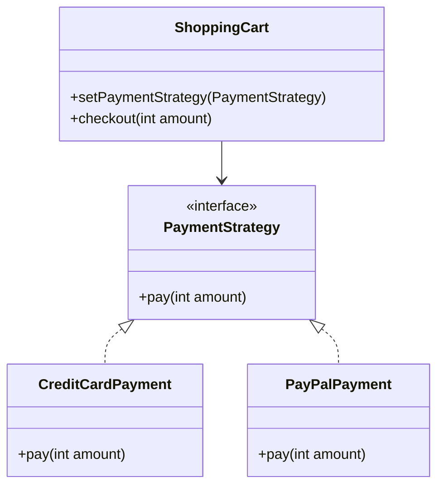
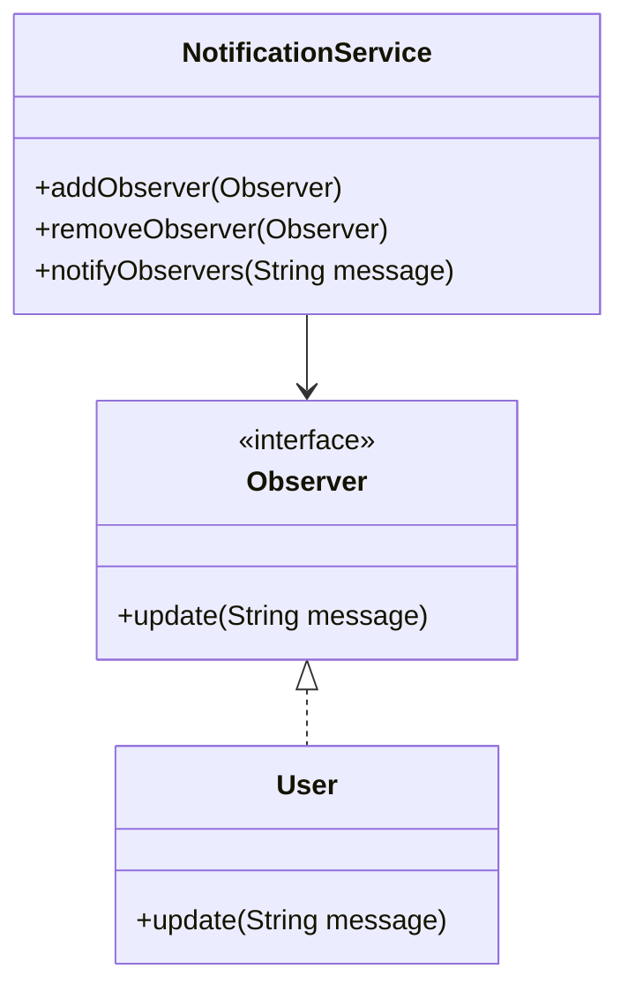

## 1.4 Why Design Patterns Matter in Java

Design patterns are a cornerstone of modern software development, offering proven solutions to common design challenges. For Java developers, mastering design patterns is not just beneficial but essential. This section explores why design patterns are crucial in Java, emphasizing their practical benefits, industry expectations, and their role in modern architectures.

### The Importance of Design Patterns in Java Development

#### Building Robust and Flexible Applications

Design patterns provide a blueprint for solving recurring design problems, enabling developers to build applications that are both robust and flexible. By abstracting complex design issues into reusable solutions, design patterns help developers create systems that are easier to maintain and extend.

- **Encapsulation of Best Practices**: Design patterns encapsulate best practices that have been refined over time. By applying these patterns, developers can avoid reinventing the wheel and leverage established solutions.
- **Enhancing Code Reusability**: Patterns promote code reusability by providing a standard approach to solving problems. This reduces redundancy and improves the maintainability of the codebase.
- **Facilitating Change**: Patterns such as the Strategy or Observer allow for easy modification of behavior without altering the underlying structure, making the system adaptable to change.

#### Industry Expectations and Professional Growth

In the software industry, familiarity with design patterns is often expected of experienced developers. Understanding and applying these patterns can significantly enhance a developer's ability to design efficient and scalable systems.

- **Standardized Communication**: Design patterns provide a common vocabulary for developers, facilitating clear and concise communication. This is particularly valuable in large teams or when collaborating across different organizations.
- **Career Advancement**: Proficiency in design patterns is often a key criterion in technical interviews and can be a differentiator in career advancement. Employers value developers who can demonstrate a deep understanding of design principles.

#### Facilitating Team Collaboration and Code Consistency

Design patterns play a crucial role in team collaboration by promoting consistency and clarity in code. When a team adopts a set of patterns, it ensures that everyone is on the same page regarding design decisions.

- **Consistency Across Codebases**: Patterns provide a consistent approach to solving problems, which helps maintain uniformity across different parts of the application. This consistency makes it easier for team members to understand and work with each other's code.
- **Improved Onboarding**: New team members can quickly get up to speed by familiarizing themselves with the patterns used in the codebase. This reduces the learning curve and accelerates productivity.

#### Avoiding Common Pitfalls with Design Patterns

Design patterns help developers avoid common pitfalls that can lead to poor design and maintenance challenges. By providing a structured approach to problem-solving, patterns mitigate risks associated with ad-hoc design decisions.

- **Avoiding Over-Engineering**: Patterns help prevent over-engineering by offering solutions that are neither too complex nor too simplistic. They strike a balance between flexibility and simplicity.
- **Reducing Code Smells**: Patterns can help eliminate code smells such as duplicated code, large classes, and excessive coupling, leading to cleaner and more maintainable code.

#### Role of Design Patterns in Modern Java Architectures

In modern Java architectures, such as microservices and enterprise systems, design patterns are indispensable. They provide the structural foundation needed to build scalable and resilient systems.

- **Microservices Architecture**: Patterns like Circuit Breaker and API Gateway are essential in microservices to handle failures gracefully and manage service interactions.
- **Enterprise Systems**: In enterprise applications, patterns such as Model-View-Controller (MVC) and Data Access Object (DAO) are widely used to separate concerns and manage data access efficiently.

### Practical Examples and Code Illustrations

To illustrate the importance of design patterns, consider the following examples:

#### Example 1: Strategy Pattern

The Strategy pattern is used to define a family of algorithms, encapsulate each one, and make them interchangeable. This pattern is particularly useful when you need to switch between different algorithms or behaviors at runtime.

```java
// Strategy interface
interface PaymentStrategy {
    void pay(int amount);
}

// Concrete strategy for credit card payment
class CreditCardPayment implements PaymentStrategy {
    private String cardNumber;

    public CreditCardPayment(String cardNumber) {
        this.cardNumber = cardNumber;
    }

    @Override
    public void pay(int amount) {
        System.out.println("Paid " + amount + " using Credit Card.");
    }
}

// Concrete strategy for PayPal payment
class PayPalPayment implements PaymentStrategy {
    private String email;

    public PayPalPayment(String email) {
        this.email = email;
    }

    @Override
    public void pay(int amount) {
        System.out.println("Paid " + amount + " using PayPal.");
    }
}

// Context class
class ShoppingCart {
    private PaymentStrategy paymentStrategy;

    public void setPaymentStrategy(PaymentStrategy paymentStrategy) {
        this.paymentStrategy = paymentStrategy;
    }

    public void checkout(int amount) {
        paymentStrategy.pay(amount);
    }
}

// Usage
public class StrategyPatternDemo {
    public static void main(String[] args) {
        ShoppingCart cart = new ShoppingCart();

        // Pay using credit card
        cart.setPaymentStrategy(new CreditCardPayment("1234-5678-9012-3456"));
        cart.checkout(100);

        // Pay using PayPal
        cart.setPaymentStrategy(new PayPalPayment("user@example.com"));
        cart.checkout(200);
    }
}
```

**Explanation**: In this example, the `PaymentStrategy` interface defines a method for payment. The `CreditCardPayment` and `PayPalPayment` classes implement this interface, providing specific payment methods. The `ShoppingCart` class uses a `PaymentStrategy` to perform payment, allowing the payment method to be changed at runtime.

#### Example 2: Observer Pattern

The Observer pattern is used to define a one-to-many dependency between objects so that when one object changes state, all its dependents are notified and updated automatically.

```java
import java.util.ArrayList;
import java.util.List;

// Observer interface
interface Observer {
    void update(String message);
}

// Concrete observer
class User implements Observer {
    private String name;

    public User(String name) {
        this.name = name;
    }

    @Override
    public void update(String message) {
        System.out.println(name + " received message: " + message);
    }
}

// Subject class
class NotificationService {
    private List<Observer> observers = new ArrayList<>();

    public void addObserver(Observer observer) {
        observers.add(observer);
    }

    public void removeObserver(Observer observer) {
        observers.remove(observer);
    }

    public void notifyObservers(String message) {
        for (Observer observer : observers) {
            observer.update(message);
        }
    }
}

// Usage
public class ObserverPatternDemo {
    public static void main(String[] args) {
        NotificationService service = new NotificationService();

        User user1 = new User("Alice");
        User user2 = new User("Bob");

        service.addObserver(user1);
        service.addObserver(user2);

        service.notifyObservers("New notification!");
    }
}
```

**Explanation**: In this example, the `Observer` interface defines a method for receiving updates. The `User` class implements this interface, representing a concrete observer. The `NotificationService` class maintains a list of observers and notifies them of any changes.

### Visualizing Design Patterns

To further understand the structure and interaction of design patterns, consider the following diagrams:

#### Strategy Pattern Structure



**Caption**: This diagram illustrates the Strategy pattern, showing the relationship between the `PaymentStrategy` interface, its concrete implementations, and the `ShoppingCart` context.

#### Observer Pattern Structure



**Caption**: This diagram depicts the Observer pattern, highlighting the interaction between the `Observer` interface, its concrete implementation, and the `NotificationService` subject.

### Conclusion

Design patterns are indispensable tools for Java developers, offering a wealth of benefits that enhance the robustness, flexibility, and maintainability of applications. By understanding and applying these patterns, developers can meet industry expectations, facilitate team collaboration, and build systems that are well-suited to modern architectural paradigms.

### Encouraging Exploration and Application

As you continue your journey in mastering Java design patterns, consider how these patterns can be applied to your current projects. Reflect on the challenges you face and explore how design patterns can offer solutions. Experiment with different patterns and observe their impact on your codebase.

### Key Takeaways

- **Design patterns provide proven solutions** to common design challenges, enhancing the robustness and flexibility of Java applications.
- **Familiarity with design patterns is expected** in the industry and can significantly impact career growth.
- **Patterns facilitate team collaboration** by promoting code consistency and providing a common vocabulary.
- **Avoid common pitfalls** by applying design patterns to prevent over-engineering and reduce code smells.
- **Design patterns are crucial in modern architectures**, such as microservices and enterprise systems, providing the structural foundation for scalable and resilient systems.

### Exercises

1. **Implement the Strategy Pattern**: Create a simple application that uses the Strategy pattern to switch between different sorting algorithms.
2. **Observer Pattern in Action**: Develop a notification system using the Observer pattern, where different users can subscribe to receive updates.
3. **Explore Alternative Implementations**: Modify the provided code examples to use Java 8 features such as Lambdas and Streams.

By engaging with these exercises, you will deepen your understanding of design patterns and their practical applications in Java development.

---

## Test Your Knowledge: Java Design Patterns Quiz



### What is the primary benefit of using design patterns in Java?

- [x] They provide proven solutions to common design problems.
- [ ] They increase the complexity of the code.
- [ ] They eliminate the need for documentation.
- [ ] They reduce the need for testing.

> **Explanation:** Design patterns offer established solutions to recurring design problems, enhancing code robustness and maintainability.

### How do design patterns facilitate team collaboration?

- [x] By providing a common vocabulary for design solutions.
- [ ] By increasing the number of meetings required.
- [ ] By making code more complex.
- [ ] By reducing the need for code reviews.

> **Explanation:** Design patterns offer a standardized way to communicate design decisions, making it easier for team members to collaborate and understand each other's code.

### Which pattern is used to define a family of algorithms and make them interchangeable?

- [x] Strategy Pattern
- [ ] Observer Pattern
- [ ] Singleton Pattern
- [ ] Factory Pattern

> **Explanation:** The Strategy pattern allows for the definition of a family of algorithms, encapsulating each one and making them interchangeable.

### What is a common pitfall that design patterns help avoid?

- [x] Over-engineering
- [ ] Under-documentation
- [ ] Excessive testing
- [ ] Lack of comments

> **Explanation:** Design patterns help avoid over-engineering by providing balanced solutions that are neither too complex nor too simplistic.

### In which architecture are patterns like Circuit Breaker and API Gateway essential?

- [x] Microservices Architecture
- [ ] Monolithic Architecture
- [ ] Client-Server Architecture
- [ ] Peer-to-Peer Architecture

> **Explanation:** In microservices architecture, patterns like Circuit Breaker and API Gateway are crucial for handling failures and managing service interactions.

### What role do design patterns play in enterprise systems?

- [x] They separate concerns and manage data access efficiently.
- [ ] They increase the number of classes in the system.
- [ ] They eliminate the need for a database.
- [ ] They reduce the number of developers needed.

> **Explanation:** In enterprise systems, patterns like MVC and DAO are used to separate concerns and manage data access efficiently.

### Why is familiarity with design patterns important for career advancement?

- [x] It is often a key criterion in technical interviews.
- [ ] It reduces the need for learning new technologies.
- [ ] It eliminates the need for teamwork.
- [ ] It guarantees a higher salary.

> **Explanation:** Proficiency in design patterns is often a key criterion in technical interviews and can be a differentiator in career advancement.

### How do design patterns enhance code reusability?

- [x] By providing a standard approach to solving problems.
- [ ] By increasing the number of lines of code.
- [ ] By reducing the need for functions.
- [ ] By eliminating the use of classes.

> **Explanation:** Design patterns promote code reusability by offering a standard approach to solving problems, reducing redundancy and improving maintainability.

### What is the Observer pattern used for?

- [x] Defining a one-to-many dependency between objects.
- [ ] Creating a single instance of a class.
- [ ] Defining a family of algorithms.
- [ ] Managing object creation.

> **Explanation:** The Observer pattern is used to define a one-to-many dependency between objects, so that when one object changes state, all its dependents are notified and updated automatically.

### True or False: Design patterns eliminate the need for testing.

- [x] False
- [ ] True

> **Explanation:** Design patterns do not eliminate the need for testing. They provide solutions to design problems, but testing is still essential to ensure the correctness and reliability of the code.



---
