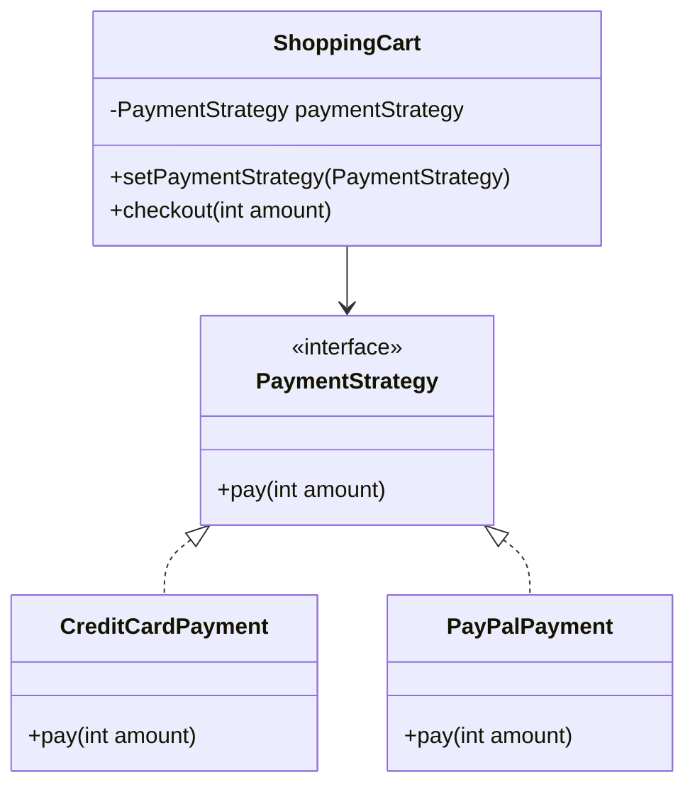
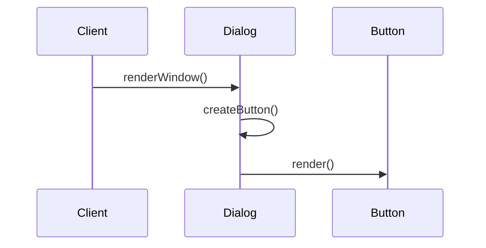

## 1.4 Benefits of Using Design Patterns in Java

Design patterns are a quintessential part of software engineering, providing reusable solutions to common problems. In the context of Java, a language renowned for its object-oriented features, design patterns become even more powerful. Let's delve into the benefits of using design patterns in Java, exploring how they enhance code readability, flexibility, and maintainability, while also addressing Java-specific challenges such as concurrency and resource management.

### Leveraging Java's Object-Oriented Features

Java's object-oriented nature makes it an ideal language for implementing design patterns. The core principles of object-oriented programming (OOP) — encapsulation, inheritance, and polymorphism — align seamlessly with the structure and intent of design patterns.

#### Encapsulation and Modularity

Design patterns promote encapsulation by defining clear interfaces and responsibilities for classes. This modular approach allows developers to encapsulate behavior and state, making code easier to understand and modify. For example, the **Strategy Pattern** encapsulates algorithms within classes, allowing them to be interchangeable without altering the client code.

```java
// Strategy interface
interface PaymentStrategy {
    void pay(int amount);
}

// Concrete strategy classes
class CreditCardPayment implements PaymentStrategy {
    public void pay(int amount) {
        System.out.println("Paid " + amount + " using Credit Card.");
    }
}

class PayPalPayment implements PaymentStrategy {
    public void pay(int amount) {
        System.out.println("Paid " + amount + " using PayPal.");
    }
}

// Context class
class ShoppingCart {
    private PaymentStrategy paymentStrategy;

    public void setPaymentStrategy(PaymentStrategy paymentStrategy) {
        this.paymentStrategy = paymentStrategy;
    }

    public void checkout(int amount) {
        paymentStrategy.pay(amount);
    }
}

// Usage
ShoppingCart cart = new ShoppingCart();
cart.setPaymentStrategy(new CreditCardPayment());
cart.checkout(100);
```

#### Inheritance and Reusability

Inheritance in Java allows for the creation of hierarchical class structures, which is a common theme in many design patterns. Patterns like the **Template Method** leverage inheritance to define the skeleton of an algorithm, deferring specific steps to subclasses.

```java
abstract class DataProcessor {
    // Template method
    public final void process() {
        readData();
        processData();
        writeData();
    }

    abstract void readData();
    abstract void processData();
    abstract void writeData();
}

class CSVDataProcessor extends DataProcessor {
    void readData() { System.out.println("Reading CSV data."); }
    void processData() { System.out.println("Processing CSV data."); }
    void writeData() { System.out.println("Writing CSV data."); }
}

// Usage
DataProcessor processor = new CSVDataProcessor();
processor.process();
```

#### Polymorphism and Flexibility

Polymorphism allows objects to be treated as instances of their parent class, enabling dynamic method binding. This is crucial for design patterns like the **Factory Method**, where the exact class of the object to be created is determined at runtime.

```java
abstract class Dialog {
    public void renderWindow() {
        Button okButton = createButton();
        okButton.render();
    }

    // Factory method
    protected abstract Button createButton();
}

class WindowsDialog extends Dialog {
    protected Button createButton() {
        return new WindowsButton();
    }
}

class WebDialog extends Dialog {
    protected Button createButton() {
        return new HTMLButton();
    }
}

// Usage
Dialog dialog = new WindowsDialog();
dialog.renderWindow();
```

### Solving Common Java Development Problems

Design patterns address many recurring problems in Java development, providing structured solutions that enhance code quality and developer productivity.

#### Code Readability and Maintainability

Design patterns improve code readability by providing a common vocabulary for developers. When a pattern is applied, its name conveys a wealth of information about the structure and behavior of the code. This shared understanding reduces the cognitive load for developers, making it easier to maintain and extend the codebase.

#### Flexibility and Scalability

Patterns like the **Decorator** and **Composite** enhance flexibility by allowing objects to be composed in various configurations. This is particularly useful in Java applications that require scalable and dynamic behavior.

```java
// Component interface
interface Shape {
    void draw();
}

// Concrete component
class Circle implements Shape {
    public void draw() {
        System.out.println("Drawing a Circle.");
    }
}

// Decorator class
abstract class ShapeDecorator implements Shape {
    protected Shape decoratedShape;

    public ShapeDecorator(Shape decoratedShape) {
        this.decoratedShape = decoratedShape;
    }

    public void draw() {
        decoratedShape.draw();
    }
}

// Concrete decorator
class RedBorderDecorator extends ShapeDecorator {
    public RedBorderDecorator(Shape decoratedShape) {
        super(decoratedShape);
    }

    public void draw() {
        decoratedShape.draw();
        setRedBorder(decoratedShape);
    }

    private void setRedBorder(Shape decoratedShape) {
        System.out.println("Border Color: Red");
    }
}

// Usage
Shape circle = new Circle();
Shape redCircle = new RedBorderDecorator(circle);
redCircle.draw();
```

### Managing Java-Specific Challenges

Java developers often face challenges related to concurrency and resource management. Design patterns provide robust solutions to these issues.

#### Concurrency Management

Patterns like the **Singleton** and **Thread Pool** help manage concurrency in Java applications. The Singleton pattern ensures that a class has only one instance, which is particularly useful in multi-threaded environments where shared resources need to be controlled.

```java
class Singleton {
    private static volatile Singleton instance;

    private Singleton() {}

    public static Singleton getInstance() {
        if (instance == null) {
            synchronized (Singleton.class) {
                if (instance == null) {
                    instance = new Singleton();
                }
            }
        }
        return instance;
    }
}
```

The **Thread Pool** pattern, on the other hand, manages a pool of threads to execute tasks, optimizing resource usage and improving application performance.

```java
import java.util.concurrent.ExecutorService;
import java.util.concurrent.Executors;

public class ThreadPoolExample {
    public static void main(String[] args) {
        ExecutorService executor = Executors.newFixedThreadPool(5);

        for (int i = 0; i < 10; i++) {
            Runnable worker = new WorkerThread("" + i);
            executor.execute(worker);
        }
        executor.shutdown();
        while (!executor.isTerminated()) {}
        System.out.println("Finished all threads");
    }
}

class WorkerThread implements Runnable {
    private String command;

    public WorkerThread(String s) {
        this.command = s;
    }

    public void run() {
        System.out.println(Thread.currentThread().getName() + " Start. Command = " + command);
        processCommand();
        System.out.println(Thread.currentThread().getName() + " End.");
    }

    private void processCommand() {
        try {
            Thread.sleep(5000);
        } catch (InterruptedException e) {
            e.printStackTrace();
        }
    }
}
```

#### Resource Management

Patterns like the **Flyweight** and **Object Pool** optimize resource usage by sharing and reusing objects. The Flyweight pattern reduces memory consumption by sharing common state among multiple objects.

```java
import java.util.HashMap;
import java.util.Map;

// Flyweight interface
interface TreeType {
    void draw(int x, int y);
}

// Concrete Flyweight
class ConcreteTreeType implements TreeType {
    private String name;
    private String color;
    private String texture;

    public ConcreteTreeType(String name, String color, String texture) {
        this.name = name;
        this.color = color;
        this.texture = texture;
    }

    public void draw(int x, int y) {
        System.out.println("Drawing a " + name + " tree at (" + x + ", " + y + ")");
    }
}

// Flyweight Factory
class TreeFactory {
    private static Map<String, TreeType> treeTypes = new HashMap<>();

    public static TreeType getTreeType(String name, String color, String texture) {
        TreeType result = treeTypes.get(name);
        if (result == null) {
            result = new ConcreteTreeType(name, color, texture);
            treeTypes.put(name, result);
        }
        return result;
    }
}

// Usage
TreeType oak = TreeFactory.getTreeType("Oak", "Green", "Rough");
oak.draw(10, 20);
```

### Impact on Large-Scale Java Applications

In large-scale Java applications, design patterns play a critical role in managing complexity and ensuring scalability.

#### Enterprise Solutions

Design patterns are integral to enterprise Java applications, where they help standardize solutions and promote best practices. Patterns like **DAO (Data Access Object)** and **MVC (Model-View-Controller)** are widely used in enterprise environments to separate concerns and manage data access efficiently.

```java
// DAO Interface
interface UserDAO {
    void addUser(User user);
    User getUser(int id);
}

// DAO Implementation
class UserDAOImpl implements UserDAO {
    // Simulate a database with a map
    private Map<Integer, User> database = new HashMap<>();

    public void addUser(User user) {
        database.put(user.getId(), user);
        System.out.println("User added: " + user.getName());
    }

    public User getUser(int id) {
        return database.get(id);
    }
}

// Usage
UserDAO userDAO = new UserDAOImpl();
userDAO.addUser(new User(1, "John Doe"));
User user = userDAO.getUser(1);
System.out.println("Retrieved User: " + user.getName());
```

### Encouraging Pattern Usage in Java Development

By leveraging design patterns, Java developers can enhance their programming skills and improve application quality. Patterns provide a proven framework for solving complex problems, enabling developers to focus on building robust and efficient solutions.

#### Try It Yourself

To fully grasp the power of design patterns in Java, try implementing a few patterns in your own projects. Start with simple patterns like Singleton or Factory Method, and gradually explore more complex patterns like Observer or Decorator. Experiment with modifying the code examples provided in this guide to suit your needs and observe how patterns can simplify your development process.

### Visualizing Design Patterns in Java

To better understand the relationships and interactions between objects in design patterns, let's visualize a few patterns using diagrams.

#### Class Diagram for the Strategy Pattern



#### Sequence Diagram for the Factory Method Pattern



### Conclusion

Design patterns are a powerful tool in the Java developer's toolkit, providing structured solutions to common problems and enhancing code quality. By understanding and applying design patterns, developers can improve code readability, flexibility, and maintainability, while effectively managing Java-specific challenges like concurrency and resource management. As you continue your journey in Java development, embrace design patterns to build robust and scalable applications.

## Quiz Time!



### What is a primary benefit of using design patterns in Java?

- [x] They provide reusable solutions to common problems.
- [ ] They make code execution faster.
- [ ] They eliminate the need for testing.
- [ ] They reduce the need for documentation.

> **Explanation:** Design patterns offer reusable solutions to common software design problems, improving code maintainability and readability.

### How does the Strategy Pattern enhance flexibility in Java applications?

- [x] By allowing algorithms to be interchangeable.
- [ ] By making classes immutable.
- [ ] By enforcing a single algorithm for all use cases.
- [ ] By eliminating the need for interfaces.

> **Explanation:** The Strategy Pattern encapsulates algorithms within classes, allowing them to be interchangeable without altering the client code.

### Which Java feature is crucial for implementing the Template Method Pattern?

- [x] Inheritance
- [ ] Polymorphism
- [ ] Encapsulation
- [ ] Abstraction

> **Explanation:** The Template Method Pattern relies on inheritance to define the skeleton of an algorithm, deferring specific steps to subclasses.

### What problem does the Singleton Pattern address in Java?

- [x] Ensuring a class has only one instance.
- [ ] Allowing multiple instances of a class.
- [ ] Improving memory allocation.
- [ ] Enhancing algorithm efficiency.

> **Explanation:** The Singleton Pattern ensures that a class has only one instance, which is useful in scenarios where a single point of control is needed.

### How does the Flyweight Pattern optimize resource usage?

- [x] By sharing common state among multiple objects.
- [ ] By creating new objects for each request.
- [ ] By using large data structures.
- [ ] By duplicating object state.

> **Explanation:** The Flyweight Pattern reduces memory consumption by sharing common state among multiple objects, optimizing resource usage.

### What is a key advantage of using design patterns in large-scale Java applications?

- [x] They help manage complexity and ensure scalability.
- [ ] They eliminate the need for databases.
- [ ] They make applications run on all platforms.
- [ ] They reduce the number of lines of code.

> **Explanation:** Design patterns help manage complexity and ensure scalability in large-scale applications by providing standardized solutions.

### Which design pattern is commonly used to manage concurrency in Java?

- [x] Thread Pool Pattern
- [ ] Observer Pattern
- [ ] Decorator Pattern
- [ ] Composite Pattern

> **Explanation:** The Thread Pool Pattern manages a pool of threads to execute tasks, optimizing resource usage and improving application performance.

### How do design patterns improve code readability?

- [x] By providing a common vocabulary for developers.
- [ ] By making code execution faster.
- [ ] By eliminating comments.
- [ ] By reducing the number of classes.

> **Explanation:** Design patterns improve code readability by providing a common vocabulary for developers, making it easier to understand and maintain code.

### What is the role of polymorphism in design patterns?

- [x] It allows objects to be treated as instances of their parent class.
- [ ] It makes classes immutable.
- [ ] It enforces a single algorithm for all use cases.
- [ ] It eliminates the need for interfaces.

> **Explanation:** Polymorphism allows objects to be treated as instances of their parent class, enabling dynamic method binding and flexibility in design patterns.

### True or False: Design patterns eliminate the need for testing in Java applications.

- [ ] True
- [x] False

> **Explanation:** Design patterns do not eliminate the need for testing; they provide structured solutions that improve code quality and maintainability, but testing remains essential.


