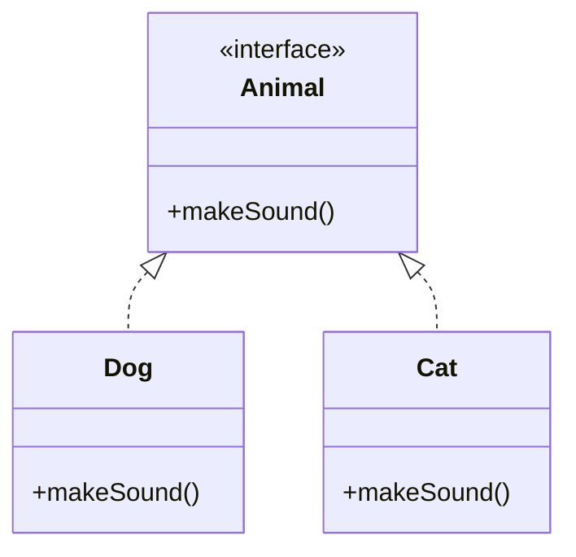

## 1.5 Overview of Java's Features Relevant to Design Patterns

In the realm of software engineering, design patterns are indispensable for crafting robust, scalable, and maintainable applications. Java, as a versatile and powerful programming language, offers a suite of features that make it particularly well-suited for implementing these patterns. In this section, we will delve into the key Java language features that are essential for design patterns, including encapsulation, inheritance, polymorphism, interfaces, abstract classes, exception handling, generics, annotations, and the enhancements introduced in Java 8 and beyond. By understanding these features, you will be better equipped to apply design patterns effectively in your Java applications.

### Encapsulation: The Foundation of Object-Oriented Design

Encapsulation is a fundamental principle of object-oriented programming (OOP) that involves bundling the data (attributes) and methods (functions) that operate on the data into a single unit, or class. It restricts direct access to some of the object's components, which can prevent the accidental modification of data.

**Key Benefits of Encapsulation:**
- **Data Hiding:** Protects the internal state of an object from unintended interference and misuse.
- **Modularity:** Facilitates the division of complex systems into manageable parts.
- **Maintainability:** Simplifies code maintenance by allowing changes to the internal implementation without affecting external code.

**Example:**

```java
public class Account {
    private double balance;

    public Account(double balance) {
        this.balance = balance;
    }

    public double getBalance() {
        return balance;
    }

    public void deposit(double amount) {
        if (amount > 0) {
            balance += amount;
        }
    }

    public void withdraw(double amount) {
        if (amount > 0 && amount <= balance) {
            balance -= amount;
        }
    }
}
```

In the above example, the `balance` attribute is encapsulated within the `Account` class, and access to it is controlled through public methods.

### Inheritance: Building on Existing Code

Inheritance allows a new class to inherit the properties and behavior of an existing class. This feature promotes code reuse and establishes a natural hierarchy between classes.

**Key Benefits of Inheritance:**
- **Code Reusability:** Enables the reuse of existing code, reducing redundancy.
- **Polymorphic Behavior:** Facilitates polymorphism, allowing objects to be treated as instances of their parent class.
- **Hierarchical Classification:** Organizes classes into a hierarchy, reflecting real-world relationships.

**Example:**

```java
public class Vehicle {
    public void start() {
        System.out.println("Vehicle started");
    }
}

public class Car extends Vehicle {
    @Override
    public void start() {
        System.out.println("Car started");
    }
}
```

In this example, `Car` inherits from `Vehicle`, allowing it to override the `start` method to provide specific behavior.

### Polymorphism: Flexibility in Code

Polymorphism enables objects to be treated as instances of their parent class, allowing for flexibility and the ability to define one interface with multiple implementations.

**Key Benefits of Polymorphism:**
- **Dynamic Method Dispatch:** Allows the execution of the appropriate method based on the object type at runtime.
- **Interface Implementation:** Enables different classes to implement the same interface, providing diverse behaviors.

**Example:**

```java
public interface Animal {
    void makeSound();
}

public class Dog implements Animal {
    @Override
    public void makeSound() {
        System.out.println("Bark");
    }
}

public class Cat implements Animal {
    @Override
    public void makeSound() {
        System.out.println("Meow");
    }
}

public class Zoo {
    public static void main(String[] args) {
        Animal dog = new Dog();
        Animal cat = new Cat();
        
        dog.makeSound(); // Outputs: Bark
        cat.makeSound(); // Outputs: Meow
    }
}
```

Here, both `Dog` and `Cat` implement the `Animal` interface, allowing them to be used interchangeably in the `Zoo` class.

### Interfaces and Abstract Classes: Enabling Flexible Design Patterns

Java interfaces and abstract classes are powerful tools for defining contracts and shared behavior across classes, playing a crucial role in implementing design patterns.

#### Interfaces

Interfaces define a contract that implementing classes must adhere to, without dictating how the methods should be implemented.

**Key Benefits of Interfaces:**
- **Decoupling:** Promotes loose coupling between components.
- **Multiple Inheritance:** Allows a class to implement multiple interfaces, overcoming the single inheritance limitation.

**Example:**

```java
public interface Flyable {
    void fly();
}

public class Bird implements Flyable {
    @Override
    public void fly() {
        System.out.println("Bird is flying");
    }
}

public class Airplane implements Flyable {
    @Override
    public void fly() {
        System.out.println("Airplane is flying");
    }
}
```

Both `Bird` and `Airplane` implement the `Flyable` interface, providing their own implementations of the `fly` method.

#### Abstract Classes

Abstract classes allow you to define methods with or without implementations, serving as a base for other classes.

**Key Benefits of Abstract Classes:**
- **Shared Code:** Provides a mechanism for sharing code among related classes.
- **Partial Implementation:** Allows partial implementation of methods, which can be completed by subclasses.

**Example:**

```java
public abstract class Shape {
    abstract void draw();

    public void display() {
        System.out.println("Displaying shape");
    }
}

public class Circle extends Shape {
    @Override
    void draw() {
        System.out.println("Drawing a circle");
    }
}
```

In this example, `Shape` is an abstract class with an abstract method `draw`, which `Circle` must implement.

### Exception Handling: Managing Errors Gracefully

Java's robust exception handling mechanism is crucial for building reliable applications and plays a significant role in design patterns by ensuring that errors are managed gracefully.

**Key Benefits of Exception Handling:**
- **Error Propagation:** Allows errors to be propagated up the call stack.
- **Resource Management:** Facilitates the cleanup of resources through `finally` blocks.
- **Custom Exceptions:** Enables the creation of custom exceptions for specific error conditions.

**Example:**

```java
public class FileProcessor {
    public void processFile(String filePath) {
        try {
            // Code to read the file
        } catch (IOException e) {
            System.out.println("An error occurred: " + e.getMessage());
        } finally {
            // Code to close resources
        }
    }
}
```

In this example, exceptions are caught and handled, ensuring that resources are released properly.

### Generics: Enhancing Code Reusability

Generics allow you to define classes, interfaces, and methods with a placeholder for types, enhancing code reusability and type safety.

**Key Benefits of Generics:**
- **Type Safety:** Ensures compile-time type checking, reducing runtime errors.
- **Code Reusability:** Allows the creation of generic algorithms that work with any object type.

**Example:**

```java
public class Box<T> {
    private T content;

    public void setContent(T content) {
        this.content = content;
    }

    public T getContent() {
        return content;
    }
}

public class Main {
    public static void main(String[] args) {
        Box<String> stringBox = new Box<>();
        stringBox.setContent("Hello");
        System.out.println(stringBox.getContent()); // Outputs: Hello

        Box<Integer> integerBox = new Box<>();
        integerBox.setContent(123);
        System.out.println(integerBox.getContent()); // Outputs: 123
    }
}
```

Generics allow the `Box` class to be used with different data types without sacrificing type safety.

### Annotations: Adding Metadata to Code

Annotations provide a way to add metadata to Java code, influencing how the code is processed by the compiler or runtime.

**Key Benefits of Annotations:**
- **Code Documentation:** Provides additional information about the code.
- **Configuration:** Enables configuration of frameworks and libraries.
- **Custom Annotations:** Allows the creation of custom annotations for specific use cases.

**Example:**

```java
public @interface Author {
    String name();
    String date();
}

@Author(name = "John Doe", date = "2024-11-17")
public class MyClass {
    // Class implementation
}
```

In this example, the `Author` annotation provides metadata about the `MyClass` class.

### Java 8 and Beyond: Modern Features for Design Patterns

Java 8 introduced several features that have significantly influenced the implementation of design patterns, including lambda expressions, the Stream API, and default methods in interfaces.

#### Lambda Expressions

Lambda expressions provide a concise way to represent anonymous functions, making it easier to implement functional interfaces.

**Key Benefits of Lambda Expressions:**
- **Conciseness:** Reduces boilerplate code.
- **Functional Programming:** Enables functional programming paradigms.

**Example:**

```java
List<String> names = Arrays.asList("Alice", "Bob", "Charlie");
names.forEach(name -> System.out.println(name));
```

In this example, a lambda expression is used to print each name in the list.

#### Stream API

The Stream API provides a powerful way to process sequences of elements, supporting operations like filtering, mapping, and reducing.

**Key Benefits of the Stream API:**
- **Declarative Style:** Allows for a more declarative style of programming.
- **Parallel Processing:** Supports parallel operations for improved performance.

**Example:**

```java
List<String> names = Arrays.asList("Alice", "Bob", "Charlie");
names.stream()
     .filter(name -> name.startsWith("A"))
     .forEach(System.out::println); // Outputs: Alice
```

The Stream API is used here to filter and print names starting with "A".

#### Default Methods in Interfaces

Default methods allow interfaces to have method implementations, enabling the evolution of interfaces without breaking existing implementations.

**Key Benefits of Default Methods:**
- **Backward Compatibility:** Allows the addition of new methods to interfaces without affecting existing code.
- **Code Sharing:** Enables code sharing among interface implementers.

**Example:**

```java
public interface Vehicle {
    void start();

    default void stop() {
        System.out.println("Vehicle stopped");
    }
}

public class Car implements Vehicle {
    @Override
    public void start() {
        System.out.println("Car started");
    }
}

public class Main {
    public static void main(String[] args) {
        Car car = new Car();
        car.start(); // Outputs: Car started
        car.stop();  // Outputs: Vehicle stopped
    }
}
```

In this example, the `stop` method is a default method in the `Vehicle` interface, providing a common implementation for all implementers.

### Limitations and Considerations

While Java provides a rich set of features for implementing design patterns, there are some limitations and considerations to keep in mind:

- **Single Inheritance:** Java supports single inheritance, which can limit the ability to inherit behavior from multiple classes. However, interfaces and default methods can mitigate this limitation.
- **Checked Exceptions:** Java's checked exceptions can complicate the implementation of certain patterns, such as the Command pattern, where exceptions need to be handled explicitly.
- **Verbosity:** Java's verbosity can sometimes lead to boilerplate code, although features like lambda expressions and the Stream API help reduce this.

### Preparing for Practical Code Examples

As we explore design patterns in subsequent sections, it's important to understand how these Java features will be applied. We'll see how encapsulation, inheritance, polymorphism, interfaces, and other features enable the implementation of various design patterns, providing solutions to common software design problems.

### Visualizing Java's Object-Oriented Features

To better understand how Java's object-oriented features support design patterns, let's visualize the relationships between classes, interfaces, and objects.



**Diagram Description:** This class diagram illustrates the use of interfaces in Java. The `Animal` interface is implemented by both `Dog` and `Cat` classes, demonstrating polymorphism and interface implementation.

### Try It Yourself

To deepen your understanding, try modifying the code examples provided in this section. For instance, add a new class that implements the `Animal` interface and provides a unique implementation of the `makeSound` method. Experiment with different generic types in the `Box` class or create custom annotations to see how they can be used in your code.

### Key Takeaways

- Java's encapsulation, inheritance, and polymorphism are foundational for implementing design patterns.
- Interfaces and abstract classes provide flexibility and enable the implementation of various patterns.
- Exception handling, generics, and annotations enhance the robustness and reusability of design patterns.
- Java 8 features like lambda expressions and the Stream API have modernized pattern implementation.
- Understanding Java's features and limitations is crucial for effectively applying design patterns.

## Quiz Time!



### Which Java feature is fundamental for protecting an object's internal state?

- [x] Encapsulation
- [ ] Inheritance
- [ ] Polymorphism
- [ ] Generics

> **Explanation:** Encapsulation is the mechanism that restricts access to certain components of an object, protecting its internal state from unintended interference.

### What is the primary benefit of using interfaces in Java?

- [x] Decoupling components
- [ ] Enabling multiple inheritance
- [ ] Providing default method implementations
- [ ] Handling exceptions

> **Explanation:** Interfaces promote loose coupling by defining a contract that implementing classes must adhere to, without dictating how the methods should be implemented.

### How do lambda expressions benefit Java developers?

- [x] They reduce boilerplate code
- [ ] They enhance exception handling
- [ ] They enforce type safety
- [ ] They allow multiple inheritance

> **Explanation:** Lambda expressions provide a concise way to represent anonymous functions, reducing the amount of boilerplate code required.

### Which Java feature allows for type-safe collections?

- [x] Generics
- [ ] Annotations
- [ ] Abstract classes
- [ ] Interfaces

> **Explanation:** Generics enable type-safe collections by allowing classes, interfaces, and methods to operate on objects of various types while providing compile-time type checking.

### What is a limitation of Java's inheritance model?

- [x] Single inheritance
- [ ] Lack of interfaces
- [ ] No support for polymorphism
- [ ] Inability to handle exceptions

> **Explanation:** Java supports single inheritance, meaning a class can inherit from only one superclass, which can limit the ability to inherit behavior from multiple classes.

### How do default methods in interfaces enhance backward compatibility?

- [x] By allowing new methods to be added without breaking existing implementations
- [ ] By enforcing strict type checking
- [ ] By providing multiple inheritance
- [ ] By handling exceptions

> **Explanation:** Default methods allow interfaces to have method implementations, enabling the evolution of interfaces without breaking existing implementations.

### Which Java feature is used to add metadata to code?

- [x] Annotations
- [ ] Generics
- [ ] Lambda expressions
- [ ] Abstract classes

> **Explanation:** Annotations provide a way to add metadata to Java code, influencing how the code is processed by the compiler or runtime.

### What is the role of the Stream API in Java?

- [x] To process sequences of elements
- [ ] To handle exceptions
- [ ] To enable multiple inheritance
- [ ] To provide default method implementations

> **Explanation:** The Stream API provides a powerful way to process sequences of elements, supporting operations like filtering, mapping, and reducing.

### Which Java 8 feature allows for functional programming paradigms?

- [x] Lambda expressions
- [ ] Checked exceptions
- [ ] Abstract classes
- [ ] Annotations

> **Explanation:** Lambda expressions enable functional programming paradigms by providing a concise way to represent anonymous functions.

### True or False: Java's verbosity can sometimes lead to boilerplate code.

- [x] True
- [ ] False

> **Explanation:** Java's verbosity can lead to boilerplate code, although features like lambda expressions and the Stream API help reduce this.



Remember, this is just the beginning. As you progress through this guide, you'll build a deeper understanding of how to leverage Java's features to implement design patterns effectively. Keep experimenting, stay curious, and enjoy the journey!
