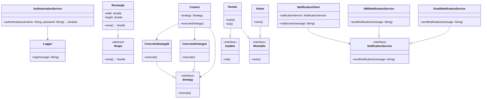

## 10.1 SOLID Principles in Practice

In the realm of software engineering, the SOLID principles serve as a foundation for creating robust, maintainable, and scalable software systems. These principles guide developers in structuring their code in a way that enhances flexibility and reduces the risk of encountering common pitfalls. In this section, we will delve into each of the SOLID principles, explore their connection to design patterns, and demonstrate their application through Java code examples. By understanding and applying these principles, you can significantly improve the quality of your software design.

### Understanding SOLID Principles

The SOLID principles are a set of five design principles intended to make software designs more understandable, flexible, and maintainable. Let's break down each principle:

#### Single Responsibility Principle (SRP)

**Definition**: A class should have only one reason to change, meaning it should have only one job or responsibility.

**Explanation**: The SRP emphasizes that a class should focus on a single task or functionality. This principle helps in reducing the complexity of a class and makes it easier to understand and modify. When a class has multiple responsibilities, changes to one responsibility can affect others, leading to a fragile design.

**Example**: Consider a class that handles both user authentication and logging. By applying SRP, we would separate these responsibilities into two distinct classes: `AuthenticationService` and `Logger`.

```java
// AuthenticationService.java
public class AuthenticationService {
    public boolean authenticate(String username, String password) {
        // Authentication logic
        return true;
    }
}

// Logger.java
public class Logger {
    public void log(String message) {
        // Logging logic
        System.out.println(message);
    }
}
```

#### Open/Closed Principle (OCP)

**Definition**: Software entities (classes, modules, functions, etc.) should be open for extension but closed for modification.

**Explanation**: The OCP encourages developers to design systems that allow behavior to be extended without altering existing code. This is often achieved through the use of interfaces and abstract classes.

**Example**: The Strategy pattern is a perfect embodiment of the OCP. It allows you to define a family of algorithms, encapsulate each one, and make them interchangeable.

```java
// Strategy.java
public interface Strategy {
    void execute();
}

// ConcreteStrategyA.java
public class ConcreteStrategyA implements Strategy {
    public void execute() {
        System.out.println("Executing Strategy A");
    }
}

// ConcreteStrategyB.java
public class ConcreteStrategyB implements Strategy {
    public void execute() {
        System.out.println("Executing Strategy B");
    }
}

// Context.java
public class Context {
    private Strategy strategy;

    public Context(Strategy strategy) {
        this.strategy = strategy;
    }

    public void executeStrategy() {
        strategy.execute();
    }
}

// Main.java
public class Main {
    public static void main(String[] args) {
        Context context = new Context(new ConcreteStrategyA());
        context.executeStrategy(); // Output: Executing Strategy A

        context = new Context(new ConcreteStrategyB());
        context.executeStrategy(); // Output: Executing Strategy B
    }
}
```

#### Liskov Substitution Principle (LSP)

**Definition**: Objects of a superclass should be replaceable with objects of a subclass without affecting the correctness of the program.

**Explanation**: The LSP ensures that a subclass can stand in for its superclass without introducing errors. This principle is crucial for achieving polymorphism in object-oriented programming.

**Example**: Consider a hierarchy of shapes where a `Rectangle` is a subclass of `Shape`. According to LSP, any instance of `Rectangle` should be usable wherever a `Shape` is expected.

```java
// Shape.java
public abstract class Shape {
    public abstract double area();
}

// Rectangle.java
public class Rectangle extends Shape {
    private double width;
    private double height;

    public Rectangle(double width, double height) {
        this.width = width;
        this.height = height;
    }

    @Override
    public double area() {
        return width * height;
    }
}

// Main.java
public class Main {
    public static void main(String[] args) {
        Shape shape = new Rectangle(5, 10);
        System.out.println("Area: " + shape.area()); // Output: Area: 50.0
    }
}
```

#### Interface Segregation Principle (ISP)

**Definition**: Clients should not be forced to depend on interfaces they do not use.

**Explanation**: The ISP advocates for creating smaller, more specific interfaces rather than large, general-purpose ones. This reduces the impact of changes and makes the system more flexible.

**Example**: Instead of having a single `Worker` interface with multiple methods, we can split it into smaller interfaces.

```java
// Workable.java
public interface Workable {
    void work();
}

// Eatable.java
public interface Eatable {
    void eat();
}

// Robot.java
public class Robot implements Workable {
    public void work() {
        System.out.println("Robot is working");
    }
}

// Human.java
public class Human implements Workable, Eatable {
    public void work() {
        System.out.println("Human is working");
    }

    public void eat() {
        System.out.println("Human is eating");
    }
}
```

#### Dependency Inversion Principle (DIP)

**Definition**: High-level modules should not depend on low-level modules. Both should depend on abstractions. Abstractions should not depend on details. Details should depend on abstractions.

**Explanation**: The DIP promotes the decoupling of software modules by ensuring that high-level modules are not dependent on low-level modules. This is typically achieved through dependency injection.

**Example**: The Factory Method pattern is a good example of the DIP in action.

```java
// NotificationService.java
public interface NotificationService {
    void sendNotification(String message);
}

// EmailNotificationService.java
public class EmailNotificationService implements NotificationService {
    public void sendNotification(String message) {
        System.out.println("Email Notification: " + message);
    }
}

// SMSNotificationService.java
public class SMSNotificationService implements NotificationService {
    public void sendNotification(String message) {
        System.out.println("SMS Notification: " + message);
    }
}

// NotificationClient.java
public class NotificationClient {
    private NotificationService notificationService;

    public NotificationClient(NotificationService notificationService) {
        this.notificationService = notificationService;
    }

    public void notifyUser(String message) {
        notificationService.sendNotification(message);
    }
}

// Main.java
public class Main {
    public static void main(String[] args) {
        NotificationService emailService = new EmailNotificationService();
        NotificationClient client = new NotificationClient(emailService);
        client.notifyUser("Welcome to SOLID Principles!"); // Output: Email Notification: Welcome to SOLID Principles!
    }
}
```

### Benefits of Applying SOLID Principles

Adhering to SOLID principles offers numerous benefits:

1. **Maintainability**: By ensuring that classes have a single responsibility and are open for extension, code becomes easier to maintain and modify over time.

2. **Flexibility**: The use of interfaces and abstractions allows for greater flexibility in changing or extending system behavior without impacting existing code.

3. **Scalability**: SOLID principles facilitate the development of scalable systems by promoting modularity and reducing dependencies between components.

4. **Testability**: By decoupling components and adhering to the DIP, systems become more testable, as individual components can be tested in isolation.

### Common Pitfalls When Ignoring SOLID Principles

Ignoring SOLID principles can lead to several issues:

1. **Tight Coupling**: Without the DIP, high-level modules become tightly coupled to low-level modules, making changes difficult and error-prone.

2. **Complexity**: Violating the SRP can lead to classes that are difficult to understand and maintain due to their multiple responsibilities.

3. **Rigidity**: Ignoring the OCP can result in systems that are difficult to extend, as changes require modifying existing code.

4. **Fragility**: Violating the LSP can introduce subtle bugs when subclasses do not behave as expected when used in place of their superclass.

5. **Interface Bloat**: Ignoring the ISP can lead to interfaces that are too large and complex, forcing clients to implement methods they do not need.

### Real-World Scenarios and Industry Examples

In practice, SOLID principles have been instrumental in improving software design across various industries. Let's explore a few real-world scenarios:

#### Scenario 1: E-commerce Platform

An e-commerce platform initially had a monolithic architecture with tightly coupled components. By applying SOLID principles, the development team refactored the codebase into a more modular design, using the Strategy pattern to handle different payment methods (credit card, PayPal, etc.). This change allowed the platform to easily integrate new payment options without modifying existing code, enhancing flexibility and reducing time-to-market for new features.

#### Scenario 2: Banking Application

A banking application faced challenges with its notification system, which was tightly coupled to the email service. By applying the Dependency Inversion Principle, the team introduced a NotificationService interface and implemented different notification strategies (email, SMS, push notifications). This decoupling allowed the application to switch notification methods seamlessly, improving scalability and user experience.

#### Scenario 3: Healthcare Management System

In a healthcare management system, the initial design had a single interface for all user roles (doctors, nurses, administrators). By applying the Interface Segregation Principle, the team created specific interfaces for each role, reducing complexity and improving the system's adaptability to changing requirements.

### Visualizing SOLID Principles

To further illustrate the application of SOLID principles, let's visualize the relationships and interactions within a system designed with these principles in mind.



### Try It Yourself

To deepen your understanding of SOLID principles, try modifying the provided code examples:

1. **Experiment with Different Strategies**: Implement additional strategies for the Strategy pattern and observe how easily they integrate into the existing system.

2. **Refactor Code to Apply SRP**: Identify classes in your current projects that violate the Single Responsibility Principle and refactor them into smaller, more focused classes.

3. **Implement Dependency Injection**: Replace direct instantiation of classes with dependency injection to adhere to the Dependency Inversion Principle.

### Conclusion

The SOLID principles are fundamental to creating high-quality software designs. By applying these principles, you can ensure that your code is maintainable, flexible, and scalable. Remember, the journey to mastering SOLID principles is ongoing. Keep experimenting, stay curious, and enjoy the process of refining your software design skills.

## Quiz Time!



### Which SOLID principle emphasizes that a class should have only one reason to change?

- [x] Single Responsibility Principle
- [ ] Open/Closed Principle
- [ ] Liskov Substitution Principle
- [ ] Interface Segregation Principle

> **Explanation:** The Single Responsibility Principle states that a class should have only one reason to change, focusing on a single responsibility.

### What design pattern is commonly used to adhere to the Open/Closed Principle?

- [ ] Singleton Pattern
- [x] Strategy Pattern
- [ ] Observer Pattern
- [ ] Factory Method Pattern

> **Explanation:** The Strategy pattern allows behavior to be extended without modifying existing code, aligning with the Open/Closed Principle.

### Which principle ensures that subclasses can replace base classes without affecting program correctness?

- [ ] Single Responsibility Principle
- [ ] Open/Closed Principle
- [x] Liskov Substitution Principle
- [ ] Dependency Inversion Principle

> **Explanation:** The Liskov Substitution Principle ensures that subclasses can replace base classes without affecting the correctness of the program.

### What does the Interface Segregation Principle advocate for?

- [ ] Large, general-purpose interfaces
- [x] Smaller, more specific interfaces
- [ ] Single interface for all clients
- [ ] No interfaces at all

> **Explanation:** The Interface Segregation Principle advocates for creating smaller, more specific interfaces to reduce the impact of changes.

### Which principle promotes the decoupling of software modules?

- [ ] Single Responsibility Principle
- [ ] Open/Closed Principle
- [ ] Liskov Substitution Principle
- [x] Dependency Inversion Principle

> **Explanation:** The Dependency Inversion Principle promotes decoupling by ensuring high-level modules do not depend on low-level modules.

### What can result from ignoring the Single Responsibility Principle?

- [x] Increased complexity
- [ ] Improved flexibility
- [ ] Enhanced scalability
- [ ] Better maintainability

> **Explanation:** Ignoring the Single Responsibility Principle can lead to increased complexity, as classes may take on multiple responsibilities.

### How does the Strategy pattern support the Open/Closed Principle?

- [x] By allowing new strategies to be added without modifying existing code
- [ ] By enforcing a single responsibility
- [ ] By using large interfaces
- [ ] By tightly coupling components

> **Explanation:** The Strategy pattern supports the Open/Closed Principle by allowing new strategies to be added without modifying existing code.

### What is a common pitfall of ignoring the Dependency Inversion Principle?

- [ ] Increased flexibility
- [ ] Better scalability
- [x] Tight coupling between modules
- [ ] Enhanced testability

> **Explanation:** Ignoring the Dependency Inversion Principle can lead to tight coupling between high-level and low-level modules.

### Which principle is demonstrated by creating specific interfaces for different user roles?

- [ ] Single Responsibility Principle
- [ ] Open/Closed Principle
- [ ] Liskov Substitution Principle
- [x] Interface Segregation Principle

> **Explanation:** Creating specific interfaces for different user roles demonstrates the Interface Segregation Principle.

### True or False: The SOLID principles are only applicable to object-oriented programming.

- [x] True
- [ ] False

> **Explanation:** The SOLID principles are primarily designed for object-oriented programming to enhance design and maintainability.


