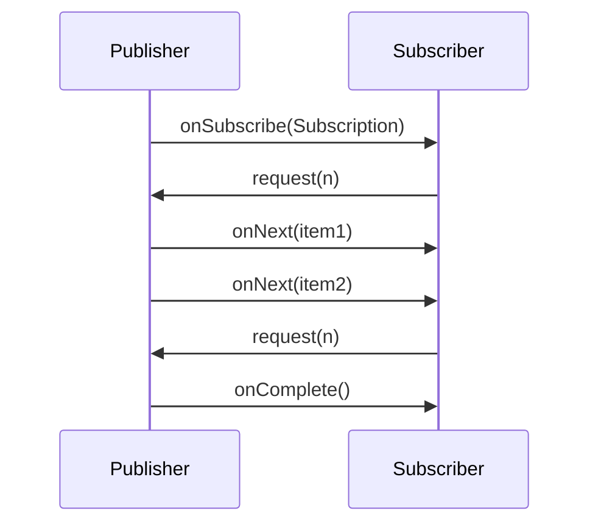

## 10.10.1 Introduction to Reactive Programming

### Overview

Reactive programming is a programming paradigm that is gaining traction in the development of responsive, resilient, and scalable systems. It is particularly relevant in the context of modern software applications that demand high performance and responsiveness. This section delves into the core principles of reactive programming, its benefits over traditional concurrency models, and its implementation in Java.

### Core Concepts of Reactive Programming

Reactive programming is built on four fundamental principles: event-driven architecture, asynchronous processing, non-blocking operations, and backpressure management. These principles collectively enable systems to handle a large number of concurrent operations efficiently.

#### Event-Driven Architecture

An event-driven architecture is central to reactive programming. In this model, the flow of the program is determined by events such as user actions, sensor outputs, or messages from other programs. This approach allows systems to react to changes in state or the environment, making them more dynamic and adaptable.

#### Asynchronous Processing

Asynchronous processing is a key aspect of reactive programming. It allows tasks to be executed independently of the main program flow, enabling the system to continue processing other tasks while waiting for certain operations to complete. This is crucial for improving the responsiveness of applications, as it prevents the blocking of resources.

#### Non-Blocking Operations

Non-blocking operations are essential for achieving high throughput in reactive systems. Unlike blocking operations, which wait for a task to complete before proceeding, non-blocking operations allow the system to continue executing other tasks. This is particularly beneficial in I/O-bound applications, where waiting for data can significantly hinder performance.

#### Backpressure Management

Backpressure is a mechanism for handling the flow of data between components in a reactive system. It ensures that producers do not overwhelm consumers with data, which can lead to resource exhaustion and system failure. Effective backpressure management is crucial for maintaining system stability and performance.

### The Reactive Manifesto

The [Reactive Manifesto](https://www.reactivemanifesto.org/) outlines the key characteristics of reactive systems: responsiveness, resilience, elasticity, and message-driven architecture. These characteristics are essential for building systems that can adapt to varying workloads and recover from failures gracefully.

- **Responsiveness**: Reactive systems provide rapid and consistent response times, ensuring a positive user experience.
- **Resilience**: By isolating failures and recovering gracefully, reactive systems maintain functionality even in adverse conditions.
- **Elasticity**: Reactive systems can scale up or down to accommodate changes in workload, optimizing resource usage.
- **Message-Driven**: Communication in reactive systems is based on asynchronous message passing, which decouples components and enhances scalability.

### Addressing Limitations of Traditional Concurrency Models

Traditional concurrency models, such as thread-based approaches, often struggle with scalability and resource management. These models can lead to issues such as thread contention, deadlocks, and excessive resource consumption. Reactive programming addresses these limitations by:

- **Reducing Resource Usage**: By using non-blocking operations and asynchronous processing, reactive systems minimize the number of threads required, reducing resource consumption.
- **Improving Scalability**: Reactive systems can handle a large number of concurrent operations without degrading performance, making them ideal for high-load applications.
- **Enhancing Fault Tolerance**: The message-driven architecture of reactive systems isolates failures and allows for graceful recovery, improving overall system resilience.

### The Reactive Streams Initiative

The Reactive Streams initiative aims to provide a standard for asynchronous stream processing with non-blocking backpressure. It defines a set of interfaces and methods for building reactive systems, ensuring interoperability between different implementations. The initiative's goal is to enable the development of robust and efficient reactive applications across various platforms.

#### Key Interfaces in Reactive Streams

The Reactive Streams specification defines four key interfaces:

- **Publisher**: Represents a provider of a potentially unbounded number of sequenced elements, publishing them according to the demand signaled by a `Subscriber`.
- **Subscriber**: Consumes elements provided by a `Publisher`, processing them asynchronously.
- **Subscription**: Represents a one-to-one lifecycle of a `Subscriber` subscribing to a `Publisher`.
- **Processor**: A combination of a `Subscriber` and a `Publisher`, allowing for the transformation of data streams.

### Implementing Reactive Programming in Java

Java provides several libraries and frameworks for implementing reactive programming, including Project Reactor and RxJava. These libraries offer powerful tools for building reactive applications, leveraging Java's concurrency features and modern language constructs.

#### Example: Reactive Programming with Project Reactor

Project Reactor is a popular library for building reactive applications in Java. It provides a rich set of operators for composing asynchronous and event-driven applications.

```java
import reactor.core.publisher.Flux;

public class ReactiveExample {
    public static void main(String[] args) {
        Flux<String> flux = Flux.just("Hello", "Reactive", "World")
            .map(String::toUpperCase)
            .filter(s -> s.startsWith("R"));

        flux.subscribe(System.out::println);
    }
}
```

In this example, a `Flux` is created with a sequence of strings. The `map` operator transforms each string to uppercase, and the `filter` operator selects strings that start with "R". The `subscribe` method initiates the processing of the stream, printing the results to the console.

#### Encouraging Experimentation

Experiment with the code example by modifying the sequence of strings or adding additional operators. Observe how changes affect the output and behavior of the reactive stream.

### Visualizing Reactive Programming

To better understand the flow of data in a reactive system, consider the following sequence diagram illustrating the interaction between a `Publisher` and a `Subscriber`.



**Diagram Description**: This sequence diagram shows the interaction between a `Publisher` and a `Subscriber`. The `Subscriber` requests a certain number of items, and the `Publisher` sends them asynchronously. The process continues until the `Publisher` sends an `onComplete` signal.

### Best Practices for Reactive Programming

- **Design for Asynchronicity**: Embrace asynchronous processing to maximize the benefits of reactive programming.
- **Manage Backpressure**: Implement effective backpressure strategies to prevent resource exhaustion and maintain system stability.
- **Leverage Reactive Libraries**: Utilize libraries like Project Reactor and RxJava to simplify the development of reactive applications.
- **Test Thoroughly**: Ensure comprehensive testing of reactive systems to identify and address potential issues early in the development process.

### Conclusion

Reactive programming offers a powerful paradigm for building responsive, resilient, and scalable systems. By embracing event-driven architecture, asynchronous processing, non-blocking operations, and backpressure management, developers can create applications that meet the demands of modern software environments. As the adoption of reactive programming continues to grow, understanding its principles and best practices will be essential for Java developers and software architects.

### References and Further Reading

- [Reactive Manifesto](https://www.reactivemanifesto.org/)
- [Reactive Streams Specification](https://www.reactive-streams.org/)
- [Project Reactor Documentation](https://projectreactor.io/docs)
- [RxJava Documentation](https://github.com/ReactiveX/RxJava)

---

## Test Your Knowledge: Reactive Programming in Java Quiz



### What is a key principle of reactive programming?

- [x] Asynchronous processing
- [ ] Synchronous processing
- [ ] Blocking operations
- [ ] Single-threaded execution

> **Explanation:** Asynchronous processing allows tasks to be executed independently, improving responsiveness and efficiency.

### Which of the following is NOT a characteristic of reactive systems according to the Reactive Manifesto?

- [ ] Responsiveness
- [ ] Resilience
- [x] Determinism
- [ ] Elasticity

> **Explanation:** Determinism is not a characteristic of reactive systems; they focus on responsiveness, resilience, elasticity, and being message-driven.

### What is the purpose of backpressure in reactive programming?

- [x] To manage the flow of data between components
- [ ] To increase the speed of data processing
- [ ] To ensure data is processed in order
- [ ] To block data until resources are available

> **Explanation:** Backpressure manages the flow of data to prevent producers from overwhelming consumers, maintaining system stability.

### Which interface in Reactive Streams represents a provider of sequenced elements?

- [x] Publisher
- [ ] Subscriber
- [ ] Subscription
- [ ] Processor

> **Explanation:** The `Publisher` interface represents a provider of sequenced elements, publishing them according to demand.

### What is the role of a `Subscriber` in Reactive Streams?

- [x] To consume elements provided by a `Publisher`
- [ ] To provide elements to a `Publisher`
- [ ] To manage subscriptions
- [ ] To transform data streams

> **Explanation:** A `Subscriber` consumes elements provided by a `Publisher`, processing them asynchronously.

### Which Java library is commonly used for building reactive applications?

- [x] Project Reactor
- [ ] Apache Commons
- [ ] JUnit
- [ ] Hibernate

> **Explanation:** Project Reactor is a popular library for building reactive applications in Java.

### What does the `map` operator do in a reactive stream?

- [x] Transforms each element in the stream
- [ ] Filters elements from the stream
- [ ] Combines multiple streams
- [ ] Terminates the stream

> **Explanation:** The `map` operator transforms each element in the stream, applying a specified function.

### How does reactive programming improve scalability?

- [x] By handling a large number of concurrent operations efficiently
- [ ] By using more threads
- [ ] By blocking operations until resources are available
- [ ] By reducing the number of operations

> **Explanation:** Reactive programming improves scalability by efficiently handling a large number of concurrent operations without degrading performance.

### What is the benefit of non-blocking operations in reactive systems?

- [x] They allow the system to continue executing other tasks
- [ ] They ensure tasks are executed in order
- [ ] They increase the number of threads used
- [ ] They block resources until tasks are complete

> **Explanation:** Non-blocking operations allow the system to continue executing other tasks, improving throughput and responsiveness.

### True or False: Reactive programming is only suitable for I/O-bound applications.

- [ ] True
- [x] False

> **Explanation:** While reactive programming is particularly beneficial for I/O-bound applications, it can be applied to various types of applications to improve responsiveness and scalability.



---
